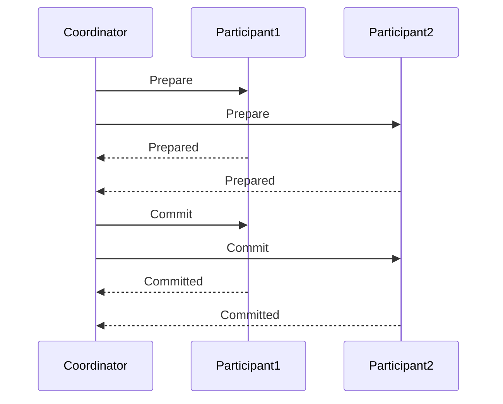
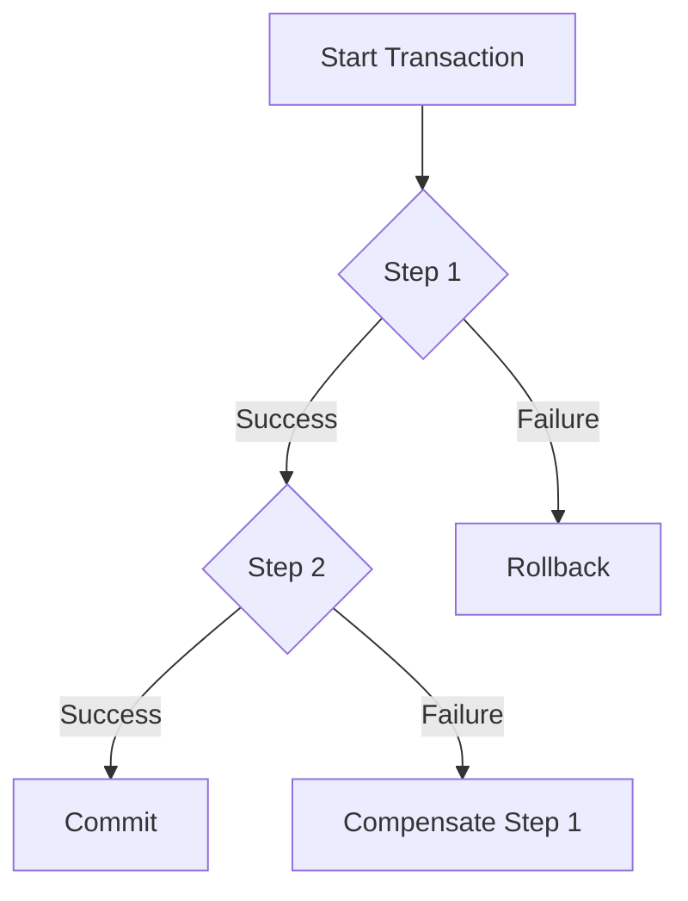

## 13.10. Transaction Management

In the world of enterprise software development, transaction management is a critical aspect that ensures data integrity and consistency across complex systems. This section delves into the intricacies of transaction management in Elixir, focusing on ACID properties, distributed transactions, and the tools and patterns that facilitate effective transaction handling. As expert software engineers and architects, understanding these concepts will empower you to build robust, scalable, and fault-tolerant systems.

### Introduction to Transaction Management

Transaction management is the process of ensuring that a series of operations on a database or across multiple systems are completed successfully and consistently. It is crucial for maintaining data integrity, especially in systems where multiple operations must be executed as a single unit. In Elixir, transaction management takes on a unique flavor due to its functional nature and the capabilities of the BEAM virtual machine.

### Understanding ACID Properties

The ACID properties—Atomicity, Consistency, Isolation, and Durability—are fundamental principles that underpin reliable transaction management. Let's explore each of these properties in the context of Elixir:

#### Atomicity

Atomicity ensures that a transaction is treated as a single unit of work. If any part of the transaction fails, the entire transaction is rolled back, leaving the system in its previous state. In Elixir, atomicity can be managed using Ecto, the database wrapper and query generator for Elixir.

```elixir
defmodule MyApp.TransactionExample do
  import Ecto.Query
  alias MyApp.Repo
  alias MyApp.Account

  def transfer_funds(from_account_id, to_account_id, amount) do
    Repo.transaction(fn ->
      from_account = Repo.get!(Account, from_account_id)
      to_account = Repo.get!(Account, to_account_id)

      # Ensure sufficient funds
      if from_account.balance < amount do
        Repo.rollback("Insufficient funds")
      end

      # Update account balances
      from_account = %{from_account | balance: from_account.balance - amount}
      to_account = %{to_account | balance: to_account.balance + amount}

      Repo.update!(from_account)
      Repo.update!(to_account)
    end)
  end
end
```

In this example, the `Repo.transaction/1` function ensures that the fund transfer is atomic. If any operation within the transaction fails, the entire transaction is rolled back.

#### Consistency

Consistency ensures that a transaction brings the database from one valid state to another, maintaining database invariants. This is often enforced through constraints and validations in the database schema.

```elixir
defmodule MyApp.Account do
  use Ecto.Schema
  import Ecto.Changeset

  schema "accounts" do
    field :balance, :decimal
    field :currency, :string
    timestamps()
  end

  def changeset(account, attrs) do
    account
    |> cast(attrs, [:balance, :currency])
    |> validate_required([:balance, :currency])
    |> check_constraint(:balance, name: :balance_must_be_non_negative)
  end
end
```

Here, a constraint ensures that account balances cannot be negative, maintaining consistency.

#### Isolation

Isolation ensures that transactions are executed in isolation from one another. In Elixir, this can be achieved using database isolation levels. However, due to the distributed nature of Elixir applications, achieving strict isolation can be challenging.

#### Durability

Durability guarantees that once a transaction is committed, it will remain so, even in the event of a system crash. This is typically handled by the database management system, ensuring that committed transactions are saved to non-volatile storage.

### Distributed Transactions

In modern distributed systems, transactions often span multiple services or databases, necessitating distributed transaction management. Elixir's concurrency model and distributed capabilities make it well-suited for handling such scenarios.

#### Managing Distributed Transactions

Distributed transactions require coordination across multiple nodes or services. This can be achieved through various patterns and tools, such as two-phase commit protocols and the Saga pattern.

##### Two-Phase Commit Protocol

The two-phase commit (2PC) protocol is a classic distributed transaction management technique. It involves a coordinator node that manages the transaction across multiple participant nodes.


```mermaid
sequenceDiagram
    participant Coordinator
    participant Participant1
    participant Participant2

    Coordinator->>Participant1: Prepare
    Coordinator->>Participant2: Prepare
    Participant1-->>Coordinator: Prepared
    Participant2-->>Coordinator: Prepared
    Coordinator->>Participant1: Commit
    Coordinator->>Participant2: Commit
    Participant1-->>Coordinator: Committed
    Participant2-->>Coordinator: Committed
```

In this diagram, the coordinator manages the transaction by first asking participants to prepare (phase one) and then committing the transaction (phase two) if all participants are ready.

##### Saga Pattern

The Saga pattern is an alternative to 2PC, particularly useful in microservices architectures. It breaks a transaction into a series of smaller, independent transactions, each with its own compensating action.

```elixir
defmodule MyApp.Saga do
  def execute do
    case step_one() do
      :ok -> 
        case step_two() do
          :ok -> :commit
          :error -> compensate_step_one()
        end
      :error -> :rollback
    end
  end

  defp step_one do
    # Perform step one
    :ok
  end

  defp step_two do
    # Perform step two
    :ok
  end

  defp compensate_step_one do
    # Compensating action for step one
  end
end
```

In this example, each step in the saga can succeed or fail independently, and compensating actions are defined to undo the effects of completed steps if necessary.

### Tools for Transaction Management

Elixir provides several tools and libraries to facilitate transaction management, especially in distributed systems.

#### Multi-Database Coordinators

For applications that interact with multiple databases, multi-database coordinators can help manage transactions across these systems, ensuring consistency and atomicity.

#### Sagas for Complex Transaction Management

The Saga pattern can be implemented using libraries such as `Commanded` or `ExSaga`, which provide frameworks for managing complex transactions in distributed systems.

### Design Considerations

When implementing transaction management in Elixir, consider the following:

- **Consistency vs. Availability**: In distributed systems, achieving both consistency and availability can be challenging. Consider the trade-offs and choose the appropriate consistency model for your application.
- **Error Handling**: Ensure robust error handling and recovery mechanisms to handle transaction failures gracefully.
- **Performance**: Distributed transactions can introduce latency. Optimize performance by minimizing the scope of transactions and using asynchronous processing where possible.

### Elixir Unique Features

Elixir's concurrency model, based on the Actor model, provides unique advantages for transaction management. Processes can be used to isolate transactions, and message passing can facilitate coordination between distributed components.

### Differences and Similarities

Transaction management in Elixir shares similarities with other functional languages but also leverages the unique capabilities of the BEAM VM. The use of processes, message passing, and OTP behaviors distinguishes Elixir's approach from traditional models.

### Try It Yourself

Experiment with the code examples provided by modifying transaction logic, adding error handling, or integrating with external services. Observe how changes impact transaction behavior and system consistency.

### Visualizing Transaction Management

Here's a visual representation of a distributed transaction using the Saga pattern:


```mermaid
graph TD;
    A[Start Transaction] --> B{Step 1}
    B -->|Success| C{Step 2}
    C -->|Success| D[Commit]
    C -->|Failure| E[Compensate Step 1]
    B -->|Failure| F[Rollback]
```

This diagram illustrates the flow of a transaction using the Saga pattern, highlighting the compensating actions in case of failure.

### Knowledge Check

1. **What are the ACID properties, and why are they important?**
2. **Explain the difference between the two-phase commit protocol and the Saga pattern.**
3. **How does Elixir's concurrency model benefit transaction management?**
4. **What are some tools and libraries available for managing distributed transactions in Elixir?**

### Summary

In this section, we've explored the essentials of transaction management in Elixir, focusing on ACID properties, distributed transactions, and tools like Sagas. By mastering these concepts, you can build systems that maintain data integrity and consistency, even in complex, distributed environments.

## Quiz Time!



### Which property ensures that a transaction is treated as a single unit of work?

- [x] Atomicity
- [ ] Consistency
- [ ] Isolation
- [ ] Durability

> **Explanation:** Atomicity ensures that a transaction is treated as a single unit of work, meaning if any part fails, the entire transaction is rolled back.

### What is the main advantage of the Saga pattern over the two-phase commit protocol?

- [x] It allows for independent transaction steps with compensating actions.
- [ ] It is faster than the two-phase commit protocol.
- [ ] It requires fewer resources.
- [ ] It guarantees strict isolation.

> **Explanation:** The Saga pattern allows for independent transaction steps with compensating actions, making it more suitable for microservices architectures.

### Which Elixir library is commonly used for database interactions and transaction management?

- [x] Ecto
- [ ] Phoenix
- [ ] Plug
- [ ] GenServer

> **Explanation:** Ecto is commonly used for database interactions and transaction management in Elixir.

### What does the 'D' in ACID stand for?

- [x] Durability
- [ ] Dependency
- [ ] Distribution
- [ ] Data

> **Explanation:** The 'D' in ACID stands for Durability, ensuring that once a transaction is committed, it remains so even in the event of a system crash.

### Which Elixir tool can be used for building complex transaction workflows?

- [x] Commanded
- [ ] Mix
- [ ] ExUnit
- [ ] Dialyzer

> **Explanation:** Commanded can be used for building complex transaction workflows, particularly in event-sourced systems.

### What is a key benefit of using processes in Elixir for transaction management?

- [x] Isolation of transactions
- [ ] Faster execution
- [ ] Easier debugging
- [ ] Less memory usage

> **Explanation:** Using processes in Elixir allows for the isolation of transactions, which can help manage concurrency and state.

### What does the two-phase commit protocol ensure in distributed transactions?

- [x] Consistency across all participants
- [ ] Faster transaction processing
- [ ] Reduced network traffic
- [ ] Increased availability

> **Explanation:** The two-phase commit protocol ensures consistency across all participants in a distributed transaction.

### Which property of ACID is primarily concerned with maintaining database invariants?

- [x] Consistency
- [ ] Atomicity
- [ ] Isolation
- [ ] Durability

> **Explanation:** Consistency is primarily concerned with maintaining database invariants, ensuring transactions bring the database from one valid state to another.

### True or False: The Saga pattern is suitable for systems that require strict isolation.

- [ ] True
- [x] False

> **Explanation:** False. The Saga pattern is not suitable for systems that require strict isolation, as it allows for independent transaction steps.

### Which of the following is a common challenge in distributed transaction management?

- [x] Achieving both consistency and availability
- [ ] Reducing transaction latency
- [ ] Simplifying transaction logic
- [ ] Minimizing resource usage

> **Explanation:** Achieving both consistency and availability is a common challenge in distributed transaction management due to the CAP theorem.



Remember, mastering transaction management is a journey. As you continue to explore and experiment, you'll gain deeper insights into building resilient and efficient systems. Keep pushing the boundaries of what's possible with Elixir, and enjoy the process of learning and growing as a software architect!

---
