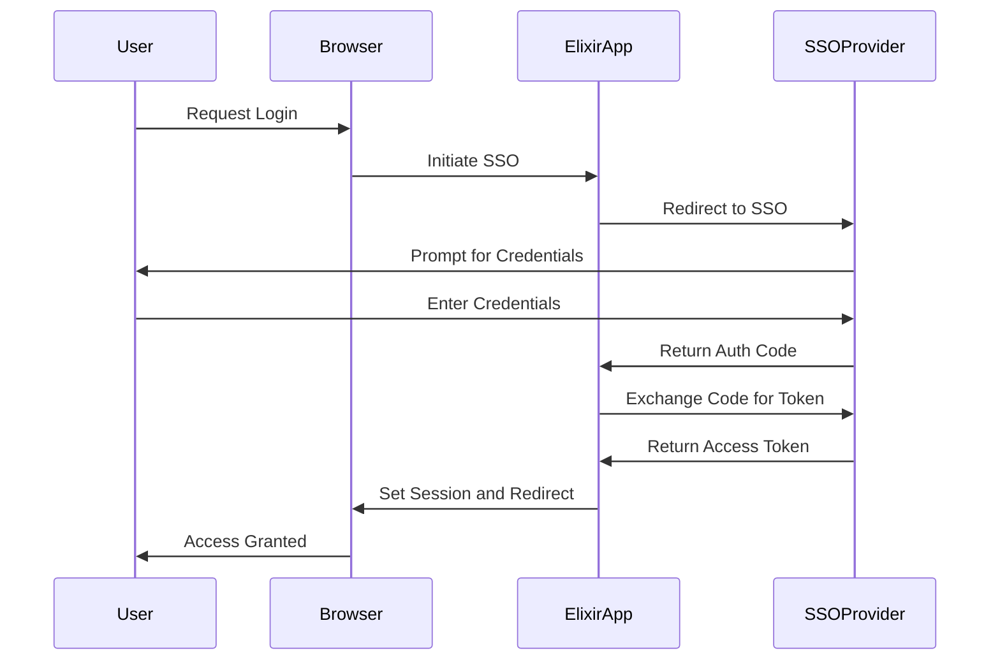

## 13.11. Security and Authentication Integration

In today's digital landscape, securing applications and managing authentication are paramount. As expert software engineers and architects, understanding how to integrate robust security measures in Elixir applications is crucial. This section delves into advanced security and authentication integration techniques, focusing on Single Sign-On (SSO), OAuth2, OpenID Connect, and encryption strategies to protect data both in transit and at rest.

### Single Sign-On (SSO)

Single Sign-On (SSO) is a user authentication process that allows users to access multiple applications with one set of login credentials. This centralized authentication mechanism simplifies user management and enhances security by reducing the number of passwords a user must remember.

#### Integrating with SSO Providers

To integrate SSO into your Elixir application, you can leverage libraries such as `ueberauth`, which provides a flexible authentication system for Elixir applications. Here's a step-by-step guide to integrating SSO using `ueberauth`:

1. **Install Ueberauth and a Strategy**: First, add `ueberauth` and a strategy like `ueberauth_google` to your `mix.exs` dependencies.

    ```elixir
    defp deps do
      [
        {:ueberauth, "~> 0.6"},
        {:ueberauth_google, "~> 0.9"}
      ]
    end
    ```

2. **Configure Ueberauth**: Set up the configuration in `config/config.exs`.

    ```elixir
    config :ueberauth, Ueberauth,
      providers: [
        google: {Ueberauth.Strategy.Google, []}
      ]

    config :ueberauth, Ueberauth.Strategy.Google.OAuth,
      client_id: System.get_env("GOOGLE_CLIENT_ID"),
      client_secret: System.get_env("GOOGLE_CLIENT_SECRET")
    ```

3. **Create a Controller**: Implement a controller to handle authentication requests.

    ```elixir
    defmodule MyAppWeb.AuthController do
      use MyAppWeb, :controller
      plug Ueberauth

      def request(conn, _params) do
        render(conn, "request.html")
      end

      def callback(%{assigns: %{ueberauth_auth: auth}} = conn, _params) do
        # Handle successful authentication
        IO.inspect(auth)
        conn
        |> put_flash(:info, "Successfully authenticated.")
        |> redirect(to: "/")
      end

      def callback(%{assigns: %{ueberauth_failure: failure}} = conn, _params) do
        # Handle authentication failure
        IO.inspect(failure)
        conn
        |> put_flash(:error, "Failed to authenticate.")
        |> redirect(to: "/")
      end
    end
    ```

4. **Update Router**: Add routes for the authentication process.

    ```elixir
    scope "/auth", MyAppWeb do
      pipe_through :browser

      get "/:provider", AuthController, :request
      get "/:provider/callback", AuthController, :callback
    end
    ```

5. **Try It Yourself**: Experiment by adding another provider, such as GitHub, and observe how the integration process remains consistent.

### OAuth2 and OpenID Connect

OAuth2 is a widely used authorization framework that enables third-party applications to obtain limited access to user accounts on an HTTP service. OpenID Connect builds on OAuth2 to provide a simple identity layer on top of the protocol.

#### Implementing OAuth2 in Elixir

To implement OAuth2 in Elixir, you can use the `oauth2` library. Here's how you can set it up:

1. **Install the OAuth2 Library**: Add `oauth2` to your `mix.exs` dependencies.

    ```elixir
    defp deps do
      [
        {:oauth2, "~> 2.0"}
      ]
    end
    ```

2. **Configure the OAuth2 Client**: Define a module to handle OAuth2 interactions.

    ```elixir
    defmodule MyApp.OAuth2Client do
      use OAuth2.Client

      def client do
        OAuth2.Client.new([
          strategy: OAuth2.Strategy.AuthCode,
          client_id: System.get_env("CLIENT_ID"),
          client_secret: System.get_env("CLIENT_SECRET"),
          site: "https://provider.com",
          redirect_uri: "http://localhost:4000/auth/callback"
        ])
      end

      def authorize_url!(params \\ []) do
        client()
        |> put_param(:scope, "read write")
        |> OAuth2.Client.authorize_url!(params)
      end

      def get_token!(params \\ [], headers \\ []) do
        client()
        |> OAuth2.Client.get_token!(params, headers)
      end
    end
    ```

3. **Handle the Callback**: Implement the callback logic to exchange the authorization code for an access token.

    ```elixir
    defmodule MyAppWeb.AuthController do
      use MyAppWeb, :controller

      def callback(conn, %{"code" => code}) do
        client = MyApp.OAuth2Client.get_token!(code: code)
        token = client.token
        # Use the token to access protected resources
        IO.inspect(token)
        conn
        |> put_flash(:info, "Successfully authenticated.")
        |> redirect(to: "/")
      end
    end
    ```

4. **Try It Yourself**: Modify the scope parameter to request different levels of access and observe the changes in permissions granted.

#### OpenID Connect Integration

OpenID Connect can be integrated using libraries like `openid_connect`. Here's a basic setup:

1. **Install the Library**: Add `openid_connect` to your `mix.exs` dependencies.

    ```elixir
    defp deps do
      [
        {:openid_connect, "~> 0.2"}
      ]
    end
    ```

2. **Configure OpenID Connect**: Set up the configuration for your provider.

    ```elixir
    config :openid_connect, :providers,
      google: [
        discovery_document_uri: "https://accounts.google.com/.well-known/openid-configuration",
        client_id: System.get_env("GOOGLE_CLIENT_ID"),
        client_secret: System.get_env("GOOGLE_CLIENT_SECRET"),
        redirect_uri: "http://localhost:4000/auth/callback"
      ]
    ```

3. **Handle Authentication**: Use the library to authenticate users.

    ```elixir
    defmodule MyAppWeb.AuthController do
      use MyAppWeb, :controller

      def callback(conn, %{"code" => code}) do
        {:ok, tokens} = OpenIDConnect.fetch_tokens(:google, code: code)
        IO.inspect(tokens)
        conn
        |> put_flash(:info, "Successfully authenticated with OpenID Connect.")
        |> redirect(to: "/")
      end
    end
    ```

4. **Try It Yourself**: Experiment with different OpenID Connect providers and observe the differences in the authentication flow.

### Encryption and Data Protection

Securing data in transit and at rest is a critical aspect of application security. Elixir provides several tools and libraries to ensure data protection.

#### Securing Data in Transit

To secure data in transit, use HTTPS and SSL/TLS protocols. Phoenix, the web framework for Elixir, supports HTTPS out of the box. Here's how to set it up:

1. **Generate SSL Certificates**: Use tools like Let's Encrypt to obtain SSL certificates.

2. **Configure Phoenix for HTTPS**: Update your endpoint configuration.

    ```elixir
    config :my_app, MyAppWeb.Endpoint,
      https: [
        port: 443,
        cipher_suite: :strong,
        keyfile: System.get_env("SSL_KEY_PATH"),
        certfile: System.get_env("SSL_CERT_PATH")
      ]
    ```

3. **Redirect HTTP to HTTPS**: Ensure all traffic is redirected to HTTPS.

    ```elixir
    defmodule MyAppWeb.Endpoint do
      use Phoenix.Endpoint, otp_app: :my_app

      plug Plug.SSL, rewrite_on: [:x_forwarded_proto]
    end
    ```

4. **Try It Yourself**: Test your application with tools like SSL Labs to ensure proper configuration.

#### Securing Data at Rest

For data at rest, encryption is key. Use libraries like `cloak` to encrypt sensitive data in your database.

1. **Install Cloak**: Add `cloak` to your `mix.exs` dependencies.

    ```elixir
    defp deps do
      [
        {:cloak, "~> 1.0"}
      ]
    end
    ```

2. **Configure Cloak**: Set up encryption keys and algorithms.

    ```elixir
    config :cloak, Cloak,
      ciphers: [
        default: {Cloak.Ciphers.AES.GCM, tag: "AES.GCM.V1", key: System.get_env("CLOAK_KEY")}
      ]
    ```

3. **Encrypt Fields**: Use `cloak_ecto` to encrypt fields in your Ecto schemas.

    ```elixir
    defmodule MyApp.User do
      use Ecto.Schema
      import Ecto.Changeset
      use Cloak.Ecto.Schema

      schema "users" do
        field :email, Cloak.Ecto.EncryptedField
        field :name, :string
        timestamps()
      end

      def changeset(user, attrs) do
        user
        |> cast(attrs, [:email, :name])
        |> validate_required([:email, :name])
      end
    end
    ```

4. **Try It Yourself**: Experiment with different encryption algorithms and observe their impact on performance and security.

### Visualizing Security Integration

To better understand the flow of security integration, let's visualize the process using a sequence diagram.



**Diagram Description**: This sequence diagram illustrates the flow of a Single Sign-On (SSO) authentication process. The user initiates a login request, which is handled by the Elixir application. The application redirects the user to the SSO provider, where the user enters their credentials. Upon successful authentication, the SSO provider returns an authorization code, which the Elixir application exchanges for an access token. Finally, the application sets the session and grants access to the user.

### Knowledge Check

- **Question**: What are the benefits of using Single Sign-On (SSO) in an application?
- **Challenge**: Implement a basic OAuth2 flow using a different provider, such as GitHub, and compare it with the Google example provided.

### Summary

In this section, we've explored advanced security and authentication integration techniques in Elixir, focusing on Single Sign-On (SSO), OAuth2, OpenID Connect, and encryption strategies. By leveraging these technologies, you can enhance the security of your applications and provide a seamless authentication experience for users.

### Embrace the Journey

Remember, security is an ongoing process. As you integrate these techniques into your applications, continue to stay informed about the latest security practices and updates. Keep experimenting, stay curious, and enjoy the journey of building secure and robust applications with Elixir!

## Quiz: Security and Authentication Integration



### What is the primary benefit of Single Sign-On (SSO)?

- [x] Centralized authentication
- [ ] Increased password complexity
- [ ] Faster application performance
- [ ] Reduced server load

> **Explanation:** SSO provides centralized authentication, allowing users to access multiple applications with a single set of credentials.

### Which library is commonly used for OAuth2 integration in Elixir?

- [x] oauth2
- [ ] ueberauth
- [ ] cloak
- [ ] phoenix

> **Explanation:** The `oauth2` library is commonly used for OAuth2 integration in Elixir applications.

### What is the purpose of OpenID Connect?

- [x] To provide an identity layer on top of OAuth2
- [ ] To encrypt data at rest
- [ ] To manage database connections
- [ ] To handle HTTP requests

> **Explanation:** OpenID Connect provides an identity layer on top of the OAuth2 protocol, enabling user authentication.

### How can you secure data in transit in a Phoenix application?

- [x] Use HTTPS and SSL/TLS
- [ ] Use cloak for encryption
- [ ] Use OAuth2 for authentication
- [ ] Use Plug for routing

> **Explanation:** HTTPS and SSL/TLS are used to secure data in transit in web applications, including those built with Phoenix.

### Which of the following is a method for securing data at rest?

- [x] Encrypting data with libraries like cloak
- [ ] Using OAuth2 for authentication
- [ ] Implementing SSO
- [ ] Using Plug for routing

> **Explanation:** Encrypting data with libraries like `cloak` is a method for securing data at rest.

### What is the role of the `ueberauth` library in Elixir?

- [x] To provide a flexible authentication system
- [ ] To encrypt data at rest
- [ ] To manage HTTP requests
- [ ] To handle database connections

> **Explanation:** `ueberauth` provides a flexible authentication system for Elixir applications, supporting various authentication strategies.

### Which protocol is used for centralized authentication in SSO?

- [x] SAML
- [ ] HTTP
- [ ] FTP
- [ ] SMTP

> **Explanation:** SAML (Security Assertion Markup Language) is commonly used for centralized authentication in SSO systems.

### What is a key advantage of using OAuth2?

- [x] It allows third-party applications to access user data without exposing credentials.
- [ ] It encrypts data at rest.
- [ ] It provides faster application performance.
- [ ] It reduces server load.

> **Explanation:** OAuth2 allows third-party applications to access user data without exposing user credentials, enhancing security.

### True or False: OpenID Connect is a standalone protocol.

- [ ] True
- [x] False

> **Explanation:** OpenID Connect is not a standalone protocol; it is an identity layer built on top of OAuth2.

### What is the primary purpose of using encryption in applications?

- [x] To protect sensitive data from unauthorized access
- [ ] To improve application performance
- [ ] To simplify authentication processes
- [ ] To reduce server load

> **Explanation:** The primary purpose of encryption is to protect sensitive data from unauthorized access, ensuring data confidentiality and integrity.




