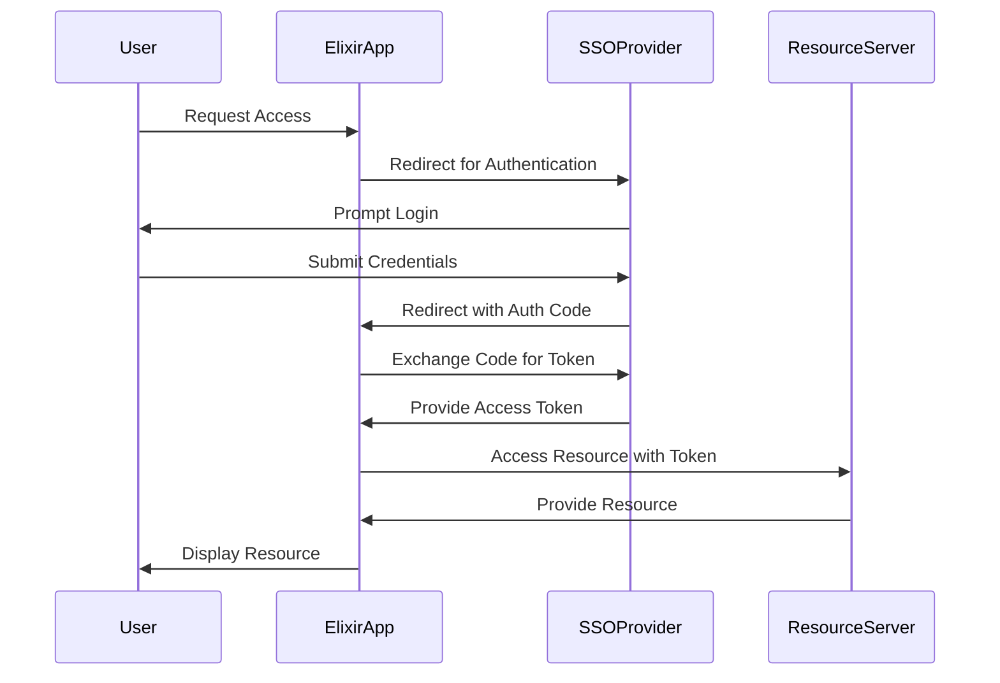

## 13.11. Security and Authentication Integration

In today's interconnected digital landscape, security and authentication are paramount. For Elixir developers, understanding how to effectively integrate security measures and authentication protocols into applications is crucial. This section delves into key concepts such as Single Sign-On (SSO), OAuth2, OpenID Connect, and encryption techniques to protect data both in transit and at rest.

### Single Sign-On (SSO)

Single Sign-On (SSO) is a user authentication process that allows users to access multiple applications with one set of login credentials. This enhances user experience by reducing the number of times a user has to log in and also centralizes authentication, making it easier to manage security policies.

#### Integrating with SSO Providers

To integrate SSO in Elixir applications, we typically rely on third-party identity providers like Okta, Auth0, or Azure AD. These providers use protocols such as SAML (Security Assertion Markup Language) or OAuth2 to facilitate SSO.

**Steps to Integrate SSO:**

1. **Choose an SSO Provider:** Select a provider that aligns with your application's needs and supports the required protocols.
2. **Configure the Provider:** Set up an application in the provider's dashboard to obtain client credentials.
3. **Implement the SSO Flow:** Use libraries like `ueberauth` in Elixir to handle the authentication flow.

**Code Example:**

Here's a basic example using `ueberauth` for SSO integration:

```elixir
# In your mix.exs file
defp deps do
  [
    {:ueberauth, "~> 0.6"},
    {:ueberauth_google, "~> 0.8"}
  ]
end

# In your router.ex file
pipeline :browser do
  plug Ueberauth
end

scope "/", MyAppWeb do
  pipe_through :browser

  get "/auth/:provider", AuthController, :request
  get "/auth/:provider/callback", AuthController, :callback
end

# In your auth_controller.ex file
defmodule MyAppWeb.AuthController do
  use MyAppWeb, :controller

  def callback(conn, %{"provider" => provider}) do
    case Ueberauth.Strategy.Helpers.get_user(conn) do
      {:ok, user} ->
        # Handle successful authentication
        conn
        |> put_flash(:info, "Successfully authenticated with #{provider}")
        |> redirect(to: "/dashboard")
      {:error, reason} ->
        # Handle failed authentication
        conn
        |> put_flash(:error, "Failed to authenticate: #{reason}")
        |> redirect(to: "/")
    end
  end
end
```

**Try It Yourself:**

- Modify the code to integrate with another provider like GitHub or Facebook.
- Experiment with error handling by simulating authentication failures.

### OAuth2 and OpenID Connect

OAuth2 is a widely used authorization framework that allows applications to access resources on behalf of a user. OpenID Connect is an identity layer on top of OAuth2, providing authentication.

#### Implementing OAuth2 and OpenID Connect

To implement OAuth2 and OpenID Connect in Elixir, we can use libraries such as `oauth2` and `ueberauth`.

**Key Steps:**

1. **Register Your Application:** Obtain client credentials from the OAuth2 provider.
2. **Implement the Authorization Code Flow:** This involves redirecting the user to the provider's authorization page and handling the callback.
3. **Exchange the Authorization Code for Tokens:** Use the received authorization code to request access and ID tokens.

**Code Example:**

```elixir
# In your mix.exs file
defp deps do
  [
    {:oauth2, "~> 2.0"}
  ]
end

# OAuth2 client configuration
defmodule MyApp.OAuth2Client do
  use OAuth2.Client

  def client do
    OAuth2.Client.new([
      strategy: OAuth2.Strategy.AuthCode,
      client_id: "your_client_id",
      client_secret: "your_client_secret",
      site: "https://provider.com",
      redirect_uri: "http://localhost:4000/auth/callback"
    ])
  end

  def authorize_url!(client) do
    OAuth2.Client.authorize_url!(client)
  end

  def get_token!(client, code) do
    OAuth2.Client.get_token!(client, code: code)
  end
end

# In your auth_controller.ex file
defmodule MyAppWeb.AuthController do
  use MyAppWeb, :controller

  alias MyApp.OAuth2Client

  def request(conn, _params) do
    client = OAuth2Client.client()
    redirect(conn, external: OAuth2Client.authorize_url!(client))
  end

  def callback(conn, %{"code" => code}) do
    client = OAuth2Client.client()
    token = OAuth2Client.get_token!(client, code)

    # Use token to access user info
    conn
    |> put_flash(:info, "Successfully authenticated")
    |> redirect(to: "/dashboard")
  end
end
```

**Try It Yourself:**

- Implement token refresh logic for long-lived sessions.
- Explore using OpenID Connect to retrieve user profile information.

### Encryption and Data Protection

Securing data is critical in any application. Elixir provides robust tools for encrypting data both in transit and at rest.

#### Securing Data in Transit

To secure data in transit, we use SSL/TLS protocols. Elixir's `:ssl` module provides functionality for handling secure connections.

**Code Example:**

```elixir
# Establishing an SSL connection
{:ok, socket} = :ssl.connect('example.com', 443, [])
:ssl.send(socket, "GET / HTTP/1.1\r\nHost: example.com\r\n\r\n")
{:ok, response} = :ssl.recv(socket, 0)
IO.puts(response)
:ssl.close(socket)
```

#### Securing Data at Rest

For data at rest, encryption libraries like `cloak` can be used to encrypt sensitive information before storing it in a database.

**Code Example:**

```elixir
# In your mix.exs file
defp deps do
  [
    {:cloak, "~> 1.0"}
  ]
end

# Configuration for Cloak
config :cloak, Cloak.Vault,
  ciphers: [
    default: {Cloak.Ciphers.AES.GCM, tag: "AES.GCM.V1", key: "your_secret_key"}
  ]

# Encrypting and decrypting data
defmodule MyApp.Encryption do
  alias Cloak.Vault

  def encrypt(data) do
    Vault.encrypt(data)
  end

  def decrypt(encrypted_data) do
    Vault.decrypt(encrypted_data)
  end
end
```

**Try It Yourself:**

- Experiment with different encryption algorithms provided by Cloak.
- Implement a function to rotate encryption keys periodically.

### Visualizing Security and Authentication Integration

To better understand the flow of security and authentication integration, let's visualize the process using a sequence diagram.


```mermaid
sequenceDiagram
    participant User
    participant ElixirApp
    participant SSOProvider
    participant ResourceServer

    User->>ElixirApp: Request Access
    ElixirApp->>SSOProvider: Redirect for Authentication
    SSOProvider->>User: Prompt Login
    User->>SSOProvider: Submit Credentials
    SSOProvider->>ElixirApp: Redirect with Auth Code
    ElixirApp->>SSOProvider: Exchange Code for Token
    SSOProvider->>ElixirApp: Provide Access Token
    ElixirApp->>ResourceServer: Access Resource with Token
    ResourceServer->>ElixirApp: Provide Resource
    ElixirApp->>User: Display Resource
```

**Diagram Explanation:**

- The user initiates a request to access a resource.
- The application redirects the user to the SSO provider for authentication.
- Upon successful login, the provider redirects back with an authorization code.
- The application exchanges the code for an access token.
- The token is used to access the resource server, which returns the requested resource.

### References and Links

- [OAuth2 Specification](https://oauth.net/2/)
- [OpenID Connect Specification](https://openid.net/connect/)
- [Elixir Cloak Library](https://hexdocs.pm/cloak/readme.html)

### Knowledge Check

- What is the difference between OAuth2 and OpenID Connect?
- How does Single Sign-On improve user experience?
- Why is it important to encrypt data at rest?

### Embrace the Journey

Security and authentication integration in Elixir applications is a journey that involves understanding protocols, implementing robust encryption, and continuously evolving with the latest security practices. Remember, this is just the beginning. As you progress, you'll build more secure and resilient applications. Keep experimenting, stay curious, and enjoy the journey!

## Quiz Time!



### What is the primary purpose of Single Sign-On (SSO)?

- [x] To allow users to access multiple applications with one set of login credentials.
- [ ] To encrypt data at rest.
- [ ] To provide a backup authentication method.
- [ ] To manage user permissions within a single application.

> **Explanation:** SSO allows users to access multiple applications with one set of login credentials, enhancing user experience and centralizing authentication management.

### Which protocol is commonly used for Single Sign-On?

- [x] SAML
- [ ] HTTP
- [ ] FTP
- [ ] SMTP

> **Explanation:** SAML (Security Assertion Markup Language) is commonly used for Single Sign-On to facilitate authentication and authorization.

### What is the main difference between OAuth2 and OpenID Connect?

- [x] OAuth2 is an authorization framework, while OpenID Connect is an identity layer on top of OAuth2.
- [ ] OAuth2 is used for data encryption, while OpenID Connect is used for data decryption.
- [ ] OAuth2 is a protocol for sending emails, while OpenID Connect is for receiving emails.
- [ ] OAuth2 requires a password, while OpenID Connect does not.

> **Explanation:** OAuth2 is an authorization framework, and OpenID Connect is an identity layer on top of OAuth2, providing authentication.

### What is the role of the `ueberauth` library in Elixir?

- [x] It handles authentication flows with various providers.
- [ ] It encrypts data at rest.
- [ ] It manages database connections.
- [ ] It performs data serialization.

> **Explanation:** The `ueberauth` library in Elixir is used to handle authentication flows with various providers, simplifying the integration of authentication protocols.

### Which library can be used in Elixir for data encryption?

- [x] Cloak
- [ ] Phoenix
- [ ] Ecto
- [ ] Plug

> **Explanation:** Cloak is a library in Elixir that provides tools for encrypting data, ensuring data security at rest.

### What is the purpose of the `:ssl` module in Elixir?

- [x] To handle secure connections using SSL/TLS protocols.
- [ ] To manage user sessions.
- [ ] To perform logging operations.
- [ ] To handle HTTP requests.

> **Explanation:** The `:ssl` module in Elixir is used to handle secure connections using SSL/TLS protocols, ensuring data security in transit.

### How can you obtain client credentials for OAuth2 integration?

- [x] By registering your application with the OAuth2 provider.
- [ ] By generating them locally on your server.
- [ ] By using a random number generator.
- [ ] By extracting them from the user's session.

> **Explanation:** Client credentials for OAuth2 integration are obtained by registering your application with the OAuth2 provider, which provides the necessary credentials.

### What is a common use case for OpenID Connect?

- [x] Authenticating users and retrieving their profile information.
- [ ] Encrypting database records.
- [ ] Sending emails to users.
- [ ] Compressing image files.

> **Explanation:** OpenID Connect is commonly used for authenticating users and retrieving their profile information, building on top of OAuth2.

### Why is encryption important for data at rest?

- [x] To protect sensitive information from unauthorized access.
- [ ] To increase the speed of data retrieval.
- [ ] To reduce the size of data storage.
- [ ] To simplify data backup processes.

> **Explanation:** Encryption is important for data at rest to protect sensitive information from unauthorized access, ensuring data security and compliance with regulations.

### True or False: The `oauth2` library in Elixir is used to manage database migrations.

- [ ] True
- [x] False

> **Explanation:** False. The `oauth2` library in Elixir is used for implementing OAuth2 authorization flows, not for managing database migrations.


