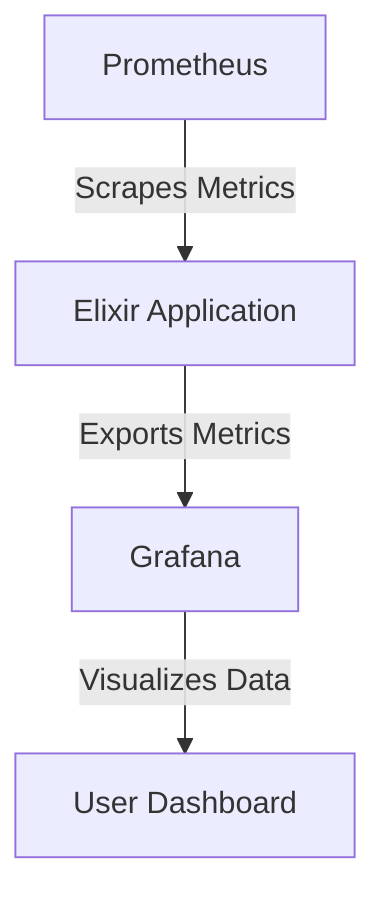
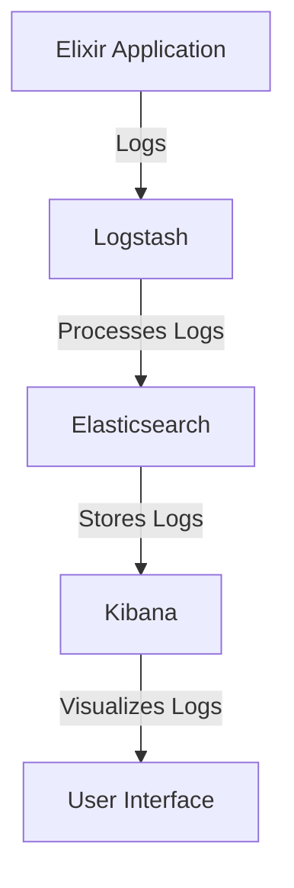

## 13.12. Monitoring and Logging Strategies

In the world of software engineering, especially when dealing with distributed systems and microservices, monitoring and logging are crucial components for maintaining system health and performance. Elixir, with its robust concurrency model and fault-tolerant design, offers unique opportunities and challenges in implementing effective monitoring and logging strategies. In this section, we will explore advanced techniques for centralized monitoring, configuring alerting systems, and establishing logging best practices in Elixir applications.

### Centralized Monitoring

Centralized monitoring involves aggregating metrics from multiple services into a single, cohesive view. This approach allows for comprehensive insights into the performance and health of your entire system.

#### Aggregating Metrics from Multiple Services

To effectively monitor an Elixir application, it's essential to collect and aggregate metrics from various services. This can include metrics such as CPU usage, memory consumption, request latency, and error rates.

**Prometheus and Grafana**

Prometheus is a powerful open-source monitoring solution that can be used to collect metrics from Elixir applications. Grafana, on the other hand, is a visualization tool that can be used to create dashboards for these metrics.

```elixir
# Example of using Prometheus with Elixir

defmodule MyApp.Metrics do
  use Prometheus.PlugExporter

  def setup do
    # Define a counter metric
    Prometheus.Metric.Counter.declare(
      name: :http_requests_total,
      help: "Total number of HTTP requests"
    )

    # Increment the counter
    Prometheus.Metric.Counter.inc(name: :http_requests_total)
  end
end
```

In the above example, we define a counter metric to track the total number of HTTP requests. This metric can then be scraped by Prometheus and visualized using Grafana.

**Visualizing Metrics with Grafana**

To visualize the metrics collected by Prometheus, you can use Grafana to create dashboards. Grafana provides a user-friendly interface to create graphs and alerts based on the metrics data.



*Diagram: The flow of metrics from an Elixir application to Prometheus and visualization in Grafana.*

#### Implementing Distributed Tracing

Distributed tracing is another critical component of centralized monitoring. It helps in tracking requests as they flow through different services in a distributed system. OpenTelemetry is a popular choice for implementing distributed tracing in Elixir.

```elixir
# Example of setting up OpenTelemetry in Elixir

defmodule MyApp.Tracer do
  use OpenTelemetry.Tracer

  def start_trace do
    OpenTelemetry.Tracer.with_span "my_span" do
      # Perform operations within the trace
    end
  end
end
```

By using OpenTelemetry, you can gain insights into the performance of individual services and identify bottlenecks in your system.

### Alerting Systems

Alerting systems are essential for notifying developers and operators about critical system events. Properly configured alerts can help in quickly identifying and resolving issues before they impact users.

#### Configuring Alerts for Critical System Events

Alerts should be configured to notify the relevant teams about critical events such as high error rates, increased latency, or resource exhaustion.

**Using Alertmanager with Prometheus**

Alertmanager is a component of the Prometheus ecosystem that handles alerts. It can be configured to send notifications via email, Slack, or other communication channels.

```yaml
# Example Alertmanager configuration

route:
  receiver: "team_notifications"

receivers:
  - name: "team_notifications"
    email_configs:
      - to: "team@example.com"
        from: "alertmanager@example.com"
        smarthost: "smtp.example.com:587"
```

In this configuration, alerts are sent to the specified email address whenever a critical event occurs.

**Creating Custom Alerts**

Custom alerts can be created based on specific metrics or conditions. For example, you can create an alert for high memory usage in an Elixir application.

```yaml
# Prometheus alert rule for high memory usage

groups:
  - name: memory_alerts
    rules:
      - alert: HighMemoryUsage
        expr: node_memory_Active_bytes > 1e+09
        for: 5m
        labels:
          severity: critical
        annotations:
          summary: "High memory usage detected"
          description: "Memory usage is above 1GB for more than 5 minutes."
```

This alert rule triggers when memory usage exceeds 1GB for more than 5 minutes, notifying the team to investigate the issue.

### Logging Best Practices

Logging is an essential part of monitoring and debugging applications. Well-structured logs provide valuable insights into application behavior and help in diagnosing issues.

#### Structuring Logs for Readability and Analysis

Logs should be structured in a way that makes them easy to read and analyze. This includes using consistent formats, including relevant context, and avoiding excessive verbosity.

**Using Logger in Elixir**

Elixir's built-in `Logger` module provides a simple and effective way to log messages. It supports different log levels such as `:debug`, `:info`, `:warn`, and `:error`.

```elixir
# Example of using Logger in Elixir

defmodule MyApp.LoggerExample do
  require Logger

  def log_message do
    Logger.info("This is an informational message")
    Logger.error("This is an error message")
  end
end
```

In this example, we log messages at different levels using the `Logger` module.

**Structured Logging with JSON**

Structured logging involves formatting log messages in a structured format such as JSON. This makes it easier to parse and analyze logs using tools like Elasticsearch and Kibana.

```elixir
# Example of structured logging with JSON

defmodule MyApp.StructuredLogger do
  require Logger

  def log_structured_message do
    Logger.info(fn ->
      Jason.encode!(%{
        event: "user_login",
        user_id: 123,
        timestamp: DateTime.utc_now()
      })
    end)
  end
end
```

By logging messages in JSON format, you can easily search and filter logs based on specific fields.

**Centralized Log Management**

Centralized log management involves aggregating logs from multiple services into a single location for analysis. Tools like Elasticsearch, Logstash, and Kibana (ELK stack) are commonly used for this purpose.



*Diagram: Centralized log management using the ELK stack.*

### Try It Yourself

To experiment with the concepts discussed in this section, try setting up a simple Elixir application with Prometheus and Grafana for monitoring, and configure Alertmanager for alerts. Implement structured logging using JSON and visualize logs using the ELK stack. Modify the configurations to suit your application's needs and observe the impact on monitoring and logging.

### Knowledge Check

- What are the benefits of centralized monitoring in a distributed system?
- How can Prometheus and Grafana be used together for monitoring Elixir applications?
- What is the role of Alertmanager in the Prometheus ecosystem?
- Why is structured logging important for log analysis?
- How can OpenTelemetry be used for distributed tracing in Elixir?

### Summary

In this section, we explored advanced monitoring and logging strategies for Elixir applications. We discussed the importance of centralized monitoring, configuring alerting systems, and establishing logging best practices. By implementing these strategies, you can gain valuable insights into your application's performance and quickly identify and resolve issues. Remember, effective monitoring and logging are crucial for building robust and scalable systems.

## Quiz: Monitoring and Logging Strategies



### What is the primary purpose of centralized monitoring?

- [x] To aggregate metrics from multiple services into a single view
- [ ] To reduce the number of logs generated by the system
- [ ] To eliminate the need for alerting systems
- [ ] To replace traditional logging methods

> **Explanation:** Centralized monitoring aggregates metrics from multiple services to provide a comprehensive view of the system's performance and health.

### Which tool is commonly used with Prometheus for visualizing metrics?

- [x] Grafana
- [ ] Elasticsearch
- [ ] Logstash
- [ ] Kibana

> **Explanation:** Grafana is commonly used with Prometheus to create dashboards and visualize metrics.

### What is the role of Alertmanager in the Prometheus ecosystem?

- [x] To handle alerts and send notifications
- [ ] To collect metrics from applications
- [ ] To visualize metrics in dashboards
- [ ] To store logs in a centralized location

> **Explanation:** Alertmanager handles alerts and sends notifications based on predefined conditions.

### Why is structured logging important?

- [x] It makes logs easier to parse and analyze
- [ ] It reduces the size of log files
- [ ] It eliminates the need for log rotation
- [ ] It increases the verbosity of logs

> **Explanation:** Structured logging formats logs in a way that makes them easier to parse and analyze, often using formats like JSON.

### How can OpenTelemetry be used in Elixir?

- [x] For distributed tracing
- [ ] For centralized logging
- [ ] For alert management
- [ ] For reducing memory usage

> **Explanation:** OpenTelemetry is used for distributed tracing, helping track requests across different services.

### What is the ELK stack used for?

- [x] Centralized log management
- [ ] Distributed tracing
- [ ] Metric visualization
- [ ] Alert configuration

> **Explanation:** The ELK stack (Elasticsearch, Logstash, Kibana) is used for centralized log management and visualization.

### Which of the following is a benefit of using JSON for structured logging?

- [x] Easier log parsing and filtering
- [ ] Reduced log file size
- [ ] Increased log verbosity
- [ ] Simplified log rotation

> **Explanation:** JSON format makes logs easier to parse and filter, aiding in analysis.

### What is a key advantage of using Prometheus for monitoring?

- [x] It can scrape metrics from multiple sources
- [ ] It provides built-in alerting
- [ ] It stores logs in a centralized location
- [ ] It visualizes data directly

> **Explanation:** Prometheus can scrape metrics from multiple sources, making it versatile for monitoring.

### True or False: Alertmanager can send notifications via email and Slack.

- [x] True
- [ ] False

> **Explanation:** Alertmanager can be configured to send notifications via various channels, including email and Slack.

### What is the primary function of Grafana in a monitoring setup?

- [x] To visualize metrics and create dashboards
- [ ] To collect and store logs
- [ ] To handle alerts and notifications
- [ ] To manage application configurations

> **Explanation:** Grafana is used to visualize metrics and create dashboards for monitoring purposes.



Remember, this is just the beginning. As you progress, you'll build more complex and interactive monitoring and logging systems. Keep experimenting, stay curious, and enjoy the journey!
