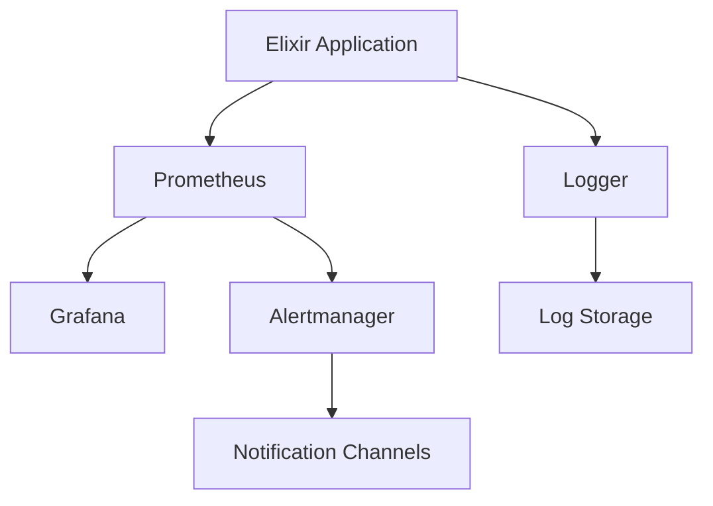

## 13.12. Monitoring and Logging Strategies

In the dynamic world of software development, monitoring and logging are crucial for maintaining the health and performance of applications. In Elixir, these practices are essential for building robust, scalable, and fault-tolerant systems. This section delves into advanced monitoring and logging strategies tailored for Elixir applications, focusing on centralized monitoring, alerting systems, and logging best practices.

### Centralized Monitoring

Centralized monitoring is a strategy that aggregates metrics from multiple services into a single, unified platform. This approach provides a holistic view of the system's health and performance, enabling developers to quickly identify and address issues.

#### Why Centralized Monitoring?

Centralized monitoring offers several benefits:

- **Unified View**: By aggregating metrics from various services, developers gain a comprehensive view of the entire system.
- **Ease of Analysis**: Centralized data makes it easier to analyze trends and identify anomalies.
- **Simplified Management**: Managing a single monitoring platform is more efficient than handling multiple disparate systems.

#### Implementing Centralized Monitoring in Elixir

To implement centralized monitoring in Elixir, consider using tools like Prometheus and Grafana. These tools provide powerful capabilities for collecting, storing, and visualizing metrics.

**Prometheus Setup**

Prometheus is an open-source monitoring solution that collects metrics from configured targets at specified intervals. It is well-suited for Elixir applications due to its scalability and flexibility.

1. **Install Prometheus**: Download and install Prometheus from the [official website](https://prometheus.io/download/).

2. **Configure Prometheus**: Create a configuration file (`prometheus.yml`) to specify the targets to be monitored.

   ```yaml
   global:
     scrape_interval: 15s

   scrape_configs:
     - job_name: 'elixir_app'
       static_configs:
         - targets: ['localhost:4000']
   ```

3. **Integrate with Elixir**: Use the `prometheus_ex` library to expose metrics from your Elixir application.

   ```elixir
   defmodule MyApp.Metrics do
     use Prometheus.PlugExporter
     use Prometheus.Metric

     def setup do
       Counter.declare(name: :http_requests_total, help: "Total number of HTTP requests")
     end

     def increment_request_count do
       Counter.inc(name: :http_requests_total)
     end
   end
   ```

4. **Visualize with Grafana**: Set up Grafana to visualize the metrics collected by Prometheus. Grafana provides a rich set of features for creating dashboards and alerts.

   

   *Figure 1: Example of a Grafana Dashboard visualizing Prometheus metrics.*

### Alerting Systems

Alerting systems are critical for notifying developers of potential issues before they escalate into major problems. Effective alerting involves configuring alerts for critical system events and ensuring timely responses.

#### Key Components of Alerting Systems

- **Thresholds**: Define thresholds for metrics that, when exceeded, trigger alerts.
- **Notification Channels**: Set up channels (e.g., email, Slack, SMS) for delivering alerts to the appropriate teams.
- **Escalation Policies**: Establish policies for escalating alerts if they are not addressed within a certain timeframe.

#### Configuring Alerts in Elixir

To configure alerts in Elixir, you can use tools like Alertmanager, which integrates with Prometheus to handle alerts.

**Setting Up Alertmanager**

1. **Install Alertmanager**: Download and install Alertmanager from the [official website](https://prometheus.io/docs/alerting/latest/alertmanager/).

2. **Configure Alertmanager**: Create a configuration file (`alertmanager.yml`) to specify the alerting rules and notification channels.

   ```yaml
   route:
     receiver: 'team-X'

   receivers:
     - name: 'team-X'
       email_configs:
         - to: 'team-x@example.com'
   ```

3. **Define Alerting Rules**: In Prometheus, define alerting rules that specify the conditions under which alerts should be triggered.

   ```yaml
   groups:
     - name: example
       rules:
         - alert: HighRequestLatency
           expr: http_request_duration_seconds{job="elixir_app"} > 0.5
           for: 5m
           labels:
             severity: 'critical'
           annotations:
             summary: "High request latency detected"
   ```

4. **Test Alerts**: Ensure that alerts are correctly configured by testing them in a controlled environment.

### Logging Best Practices

Logging is an essential aspect of monitoring, providing insights into the application's behavior and aiding in troubleshooting. Effective logging involves structuring logs for readability and analysis.

#### Structuring Logs

- **Consistent Format**: Use a consistent format for all log entries to facilitate parsing and analysis.
- **Include Contextual Information**: Include relevant context (e.g., request IDs, user IDs) in log entries to aid in tracing issues.
- **Log Levels**: Use appropriate log levels (e.g., DEBUG, INFO, WARN, ERROR) to categorize log entries based on their severity.

#### Implementing Logging in Elixir

In Elixir, the `Logger` module provides a robust logging framework that supports various backends and formats.

**Basic Logging Setup**

1. **Configure Logger**: In your `config/config.exs` file, configure the `Logger` module to specify the log level and format.

   ```elixir
   config :logger, :console,
     format: "$time $metadata[$level] $message\n",
     metadata: [:request_id]
   ```

2. **Log Messages**: Use the `Logger` module to log messages at different levels.

   ```elixir
   defmodule MyApp do
     require Logger

     def some_function do
       Logger.info("This is an informational message")
       Logger.error("This is an error message")
     end
   end
   ```

3. **Structured Logging**: Consider using structured logging to output logs in a machine-readable format, such as JSON.

   ```elixir
   config :logger, :console,
     format: {Jason, :encode!},
     metadata: [:request_id, :user_id]
   ```

4. **Log Rotation and Retention**: Implement log rotation and retention policies to manage disk space and ensure that logs are available for analysis.

### Visualizing Monitoring and Logging Architecture

To better understand the flow of monitoring and logging data, consider the following diagram:


```mermaid
graph TD;
    A[Elixir Application] --> B[Prometheus];
    B --> C[Grafana];
    A --> D[Logger];
    D --> E[Log Storage];
    B --> F[Alertmanager];
    F --> G[Notification Channels];
```

*Figure 2: Monitoring and Logging Architecture for Elixir Applications.*

### Knowledge Check

- **What are the benefits of centralized monitoring?**
- **How can you configure alerts for critical system events in Elixir?**
- **What are some best practices for structuring logs?**

### Try It Yourself

To reinforce your understanding, try experimenting with the code examples provided:

- **Modify the Prometheus configuration** to monitor additional metrics from your Elixir application.
- **Create custom alerting rules** in Prometheus to trigger alerts based on specific conditions.
- **Implement structured logging** in your Elixir application and analyze the logs using a log management tool.

### Conclusion

Monitoring and logging are vital components of any robust application architecture. By implementing centralized monitoring, configuring effective alerting systems, and following logging best practices, you can ensure the reliability and performance of your Elixir applications. Remember, this is just the beginning. As you progress, you'll build more complex and interactive systems. Keep experimenting, stay curious, and enjoy the journey!

## Quiz Time!



### What is the primary benefit of centralized monitoring?

- [x] Aggregates metrics from multiple services into a unified platform
- [ ] Reduces the need for logging
- [ ] Eliminates the need for alerting systems
- [ ] Increases application complexity

> **Explanation:** Centralized monitoring aggregates metrics from multiple services into a unified platform, providing a comprehensive view of the system's health and performance.

### Which tool is commonly used with Prometheus for visualizing metrics?

- [x] Grafana
- [ ] Elasticsearch
- [ ] Kibana
- [ ] Logstash

> **Explanation:** Grafana is commonly used with Prometheus to visualize metrics through dashboards.

### What is a key component of an alerting system?

- [x] Thresholds
- [ ] Log rotation
- [ ] Code compilation
- [ ] Database indexing

> **Explanation:** Thresholds are a key component of an alerting system, defining the conditions under which alerts should be triggered.

### Which Elixir module is used for logging?

- [x] Logger
- [ ] Logstash
- [ ] Log4j
- [ ] Syslog

> **Explanation:** The `Logger` module in Elixir is used for logging messages at different levels.

### What is a best practice for structuring logs?

- [x] Use a consistent format
- [ ] Log everything at the DEBUG level
- [ ] Avoid including contextual information
- [ ] Use random formats

> **Explanation:** Using a consistent format for logs is a best practice as it facilitates parsing and analysis.

### What is the purpose of Alertmanager?

- [x] To handle alerts generated by Prometheus
- [ ] To store logs
- [ ] To compile Elixir code
- [ ] To manage database connections

> **Explanation:** Alertmanager handles alerts generated by Prometheus, allowing for notification and escalation.

### How can structured logging benefit an application?

- [x] Makes logs machine-readable
- [ ] Increases log file size
- [ ] Reduces logging performance
- [ ] Complicates log analysis

> **Explanation:** Structured logging outputs logs in a machine-readable format, such as JSON, which aids in automated log analysis.

### Which configuration file is used to specify targets for Prometheus?

- [x] prometheus.yml
- [ ] config.exs
- [ ] alertmanager.yml
- [ ] application.conf

> **Explanation:** The `prometheus.yml` file is used to specify targets for Prometheus to scrape metrics from.

### What should be included in logs for better traceability?

- [x] Contextual information
- [ ] Only error messages
- [ ] Random data
- [ ] Unformatted text

> **Explanation:** Including contextual information, such as request IDs and user IDs, in logs aids in tracing issues.

### Centralized monitoring simplifies management by:

- [x] Aggregating data into a single platform
- [ ] Eliminating the need for monitoring
- [ ] Increasing the number of monitoring tools
- [ ] Reducing data visibility

> **Explanation:** Centralized monitoring simplifies management by aggregating data into a single platform, making it easier to analyze and manage.



---
