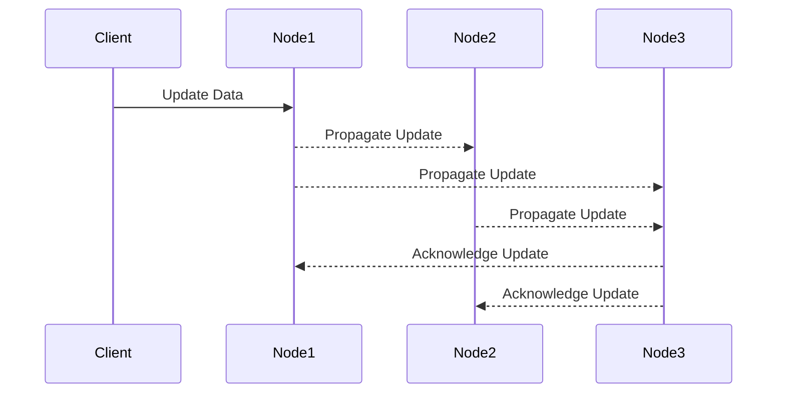
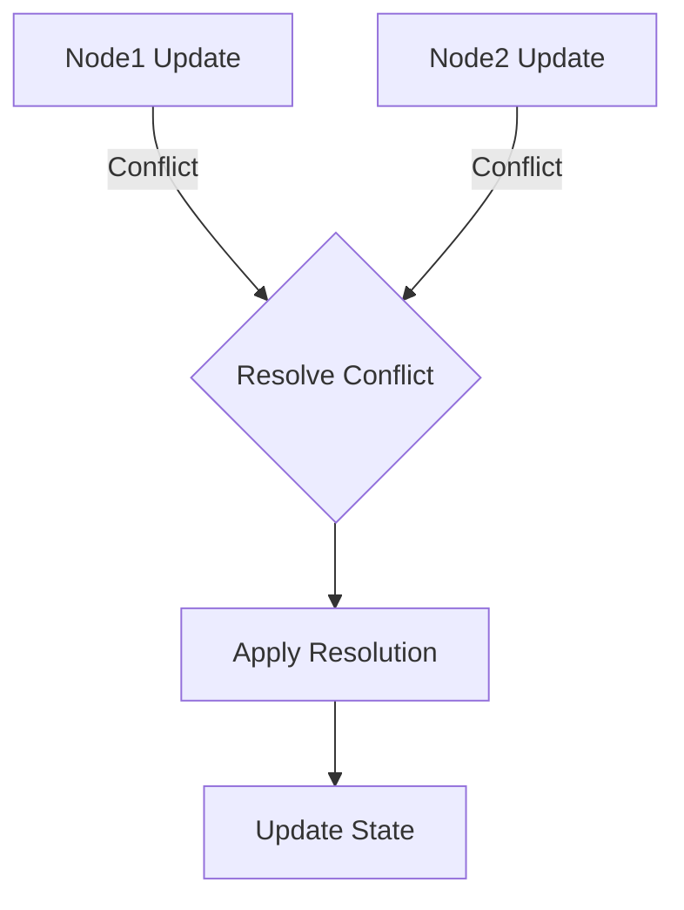

## 13.13. Patterns for Data Consistency

In the world of distributed systems, ensuring data consistency is a critical challenge. Elixir, with its robust concurrency model and functional programming paradigm, offers unique approaches to tackle these challenges. In this section, we will delve into various patterns for achieving data consistency in Elixir applications, focusing on eventual consistency, consistency models, and conflict resolution.

### Eventual Consistency

**Eventual consistency** is a consistency model used in distributed computing to achieve high availability and partition tolerance. In this model, it is acceptable for the system to be temporarily inconsistent, with the guarantee that it will become consistent over time.

#### Key Concepts

- **Temporary Inconsistency**: Accepting that data may not be immediately consistent across all nodes.
- **Convergence**: Ensuring that all nodes eventually reach a consistent state.
- **Trade-offs**: Balancing between consistency, availability, and partition tolerance (CAP theorem).

#### Implementing Eventual Consistency in Elixir

Elixir's concurrency model, based on the Actor model, is well-suited for implementing eventual consistency. Processes can communicate asynchronously, allowing for updates to propagate through the system over time.

```elixir
defmodule EventualConsistency do
  use GenServer

  # Client API
  def start_link(initial_state) do
    GenServer.start_link(__MODULE__, initial_state, name: __MODULE__)
  end

  def update_state(new_data) do
    GenServer.cast(__MODULE__, {:update, new_data})
  end

  def get_state do
    GenServer.call(__MODULE__, :get_state)
  end

  # Server Callbacks
  def init(initial_state) do
    {:ok, initial_state}
  end

  def handle_cast({:update, new_data}, state) do
    # Simulate eventual consistency by merging new data
    updated_state = Map.merge(state, new_data)
    {:noreply, updated_state}
  end

  def handle_call(:get_state, _from, state) do
    {:reply, state, state}
  end
end

# Usage
{:ok, _pid} = EventualConsistency.start_link(%{key1: "value1"})
EventualConsistency.update_state(%{key2: "value2"})
IO.inspect(EventualConsistency.get_state()) # Eventually consistent state
```

In this example, the `EventualConsistency` module uses a GenServer to manage state updates. The `update_state/1` function simulates eventual consistency by merging new data into the existing state.

#### Visualizing Eventual Consistency



**Diagram Description**: This sequence diagram illustrates how an update is propagated across nodes in an eventually consistent system. Each node communicates asynchronously, ensuring that all nodes eventually converge to the same state.

### Consistency Models

Consistency models define the rules for reading and writing data in a distributed system. Understanding these models is crucial for designing systems that meet specific consistency requirements.

#### Strong Consistency

**Strong consistency** ensures that all nodes see the same data at the same time. This model is often used when data accuracy is critical, but it can impact system availability and performance.

- **Use Cases**: Financial transactions, inventory management.
- **Trade-offs**: Reduced availability and increased latency.

#### Weak Consistency

**Weak consistency** allows for temporary inconsistencies, prioritizing availability and performance over immediate consistency.

- **Use Cases**: Social media feeds, caching systems.
- **Trade-offs**: Potential for stale data.

#### Implementing Consistency Models in Elixir

Elixir's process model allows for flexible implementation of different consistency models. By leveraging GenServers and message passing, we can design systems that adhere to the desired consistency level.

```elixir
defmodule StrongConsistency do
  use GenServer

  # Client API
  def start_link(initial_state) do
    GenServer.start_link(__MODULE__, initial_state, name: __MODULE__)
  end

  def update_state(new_data) do
    GenServer.call(__MODULE__, {:update, new_data})
  end

  def get_state do
    GenServer.call(__MODULE__, :get_state)
  end

  # Server Callbacks
  def init(initial_state) do
    {:ok, initial_state}
  end

  def handle_call({:update, new_data}, _from, state) do
    # Ensure strong consistency by synchronously updating state
    updated_state = Map.merge(state, new_data)
    {:reply, :ok, updated_state}
  end

  def handle_call(:get_state, _from, state) do
    {:reply, state, state}
  end
end

# Usage
{:ok, _pid} = StrongConsistency.start_link(%{key1: "value1"})
StrongConsistency.update_state(%{key2: "value2"})
IO.inspect(StrongConsistency.get_state()) # Strongly consistent state
```

In this example, the `StrongConsistency` module ensures that state updates are handled synchronously, providing strong consistency guarantees.

### Conflict Resolution

In distributed systems, conflicts can arise when multiple nodes attempt to update the same data simultaneously. Effective conflict resolution strategies are essential for maintaining data integrity.

#### Common Conflict Resolution Strategies

- **Last Write Wins (LWW)**: The most recent update is accepted.
- **Merge Function**: Custom logic to merge conflicting updates.
- **Version Vectors**: Track changes using version numbers.

#### Implementing Conflict Resolution in Elixir

Elixir's functional programming paradigm makes it easy to implement conflict resolution strategies using pure functions and pattern matching.

```elixir
defmodule ConflictResolver do
  def resolve_conflict(data1, data2) do
    # Example: Last Write Wins strategy
    if data1.timestamp > data2.timestamp do
      data1
    else
      data2
    end
  end
end

# Usage
data1 = %{value: "old", timestamp: 1}
data2 = %{value: "new", timestamp: 2}
resolved_data = ConflictResolver.resolve_conflict(data1, data2)
IO.inspect(resolved_data) # Outputs: %{value: "new", timestamp: 2}
```

In this example, the `ConflictResolver` module implements a simple Last Write Wins strategy, resolving conflicts based on timestamps.

#### Visualizing Conflict Resolution



**Diagram Description**: This flowchart illustrates the conflict resolution process. When a conflict is detected, a resolution strategy is applied, and the resolved state is updated.

### Design Considerations

When designing systems with data consistency in mind, consider the following:

- **Consistency vs. Availability**: Determine the appropriate balance based on application requirements.
- **Latency**: Consider the impact of consistency models on system performance.
- **Scalability**: Ensure that the chosen consistency model supports system growth.

### Elixir Unique Features

Elixir's concurrency model and functional programming paradigm offer unique advantages for implementing data consistency patterns:

- **Actor Model**: Facilitates asynchronous communication and eventual consistency.
- **Pattern Matching**: Simplifies conflict resolution logic.
- **Immutable Data Structures**: Enhance reliability and predictability.

### Differences and Similarities

Data consistency patterns in Elixir share similarities with those in other functional languages, but Elixir's unique features, such as the BEAM VM and OTP, provide distinct advantages in building scalable and fault-tolerant systems.

### Try It Yourself

Experiment with the provided code examples by modifying the consistency models and conflict resolution strategies. Observe how changes impact system behavior and performance.

### Knowledge Check

- What are the trade-offs between strong and weak consistency?
- How does Elixir's Actor model facilitate eventual consistency?
- What are some common conflict resolution strategies?

### Summary

In this section, we explored various patterns for achieving data consistency in Elixir applications. By understanding eventual consistency, consistency models, and conflict resolution strategies, you can design systems that balance reliability, performance, and scalability.

## Quiz: Patterns for Data Consistency



### What is eventual consistency?

- [x] A model where temporary inconsistencies are acceptable, with eventual convergence.
- [ ] A model where data is always consistent across all nodes.
- [ ] A model that prioritizes consistency over availability.
- [ ] A model that only applies to single-node systems.

> **Explanation:** Eventual consistency allows for temporary inconsistencies, with the guarantee that all nodes will eventually converge to a consistent state.

### Which consistency model ensures all nodes see the same data at the same time?

- [x] Strong consistency
- [ ] Weak consistency
- [ ] Eventual consistency
- [ ] None of the above

> **Explanation:** Strong consistency ensures that all nodes have the same view of the data at any given time.

### What is a common strategy for conflict resolution in distributed systems?

- [x] Last Write Wins
- [ ] First Write Wins
- [ ] Random Selection
- [ ] Ignoring Conflicts

> **Explanation:** Last Write Wins is a common strategy where the most recent update is accepted in case of conflicts.

### How does Elixir's Actor model support eventual consistency?

- [x] By allowing asynchronous communication between processes
- [ ] By enforcing synchronous updates
- [ ] By using shared mutable state
- [ ] By prioritizing consistency over availability

> **Explanation:** Elixir's Actor model supports eventual consistency through asynchronous communication, allowing updates to propagate over time.

### What is a trade-off of using strong consistency?

- [x] Reduced availability and increased latency
- [ ] Increased availability and reduced latency
- [ ] No trade-offs
- [ ] Improved scalability

> **Explanation:** Strong consistency can lead to reduced availability and increased latency due to the need for synchronous updates.

### Which Elixir feature simplifies conflict resolution logic?

- [x] Pattern matching
- [ ] Mutable state
- [ ] Global variables
- [ ] Dynamic typing

> **Explanation:** Pattern matching in Elixir simplifies the implementation of conflict resolution logic by allowing concise and clear expression of conditions.

### What is the CAP theorem?

- [x] A principle that states a distributed system can only guarantee two of the following: Consistency, Availability, Partition tolerance.
- [ ] A theorem that guarantees all three: Consistency, Availability, Partition tolerance.
- [ ] A principle that applies only to single-node systems.
- [ ] A theorem that prioritizes availability over consistency.

> **Explanation:** The CAP theorem states that a distributed system can only guarantee two out of the three: Consistency, Availability, and Partition tolerance.

### What is the role of version vectors in conflict resolution?

- [x] To track changes using version numbers
- [ ] To randomly select a version
- [ ] To ignore conflicts
- [ ] To enforce strong consistency

> **Explanation:** Version vectors are used to track changes using version numbers, helping in resolving conflicts by determining the order of updates.

### How can Elixir's immutable data structures enhance reliability?

- [x] By preventing unintended side effects
- [ ] By allowing mutable state
- [ ] By enforcing global variables
- [ ] By increasing latency

> **Explanation:** Immutable data structures prevent unintended side effects, enhancing the reliability and predictability of the system.

### True or False: Weak consistency prioritizes availability and performance over immediate consistency.

- [x] True
- [ ] False

> **Explanation:** Weak consistency allows for temporary inconsistencies, prioritizing availability and performance over immediate consistency.



Remember, mastering data consistency patterns in Elixir is a journey. Keep experimenting, stay curious, and enjoy the process of building reliable and scalable systems!
