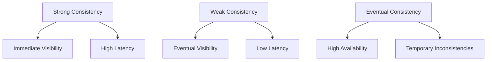

## 13.13. Patterns for Data Consistency

In distributed systems, ensuring data consistency is a critical challenge. Elixir, with its robust concurrency model and powerful abstractions, provides a unique platform for implementing advanced data consistency patterns. In this section, we'll delve into the intricacies of data consistency in Elixir, covering eventual consistency, different consistency models, and strategies for conflict resolution.

### Introduction to Data Consistency

Data consistency refers to the correctness and uniformity of data across a system. In distributed systems, achieving consistency becomes complex due to the inherent nature of distributed components operating concurrently and independently. Elixir's functional paradigm and concurrency model offer powerful tools to address these challenges.

Let's explore the key concepts:

- **Eventual Consistency**: A model where updates to a distributed database will eventually propagate to all nodes, leading to a consistent state over time.
- **Consistency Models**: Different strategies to manage consistency, ranging from strong consistency to weak consistency.
- **Conflict Resolution**: Techniques to handle data conflicts that arise due to concurrent operations.

### Eventual Consistency

Eventual consistency is a consistency model used in distributed computing to achieve high availability and partition tolerance. It allows temporary inconsistencies, with the guarantee that all replicas will eventually converge to the same state.

#### Key Characteristics

- **Scalability**: By allowing temporary inconsistencies, systems can scale more effectively.
- **Availability**: Systems remain available even during network partitions.
- **Latency**: Reduced latency as updates do not need to be immediately consistent across all nodes.

#### Implementing Eventual Consistency in Elixir

In Elixir, eventual consistency can be implemented using message-passing and state synchronization techniques. Let's consider an example using a simple distributed counter.

```elixir
defmodule DistributedCounter do
  use GenServer

  # Client API
  def start_link(initial_value \\ 0) do
    GenServer.start_link(__MODULE__, initial_value, name: __MODULE__)
  end

  def increment do
    GenServer.cast(__MODULE__, :increment)
  end

  def get_value do
    GenServer.call(__MODULE__, :get_value)
  end

  # Server Callbacks
  def init(initial_value) do
    {:ok, initial_value}
  end

  def handle_cast(:increment, state) do
    {:noreply, state + 1}
  end

  def handle_call(:get_value, _from, state) do
    {:reply, state, state}
  end
end
```

In this example, the `DistributedCounter` module uses a GenServer to maintain a counter state. The `increment` function updates the counter asynchronously, allowing for eventual consistency across distributed nodes.

#### Try It Yourself

Experiment with the `DistributedCounter` by running multiple instances and observing how the state converges over time. Modify the code to introduce network delays or simulate node failures to see how eventual consistency behaves under different conditions.

### Consistency Models

Consistency models define the rules for reading and writing data in a distributed system. They determine how and when changes to data become visible to other components.

#### Strong Consistency

Strong consistency ensures that any read operation returns the most recent write. This model is suitable for applications where accuracy is critical, but it can impact system availability and performance.

##### Implementation in Elixir

To achieve strong consistency, Elixir applications often use distributed transactions or consensus algorithms like Raft or Paxos. Here's a simplified example using a transaction-like approach:

```elixir
defmodule StrongConsistentStore do
  use GenServer

  # Client API
  def start_link(initial_state \\ %{}) do
    GenServer.start_link(__MODULE__, initial_state, name: __MODULE__)
  end

  def put(key, value) do
    GenServer.call(__MODULE__, {:put, key, value})
  end

  def get(key) do
    GenServer.call(__MODULE__, {:get, key})
  end

  # Server Callbacks
  def init(initial_state) do
    {:ok, initial_state}
  end

  def handle_call({:put, key, value}, _from, state) do
    new_state = Map.put(state, key, value)
    {:reply, :ok, new_state}
  end

  def handle_call({:get, key}, _from, state) do
    {:reply, Map.get(state, key), state}
  end
end
```

In this example, the `StrongConsistentStore` ensures that each write operation is immediately visible to subsequent reads, maintaining strong consistency.

#### Weak Consistency

Weak consistency models allow for more relaxed rules, where reads may not immediately reflect the latest writes. This model is often used in systems prioritizing availability and partition tolerance.

##### Implementation in Elixir

In Elixir, weak consistency can be implemented using asynchronous message-passing and eventual synchronization. Here's an example:

```elixir
defmodule WeakConsistentStore do
  use GenServer

  # Client API
  def start_link(initial_state \\ %{}) do
    GenServer.start_link(__MODULE__, initial_state, name: __MODULE__)
  end

  def put(key, value) do
    GenServer.cast(__MODULE__, {:put, key, value})
  end

  def get(key) do
    GenServer.call(__MODULE__, {:get, key})
  end

  # Server Callbacks
  def init(initial_state) do
    {:ok, initial_state}
  end

  def handle_cast({:put, key, value}, state) do
    new_state = Map.put(state, key, value)
    {:noreply, new_state}
  end

  def handle_call({:get, key}, _from, state) do
    {:reply, Map.get(state, key), state}
  end
end
```

The `WeakConsistentStore` allows writes to be performed asynchronously, accepting temporary inconsistencies until the state is eventually synchronized.

### Conflict Resolution

In distributed systems, conflicts arise when concurrent operations lead to inconsistent states. Effective conflict resolution strategies are essential to maintain data integrity.

#### Common Conflict Resolution Strategies

- **Last-Write-Wins (LWW)**: The most recent write operation takes precedence.
- **Merge Functions**: Custom functions to merge conflicting states.
- **Vector Clocks**: Track the causal relationships between events to resolve conflicts.

##### Implementing Conflict Resolution in Elixir

Let's implement a simple conflict resolution strategy using a merge function:

```elixir
defmodule ConflictResolver do
  def resolve_conflict(state1, state2) do
    Map.merge(state1, state2, fn _key, val1, val2 ->
      # Custom merge logic: choose the maximum value
      max(val1, val2)
    end)
  end
end
```

In this example, the `resolve_conflict` function merges two states by choosing the maximum value for each conflicting key. This approach can be customized based on application requirements.

#### Try It Yourself

Experiment with different conflict resolution strategies by modifying the `resolve_conflict` function. Consider scenarios where different strategies might be more appropriate, such as choosing the minimum value or combining values.

### Visualizing Consistency Models

To better understand the differences between consistency models, let's visualize them using a diagram.


```mermaid
graph TD;
    A[Strong Consistency] --> B[Immediate Visibility];
    A --> C[High Latency];
    D[Weak Consistency] --> E[Eventual Visibility];
    D --> F[Low Latency];
    G[Eventual Consistency] --> H[High Availability];
    G --> I[Temporary Inconsistencies];
```

**Diagram Description**: This diagram illustrates the trade-offs between different consistency models. Strong consistency offers immediate visibility but at the cost of high latency. Weak consistency provides low latency with eventual visibility. Eventual consistency prioritizes high availability, accepting temporary inconsistencies.

### Design Considerations

When choosing a consistency model, consider the following factors:

- **Application Requirements**: Determine whether your application prioritizes availability, latency, or consistency.
- **System Architecture**: Evaluate the architecture of your distributed system and the impact of consistency models on performance.
- **Data Integrity**: Ensure that the chosen consistency model aligns with your data integrity requirements.

### Elixir Unique Features

Elixir's concurrency model and message-passing capabilities make it well-suited for implementing data consistency patterns. The use of GenServers and distributed processes allows for flexible consistency models, while Elixir's functional paradigm supports the development of robust conflict resolution strategies.

### Differences and Similarities

Consistency models are often confused due to their overlapping characteristics. It's important to distinguish between them:

- **Strong vs. Eventual Consistency**: Strong consistency provides immediate data correctness, while eventual consistency accepts temporary inconsistencies for scalability.
- **Weak vs. Eventual Consistency**: Both models allow for temporary inconsistencies, but eventual consistency guarantees convergence over time.

### Knowledge Check

To reinforce your understanding of data consistency patterns, consider the following questions:

- What are the trade-offs between strong and eventual consistency models?
- How can conflict resolution strategies be customized in Elixir?
- What are the key characteristics of weak consistency models?

### Embrace the Journey

Remember, mastering data consistency patterns in Elixir is a journey. As you explore different models and strategies, you'll gain a deeper understanding of distributed systems and their complexities. Keep experimenting, stay curious, and enjoy the process!

## Quiz Time!



### What is eventual consistency?

- [x] A model where updates eventually propagate to all nodes
- [ ] A model where updates are immediately visible to all nodes
- [ ] A model that prioritizes strong consistency over availability
- [ ] A model that ensures no data conflicts occur

> **Explanation:** Eventual consistency allows temporary inconsistencies, with the guarantee that all replicas will eventually converge to the same state.

### Which consistency model ensures immediate visibility of updates?

- [x] Strong consistency
- [ ] Weak consistency
- [ ] Eventual consistency
- [ ] None of the above

> **Explanation:** Strong consistency ensures that any read operation returns the most recent write, providing immediate visibility.

### What is a common conflict resolution strategy in distributed systems?

- [x] Last-Write-Wins (LWW)
- [ ] First-Write-Wins (FWW)
- [ ] Random-Write-Wins (RWW)
- [ ] None of the above

> **Explanation:** Last-Write-Wins (LWW) is a common strategy where the most recent write operation takes precedence.

### How does weak consistency differ from strong consistency?

- [x] Weak consistency allows for temporary inconsistencies
- [ ] Weak consistency ensures immediate visibility of updates
- [ ] Weak consistency is more suitable for applications requiring strong data integrity
- [ ] Weak consistency is not used in distributed systems

> **Explanation:** Weak consistency allows for temporary inconsistencies, prioritizing availability and partition tolerance.

### What is the primary advantage of eventual consistency?

- [x] High availability
- [ ] Immediate consistency
- [ ] Strong data integrity
- [ ] Low latency

> **Explanation:** Eventual consistency prioritizes high availability, accepting temporary inconsistencies.

### Which Elixir feature is well-suited for implementing consistency models?

- [x] GenServers
- [ ] Macros
- [ ] Protocols
- [ ] Structs

> **Explanation:** GenServers and distributed processes in Elixir are well-suited for implementing consistency models.

### What is a key characteristic of strong consistency?

- [x] Immediate visibility of updates
- [ ] Low latency
- [ ] Temporary inconsistencies
- [ ] High availability

> **Explanation:** Strong consistency ensures that any read operation returns the most recent write, providing immediate visibility.

### How can conflict resolution be customized in Elixir?

- [x] Using custom merge functions
- [ ] Using built-in Elixir macros
- [ ] Using protocols
- [ ] Using structs

> **Explanation:** Conflict resolution can be customized using custom merge functions to handle conflicting states.

### What is the trade-off of using strong consistency?

- [x] High latency
- [ ] Low availability
- [ ] Temporary inconsistencies
- [ ] None of the above

> **Explanation:** Strong consistency can lead to high latency as updates need to be immediately consistent across all nodes.

### True or False: Eventual consistency guarantees immediate data correctness.

- [ ] True
- [x] False

> **Explanation:** Eventual consistency allows temporary inconsistencies, with the guarantee that all replicas will eventually converge to the same state.


