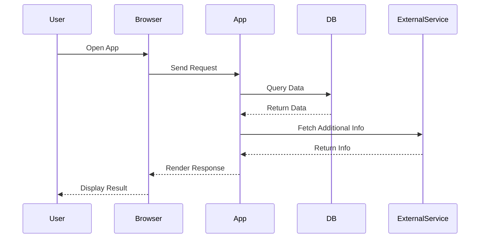

## 13.14. Integration Testing

Integration testing is a crucial aspect of software development, ensuring that different components of a system work together as expected. In Elixir, integration testing is particularly important due to the language's emphasis on concurrency and distributed systems. This section will guide you through the intricacies of integration testing in Elixir, covering end-to-end testing, setting up test environments, and mocking external systems.

### End-to-End Testing

End-to-end (E2E) testing involves validating the entire integration flow between systems, ensuring that all components interact correctly. In Elixir, E2E testing is essential for verifying the behavior of applications that rely on multiple processes, services, or external APIs.

#### Key Concepts

- **Comprehensive Validation**: E2E tests cover the entire application flow, from user input to data processing and output.
- **Realistic Scenarios**: These tests simulate real-world usage, providing confidence that the system behaves as expected in production.
- **Complex Interactions**: E2E tests are ideal for verifying complex interactions between components, such as message passing and data synchronization.

#### Implementing End-to-End Tests

To implement E2E tests in Elixir, we can use tools like [Hound](https://hexdocs.pm/hound/readme.html) or [Wallaby](https://hexdocs.pm/wallaby/readme.html) for browser-based testing, and [ExUnit](https://hexdocs.pm/ex_unit/ExUnit.html) for general test execution.

```elixir
defmodule MyAppWeb.E2ETest do
  use ExUnit.Case, async: true
  use Wallaby.Feature

  alias MyApp.Repo
  alias MyApp.Accounts.User

  feature "user can sign up and log in", %{session: session} do
    session
    |> visit("/sign_up")
    |> fill_in(Query.text_field("Email"), with: "test@example.com")
    |> fill_in(Query.text_field("Password"), with: "password")
    |> click(Query.button("Sign Up"))

    assert_has(session, Query.text("Welcome, test@example.com"))

    user = Repo.get_by(User, email: "test@example.com")
    assert user != nil
  end
end
```

In this example, we use Wallaby to simulate a user signing up and logging in. The test verifies that the user is greeted with a welcome message and that their account is created in the database.

#### Challenges and Considerations

- **Test Flakiness**: E2E tests can be flaky due to network issues or timing problems. Use retries and timeouts judiciously.
- **Performance**: These tests can be slow. Run them in parallel where possible and focus on critical paths.
- **Maintenance**: Keep tests up-to-date with application changes to avoid false positives or negatives.

### Test Environments

Setting up isolated test environments that replicate production is crucial for reliable integration testing. This ensures that tests run in a controlled setting, minimizing external influences.

#### Key Concepts

- **Isolation**: Test environments should be isolated from development and production to prevent interference.
- **Consistency**: Ensure that the environment is consistent across test runs to produce reliable results.
- **Reproducibility**: The environment should be easily reproducible to facilitate debugging and collaboration.

#### Setting Up Test Environments

In Elixir, we can use tools like [Docker](https://www.docker.com/) and [Docker Compose](https://docs.docker.com/compose/) to create isolated environments. Here's an example of a `docker-compose.yml` file for setting up a test environment:

```yaml
version: '3.8'
services:
  db:
    image: postgres:13
    environment:
      POSTGRES_USER: postgres
      POSTGRES_PASSWORD: postgres
      POSTGRES_DB: my_app_test
    ports:
      - "5432:5432"

  app:
    build: .
    command: mix test
    environment:
      MIX_ENV: test
    depends_on:
      - db
    volumes:
      - .:/app
```

This configuration sets up a PostgreSQL database and runs the Elixir application in test mode. The `depends_on` directive ensures that the database is ready before the application starts.

#### Best Practices

- **Use Environment Variables**: Configure your application using environment variables to easily switch between environments.
- **Automate Setup**: Use scripts or tools like [Terraform](https://www.terraform.io/) to automate environment setup and teardown.
- **Monitor Resources**: Keep an eye on resource usage to avoid performance bottlenecks during testing.

### Mocking External Systems

Mocking external systems is essential for reliable integration tests, especially when dealing with third-party APIs or services. Mocks allow you to simulate external dependencies, ensuring that tests are not affected by their availability or behavior.

#### Key Concepts

- **Controlled Responses**: Mocks provide controlled responses, allowing you to test different scenarios and edge cases.
- **Isolation**: By mocking external systems, you isolate your tests from external failures or changes.
- **Speed**: Mocks are faster than real external calls, speeding up test execution.

#### Implementing Mocks in Elixir

Elixir provides several libraries for mocking, such as [Mox](https://hexdocs.pm/mox/Mox.html). Here's an example of using Mox to mock an external HTTP client:

```elixir
defmodule MyApp.ExternalClient do
  @callback get(String.t()) :: {:ok, map()} | {:error, term()}
end

defmodule MyApp.ExternalClientMock do
  use Mox

  defmock(MyApp.ExternalClientMock, for: MyApp.ExternalClient)
end

defmodule MyApp.ExternalClientTest do
  use ExUnit.Case, async: true

  import Mox

  setup :verify_on_exit!

  test "handles successful response" do
    MyApp.ExternalClientMock
    |> expect(:get, fn _url -> {:ok, %{"data" => "value"}} end)

    assert MyApp.ExternalClient.get("http://example.com") == {:ok, %{"data" => "value"}}
  end
end
```

In this example, we define a mock for `MyApp.ExternalClient` and use it in a test to simulate a successful HTTP response.

#### Best Practices

- **Define Clear Contracts**: Use interfaces or behaviors to define clear contracts for your mocks.
- **Limit Mock Usage**: Use mocks sparingly and only for external dependencies. Avoid mocking internal logic.
- **Verify Interactions**: Use tools like Mox to verify that your code interacts with mocks as expected.

### Visualizing Integration Testing

To better understand the flow of integration testing, let's visualize the process using a sequence diagram.



**Diagram Description**: This sequence diagram illustrates the flow of an end-to-end test, where a user interacts with a browser, which communicates with the application. The application queries a database and fetches additional information from an external service before rendering a response to the user.

### Knowledge Check

To reinforce your understanding of integration testing in Elixir, consider the following questions:

- What are the key benefits of end-to-end testing?
- How can you ensure that your test environment replicates production?
- Why is mocking external systems important for integration testing?

### Summary

Integration testing in Elixir is a powerful tool for ensuring that your application components work together seamlessly. By implementing end-to-end tests, setting up isolated test environments, and mocking external systems, you can build robust and reliable applications. Remember, integration testing is an ongoing process that requires continuous attention and adaptation as your application evolves.

### Try It Yourself

To deepen your understanding, try modifying the provided code examples. For instance, add additional test cases to the E2E test or experiment with different mock responses. This hands-on approach will help solidify your knowledge and prepare you for real-world scenarios.

### References and Further Reading

- [Elixir's ExUnit Documentation](https://hexdocs.pm/ex_unit/ExUnit.html)
- [Wallaby for Browser Testing](https://hexdocs.pm/wallaby/readme.html)
- [Mox for Mocking in Elixir](https://hexdocs.pm/mox/Mox.html)
- [Docker Compose Documentation](https://docs.docker.com/compose/)

## Quiz: Integration Testing



### What is the primary goal of end-to-end testing?

- [x] To validate the entire integration flow between systems.
- [ ] To test individual functions in isolation.
- [ ] To measure the performance of a single component.
- [ ] To ensure code coverage.

> **Explanation:** End-to-end testing aims to validate the entire integration flow between systems, ensuring that all components interact correctly.

### Which tool is commonly used for browser-based testing in Elixir?

- [ ] ExUnit
- [x] Wallaby
- [ ] Mox
- [ ] Docker

> **Explanation:** Wallaby is a tool commonly used for browser-based testing in Elixir, allowing for simulation of user interactions.

### Why is it important to set up isolated test environments?

- [x] To prevent interference from development and production environments.
- [ ] To increase the speed of test execution.
- [ ] To reduce the number of test cases.
- [ ] To simplify code deployment.

> **Explanation:** Isolated test environments prevent interference from development and production environments, ensuring reliable test results.

### What is the purpose of mocking external systems in integration testing?

- [x] To simulate external dependencies for reliable tests.
- [ ] To increase test coverage.
- [ ] To improve application performance.
- [ ] To reduce code complexity.

> **Explanation:** Mocking external systems allows you to simulate external dependencies, ensuring that tests are not affected by their availability or behavior.

### Which library is used for mocking in Elixir?

- [ ] Wallaby
- [ ] ExUnit
- [x] Mox
- [ ] Hound

> **Explanation:** Mox is a library used for mocking in Elixir, providing controlled responses for external dependencies.

### What is a key challenge of end-to-end testing?

- [x] Test flakiness due to network issues or timing problems.
- [ ] Lack of test coverage.
- [ ] Difficulty in writing test cases.
- [ ] High resource consumption.

> **Explanation:** Test flakiness is a key challenge of end-to-end testing, often caused by network issues or timing problems.

### How can you automate the setup of test environments?

- [x] Use scripts or tools like Terraform.
- [ ] Manually configure each environment.
- [ ] Use a single environment for all tests.
- [ ] Avoid using test environments.

> **Explanation:** Automating the setup of test environments with scripts or tools like Terraform ensures consistency and reproducibility.

### What is a best practice when using mocks?

- [x] Define clear contracts for your mocks.
- [ ] Mock internal logic extensively.
- [ ] Use mocks for all dependencies.
- [ ] Avoid verifying interactions with mocks.

> **Explanation:** Defining clear contracts for your mocks ensures that they accurately simulate external dependencies.

### What is the benefit of using Docker for test environments?

- [x] It provides isolation and consistency across test runs.
- [ ] It increases the speed of test execution.
- [ ] It simplifies code deployment.
- [ ] It reduces the number of test cases.

> **Explanation:** Docker provides isolation and consistency across test runs, ensuring reliable test results.

### True or False: Integration testing is only necessary for large applications.

- [ ] True
- [x] False

> **Explanation:** Integration testing is important for applications of all sizes to ensure that components work together as expected.



Remember, this is just the beginning. As you progress, you'll build more complex and interactive applications. Keep experimenting, stay curious, and enjoy the journey!
