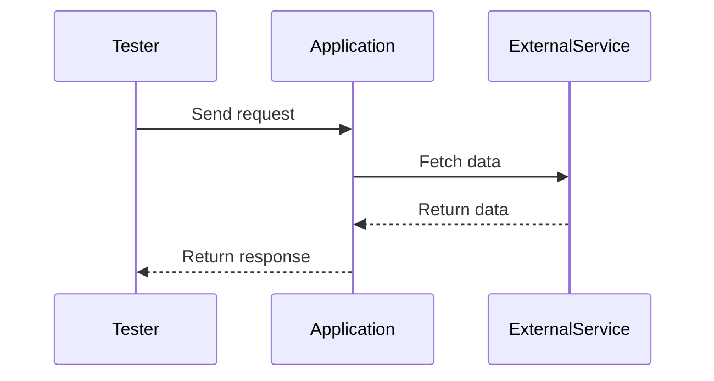

## 13.14. Integration Testing

Integration testing is a critical phase in the software development lifecycle, especially in complex systems where multiple components interact. In Elixir, integration testing ensures that different parts of your application work together as expected. This section will guide you through the concepts, techniques, and tools necessary for effective integration testing in Elixir.

### Introduction to Integration Testing

Integration testing involves testing the combination of different modules or services to ensure they function together correctly. Unlike unit tests, which test individual components in isolation, integration tests focus on the interactions and data flow between components.

#### Key Objectives of Integration Testing

- **Validate Interactions**: Ensure that different modules or services communicate and interact correctly.
- **Detect Interface Issues**: Identify problems at the interfaces between components.
- **Test Realistic Scenarios**: Simulate real-world usage scenarios to uncover potential issues.
- **Ensure Data Integrity**: Verify that data is correctly passed and transformed across components.

### End-to-End Testing

End-to-end (E2E) testing is a subset of integration testing that validates the entire flow of an application from start to finish. E2E tests are crucial for ensuring that the system behaves as expected in real-world scenarios.

#### Benefits of End-to-End Testing

- **Comprehensive Coverage**: Tests the entire application stack, including front-end, back-end, and databases.
- **User-Centric**: Mimics user interactions to validate user journeys and workflows.
- **Early Detection**: Identifies integration issues early in the development process.

#### Implementing End-to-End Testing in Elixir

To implement E2E testing in Elixir, you can use tools like Hound or Wallaby, which provide browser automation capabilities. These tools allow you to write tests that simulate user interactions with your application.

```elixir
# Example of an end-to-end test using Wallaby
defmodule MyAppWeb.PageTest do
  use ExUnit.Case, async: true
  use Wallaby.Feature

  feature "user can log in", %{session: session} do
    session
    |> visit("/login")
    |> fill_in(Query.text_field("Email"), with: "user@example.com")
    |> fill_in(Query.text_field("Password"), with: "password")
    |> click(Query.button("Log in"))
    |> assert_text("Welcome back!")
  end
end
```

### Test Environments

Setting up test environments that closely replicate production is essential for reliable integration testing. A well-configured test environment ensures that tests run consistently and produce accurate results.

#### Key Considerations for Test Environments

- **Isolation**: Ensure that the test environment is isolated from production to prevent data corruption.
- **Consistency**: Use the same configurations and dependencies as production to replicate real-world conditions.
- **Scalability**: Ensure that the environment can handle the scale of tests being run.

#### Setting Up a Test Environment in Elixir

Elixir's `Mix` tool provides excellent support for setting up and managing test environments. You can define different configurations for test environments in your `config/test.exs` file.

```elixir
# Example configuration for a test environment
use Mix.Config

config :my_app, MyApp.Repo,
  username: "postgres",
  password: "postgres",
  database: "my_app_test",
  hostname: "localhost",
  pool: Ecto.Adapters.SQL.Sandbox
```

### Mocking External Systems

In integration testing, it is often necessary to simulate external systems or dependencies to ensure tests are reliable and independent. Mocking allows you to replace real external systems with simulated ones that mimic their behavior.

#### Benefits of Mocking

- **Control**: Gain control over external dependencies to simulate different scenarios.
- **Reliability**: Ensure tests are not affected by external system failures or downtime.
- **Speed**: Reduce test execution time by avoiding real network calls.

#### Techniques for Mocking in Elixir

Elixir provides several libraries and techniques for mocking external systems, such as Mox and Bypass.

##### Using Mox for Mocking

Mox is a popular library in Elixir for creating mocks based on behaviors. It allows you to define expectations and verify interactions with external dependencies.

```elixir
# Define a behavior for the external service
defmodule MyApp.ExternalService do
  @callback fetch_data() :: {:ok, map()} | {:error, term()}
end

# Create a mock implementation using Mox
defmodule MyApp.ExternalServiceMock do
  use Mox

  defmock(MyApp.ExternalServiceMock, for: MyApp.ExternalService)
end

# Use the mock in tests
defmodule MyApp.SomeModuleTest do
  use ExUnit.Case, async: true

  setup :set_mox_global

  test "fetches data successfully" do
    MyApp.ExternalServiceMock
    |> expect(:fetch_data, fn -> {:ok, %{data: "mocked"}} end)

    assert MyApp.SomeModule.fetch_data() == {:ok, %{data: "mocked"}}
  end
end
```

##### Using Bypass for HTTP Mocking

Bypass is a library that allows you to create a mock HTTP server. It is useful for testing HTTP interactions without making real network requests.

```elixir
# Example of using Bypass to mock an HTTP server
defmodule MyApp.HttpClientTest do
  use ExUnit.Case, async: true
  alias MyApp.HttpClient

  setup do
    bypass = Bypass.open()
    {:ok, bypass: bypass}
  end

  test "handles HTTP response", %{bypass: bypass} do
    Bypass.expect(bypass, fn conn ->
      Plug.Conn.resp(conn, 200, "Mocked response")
    end)

    assert HttpClient.get("http://localhost:#{bypass.port}/") == "Mocked response"
  end
end
```

### Visualizing Integration Testing Workflow

To better understand the integration testing process, let's visualize the workflow using a sequence diagram.


```mermaid
sequenceDiagram
    participant Tester
    participant Application
    participant ExternalService
    Tester->>Application: Send request
    Application->>ExternalService: Fetch data
    ExternalService-->>Application: Return data
    Application-->>Tester: Return response
```

**Diagram Description**: This sequence diagram illustrates the typical flow of an integration test. The tester sends a request to the application, which then interacts with an external service. The application processes the response from the external service and returns the final response to the tester.

### Best Practices for Integration Testing

- **Automate Tests**: Automate integration tests to run as part of your continuous integration (CI) pipeline.
- **Focus on Critical Paths**: Prioritize testing critical user journeys and workflows.
- **Maintain Test Data**: Use consistent and reliable test data to ensure reproducibility.
- **Monitor Test Performance**: Keep an eye on test execution times and optimize slow tests.

### Challenges in Integration Testing

Integration testing can be challenging due to the complexity of interactions between components. Common challenges include:

- **Flaky Tests**: Tests that fail intermittently due to timing issues or external dependencies.
- **Complex Setup**: Setting up and maintaining test environments can be time-consuming.
- **Data Management**: Ensuring test data is consistent and isolated from production data.

### Elixir Unique Features for Integration Testing

Elixir's concurrency model and fault-tolerance features make it particularly well-suited for integration testing. The language's ability to handle concurrent processes and its robust error handling mechanisms provide a solid foundation for testing complex systems.

- **Concurrency**: Leverage Elixir's concurrency model to run tests in parallel, reducing test execution time.
- **Fault Tolerance**: Use Elixir's supervision trees to manage and recover from failures during testing.

### Differences and Similarities with Other Testing Patterns

Integration testing shares similarities with other testing patterns, such as system testing and acceptance testing, but focuses more on the interactions between components rather than the system as a whole.

- **Similarities**: Like system testing, integration testing validates the interactions between components.
- **Differences**: Unlike unit testing, which tests individual components in isolation, integration testing focuses on the combined behavior of components.

### Try It Yourself

Encourage experimentation by modifying the provided code examples. Try creating new test scenarios, mocking different external services, or setting up a custom test environment.

### Conclusion

Integration testing is an essential part of ensuring the reliability and correctness of your Elixir applications. By understanding and implementing the concepts and techniques discussed in this guide, you'll be well-equipped to tackle the challenges of integration testing in complex systems.

## Quiz Time!



### What is the primary goal of integration testing?

- [x] To validate the interactions between different components or modules.
- [ ] To test individual components in isolation.
- [ ] To test the user interface of an application.
- [ ] To ensure code coverage.

> **Explanation:** Integration testing focuses on validating the interactions and data flow between different components or modules.

### Which Elixir library is commonly used for mocking external systems?

- [x] Mox
- [ ] ExUnit
- [ ] Ecto
- [ ] Phoenix

> **Explanation:** Mox is a popular library in Elixir for creating mocks based on behaviors, allowing you to simulate external systems.

### What is one of the main benefits of end-to-end testing?

- [x] Comprehensive coverage of the entire application stack.
- [ ] Faster test execution compared to unit tests.
- [ ] Testing individual functions in isolation.
- [ ] Reducing the need for integration tests.

> **Explanation:** End-to-end testing provides comprehensive coverage by testing the entire application stack, including front-end, back-end, and databases.

### How does Bypass help in integration testing?

- [x] It allows you to create a mock HTTP server for testing HTTP interactions.
- [ ] It provides a graphical interface for writing tests.
- [ ] It is used for testing database interactions.
- [ ] It helps in setting up test environments.

> **Explanation:** Bypass is a library that allows you to create a mock HTTP server, useful for testing HTTP interactions without making real network requests.

### What is a key consideration when setting up a test environment?

- [x] Ensuring the environment is isolated from production.
- [ ] Using different configurations from production.
- [ ] Sharing the environment with production.
- [ ] Avoiding the use of databases.

> **Explanation:** Ensuring the test environment is isolated from production is crucial to prevent data corruption and ensure reliable testing.

### Which tool can be used for browser automation in Elixir?

- [x] Wallaby
- [ ] Ecto
- [ ] Phoenix
- [ ] Mix

> **Explanation:** Wallaby is a tool in Elixir that provides browser automation capabilities, allowing you to write end-to-end tests that simulate user interactions.

### What is the purpose of the `Mox` library in Elixir?

- [x] To create mocks based on behaviors for testing.
- [ ] To manage database connections.
- [ ] To automate browser interactions.
- [ ] To handle HTTP requests.

> **Explanation:** Mox is used to create mocks based on behaviors, allowing you to simulate external dependencies in tests.

### What is one challenge of integration testing?

- [x] Flaky tests due to timing issues or external dependencies.
- [ ] Lack of test coverage.
- [ ] Testing individual functions.
- [ ] Writing unit tests.

> **Explanation:** Flaky tests are a common challenge in integration testing, often caused by timing issues or reliance on external dependencies.

### How can Elixir's concurrency model benefit integration testing?

- [x] By allowing tests to run in parallel, reducing test execution time.
- [ ] By simplifying test data management.
- [ ] By providing a graphical interface for writing tests.
- [ ] By eliminating the need for test environments.

> **Explanation:** Elixir's concurrency model allows tests to run in parallel, which can significantly reduce test execution time.

### True or False: Integration testing focuses on testing individual components in isolation.

- [ ] True
- [x] False

> **Explanation:** False. Integration testing focuses on testing the interactions and data flow between different components, not individual components in isolation.


