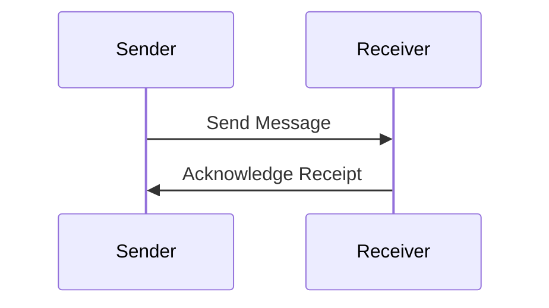
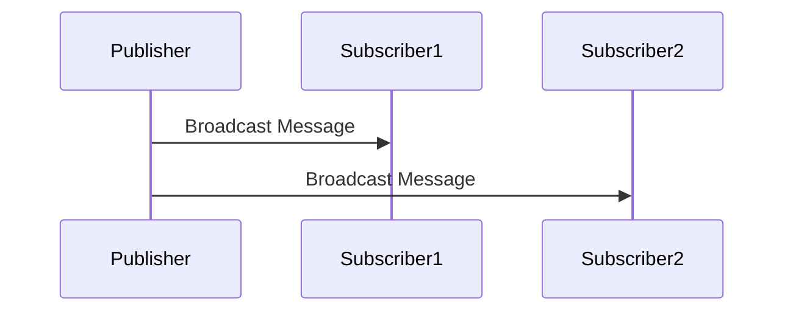
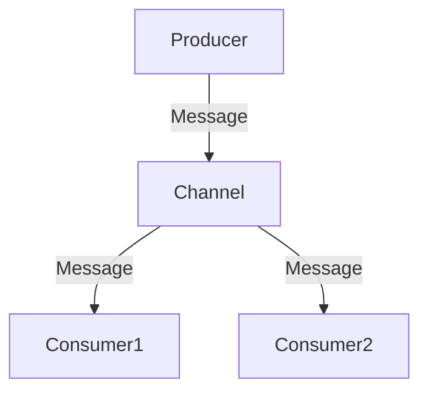

## 13.2. Messaging Patterns in Elixir

In the world of distributed systems, messaging patterns play a crucial role in ensuring efficient communication between different components. Elixir, with its robust concurrency model and the power of the BEAM virtual machine, provides a rich set of tools and patterns for implementing messaging systems. In this section, we will delve into three fundamental messaging patterns: Point-to-Point Messaging, Publish-Subscribe, and Message Channels. We will explore how these patterns can be implemented in Elixir, leveraging its unique features to build scalable and fault-tolerant systems.

### Point-to-Point Messaging

**Point-to-Point Messaging** is a communication pattern where a message is sent from one sender to one receiver. This pattern is ideal for scenarios where a specific task needs to be processed by a single consumer. In Elixir, this can be achieved using direct process communication or through a message queue.

#### Key Participants

- **Sender**: The process or module that sends the message.
- **Receiver**: The process or module that receives and processes the message.

#### Applicability

Use Point-to-Point Messaging when:

- You need to ensure that a message is processed by only one consumer.
- You want to implement request-response communication between two components.

#### Sample Code Snippet

Let's explore a simple implementation of Point-to-Point Messaging using Elixir processes:

```elixir
defmodule PointToPoint do
  def start do
    receiver_pid = spawn(fn -> receiver() end)
    send(receiver_pid, {:message, "Hello, Receiver!"})
  end

  defp receiver do
    receive do
      {:message, content} ->
        IO.puts("Received message: #{content}")
    end
  end
end

# Start the Point-to-Point messaging
PointToPoint.start()
```

In this example, we spawn a receiver process and send a message to it. The receiver process listens for messages and prints the content upon receiving one.

#### Design Considerations

- **Reliability**: Ensure that the receiver is always available to process messages.
- **Error Handling**: Implement error handling to manage scenarios where the receiver fails to process a message.

#### Elixir Unique Features

- **Lightweight Processes**: Elixir's lightweight processes make it easy to implement point-to-point communication with minimal overhead.
- **Pattern Matching**: Utilize pattern matching to handle different types of messages efficiently.

### Publish-Subscribe

**Publish-Subscribe** is a messaging pattern where messages are broadcasted to multiple subscribers. This pattern is useful for scenarios where multiple components need to react to the same event or data change.

#### Key Participants

- **Publisher**: The process or module that sends messages to subscribers.
- **Subscriber**: Processes or modules that receive messages from the publisher.

#### Applicability

Use Publish-Subscribe when:

- You need to broadcast messages to multiple consumers.
- You want to decouple the sender and receivers, allowing for flexible system architecture.

#### Sample Code Snippet

Let's implement a simple Publish-Subscribe system using Elixir's `Registry`:

```elixir
defmodule PubSub do
  def start do
    Registry.start_link(keys: :duplicate, name: PubSubRegistry)
  end

  def subscribe(subscriber) do
    Registry.register(PubSubRegistry, :event, subscriber)
  end

  def publish(message) do
    Registry.dispatch(PubSubRegistry, :event, fn entries ->
      for {pid, _} <- entries do
        send(pid, {:event, message})
      end
    end)
  end
end

# Example usage
PubSub.start()
PubSub.subscribe(self())
PubSub.publish("Hello, Subscribers!")

receive do
  {:event, message} ->
    IO.puts("Received event: #{message}")
end
```

In this example, we use Elixir's `Registry` to manage subscribers and broadcast messages to them. The `Registry` allows for efficient management of subscribers and message dispatching.

#### Design Considerations

- **Scalability**: Ensure the system can handle a large number of subscribers efficiently.
- **Decoupling**: Use this pattern to decouple components, allowing for independent development and deployment.

#### Elixir Unique Features

- **Registry**: Elixir's `Registry` provides a powerful mechanism for managing subscribers and dispatching messages.
- **Concurrency**: Leverage Elixir's concurrency model to handle multiple subscribers efficiently.

### Message Channels

**Message Channels** are used to organize message flow using queues or topics. This pattern is useful for scenarios where messages need to be categorized or prioritized.

#### Key Participants

- **Producer**: The process or module that sends messages to a channel.
- **Consumer**: Processes or modules that receive messages from a channel.

#### Applicability

Use Message Channels when:

- You need to categorize or prioritize messages.
- You want to implement complex message routing and processing logic.

#### Sample Code Snippet

Let's implement a simple message channel using Elixir's `GenStage`:

```elixir
defmodule Producer do
  use GenStage

  def start_link do
    GenStage.start_link(__MODULE__, 0, name: __MODULE__)
  end

  def init(counter) do
    {:producer, counter}
  end

  def handle_demand(demand, counter) do
    events = Enum.to_list(counter..counter + demand - 1)
    {:noreply, events, counter + demand}
  end
end

defmodule Consumer do
  use GenStage

  def start_link do
    GenStage.start_link(__MODULE__, :ok, name: __MODULE__)
  end

  def init(:ok) do
    {:consumer, :the_state_does_not_matter}
  end

  def handle_events(events, _from, state) do
    for event <- events do
      IO.puts("Consumed event: #{event}")
    end
    {:noreply, [], state}
  end
end

# Start the producer and consumer
{:ok, producer} = Producer.start_link()
{:ok, consumer} = Consumer.start_link()

# Connect the producer and consumer
GenStage.sync_subscribe(consumer, to: producer)
```

In this example, we use `GenStage` to create a producer-consumer pipeline. The producer generates events, and the consumer processes them.

#### Design Considerations

- **Backpressure**: Implement backpressure mechanisms to prevent overwhelming consumers.
- **Message Ordering**: Ensure messages are processed in the correct order if necessary.

#### Elixir Unique Features

- **GenStage**: Elixir's `GenStage` provides a powerful framework for building producer-consumer pipelines with backpressure support.
- **Flow**: Use Elixir's `Flow` for parallel data processing and complex message routing.

### Visualizing Messaging Patterns

To better understand these messaging patterns, let's visualize them using Mermaid.js diagrams.

#### Point-to-Point Messaging Diagram



*Description*: This diagram illustrates the direct communication between a sender and a receiver in a point-to-point messaging pattern.

#### Publish-Subscribe Diagram



*Description*: This diagram shows how a publisher broadcasts messages to multiple subscribers in a publish-subscribe pattern.

#### Message Channels Diagram



*Description*: This diagram represents the flow of messages through a channel, with multiple consumers receiving messages from the channel.

### References and Links

- [Elixir Documentation](https://elixir-lang.org/docs.html)
- [GenStage Documentation](https://hexdocs.pm/gen_stage/GenStage.html)
- [Registry Documentation](https://hexdocs.pm/elixir/Registry.html)

### Knowledge Check

- What are the key differences between Point-to-Point Messaging and Publish-Subscribe?
- How can Elixir's `Registry` be used to implement a Publish-Subscribe system?
- What role does `GenStage` play in implementing Message Channels?

### Embrace the Journey

Remember, mastering messaging patterns in Elixir is a journey. As you explore these patterns, you'll gain a deeper understanding of how to build robust and scalable systems. Keep experimenting, stay curious, and enjoy the journey!

### Quiz: Messaging Patterns in Elixir



### What is the primary purpose of Point-to-Point Messaging?

- [x] Direct communication between two endpoints
- [ ] Broadcasting messages to multiple subscribers
- [ ] Organizing message flow using queues
- [ ] Implementing complex message routing

> **Explanation:** Point-to-Point Messaging is used for direct communication between two endpoints, ensuring that a message is processed by only one consumer.

### Which Elixir feature is commonly used to implement Publish-Subscribe systems?

- [ ] GenStage
- [x] Registry
- [ ] Flow
- [ ] Supervisor

> **Explanation:** Elixir's `Registry` is commonly used to manage subscribers and dispatch messages in a Publish-Subscribe system.

### What is a key benefit of using Message Channels?

- [ ] Ensuring messages are processed by only one consumer
- [ ] Broadcasting messages to multiple subscribers
- [x] Categorizing or prioritizing messages
- [ ] Direct communication between two endpoints

> **Explanation:** Message Channels allow for categorizing or prioritizing messages, enabling complex message routing and processing logic.

### In a Publish-Subscribe pattern, who receives the messages?

- [ ] Only one consumer
- [x] Multiple subscribers
- [ ] A single producer
- [ ] A single channel

> **Explanation:** In a Publish-Subscribe pattern, messages are broadcasted to multiple subscribers.

### What is the role of `GenStage` in Elixir?

- [ ] Managing subscribers in a Publish-Subscribe system
- [x] Building producer-consumer pipelines with backpressure support
- [ ] Direct communication between two endpoints
- [ ] Organizing message flow using queues

> **Explanation:** `GenStage` is used in Elixir to build producer-consumer pipelines with backpressure support.

### Which pattern is best for decoupling components in a system?

- [ ] Point-to-Point Messaging
- [x] Publish-Subscribe
- [ ] Message Channels
- [ ] Direct Communication

> **Explanation:** Publish-Subscribe is best for decoupling components, allowing for independent development and deployment.

### What is a key consideration when implementing Point-to-Point Messaging?

- [x] Ensuring the receiver is always available
- [ ] Broadcasting messages to multiple subscribers
- [ ] Categorizing messages
- [ ] Implementing backpressure

> **Explanation:** Ensuring the receiver is always available is crucial for Point-to-Point Messaging to ensure messages are processed.

### How does Elixir's concurrency model benefit messaging patterns?

- [x] It allows handling multiple subscribers efficiently
- [ ] It limits the number of processes
- [ ] It restricts message broadcasting
- [ ] It simplifies direct communication

> **Explanation:** Elixir's concurrency model allows handling multiple subscribers efficiently, making it ideal for messaging patterns.

### What is the primary use of the `Registry` in Elixir?

- [ ] Building producer-consumer pipelines
- [x] Managing subscribers and dispatching messages
- [ ] Direct communication between two endpoints
- [ ] Organizing message flow using queues

> **Explanation:** The `Registry` is used in Elixir to manage subscribers and dispatch messages in a Publish-Subscribe system.

### True or False: Message Channels are used for direct communication between two endpoints.

- [ ] True
- [x] False

> **Explanation:** False. Message Channels are used to organize message flow using queues or topics, not for direct communication between two endpoints.


