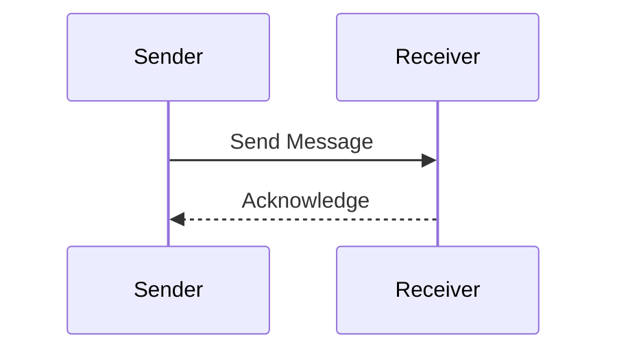
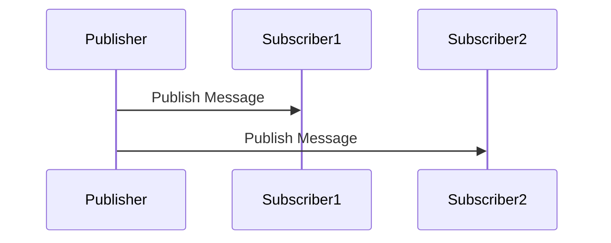
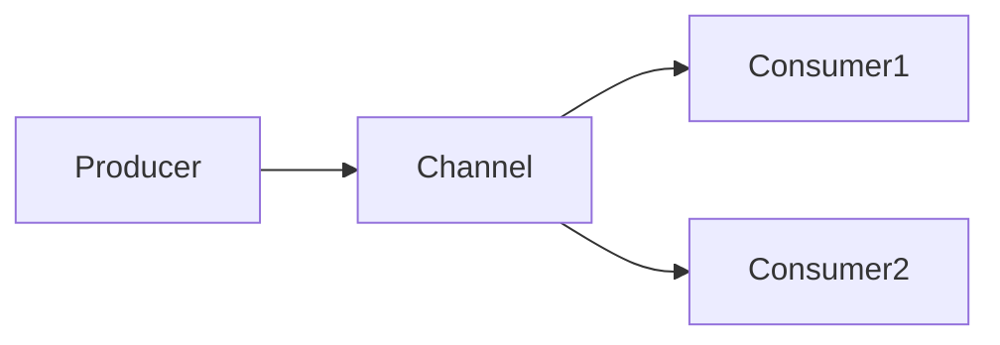

## 13.2. Messaging Patterns in Elixir

In the realm of enterprise integration, effective communication between distributed systems is crucial. Elixir, with its robust concurrency model and the Actor-based system, provides a powerful platform for implementing messaging patterns. In this section, we will delve into three primary messaging patterns: Point-to-Point Messaging, Publish-Subscribe, and Message Channels. Understanding these patterns will empower you to build scalable, reliable, and efficient systems that communicate seamlessly.

### Point-to-Point Messaging

**Point-to-Point Messaging** involves direct communication between two endpoints. In Elixir, this can be achieved using processes and message passing. Each process can act as a sender or receiver, allowing for direct and efficient communication.

#### Intent

The intent of Point-to-Point Messaging is to establish a direct line of communication between two parties, ensuring that messages are delivered to the intended recipient without any intermediaries.

#### Key Participants

- **Sender**: The process that initiates the message.
- **Receiver**: The process that receives and processes the message.

#### Applicability

Use Point-to-Point Messaging when:

- You need guaranteed delivery to a specific recipient.
- The communication is between two known entities.
- Low latency is crucial.

#### Sample Code Snippet

Let's explore a simple example of Point-to-Point Messaging in Elixir:

```elixir
defmodule PointToPoint do
  def start do
    receiver = spawn(__MODULE__, :receiver, [])
    send(receiver, {:message, "Hello, Receiver!"})
  end

  def receiver do
    receive do
      {:message, content} ->
        IO.puts("Received: #{content}")
    end
  end
end

PointToPoint.start()
```

In this example, we spawn a receiver process and send it a message. The receiver listens for messages and prints the content upon receiving one.

#### Design Considerations

- Ensure that the receiver is always ready to handle incoming messages.
- Consider implementing a retry mechanism for message delivery failures.

#### Elixir Unique Features

Elixir's lightweight processes and the BEAM's ability to handle millions of processes make Point-to-Point Messaging highly efficient.

#### Differences and Similarities

Point-to-Point Messaging is similar to direct method calls in object-oriented programming but offers more flexibility and concurrency.

### Publish-Subscribe

**Publish-Subscribe** is a messaging pattern where messages are broadcasted to multiple subscribers. This pattern is ideal for scenarios where multiple components need to react to the same event.

#### Intent

The intent of the Publish-Subscribe pattern is to decouple the sender from the receivers, allowing multiple subscribers to listen for and react to published messages.

#### Key Participants

- **Publisher**: The process that emits messages.
- **Subscriber**: Processes that listen for specific messages.
- **Broker**: An optional intermediary that manages subscriptions and message distribution.

#### Applicability

Use Publish-Subscribe when:

- Multiple components need to react to the same event.
- Decoupling senders and receivers is desired.
- Scalability and flexibility are required.

#### Sample Code Snippet

Let's implement a basic Publish-Subscribe system using Elixir's `GenServer`:

```elixir
defmodule PubSub do
  use GenServer

  def start_link do
    GenServer.start_link(__MODULE__, %{}, name: __MODULE__)
  end

  def init(state) do
    {:ok, state}
  end

  def subscribe(pid) do
    GenServer.call(__MODULE__, {:subscribe, pid})
  end

  def publish(message) do
    GenServer.cast(__MODULE__, {:publish, message})
  end

  def handle_call({:subscribe, pid}, _from, state) do
    {:reply, :ok, Map.put(state, pid, true)}
  end

  def handle_cast({:publish, message}, state) do
    Enum.each(Map.keys(state), fn pid ->
      send(pid, {:message, message})
    end)
    {:noreply, state}
  end
end

defmodule Subscriber do
  def start do
    PubSub.subscribe(self())
    loop()
  end

  def loop do
    receive do
      {:message, msg} ->
        IO.puts("Received: #{msg}")
        loop()
    end
  end
end

{:ok, _} = PubSub.start_link()
spawn(Subscriber, :start, [])
PubSub.publish("Hello, Subscribers!")
```

In this example, we create a `PubSub` server that manages subscriptions and message distribution. Subscribers register themselves and receive messages when the publisher broadcasts them.

#### Design Considerations

- Ensure that subscribers are resilient to failures.
- Consider using a broker for managing complex subscription logic.

#### Elixir Unique Features

Elixir's `GenServer` and process model make implementing Publish-Subscribe systems straightforward and efficient.

#### Differences and Similarities

Publish-Subscribe differs from Point-to-Point Messaging by allowing multiple recipients and decoupling the sender from the receivers.

### Message Channels

**Message Channels** organize message flow using queues or topics. This pattern is essential for managing complex message routing and delivery.

#### Intent

The intent of Message Channels is to provide a structured mechanism for message routing and delivery, ensuring that messages reach their intended destinations efficiently.

#### Key Participants

- **Producer**: The process that sends messages to the channel.
- **Consumer**: Processes that receive messages from the channel.
- **Channel**: The medium through which messages are routed.

#### Applicability

Use Message Channels when:

- Complex message routing is required.
- You need to decouple producers and consumers.
- Load balancing and message prioritization are necessary.

#### Sample Code Snippet

Let's implement a simple Message Channel using Elixir's `GenStage`:

```elixir
defmodule Producer do
  use GenStage

  def start_link do
    GenStage.start_link(__MODULE__, 0, name: __MODULE__)
  end

  def init(counter) do
    {:producer, counter}
  end

  def handle_demand(demand, counter) do
    events = for i <- counter..(counter + demand - 1), do: {:event, i}
    {:noreply, events, counter + demand}
  end
end

defmodule Consumer do
  use GenStage

  def start_link do
    GenStage.start_link(__MODULE__, :ok, name: __MODULE__)
  end

  def init(:ok) do
    {:consumer, :ok}
  end

  def handle_events(events, _from, state) do
    Enum.each(events, fn {:event, i} ->
      IO.puts("Consumed: #{i}")
    end)
    {:noreply, [], state}
  end
end

{:ok, producer} = Producer.start_link()
{:ok, consumer} = Consumer.start_link()

GenStage.sync_subscribe(consumer, to: producer)
```

In this example, we use `GenStage` to create a producer and a consumer. The producer generates events, and the consumer processes them.

#### Design Considerations

- Ensure that the channel can handle varying loads.
- Implement backpressure mechanisms to avoid overwhelming consumers.

#### Elixir Unique Features

Elixir's `GenStage` provides a powerful abstraction for building data processing pipelines with backpressure support.

#### Differences and Similarities

Message Channels are similar to Publish-Subscribe but focus more on message routing and delivery efficiency.

### Visualizing Messaging Patterns

To better understand these messaging patterns, let's visualize their interactions using Mermaid.js diagrams.

#### Point-to-Point Messaging Diagram


```mermaid
sequenceDiagram
    participant Sender
    participant Receiver
    Sender->>Receiver: Send Message
    Receiver-->>Sender: Acknowledge
```

*Description*: This diagram illustrates the direct communication between a sender and a receiver in Point-to-Point Messaging.

#### Publish-Subscribe Diagram


```mermaid
sequenceDiagram
    participant Publisher
    participant Subscriber1
    participant Subscriber2
    Publisher->>Subscriber1: Publish Message
    Publisher->>Subscriber2: Publish Message
```

*Description*: This diagram shows how a publisher broadcasts messages to multiple subscribers in the Publish-Subscribe pattern.

#### Message Channels Diagram


```mermaid
graph LR
    Producer --> Channel
    Channel --> Consumer1
    Channel --> Consumer2
```

*Description*: This diagram represents the flow of messages from a producer through a channel to multiple consumers in the Message Channels pattern.

### Try It Yourself

To deepen your understanding, try modifying the code examples:

- **Point-to-Point**: Add error handling to the receiver process.
- **Publish-Subscribe**: Implement a broker that filters messages based on subscriber preferences.
- **Message Channels**: Introduce multiple producers and observe how the system handles increased load.

### References and Links

- [Elixir Official Documentation](https://elixir-lang.org/docs.html)
- [GenStage Documentation](https://hexdocs.pm/gen_stage/GenStage.html)
- [Erlang's Actor Model](https://www.erlang.org/doc/design_principles/actors.html)

### Knowledge Check

- How does Point-to-Point Messaging differ from Publish-Subscribe?
- What are the key benefits of using Message Channels in Elixir?
- Explain the role of a broker in the Publish-Subscribe pattern.

### Embrace the Journey

Remember, mastering messaging patterns in Elixir is a journey. As you experiment and build more complex systems, you'll gain a deeper understanding of how to leverage Elixir's unique features to create efficient and scalable applications. Keep exploring, stay curious, and enjoy the process!

## Quiz Time!



### What is the primary intent of Point-to-Point Messaging in Elixir?

- [x] Establish direct communication between two endpoints.
- [ ] Broadcast messages to multiple subscribers.
- [ ] Organize message flow using queues.
- [ ] Decouple senders and receivers.

> **Explanation:** Point-to-Point Messaging aims to establish direct communication between two endpoints, ensuring messages are delivered to the intended recipient without intermediaries.

### Which pattern is best suited for scenarios where multiple components need to react to the same event?

- [ ] Point-to-Point Messaging
- [x] Publish-Subscribe
- [ ] Message Channels
- [ ] Direct Messaging

> **Explanation:** Publish-Subscribe is designed for scenarios where multiple components need to react to the same event, allowing for decoupled communication.

### In the Publish-Subscribe pattern, what is the role of a broker?

- [ ] Send messages to a specific receiver.
- [x] Manage subscriptions and distribute messages.
- [ ] Organize messages into queues.
- [ ] Ensure low latency communication.

> **Explanation:** A broker in the Publish-Subscribe pattern manages subscriptions and distributes messages to the appropriate subscribers.

### What is a key advantage of using Message Channels?

- [ ] Direct communication between two endpoints.
- [ ] Broadcasting messages to multiple subscribers.
- [x] Structured message routing and delivery.
- [ ] Low latency communication.

> **Explanation:** Message Channels provide a structured mechanism for message routing and delivery, ensuring messages reach their intended destinations efficiently.

### Which Elixir feature makes implementing Publish-Subscribe systems straightforward?

- [ ] Process Cloning
- [x] GenServer
- [ ] Supervisor Trees
- [ ] Task and Async Patterns

> **Explanation:** Elixir's `GenServer` simplifies the implementation of Publish-Subscribe systems by providing a robust framework for managing state and message handling.

### What is a common use case for Point-to-Point Messaging?

- [x] Guaranteed delivery to a specific recipient.
- [ ] Broadcasting messages to multiple subscribers.
- [ ] Complex message routing.
- [ ] Load balancing and message prioritization.

> **Explanation:** Point-to-Point Messaging is commonly used when guaranteed delivery to a specific recipient is required.

### How can you modify the Message Channels example to handle increased load?

- [ ] Add more subscribers.
- [x] Introduce multiple producers.
- [ ] Use a single consumer.
- [ ] Implement direct messaging.

> **Explanation:** Introducing multiple producers can help distribute the load and improve the system's ability to handle increased message traffic.

### Which pattern focuses more on message routing and delivery efficiency?

- [ ] Point-to-Point Messaging
- [ ] Publish-Subscribe
- [x] Message Channels
- [ ] Direct Messaging

> **Explanation:** Message Channels focus on message routing and delivery efficiency, providing a structured mechanism for managing message flow.

### What is the primary benefit of decoupling senders and receivers in Publish-Subscribe?

- [ ] Low latency communication.
- [x] Scalability and flexibility.
- [ ] Guaranteed delivery.
- [ ] Direct communication.

> **Explanation:** Decoupling senders and receivers in Publish-Subscribe enhances scalability and flexibility, allowing multiple subscribers to react to published messages independently.

### True or False: Elixir's Actor model is based on the concept of shared mutable state.

- [ ] True
- [x] False

> **Explanation:** Elixir's Actor model is based on processes and message passing, avoiding shared mutable state to ensure concurrency and fault tolerance.




