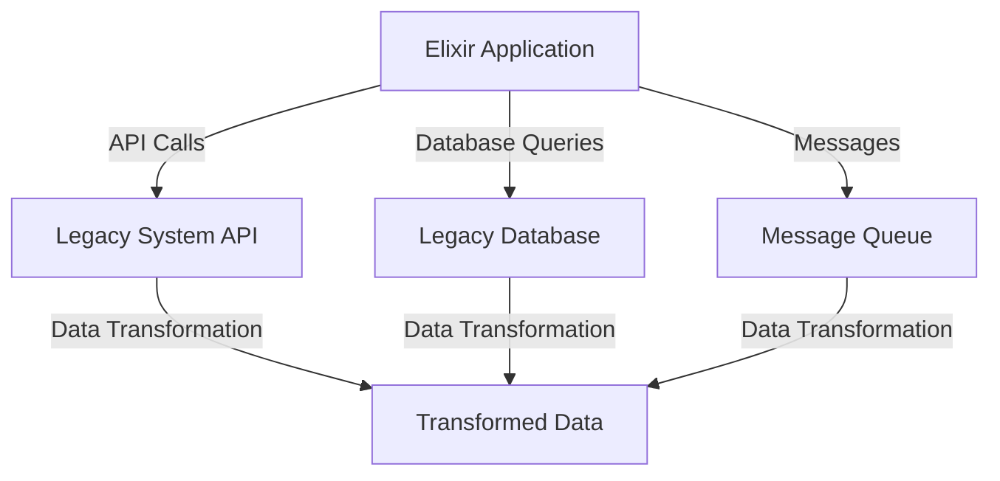

## 13.3. Integration with External Systems

In today's interconnected world, integrating with external systems is a critical capability for any modern application. Elixir, with its robust concurrency model and functional programming paradigm, offers unique advantages for building scalable and maintainable integration solutions. In this section, we'll explore how to effectively integrate Elixir applications with external systems, focusing on interfacing with legacy systems, data transformation, and the use of adapters and connectors.

### Interfacing with Legacy Systems

Legacy systems often form the backbone of many organizations' IT infrastructure. These systems may be decades old, yet they continue to perform essential functions. Integrating with such systems can be challenging due to outdated technologies, lack of documentation, and rigid architectures. However, Elixir provides several tools and techniques to facilitate this process.

#### Connecting to Existing Applications

To interface with legacy systems, we often need to connect via APIs, databases, or messaging systems. Let's explore each of these methods in detail:

1. **APIs (Application Programming Interfaces):**

   APIs are a common way to interact with external systems. They provide a standardized interface for communication, often using HTTP/HTTPS protocols. In Elixir, we can use libraries like `HTTPoison` or `Tesla` to make HTTP requests to external APIs.

   ```elixir
   defmodule LegacyApiClient do
     use Tesla

     plug Tesla.Middleware.BaseUrl, "https://legacy-system.example.com/api"
     plug Tesla.Middleware.JSON

     def get_resource(id) do
       get("/resources/#{id}")
     end
   end
   ```

   In this example, we use Tesla to create a simple client for a legacy API. We configure the base URL and JSON middleware, then define a function to fetch a resource by ID.

2. **Databases:**

   Many legacy systems store data in relational databases. Elixir's `Ecto` library provides a powerful and flexible way to interact with databases.

   ```elixir
   defmodule LegacyRepo do
     use Ecto.Repo,
       otp_app: :my_app,
       adapter: Ecto.Adapters.Postgres
   end

   defmodule LegacyData do
     use Ecto.Schema

     schema "legacy_table" do
       field :name, :string
       field :value, :integer
     end
   end

   def fetch_legacy_data do
     LegacyRepo.all(LegacyData)
   end
   ```

   Here, we define a schema for a legacy table and use Ecto to query the data. This approach allows us to leverage Elixir's functional programming features while interacting with traditional databases.

3. **Messaging Systems:**

   Messaging systems like RabbitMQ or Kafka are often used for asynchronous communication between systems. Elixir's `Broadway` library provides a framework for building data processing pipelines that can consume messages from these systems.

   ```elixir
   defmodule LegacyMessageProcessor do
     use Broadway

     def start_link(_opts) do
       Broadway.start_link(__MODULE__,
         name: __MODULE__,
         producer: [
           module: {BroadwayRabbitMQ.Producer, queue: "legacy_queue"}
         ],
         processors: [
           default: [concurrency: 10]
         ]
       )
     end

     def handle_message(_, message, _) do
       IO.inspect(message.data)
       message
     end
   end
   ```

   This example demonstrates how to set up a Broadway pipeline to process messages from a RabbitMQ queue. The `handle_message/3` function is where we define the logic for processing each message.

#### Challenges and Considerations

When interfacing with legacy systems, several challenges may arise:

- **Compatibility:** Legacy systems may use outdated protocols or data formats. It's crucial to ensure compatibility when designing integration solutions.
- **Performance:** Legacy systems may not be optimized for modern workloads. Consider the performance implications of your integration strategy.
- **Security:** Ensure that data exchanged with legacy systems is secure, especially if sensitive information is involved.

### Data Transformation

Data transformation is a critical aspect of system integration. It involves converting data from one format to another to ensure compatibility between systems. Elixir provides powerful tools for data transformation, leveraging its functional programming capabilities.

#### Converting Data Formats

Data transformation often involves converting between different data formats, such as JSON, XML, CSV, or custom formats. Elixir's pattern matching and functional programming features make it well-suited for this task.

1. **JSON Transformation:**

   JSON is a widely used data format for APIs. Elixir's `Jason` library provides fast and efficient JSON encoding and decoding.

   ```elixir
   defmodule JsonTransformer do
     def transform(json_string) do
       {:ok, data} = Jason.decode(json_string)
       transform_data(data)
     end

     defp transform_data(%{"name" => name, "value" => value}) do
       %{"name" => String.upcase(name), "value" => value * 2}
     end
   end
   ```

   In this example, we decode a JSON string into a map, transform the data by converting the name to uppercase and doubling the value, and then return the transformed data.

2. **XML Transformation:**

   XML is another common data format, especially in legacy systems. Elixir's `SweetXml` library provides tools for parsing and transforming XML data.

   ```elixir
   defmodule XmlTransformer do
     import SweetXml

     def transform(xml_string) do
       xml_string
       |> xpath(~x"//item"l, name: ~x"./name/text()"s, value: ~x"./value/text()"i)
       |> Enum.map(&transform_item/1)
     end

     defp transform_item(%{name: name, value: value}) do
       %{name: String.upcase(name), value: value * 2}
     end
   end
   ```

   Here, we use SweetXml to parse an XML string and extract data using XPath. We then transform each item in the list.

3. **CSV Transformation:**

   CSV files are commonly used for data exchange. Elixir's `NimbleCSV` library provides efficient CSV parsing and encoding.

   ```elixir
   defmodule CsvTransformer do
     alias NimbleCSV.RFC4180, as: CSV

     def transform(csv_string) do
       csv_string
       |> CSV.parse_string()
       |> Enum.map(&transform_row/1)
     end

     defp transform_row([name, value]) do
       [String.upcase(name), Integer.to_string(String.to_integer(value) * 2)]
     end
   end
   ```

   This example demonstrates how to parse a CSV string, transform each row, and return the transformed data.

#### Data Transformation Pipelines

Elixir's `Enum` and `Stream` modules provide powerful tools for building data transformation pipelines. These modules allow us to compose transformations in a functional style, making the code more readable and maintainable.

```elixir
defmodule DataPipeline do
  def run(data) do
    data
    |> Enum.map(&transform/1)
    |> Enum.filter(&filter/1)
    |> Enum.reduce(%{}, &aggregate/2)
  end

  defp transform(item), do: # transformation logic
  defp filter(item), do: # filtering logic
  defp aggregate(item, acc), do: # aggregation logic
end
```

In this example, we define a data pipeline that transforms, filters, and aggregates data. Each step in the pipeline is a separate function, allowing for easy modification and testing.

### Adapters and Connectors

Adapters and connectors are essential components of any integration solution. They provide the glue that connects different systems, allowing them to communicate and exchange data.

#### Implementing Custom Adapters

In some cases, existing libraries may not provide the functionality needed for integration. In such cases, we can implement custom adapters to bridge the gap between systems.

1. **Custom HTTP Adapter:**

   If an existing HTTP client library does not meet our needs, we can implement a custom adapter using Elixir's `:httpc` module.

   ```elixir
   defmodule CustomHttpAdapter do
     def get(url) do
       :httpc.request(:get, {url, []}, [], [])
     end
   end
   ```

   This simple adapter uses the `:httpc` module to make HTTP GET requests. We can extend it to support additional features like headers, authentication, and error handling.

2. **Custom Database Adapter:**

   If we need to connect to a non-standard database, we can implement a custom adapter using Elixir's `DBConnection` library.

   ```elixir
   defmodule CustomDbAdapter do
     use DBConnection

     def connect(opts) do
       # connection logic
     end

     def disconnect(conn, opts) do
       # disconnection logic
     end

     def handle_execute(query, params, conn, opts) do
       # query execution logic
     end
   end
   ```

   This example outlines the basic structure of a custom database adapter. We implement functions for connecting, disconnecting, and executing queries.

#### Using Existing Libraries

In many cases, existing libraries provide the functionality needed for integration. Elixir's ecosystem includes a wide range of libraries for connecting to external systems.

1. **HTTP Clients:**

   Libraries like `HTTPoison` and `Tesla` provide powerful and flexible HTTP clients for interacting with external APIs.

2. **Database Clients:**

   Elixir's `Ecto` library supports a variety of databases, including PostgreSQL, MySQL, and SQLite. It provides a high-level API for querying and managing data.

3. **Messaging Clients:**

   Libraries like `Broadway` and `KafkaEx` provide tools for building data processing pipelines and interacting with messaging systems like RabbitMQ and Kafka.

### Visualizing Integration Patterns

To better understand the integration patterns discussed, let's visualize a typical integration architecture using a Mermaid.js diagram.



**Diagram Description:** This diagram illustrates an Elixir application integrating with a legacy system via API calls, database queries, and message queues. Data transformation is applied to ensure compatibility between systems.

### Key Takeaways

- **Interfacing with Legacy Systems:** Elixir provides tools for connecting to legacy systems via APIs, databases, and messaging systems.
- **Data Transformation:** Elixir's functional programming features make it well-suited for data transformation tasks.
- **Adapters and Connectors:** Custom adapters can be implemented when existing libraries do not meet integration needs.

### Try It Yourself

Experiment with the code examples provided in this section. Try modifying the data transformation logic or implementing a custom adapter for a different protocol. Remember, the best way to learn is by doing!

### References and Further Reading

- [Tesla Documentation](https://hexdocs.pm/tesla/readme.html)
- [Ecto Documentation](https://hexdocs.pm/ecto/Ecto.html)
- [Broadway Documentation](https://hexdocs.pm/broadway/readme.html)
- [Jason Documentation](https://hexdocs.pm/jason/readme.html)
- [SweetXml Documentation](https://hexdocs.pm/sweet_xml/readme.html)
- [NimbleCSV Documentation](https://hexdocs.pm/nimble_csv/readme.html)

## Quiz: Integration with External Systems



### What is a common method for interfacing with legacy systems?

- [x] APIs
- [ ] Blockchain
- [ ] Machine Learning
- [ ] Virtual Reality

> **Explanation:** APIs provide a standardized interface for communication with legacy systems.

### Which Elixir library is commonly used for HTTP requests?

- [x] Tesla
- [ ] Ecto
- [ ] Phoenix
- [ ] Broadway

> **Explanation:** Tesla is a popular HTTP client library in Elixir.

### What is the primary purpose of data transformation?

- [x] Ensuring compatibility between systems
- [ ] Increasing data size
- [ ] Encrypting data
- [ ] Reducing data redundancy

> **Explanation:** Data transformation ensures compatibility between different systems by converting data formats.

### Which library is used for parsing XML in Elixir?

- [x] SweetXml
- [ ] Jason
- [ ] NimbleCSV
- [ ] Plug

> **Explanation:** SweetXml is used for parsing and transforming XML data in Elixir.

### What is a key advantage of using Elixir for data transformation?

- [x] Functional programming features
- [ ] Object-oriented design
- [ ] Lack of concurrency
- [ ] High memory usage

> **Explanation:** Elixir's functional programming features make it well-suited for data transformation tasks.

### What is the role of adapters in system integration?

- [x] Connecting different systems
- [ ] Encrypting data
- [ ] Reducing system load
- [ ] Increasing data redundancy

> **Explanation:** Adapters connect different systems, allowing them to communicate and exchange data.

### Which library is used for building data processing pipelines in Elixir?

- [x] Broadway
- [ ] Ecto
- [ ] Phoenix
- [ ] Tesla

> **Explanation:** Broadway is used for building data processing pipelines in Elixir.

### What is a challenge when interfacing with legacy systems?

- [x] Compatibility
- [ ] High performance
- [ ] Modern protocols
- [ ] Abundant documentation

> **Explanation:** Compatibility is a common challenge when interfacing with legacy systems.

### Which Elixir library provides tools for interacting with databases?

- [x] Ecto
- [ ] Tesla
- [ ] Phoenix
- [ ] Broadway

> **Explanation:** Ecto is a library for interacting with databases in Elixir.

### True or False: Elixir's concurrency model is a disadvantage for system integration.

- [ ] True
- [x] False

> **Explanation:** Elixir's concurrency model is an advantage for building scalable and maintainable integration solutions.



Remember, integrating with external systems is a journey. As you progress, you'll encounter new challenges and opportunities to learn. Keep experimenting, stay curious, and enjoy the journey!
