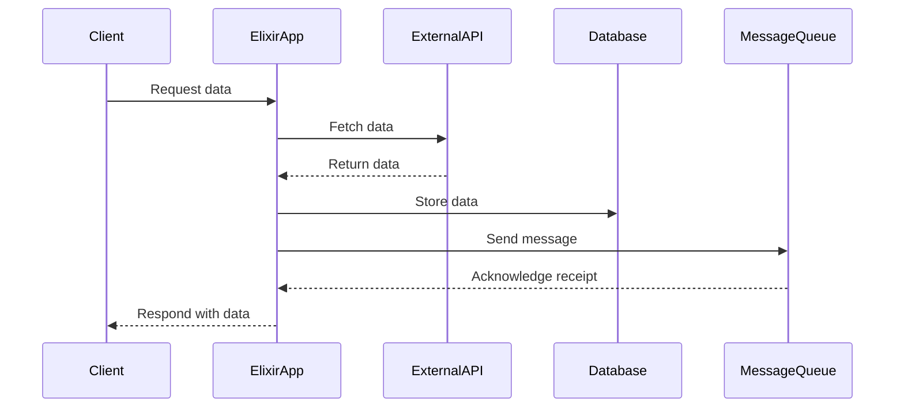

## 13.3. Integration with External Systems

In today's interconnected world, software systems rarely operate in isolation. Integration with external systems is a critical aspect of modern software architecture, enabling applications to communicate, exchange data, and leverage existing functionalities. In this section, we will explore how Elixir, with its unique features and capabilities, can be effectively used to integrate with external systems. We will cover interfacing with legacy systems, data transformation, and the use of adapters and connectors.

### Interfacing with Legacy Systems

Legacy systems are often the backbone of an organization's IT infrastructure. They may be decades old, running on outdated technology stacks, yet they hold critical business data and processes. Integrating with these systems can be challenging due to differences in technology, data formats, and communication protocols.

#### Connecting to Existing Applications

Elixir provides several ways to connect to existing applications, whether they expose APIs, databases, or messaging systems. Let's explore some common methods:

1. **APIs (Application Programming Interfaces)**

   APIs are a common way to expose functionality and data from a system. Elixir, with its robust HTTP client libraries like `HTTPoison` and `Tesla`, allows you to interact with RESTful and SOAP APIs efficiently.

   ```elixir
   defmodule ApiClient do
     use HTTPoison.Base

     def get_resource(url) do
       case get(url) do
         {:ok, %HTTPoison.Response{status_code: 200, body: body}} ->
           {:ok, body}
         {:ok, %HTTPoison.Response{status_code: status_code}} ->
           {:error, "Received status code: #{status_code}"}
         {:error, %HTTPoison.Error{reason: reason}} ->
           {:error, reason}
       end
     end
   end
   ```

   In this example, we define a simple API client using `HTTPoison` to fetch resources from a given URL. The response is pattern-matched to handle different HTTP status codes and errors.

2. **Databases**

   Elixir's `Ecto` library is a powerful tool for interacting with databases. It supports various databases, including PostgreSQL, MySQL, and SQLite, allowing you to connect and perform operations seamlessly.

   ```elixir
   defmodule MyApp.Repo do
     use Ecto.Repo,
       otp_app: :my_app,
       adapter: Ecto.Adapters.Postgres
   end

   defmodule User do
     use Ecto.Schema

     schema "users" do
       field :name, :string
       field :email, :string
     end
   end

   def list_users do
     MyApp.Repo.all(User)
   end
   ```

   Here, we define a simple schema for a `User` and a function to list all users from the database using `Ecto`.

3. **Messaging Systems**

   Messaging systems like RabbitMQ and Kafka are often used for asynchronous communication between systems. Elixir provides libraries like `AMQP` and `brod` to interact with these systems.

   ```elixir
   defmodule MessageConsumer do
     use GenServer

     def start_link(queue) do
       GenServer.start_link(__MODULE__, queue, name: __MODULE__)
     end

     def init(queue) do
       {:ok, connection} = AMQP.Connection.open()
       {:ok, channel} = AMQP.Channel.open(connection)
       AMQP.Queue.declare(channel, queue)
       AMQP.Basic.consume(channel, queue, nil, no_ack: true)
       {:ok, %{channel: channel}}
     end

     def handle_info({:basic_deliver, payload, _meta}, state) do
       IO.puts("Received message: #{payload}")
       {:noreply, state}
     end
   end
   ```

   This example demonstrates a simple message consumer using the `AMQP` library to consume messages from a RabbitMQ queue.

### Data Transformation

Data transformation is a crucial step in system integration. It involves converting data from one format to another to ensure compatibility between systems. Elixir's functional programming paradigm and pattern matching make it well-suited for data transformation tasks.

#### Converting Data Formats

Elixir provides several tools and libraries for data transformation, such as `Jason` for JSON encoding/decoding and `NimbleCSV` for CSV processing.

1. **JSON Transformation**

   JSON is a widely used data format for APIs. Elixir's `Jason` library allows you to encode and decode JSON data efficiently.

   ```elixir
   defmodule JsonTransformer do
     def transform(json_string) do
       case Jason.decode(json_string) do
         {:ok, data} -> 
           # Transform the data as needed
           {:ok, data}
         {:error, reason} -> 
           {:error, reason}
       end
     end
   end
   ```

   Here, we decode a JSON string into a map, allowing for further transformation as needed.

2. **CSV Transformation**

   CSV files are common for data exchange. `NimbleCSV` provides a fast and flexible way to parse and transform CSV data in Elixir.

   ```elixir
   defmodule CsvTransformer do
     alias NimbleCSV.RFC4180, as: CSV

     def parse(csv_string) do
       csv_string
       |> CSV.parse_string()
       |> Enum.map(&transform_row/1)
     end

     defp transform_row(row) do
       # Transform each row as needed
       row
     end
   end
   ```

   This example parses a CSV string and applies a transformation to each row.

### Adapters and Connectors

Adapters and connectors are essential components in system integration, allowing disparate systems to communicate by bridging differences in protocols, data formats, and interfaces.

#### Implementing Adapters

Adapters translate requests and responses between systems, ensuring compatibility. In Elixir, you can implement adapters using protocols and behaviours.

1. **Protocol-Based Adapter**

   Elixir protocols provide a way to achieve polymorphism. You can define a protocol to handle different types of systems.

   ```elixir
   defprotocol DataAdapter do
     def fetch_data(adapter, params)
   end

   defimpl DataAdapter, for: ApiClient do
     def fetch_data(_adapter, params) do
       # Fetch data from an API
     end
   end

   defimpl DataAdapter, for: DatabaseClient do
     def fetch_data(_adapter, params) do
       # Fetch data from a database
     end
   end
   ```

   Here, we define a `DataAdapter` protocol with implementations for different types of clients.

2. **Behaviour-Based Adapter**

   Behaviours define a set of functions that a module must implement. They are useful for defining a contract for adapters.

   ```elixir
   defmodule AdapterBehaviour do
     @callback fetch_data(params :: map) :: {:ok, any} | {:error, any}
   end

   defmodule ApiAdapter do
     @behaviour AdapterBehaviour

     def fetch_data(params) do
       # Fetch data from an API
     end
   end
   ```

   This example defines a behaviour for data fetching and implements it in an `ApiAdapter`.

#### Using Existing Libraries

Elixir's ecosystem includes numerous libraries that provide ready-made connectors for various systems, reducing the need to implement everything from scratch.

- **Ecto**: For database integration.
- **Tesla**: For HTTP client capabilities.
- **AMQP**: For RabbitMQ messaging.
- **Brod**: For Kafka integration.

### Visualizing Integration with External Systems

To better understand how Elixir can be used to integrate with external systems, let's visualize the process using a sequence diagram.


```mermaid
sequenceDiagram
    participant Client
    participant ElixirApp
    participant ExternalAPI
    participant Database
    participant MessageQueue

    Client->>ElixirApp: Request data
    ElixirApp->>ExternalAPI: Fetch data
    ExternalAPI-->>ElixirApp: Return data
    ElixirApp->>Database: Store data
    ElixirApp->>MessageQueue: Send message
    MessageQueue-->>ElixirApp: Acknowledge receipt
    ElixirApp-->>Client: Respond with data
```

This diagram illustrates a typical flow of integrating with external systems, where an Elixir application fetches data from an external API, stores it in a database, and sends a message to a queue.

### Knowledge Check

- Explain how Elixir can connect to external APIs.
- Demonstrate data transformation using Elixir libraries.
- Provide an example of implementing an adapter using Elixir protocols.

### Try It Yourself

Experiment with the provided code examples by modifying them to suit your needs. For instance, try connecting to a different API or transforming data in a new format. Remember, practice is key to mastering system integration with Elixir.

### Summary

In this section, we explored how Elixir can be used to integrate with external systems. We covered interfacing with legacy systems via APIs, databases, and messaging systems, performing data transformations, and implementing adapters and connectors. By leveraging Elixir's robust libraries and functional programming paradigm, you can build seamless integrations that enhance your application's capabilities.

Remember, this is just the beginning. As you progress, you'll discover more advanced techniques and patterns for integrating systems. Keep experimenting, stay curious, and enjoy the journey!

## Quiz Time!



### What is a common method for Elixir to connect to external systems?

- [x] Using APIs
- [ ] Using GUIs
- [ ] Using spreadsheets
- [ ] Using manual data entry

> **Explanation:** APIs are a common method for connecting to external systems, as they provide a standardized way to access data and functionality.

### Which Elixir library is commonly used for interacting with databases?

- [x] Ecto
- [ ] Phoenix
- [ ] Plug
- [ ] NimbleCSV

> **Explanation:** Ecto is a widely used library in Elixir for interacting with databases, providing a powerful toolkit for database operations.

### What is the purpose of data transformation in system integration?

- [x] To ensure compatibility between systems
- [ ] To add new features to the system
- [ ] To improve system performance
- [ ] To reduce system complexity

> **Explanation:** Data transformation ensures compatibility between systems by converting data formats, allowing seamless communication and data exchange.

### How can Elixir achieve polymorphism for implementing adapters?

- [x] Using protocols
- [ ] Using macros
- [ ] Using GenServers
- [ ] Using tasks

> **Explanation:** Elixir protocols provide a way to achieve polymorphism, allowing different implementations for different data types.

### Which library would you use for JSON encoding/decoding in Elixir?

- [x] Jason
- [ ] Ecto
- [ ] Plug
- [ ] Phoenix

> **Explanation:** Jason is a popular library in Elixir for JSON encoding and decoding, providing efficient and fast operations.

### What is a key feature of Elixir that makes it suitable for data transformation?

- [x] Pattern matching
- [ ] Object-oriented programming
- [ ] Dynamic typing
- [ ] Inheritance

> **Explanation:** Pattern matching is a key feature of Elixir that makes it suitable for data transformation, allowing for concise and expressive code.

### Which library would you use for RabbitMQ integration in Elixir?

- [x] AMQP
- [ ] Ecto
- [ ] Phoenix
- [ ] Plug

> **Explanation:** The AMQP library is commonly used for RabbitMQ integration in Elixir, providing tools for message queuing and processing.

### What is the role of adapters in system integration?

- [x] To bridge differences in protocols and data formats
- [ ] To increase system complexity
- [ ] To decrease system performance
- [ ] To add new features to the system

> **Explanation:** Adapters bridge differences in protocols and data formats, enabling seamless communication between disparate systems.

### How does Elixir handle asynchronous communication with messaging systems?

- [x] Using libraries like AMQP and brod
- [ ] Using synchronous HTTP requests
- [ ] Using direct database queries
- [ ] Using manual data entry

> **Explanation:** Elixir handles asynchronous communication with messaging systems using libraries like AMQP and brod, which provide tools for message queuing and processing.

### True or False: Elixir's functional programming paradigm makes it unsuitable for system integration.

- [ ] True
- [x] False

> **Explanation:** False. Elixir's functional programming paradigm, along with its robust libraries and tools, makes it well-suited for system integration, enabling efficient and effective communication between systems.


