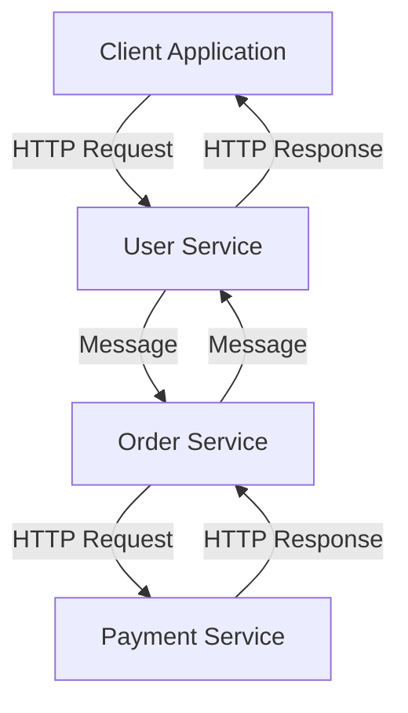

## 13.4. Service-Oriented Architecture (SOA)

Service-Oriented Architecture (SOA) is a design paradigm that enables the creation of distributed systems composed of loosely coupled, reusable services. These services communicate over a network to perform specific business functions. In this section, we will explore the principles of SOA and how to implement it using Elixir, a functional programming language known for its concurrency and fault-tolerance capabilities.

### Principles of SOA

SOA is built on several key principles that guide the design and implementation of services:

- **Loose Coupling**: Services should be independent of each other, allowing them to be developed, deployed, and maintained separately. This reduces dependencies and increases flexibility.
  
- **Interoperability**: Services should be able to communicate with each other regardless of the underlying technology stack. This is often achieved through standardized communication protocols such as HTTP, SOAP, or REST.

- **Reusability**: Services should be designed to be reusable across different applications and contexts. This involves defining clear and well-documented interfaces.

- **Abstraction**: Services should encapsulate their internal logic and expose only the necessary functionality through their interfaces. This abstraction allows for changes in the service implementation without affecting consumers.

- **Discoverability**: Services should be easily discoverable and accessible, often through a service registry or directory.

- **Statelessness**: Services should be stateless whenever possible, meaning they do not retain information between requests. This enhances scalability and reliability.

- **Composability**: Services should be designed to be composed into larger, more complex services or applications, enabling the creation of flexible and scalable systems.

### Implementing SOA in Elixir

Elixir, with its robust concurrency model and support for distributed systems, is well-suited for implementing SOA. Let's explore how to design and implement SOA in Elixir.

#### Designing Services in Elixir

1. **Define Service Boundaries**: Identify the business functions that can be encapsulated as services. Each service should have a clear responsibility and interface.

2. **Use Elixir's Concurrency Model**: Leverage Elixir's lightweight processes and message-passing capabilities to implement services that can handle concurrent requests efficiently.

3. **Implement Communication Protocols**: Use HTTP or other protocols to enable communication between services. Libraries like `Plug` and `Phoenix` can be used to build HTTP-based services.

4. **Ensure Interoperability**: Design services to be technology-agnostic by using standard data formats like JSON or XML for communication.

5. **Utilize Supervisors for Fault Tolerance**: Use Elixir's OTP framework to create supervisors that monitor and restart services in case of failures, ensuring high availability.

6. **Document Service Interfaces**: Clearly document the inputs, outputs, and behavior of each service to facilitate reusability and integration.

#### Sample Code Snippet

Let's look at a simple example of an Elixir service that provides user management functionality.

```elixir
defmodule UserService do
  use GenServer

  # Client API

  def start_link(initial_state \\ %{}) do
    GenServer.start_link(__MODULE__, initial_state, name: __MODULE__)
  end

  def create_user(user_data) do
    GenServer.call(__MODULE__, {:create_user, user_data})
  end

  def get_user(user_id) do
    GenServer.call(__MODULE__, {:get_user, user_id})
  end

  # Server Callbacks

  def init(initial_state) do
    {:ok, initial_state}
  end

  def handle_call({:create_user, user_data}, _from, state) do
    # Simulate user creation
    new_state = Map.put(state, user_data.id, user_data)
    {:reply, :ok, new_state}
  end

  def handle_call({:get_user, user_id}, _from, state) do
    user = Map.get(state, user_id, nil)
    {:reply, user, state}
  end
end
```

In this example, we define a `UserService` module that uses a GenServer to manage user data. The service provides two functions: `create_user/1` and `get_user/1`, which can be called by clients to interact with the service.

#### Visualizing SOA in Elixir

To better understand how services interact in an SOA environment, let's visualize a simple architecture using Mermaid.js.



**Diagram Description**: This diagram illustrates a simple SOA architecture where a client application communicates with a User Service. The User Service interacts with an Order Service, which in turn communicates with a Payment Service. Each service is independent but interoperable, allowing for flexible and scalable system design.

### Key Participants in SOA

- **Service Provider**: The entity that creates and maintains the service. In Elixir, this could be a module or a GenServer process.

- **Service Consumer**: The entity that uses the service. This could be another service or a client application.

- **Service Registry**: A directory where services are registered and can be discovered by consumers. In Elixir, this could be implemented using a distributed registry like `Erlang's global` or a custom solution.

- **Service Broker**: An intermediary that facilitates communication between services. This could be a message broker like RabbitMQ or Kafka.

### Applicability of SOA in Elixir

SOA is particularly useful in scenarios where:

- **Scalability**: You need to scale different parts of your application independently.
- **Flexibility**: You want to enable different teams to work on different services simultaneously.
- **Integration**: You need to integrate with external systems or services.
- **Reusability**: You want to reuse services across different applications or projects.

### Design Considerations

When implementing SOA in Elixir, consider the following:

- **Service Granularity**: Determine the appropriate level of granularity for your services. Too coarse-grained services can become monolithic, while too fine-grained services can lead to excessive communication overhead.

- **Data Consistency**: Ensure data consistency across services, especially when dealing with distributed transactions. Techniques like eventual consistency and compensating transactions can be useful.

- **Security**: Implement security measures such as authentication, authorization, and encryption to protect your services.

- **Monitoring and Logging**: Use monitoring and logging tools to track the performance and health of your services.

### Elixir Unique Features

Elixir offers several unique features that make it well-suited for SOA:

- **Concurrency**: Elixir's lightweight processes and message-passing model enable efficient handling of concurrent requests.

- **Fault Tolerance**: The OTP framework provides tools for building fault-tolerant systems with supervisors and process monitoring.

- **Distributed Systems**: Elixir's support for distributed systems allows services to be deployed across multiple nodes, enhancing scalability and reliability.

- **Functional Programming**: Elixir's functional programming paradigm promotes immutability and statelessness, which align well with SOA principles.

### Differences and Similarities with Microservices

SOA and microservices share many similarities, such as the focus on service decomposition and loose coupling. However, there are key differences:

- **Scope**: SOA typically involves larger, enterprise-level systems, while microservices focus on smaller, independently deployable components.

- **Communication**: SOA often uses enterprise service buses (ESBs) for communication, while microservices favor lightweight protocols like HTTP/REST.

- **Governance**: SOA may involve more centralized governance, whereas microservices promote decentralized governance and autonomy.

### Try It Yourself

To deepen your understanding of SOA in Elixir, try modifying the `UserService` example:

- **Add a new function** for updating user data.
- **Implement a new service** that interacts with the `UserService`.
- **Experiment with different communication protocols** such as gRPC or WebSockets.

### Knowledge Check

- **What are the key principles of SOA?**
- **How does Elixir's concurrency model benefit SOA?**
- **What are the differences between SOA and microservices?**

### Embrace the Journey

Remember, implementing SOA is a journey that involves continuous learning and adaptation. As you explore SOA in Elixir, keep experimenting, stay curious, and enjoy the process of building scalable and flexible systems.

## Quiz: Service-Oriented Architecture (SOA)



### What is a key principle of SOA?

- [x] Loose coupling
- [ ] Tight integration
- [ ] Monolithic design
- [ ] Single responsibility

> **Explanation:** Loose coupling is a fundamental principle of SOA, allowing services to be independent and flexible.

### How does Elixir's concurrency model benefit SOA?

- [x] Efficient handling of concurrent requests
- [ ] Increased memory usage
- [ ] Slower response times
- [ ] Reduced fault tolerance

> **Explanation:** Elixir's concurrency model allows for efficient handling of concurrent requests, which is beneficial for SOA.

### What is a difference between SOA and microservices?

- [x] SOA often uses ESBs, while microservices use lightweight protocols
- [ ] SOA is always smaller in scope than microservices
- [ ] Microservices require centralized governance
- [ ] SOA does not support distributed systems

> **Explanation:** SOA often uses enterprise service buses (ESBs) for communication, while microservices favor lightweight protocols like HTTP/REST.

### Which Elixir feature supports fault tolerance in SOA?

- [x] OTP framework
- [ ] Global variables
- [ ] Mutable state
- [ ] Blocking operations

> **Explanation:** The OTP framework provides tools for building fault-tolerant systems with supervisors and process monitoring.

### What is a benefit of stateless services in SOA?

- [x] Enhanced scalability
- [ ] Increased complexity
- [ ] Reduced reliability
- [ ] Slower performance

> **Explanation:** Stateless services enhance scalability by not retaining information between requests.

### What is a common communication protocol used in SOA?

- [x] HTTP
- [ ] FTP
- [ ] SMTP
- [ ] POP3

> **Explanation:** HTTP is a common communication protocol used in SOA for service interaction.

### What is a key participant in SOA?

- [x] Service Provider
- [ ] Database Administrator
- [ ] Network Engineer
- [ ] UI Designer

> **Explanation:** The Service Provider is responsible for creating and maintaining the service.

### What is a challenge when implementing SOA?

- [x] Ensuring data consistency
- [ ] Reducing service granularity
- [ ] Increasing coupling
- [ ] Centralizing all services

> **Explanation:** Ensuring data consistency across services, especially in distributed systems, is a challenge in SOA.

### What is a unique feature of Elixir that aids SOA?

- [x] Lightweight processes
- [ ] Heavyweight threads
- [ ] Global state management
- [ ] Synchronous communication

> **Explanation:** Elixir's lightweight processes enable efficient handling of concurrent requests, aiding SOA.

### True or False: SOA and microservices are identical in scope and implementation.

- [ ] True
- [x] False

> **Explanation:** SOA and microservices share similarities but differ in scope, communication methods, and governance.


