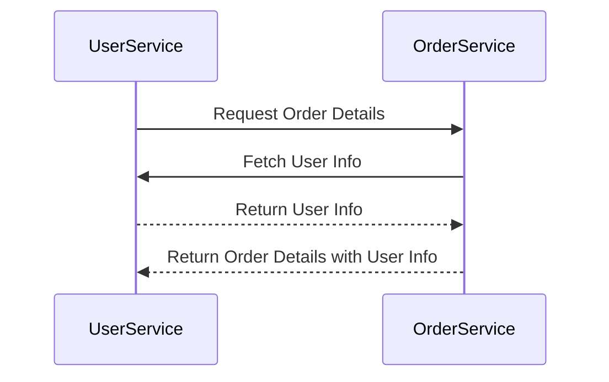

## 13.4. Service-Oriented Architecture (SOA)

Service-Oriented Architecture (SOA) is a design paradigm that allows software components to provide services to other components via a network. These services are reusable, loosely coupled, and can be independently deployed and maintained. In this section, we'll explore how SOA principles can be applied in Elixir to build scalable and maintainable systems.

### Principles of SOA

Understanding the core principles of SOA is crucial for designing systems that are both flexible and robust. Here are some key principles:

- **Loose Coupling**: Services should be independent and interact with each other through well-defined interfaces, minimizing dependencies.
- **Interoperability**: Services should be able to communicate with each other regardless of the underlying technology stack.
- **Reusability**: Services should be designed to be reused in different contexts and applications.
- **Discoverability**: Services should be easily discoverable and accessible within the architecture.
- **Composability**: Services should be able to be composed into larger services or applications.

### Implementing SOA in Elixir

Elixir, with its functional programming paradigm and robust concurrency model, is well-suited for implementing SOA. Let's explore how we can design and implement SOA using Elixir.

#### Designing Independent and Interoperable Services

In Elixir, services can be implemented as separate applications within an umbrella project or as standalone applications that communicate over a network. Here's how you can design such services:

1. **Define Service Boundaries**: Clearly define the responsibilities and boundaries of each service. This helps in maintaining loose coupling and ensures that services are independent.

2. **Use APIs for Communication**: Utilize RESTful APIs or GraphQL for communication between services. Elixir's Phoenix framework can be used to build these APIs efficiently.

3. **Employ Message Brokers**: Use message brokers like RabbitMQ or Kafka for asynchronous communication between services. This allows services to remain decoupled and scalable.

4. **Service Discovery**: Implement service discovery mechanisms to enable services to find and communicate with each other dynamically.

#### Example: Building a Simple SOA in Elixir

Let's build a simple SOA system in Elixir. We'll create two services: a User Service and an Order Service. These services will communicate via HTTP using Phoenix.

**User Service**

```elixir
defmodule UserService do
  use Phoenix.Router

  get "/users/:id", UserController, :show

  defmodule UserController do
    use Phoenix.Controller

    def show(conn, %{"id" => id}) do
      user = get_user(id)
      json(conn, user)
    end

    defp get_user(id) do
      # Simulate fetching user from database
      %{id: id, name: "User #{id}"}
    end
  end
end
```

**Order Service**

```elixir
defmodule OrderService do
  use Phoenix.Router

  get "/orders/:id", OrderController, :show

  defmodule OrderController do
    use Phoenix.Controller

    def show(conn, %{"id" => id}) do
      order = get_order(id)
      json(conn, order)
    end

    defp get_order(id) do
      # Simulate fetching order from database
      %{id: id, item: "Item #{id}", user_id: id}
    end
  end
end
```

**Service Communication**

To enable communication between the services, we can use HTTP requests. For example, the Order Service might need to fetch user information from the User Service.

```elixir
defmodule OrderService.OrderController do
  use Phoenix.Controller
  alias HTTPoison

  def show(conn, %{"id" => id}) do
    order = get_order(id)
    user_info = fetch_user_info(order.user_id)
    json(conn, %{order: order, user: user_info})
  end

  defp fetch_user_info(user_id) do
    url = "http://localhost:4000/users/#{user_id}"
    case HTTPoison.get(url) do
      {:ok, %HTTPoison.Response{status_code: 200, body: body}} ->
        {:ok, Poison.decode!(body)}
      {:error, %HTTPoison.Error{reason: reason}} ->
        {:error, reason}
    end
  end
end
```

### Visualizing SOA in Elixir

Below is a Mermaid.js diagram illustrating the interaction between the User Service and Order Service.


```mermaid
sequenceDiagram
    participant UserService
    participant OrderService
    UserService->>OrderService: Request Order Details
    OrderService->>UserService: Fetch User Info
    UserService-->>OrderService: Return User Info
    OrderService-->>UserService: Return Order Details with User Info
```

This diagram shows how the User Service and Order Service interact to fulfill a request. The Order Service fetches additional user information from the User Service to complete its response.

### Elixir Unique Features for SOA

Elixir offers several unique features that make it an excellent choice for implementing SOA:

- **Concurrency and Fault Tolerance**: Elixir's actor model and OTP (Open Telecom Platform) provide robust tools for building concurrent and fault-tolerant systems.
- **Scalability**: Elixir's lightweight processes and message-passing capabilities make it easy to scale services horizontally.
- **Hot Code Upgrades**: Elixir supports hot code upgrades, allowing you to update services without downtime.

### Design Considerations

When implementing SOA in Elixir, consider the following:

- **Data Consistency**: Ensure that data consistency is maintained across services, especially in distributed systems.
- **Security**: Implement authentication and authorization mechanisms to secure service communication.
- **Monitoring and Logging**: Use tools like Prometheus and Grafana to monitor service performance and health.

### Differences and Similarities with Microservices

SOA and microservices share many similarities, such as promoting modularity and scalability. However, microservices are often more granular and independently deployable compared to traditional SOA services. Elixir's concurrency model and lightweight processes make it well-suited for both paradigms.

### Try It Yourself

To experiment with the concepts discussed, try modifying the code examples to add new features or services. For instance, you could:

- Add a new service, such as an Inventory Service, and integrate it with the existing services.
- Implement caching mechanisms to improve performance.
- Explore using GraphQL instead of REST for service communication.

### Knowledge Check

- **What are the key principles of SOA?**
- **How can Elixir's features be leveraged in implementing SOA?**
- **What are the differences between SOA and microservices?**

### Summary

In this section, we've explored the principles of Service-Oriented Architecture and how they can be implemented in Elixir. By designing independent, interoperable services, you can build scalable and maintainable systems that leverage Elixir's unique strengths. Remember, this is just the beginning. As you progress, you'll build more complex and interactive systems. Keep experimenting, stay curious, and enjoy the journey!

## Quiz Time!



### Which of the following is a key principle of SOA?

- [x] Loose Coupling
- [ ] Tight Coupling
- [ ] Monolithic Design
- [ ] Single Responsibility

> **Explanation:** Loose coupling is a fundamental principle of SOA, ensuring services are independent and interact through well-defined interfaces.

### What is a common communication method between services in an SOA?

- [x] RESTful APIs
- [ ] Direct Database Access
- [ ] Shared Memory
- [ ] Local Function Calls

> **Explanation:** RESTful APIs are commonly used for communication between services in an SOA, providing a standardized interface.

### Which Elixir framework can be used to build APIs for SOA?

- [x] Phoenix
- [ ] Rails
- [ ] Django
- [ ] Spring

> **Explanation:** Phoenix is a web framework in Elixir that can be used to build APIs for service communication.

### What is the role of a message broker in SOA?

- [x] Facilitates asynchronous communication between services
- [ ] Stores service configurations
- [ ] Manages service deployments
- [ ] Provides user authentication

> **Explanation:** Message brokers like RabbitMQ facilitate asynchronous communication between services, enabling decoupling and scalability.

### How does Elixir's concurrency model benefit SOA?

- [x] Supports lightweight processes for scalability
- [ ] Requires heavy threading for concurrency
- [ ] Limits the number of concurrent services
- [ ] Relies on global locks

> **Explanation:** Elixir's concurrency model uses lightweight processes, making it easy to scale services horizontally.

### What is a potential advantage of using GraphQL over REST in SOA?

- [x] Allows clients to specify exactly what data they need
- [ ] Requires less setup and configuration
- [ ] Automatically scales services
- [ ] Eliminates the need for service discovery

> **Explanation:** GraphQL allows clients to specify exactly what data they need, reducing over-fetching and under-fetching issues.

### Which tool can be used for monitoring service performance in Elixir?

- [x] Prometheus
- [ ] Jenkins
- [ ] Git
- [ ] Docker

> **Explanation:** Prometheus is a monitoring tool that can be used to track service performance and health in Elixir applications.

### What is a common challenge when implementing SOA?

- [x] Maintaining data consistency across services
- [ ] Ensuring all services are tightly coupled
- [ ] Using a single programming language
- [ ] Avoiding service reuse

> **Explanation:** Maintaining data consistency across distributed services is a common challenge in SOA implementations.

### True or False: SOA and microservices are identical in their approach to service design.

- [ ] True
- [x] False

> **Explanation:** While SOA and microservices share similarities, microservices are often more granular and independently deployable.

### What is a benefit of using hot code upgrades in Elixir for SOA?

- [x] Allows updating services without downtime
- [ ] Requires restarting all services
- [ ] Simplifies service discovery
- [ ] Eliminates the need for version control

> **Explanation:** Hot code upgrades in Elixir allow services to be updated without downtime, enhancing system availability.




