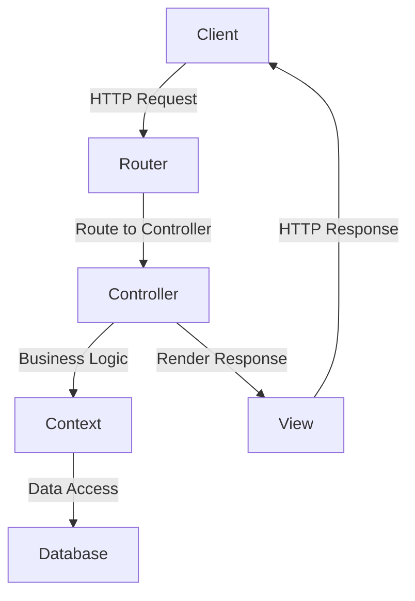

## 13.6. Implementing RESTful APIs

In the modern software landscape, RESTful APIs have become a cornerstone for enabling communication between distributed systems. In this section, we will delve into the intricacies of building RESTful APIs using Elixir, leveraging its powerful frameworks like Phoenix and Plug. We will explore design principles, tools, frameworks, and best practices to ensure your APIs are robust, scalable, and maintainable.

### Design Principles

#### Adhering to REST Constraints

REST, or Representational State Transfer, is an architectural style that defines a set of constraints for creating scalable web services. When implementing RESTful APIs, it's crucial to adhere to these constraints:

1. **Statelessness**: Each API request from a client must contain all the information needed to understand and process the request. This ensures that the server does not store any session information, making the system more scalable.

2. **Client-Server Architecture**: This separation of concerns allows the client and server to evolve independently. The client is responsible for the user interface, while the server handles data storage and processing.

3. **Uniform Interface**: A consistent and standardized interface simplifies the architecture and improves the visibility of interactions. This includes using standard HTTP methods (GET, POST, PUT, DELETE) and status codes.

4. **Cacheability**: Responses from the server should be explicitly marked as cacheable or non-cacheable to improve performance and scalability.

5. **Layered System**: The architecture should be composed of hierarchical layers, each with a specific responsibility, allowing for scalability and flexibility.

6. **Code on Demand (optional)**: Servers can extend client functionality by transferring executable code, though this is optional in REST.

### Tools and Frameworks

#### Using Plug and Phoenix for Building Web Interfaces

Elixir provides robust tools for building web interfaces, with Plug and Phoenix being the most prominent.

##### Plug

Plug is a specification for composable modules in web applications. It provides a set of tools for building web applications and is the foundation of the Phoenix framework. Here's a simple example of a Plug:

```elixir
defmodule MyApp.HelloPlug do
  import Plug.Conn

  def init(options), do: options

  def call(conn, _opts) do
    conn
    |> put_resp_content_type("text/plain")
    |> send_resp(200, "Hello, world!")
  end
end
```

- **init/1**: Initializes the plug with options.
- **call/2**: Processes the connection and returns it.

##### Phoenix

Phoenix is a web framework built on top of Plug, designed for building scalable and maintainable web applications. It provides a rich set of features for building RESTful APIs, including routing, controllers, and views.

To create a new Phoenix project, use the following command:

```bash
mix phx.new my_api --no-html --no-webpack
```

This command creates a new Phoenix project without HTML and JavaScript assets, ideal for API-only applications.

##### Routing in Phoenix

Phoenix uses a router to dispatch requests to the appropriate controller actions. Here's an example of defining routes in a Phoenix application:

```elixir
defmodule MyAppWeb.Router do
  use MyAppWeb, :router

  pipeline :api do
    plug :accepts, ["json"]
  end

  scope "/api", MyAppWeb do
    pipe_through :api

    get "/users", UserController, :index
    post "/users", UserController, :create
    get "/users/:id", UserController, :show
    put "/users/:id", UserController, :update
    delete "/users/:id", UserController, :delete
  end
end
```

- **pipeline :api**: Defines a pipeline for processing API requests, accepting JSON format.
- **scope "/api"**: Scopes routes under the "/api" path.
- **pipe_through :api**: Applies the API pipeline to the routes.

##### Controllers in Phoenix

Controllers handle incoming requests, interact with the business logic, and return responses. Here's an example of a simple controller:

```elixir
defmodule MyAppWeb.UserController do
  use MyAppWeb, :controller

  alias MyApp.Accounts
  alias MyApp.Accounts.User

  def index(conn, _params) do
    users = Accounts.list_users()
    render(conn, "index.json", users: users)
  end

  def create(conn, %{"user" => user_params}) do
    case Accounts.create_user(user_params) do
      {:ok, user} ->
        conn
        |> put_status(:created)
        |> render("show.json", user: user)
      {:error, changeset} ->
        conn
        |> put_status(:unprocessable_entity)
        |> render(MyAppWeb.ChangesetView, "error.json", changeset: changeset)
    end
  end

  # Additional actions for show, update, delete...
end
```

- **index/2**: Lists all users.
- **create/2**: Creates a new user and handles success or error cases.

### Best Practices

#### Versioning APIs

API versioning is crucial for maintaining backward compatibility and allowing clients to upgrade at their own pace. There are several strategies for versioning APIs:

1. **URI Versioning**: Include the version number in the URI, e.g., `/api/v1/users`.

2. **Header Versioning**: Use custom headers to specify the API version, e.g., `Accept: application/vnd.myapp.v1+json`.

3. **Query Parameter Versioning**: Include the version as a query parameter, e.g., `/api/users?version=1`.

#### Error Handling

Proper error handling improves the user experience and aids in debugging. Use consistent error responses with appropriate HTTP status codes and messages.

```elixir
defmodule MyAppWeb.FallbackController do
  use MyAppWeb, :controller

  def call(conn, {:error, :not_found}) do
    conn
    |> put_status(:not_found)
    |> render(MyAppWeb.ErrorView, "404.json")
  end

  def call(conn, {:error, :unprocessable_entity}) do
    conn
    |> put_status(:unprocessable_entity)
    |> render(MyAppWeb.ErrorView, "422.json")
  end

  # Additional error handling...
end
```

#### Documentation

Comprehensive API documentation is essential for developers to understand and use your API effectively. Tools like Swagger or OpenAPI can be used to generate interactive documentation.

### Visualizing RESTful API Architecture

Below is a diagram illustrating the architecture of a RESTful API built with Phoenix:



**Diagram Description**: This diagram depicts the flow of a request from the client to the server in a Phoenix application. The request is routed to the appropriate controller, which interacts with the context for business logic and data access. The response is rendered and sent back to the client.

### Elixir Unique Features

Elixir's concurrency model, based on the Actor model, allows for building highly concurrent and fault-tolerant APIs. The use of processes and message passing ensures that your API can handle a large number of simultaneous requests efficiently.

### Differences and Similarities

While RESTful APIs can be implemented in various languages and frameworks, Elixir's unique features, such as immutability and pattern matching, provide distinct advantages in terms of performance and maintainability.

### Try It Yourself

To solidify your understanding, try modifying the code examples provided:

1. **Add a new endpoint**: Implement a new endpoint in the `UserController` for updating user profiles.

2. **Implement error handling**: Extend the `FallbackController` to handle additional error cases, such as `:forbidden`.

3. **Experiment with versioning**: Implement a versioning strategy of your choice and observe how it affects the API structure.

### Knowledge Check

1. **What are the key constraints of REST?**
2. **How does Phoenix use Plug to handle HTTP requests?**
3. **What are the benefits of API versioning?**
4. **How can you handle errors consistently in a Phoenix application?**

### Embrace the Journey

Building RESTful APIs in Elixir is a rewarding journey that combines the power of functional programming with the robustness of the BEAM VM. As you continue to explore and experiment, you'll discover new ways to optimize and enhance your APIs. Remember, this is just the beginning. Keep experimenting, stay curious, and enjoy the journey!

## Quiz: Implementing RESTful APIs



### What is a key constraint of RESTful APIs?

- [x] Statelessness
- [ ] Stateful interactions
- [ ] Client-side storage
- [ ] Server-side sessions

> **Explanation:** Statelessness ensures that each request from a client contains all the information needed to process it, making the system more scalable.

### Which tool is foundational for building web applications in Elixir?

- [x] Plug
- [ ] Ecto
- [ ] Nerves
- [ ] Absinthe

> **Explanation:** Plug is a specification for composable modules in web applications and is foundational for building web applications in Elixir.

### What is a common strategy for API versioning?

- [x] URI Versioning
- [ ] Cookie Versioning
- [ ] Session Versioning
- [ ] Cache Versioning

> **Explanation:** URI Versioning involves including the version number in the URI, such as `/api/v1/users`.

### How does Phoenix handle HTTP requests?

- [x] Through a router that dispatches requests to controllers
- [ ] By directly accessing the database
- [ ] Using client-side scripts
- [ ] Through server-side sessions

> **Explanation:** Phoenix uses a router to dispatch requests to the appropriate controller actions.

### What is an advantage of using Elixir for RESTful APIs?

- [x] Concurrency and fault tolerance
- [ ] Client-side rendering
- [ ] Stateful interactions
- [ ] Server-side sessions

> **Explanation:** Elixir's concurrency model, based on the Actor model, allows for building highly concurrent and fault-tolerant APIs.

### What is the purpose of a FallbackController in Phoenix?

- [x] To handle errors consistently
- [ ] To manage database connections
- [ ] To render HTML templates
- [ ] To handle client-side scripts

> **Explanation:** A FallbackController is used to handle errors consistently in a Phoenix application.

### Which HTTP method is typically used to update a resource?

- [x] PUT
- [ ] GET
- [ ] POST
- [ ] DELETE

> **Explanation:** The PUT method is typically used to update a resource in RESTful APIs.

### What tool can be used for generating API documentation?

- [x] Swagger
- [ ] Ecto
- [ ] Nerves
- [ ] Absinthe

> **Explanation:** Swagger is a tool that can be used to generate interactive API documentation.

### How can you improve the performance of a RESTful API?

- [x] By implementing caching
- [ ] By using server-side sessions
- [ ] By storing state on the server
- [ ] By using client-side scripts

> **Explanation:** Implementing caching can improve the performance and scalability of a RESTful API.

### True or False: Elixir's immutability provides distinct advantages for RESTful APIs.

- [x] True
- [ ] False

> **Explanation:** Elixir's immutability ensures that data cannot be changed once created, providing advantages in terms of performance and maintainability.




