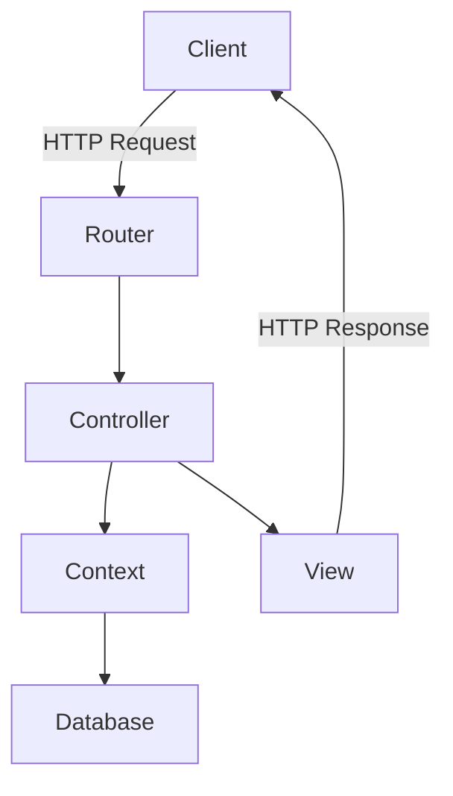

## 13.6. Implementing RESTful APIs

In the realm of modern web development, RESTful APIs have become the backbone of client-server communication. As expert software engineers and architects, understanding how to implement these APIs in Elixir can greatly enhance your ability to build scalable, maintainable, and efficient systems. This guide will walk you through the design principles, tools, frameworks, and best practices for implementing RESTful APIs using Elixir.

### Design Principles

REST, or Representational State Transfer, is an architectural style that defines a set of constraints for creating web services. Adhering to these constraints ensures that your APIs are scalable, stateless, and can be easily consumed by clients. Here are the key design principles to consider:

1. **Statelessness**: Each request from a client must contain all the information needed to understand and process the request. The server does not store any state about the client session.

2. **Client-Server Separation**: The client and server should be independent of each other. This separation allows for the development of the client and server components in isolation.

3. **Cacheability**: Responses should be explicitly marked as cacheable or non-cacheable to improve performance by reducing the need for repeated requests.

4. **Layered System**: A client should not be able to tell whether it is connected directly to the end server or an intermediary along the way.

5. **Uniform Interface**: This is achieved through the use of standard HTTP methods (GET, POST, PUT, DELETE) and consistent resource naming conventions.

6. **Code on Demand (Optional)**: Servers can extend client functionality by transferring executable code.

### Tools and Frameworks

Elixir, with its powerful concurrency model and functional programming paradigm, is well-suited for building robust RESTful APIs. Here are the primary tools and frameworks you'll use:

- **Plug**: A specification for composable modules in between web applications. It provides a set of conventions for building web applications and can be used to create a simple RESTful API.

- **Phoenix**: A web development framework built on top of Plug. Phoenix provides a comprehensive set of tools for building scalable web applications and APIs.

#### Using Plug

Plug is a minimalistic library that allows you to compose web applications. It is the foundation upon which Phoenix is built. Let's look at a simple example of using Plug to build a basic RESTful API.

```elixir
# my_app/lib/my_app/plug_example.ex
defmodule MyApp.PlugExample do
  use Plug.Router

  plug :match
  plug :dispatch

  get "/hello" do
    send_resp(conn, 200, "Hello, world!")
  end

  match _ do
    send_resp(conn, 404, "Oops, not found!")
  end
end

# To run the Plug, you need to start a Cowboy server
# my_app/lib/my_app/application.ex
defmodule MyApp.Application do
  use Application

  def start(_type, _args) do
    children = [
      {Plug.Cowboy, scheme: :http, plug: MyApp.PlugExample, options: [port: 4000]}
    ]

    opts = [strategy: :one_for_one, name: MyApp.Supervisor]
    Supervisor.start_link(children, opts)
  end
end
```

This example demonstrates a simple Plug application that responds to HTTP GET requests at the `/hello` endpoint with a "Hello, world!" message.

#### Using Phoenix

Phoenix builds on Plug to provide a full-featured web framework. It includes features like routing, controllers, views, and channels for real-time communication. Let's create a RESTful API using Phoenix.

First, generate a new Phoenix project:

```bash
mix phx.new my_api --no-html --no-webpack
```

This command creates a new Phoenix project without the HTML and JavaScript assets, which are unnecessary for an API.

Next, let's define a simple resource, such as a `User`, with CRUD operations.

```elixir
# my_api/lib/my_api_web/controllers/user_controller.ex
defmodule MyApiWeb.UserController do
  use MyApiWeb, :controller

  alias MyApi.Accounts
  alias MyApi.Accounts.User

  def index(conn, _params) do
    users = Accounts.list_users()
    render(conn, "index.json", users: users)
  end

  def create(conn, %{"user" => user_params}) do
    with {:ok, %User{} = user} <- Accounts.create_user(user_params) do
      conn
      |> put_status(:created)
      |> put_resp_header("location", Routes.user_path(conn, :show, user))
      |> render("show.json", user: user)
    end
  end

  def show(conn, %{"id" => id}) do
    user = Accounts.get_user!(id)
    render(conn, "show.json", user: user)
  end

  def update(conn, %{"id" => id, "user" => user_params}) do
    user = Accounts.get_user!(id)

    with {:ok, %User{} = user} <- Accounts.update_user(user, user_params) do
      render(conn, "show.json", user: user)
    end
  end

  def delete(conn, %{"id" => id}) do
    user = Accounts.get_user!(id)

    with {:ok, %User{}} <- Accounts.delete_user(user) do
      send_resp(conn, :no_content, "")
    end
  end
end
```

This controller provides the basic CRUD operations for a `User` resource. Notice how Phoenix's `with` construct is used to handle the success and failure cases cleanly.

### Best Practices

When implementing RESTful APIs, following best practices ensures that your APIs are robust, maintainable, and user-friendly.

#### Versioning APIs

Versioning your APIs allows you to introduce changes without breaking existing clients. A common approach is to include the version number in the URL, such as `/api/v1/users`.

#### Error Handling

Consistent and informative error handling is crucial for a good API experience. Use standard HTTP status codes and provide detailed error messages in the response body.

```elixir
defmodule MyApiWeb.FallbackController do
  use MyApiWeb, :controller

  def call(conn, {:error, :not_found}) do
    conn
    |> put_status(:not_found)
    |> put_view(MyApiWeb.ErrorView)
    |> render(:"404")
  end

  def call(conn, {:error, :unprocessable_entity, changeset}) do
    conn
    |> put_status(:unprocessable_entity)
    |> put_view(MyApiWeb.ChangesetView)
    |> render("error.json", changeset: changeset)
  end
end
```

#### Documentation

Providing clear and comprehensive documentation is essential for API adoption. Tools like Swagger or OpenAPI can be used to generate interactive API documentation.

#### Security

Ensure that your APIs are secure by implementing authentication and authorization mechanisms. Use libraries like `Guardian` for token-based authentication.

#### Testing

Thoroughly test your APIs to ensure they behave as expected. Use tools like `ExUnit` for unit tests and `Wallaby` for integration tests.

### Visualizing RESTful API Architecture

Below is a diagram illustrating the high-level architecture of a RESTful API built using Phoenix.


```mermaid
graph TD;
    A[Client] -->|HTTP Request| B[Router];
    B --> C[Controller];
    C --> D[Context];
    D --> E[Database];
    C --> F[View];
    F -->|HTTP Response| A;
```

**Figure 1: RESTful API Architecture in Phoenix**

This diagram shows the flow of an HTTP request from the client to the server, passing through the router, controller, context, and database, and returning a response to the client.

### Try It Yourself

To deepen your understanding, try modifying the code examples provided:

- Add a new resource, such as `Post`, and implement the CRUD operations.
- Implement API versioning by creating a new version of the `User` controller.
- Enhance error handling by adding more detailed error messages.
- Secure your API using `Guardian` for authentication.

### References and Links

- [Phoenix Framework Documentation](https://hexdocs.pm/phoenix/)
- [Plug Documentation](https://hexdocs.pm/plug/)
- [Elixir Lang](https://elixir-lang.org/)

### Knowledge Check

Before moving on, consider these questions:

- How does the statelessness constraint affect API design?
- What are the benefits of using Phoenix over Plug for building APIs?
- How can you implement API versioning in Phoenix?

### Embrace the Journey

Remember, building RESTful APIs in Elixir is just the beginning. As you progress, you'll be able to create more complex and interactive systems. Keep experimenting, stay curious, and enjoy the journey!

## Quiz Time!



### Which of the following is a key design principle of RESTful APIs?

- [x] Statelessness
- [ ] Stateful interactions
- [ ] Coupled client-server
- [ ] Non-cacheable responses

> **Explanation:** Statelessness is a key design principle of RESTful APIs, ensuring that each request contains all the necessary information.

### What is the primary role of the `Plug` library in Elixir?

- [x] To provide a specification for composable modules in web applications
- [ ] To manage database connections
- [ ] To handle file uploads
- [ ] To implement machine learning algorithms

> **Explanation:** Plug provides a specification for composable modules in web applications, allowing developers to build web interfaces.

### How can you implement API versioning in a Phoenix application?

- [x] By including the version number in the URL
- [ ] By using different HTTP methods
- [ ] By changing the database schema
- [ ] By modifying the HTTP headers

> **Explanation:** Including the version number in the URL is a common approach to implement API versioning.

### What is the purpose of the `FallbackController` in Phoenix?

- [x] To handle errors and provide consistent responses
- [ ] To manage user authentication
- [ ] To optimize database queries
- [ ] To render HTML templates

> **Explanation:** The `FallbackController` handles errors and provides consistent responses in a Phoenix application.

### Which tool can be used to generate interactive API documentation?

- [x] Swagger
- [ ] ExUnit
- [ ] Wallaby
- [ ] Guardian

> **Explanation:** Swagger is a tool that can be used to generate interactive API documentation.

### What is the benefit of using `Guardian` in a Phoenix application?

- [x] To implement token-based authentication
- [ ] To manage database migrations
- [ ] To optimize performance
- [ ] To handle file uploads

> **Explanation:** Guardian is used to implement token-based authentication in Phoenix applications.

### Which HTTP method is typically used to update a resource in a RESTful API?

- [x] PUT
- [ ] GET
- [ ] DELETE
- [ ] POST

> **Explanation:** The PUT method is typically used to update a resource in a RESTful API.

### What is the role of the `Context` in a Phoenix application?

- [x] To encapsulate business logic and data access
- [ ] To render HTML templates
- [ ] To handle HTTP requests
- [ ] To manage user sessions

> **Explanation:** The Context in a Phoenix application encapsulates business logic and data access.

### True or False: The `with` construct in Elixir is used for handling success and failure cases cleanly.

- [x] True
- [ ] False

> **Explanation:** The `with` construct in Elixir is used for handling success and failure cases cleanly, making code more readable.

### Which library is used for integration testing in Elixir?

- [x] Wallaby
- [ ] ExUnit
- [ ] Plug
- [ ] Phoenix

> **Explanation:** Wallaby is used for integration testing in Elixir applications.




