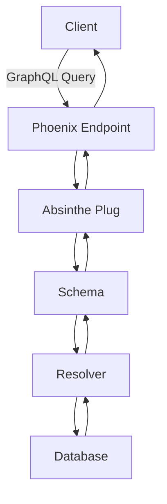

## 13.7. GraphQL APIs with Absinthe

In this section, we delve into the world of GraphQL APIs using Absinthe in Elixir. As expert software engineers and architects, understanding how to leverage GraphQL with Absinthe can significantly enhance the flexibility and efficiency of your API design. Let's explore the concepts, benefits, and practical implementation of GraphQL APIs with Absinthe.

### Introduction to GraphQL

GraphQL is a powerful query language for APIs and a runtime for executing those queries by using a type system you define for your data. It allows clients to request exactly the data they need, reducing over-fetching and under-fetching of data. This flexibility is particularly beneficial in modern web and mobile applications where bandwidth and performance are critical.

#### Key Features of GraphQL

- **Declarative Data Fetching**: Clients specify the structure of the response, ensuring they receive only the necessary data.
- **Strongly Typed Schema**: GraphQL APIs are defined by a schema that describes the types and relationships in your data.
- **Single Endpoint**: Unlike REST, which uses multiple endpoints, GraphQL uses a single endpoint to handle all requests.
- **Real-time Capabilities**: Supports subscriptions for real-time updates.

### Using Absinthe

Absinthe is a comprehensive toolkit for building GraphQL APIs in Elixir. It provides a robust set of features that integrate seamlessly with the Elixir ecosystem, allowing developers to build scalable and maintainable APIs.

#### Why Choose Absinthe?

- **Elixir Native**: Absinthe is built specifically for Elixir, leveraging its strengths in concurrency and fault tolerance.
- **Extensible**: Easily extendable with plugins and middleware to suit complex business logic.
- **Integration with Phoenix**: Absinthe integrates well with the Phoenix framework, making it ideal for web applications.
- **Comprehensive Documentation**: Well-documented with a supportive community.

### Benefits of GraphQL with Absinthe

- **Efficiency**: Reduces the amount of data transferred over the network by allowing clients to specify exactly what they need.
- **Flexibility**: Clients can evolve independently from the server, requesting new fields without requiring server changes.
- **Improved Developer Experience**: Strongly typed schemas and introspection capabilities make it easier to understand and use the API.

### Building a GraphQL API with Absinthe

Let's walk through the process of building a GraphQL API using Absinthe in Elixir. We'll cover setting up the project, defining schemas, creating resolvers, and integrating with Phoenix.

#### Setting Up the Project

First, ensure you have Elixir and Phoenix installed. Create a new Phoenix project with Absinthe:

```bash
mix phx.new my_graphql_app --no-html --no-webpack
cd my_graphql_app
```

Add Absinthe and its dependencies to your `mix.exs` file:

```elixir
defp deps do
  [
    {:phoenix, "~> 1.5.9"},
    {:phoenix_pubsub, "~> 2.0"},
    {:phoenix_ecto, "~> 4.1"},
    {:ecto_sql, "~> 3.4"},
    {:postgrex, ">= 0.0.0"},
    {:phoenix_live_dashboard, "~> 0.4"},
    {:telemetry_metrics, "~> 0.4"},
    {:telemetry_poller, "~> 0.4"},
    {:gettext, "~> 0.11"},
    {:jason, "~> 1.0"},
    {:plug_cowboy, "~> 2.0"},
    {:absinthe, "~> 1.6"},
    {:absinthe_plug, "~> 1.5"},
    {:absinthe_phoenix, "~> 2.0"}
  ]
end
```

Run `mix deps.get` to install the dependencies.

#### Defining the Schema

In GraphQL, the schema is the core of your API. It defines the types, queries, mutations, and subscriptions available. Create a new file `lib/my_graphql_app_web/schema.ex`:

```elixir
defmodule MyGraphqlAppWeb.Schema do
  use Absinthe.Schema

  query do
    field :hello, :string do
      resolve fn _, _ ->
        {:ok, "Hello, world!"}
      end
    end
  end
end
```

#### Creating Resolvers

Resolvers are functions that handle the logic for fetching data. They are associated with fields in your schema. Let's create a resolver for a simple query:

```elixir
defmodule MyGraphqlAppWeb.Resolvers.HelloResolver do
  def say_hello(_parent, _args, _resolution) do
    {:ok, "Hello, world!"}
  end
end
```

Update the schema to use the resolver:

```elixir
query do
  field :hello, :string do
    resolve &MyGraphqlAppWeb.Resolvers.HelloResolver.say_hello/3
  end
end
```

#### Integrating with Phoenix

To integrate Absinthe with Phoenix, update your router to handle GraphQL requests. In `lib/my_graphql_app_web/router.ex`, add:

```elixir
forward "/graphql", Absinthe.Plug, schema: MyGraphqlAppWeb.Schema
```

To enable a GraphQL playground for testing, add:

```elixir
forward "/graphiql", Absinthe.Plug.GraphiQL, schema: MyGraphqlAppWeb.Schema
```

### Advanced Features

Absinthe offers advanced features such as middleware, subscriptions, and custom scalars. Let's explore some of these features.

#### Middleware

Middleware allows you to modify the behavior of resolvers. For example, you can add authentication checks:

```elixir
defmodule MyGraphqlAppWeb.Middleware.Authentication do
  @behaviour Absinthe.Middleware

  def call(resolution, _config) do
    case resolution.context[:current_user] do
      nil -> resolution |> Absinthe.Resolution.put_result({:error, "Unauthorized"})
      _ -> resolution
    end
  end
end
```

Apply middleware to a field:

```elixir
field :protected_data, :string do
  middleware MyGraphqlAppWeb.Middleware.Authentication
  resolve &MyGraphqlAppWeb.Resolvers.DataResolver.get_data/3
end
```

#### Subscriptions

Subscriptions allow clients to receive real-time updates. Define a subscription in your schema:

```elixir
subscription do
  field :new_message, :message do
    config fn _, _ ->
      {:ok, topic: "messages"}
    end
  end
end
```

Publish events from your application:

```elixir
Absinthe.Subscription.publish(MyGraphqlAppWeb.Endpoint, message, new_message: "messages")
```

#### Custom Scalars

Define custom scalar types to handle specific data formats. For example, a `Date` scalar:

```elixir
defmodule MyGraphqlAppWeb.Schema.Scalars.Date do
  use Absinthe.Schema.Notation

  scalar :date, description: "ISO8601 date" do
    parse &parse_date/1
    serialize &serialize_date/1
  end

  defp parse_date(%Absinthe.Blueprint.Input.String{value: value}) do
    case Date.from_iso8601(value) do
      {:ok, date} -> {:ok, date}
      _ -> :error
    end
  end

  defp serialize_date(date) do
    Date.to_iso8601(date)
  end
end
```

### Visualizing GraphQL Architecture

To better understand how GraphQL with Absinthe fits into your application architecture, let's visualize the flow of a GraphQL request.



**Diagram Description:** This flowchart illustrates the journey of a GraphQL query from the client to the server and back. The client sends a query to the Phoenix endpoint, which is processed by the Absinthe plug. The schema directs the query to the appropriate resolver, which fetches data from the database and returns it to the client.

### Design Considerations

When designing GraphQL APIs with Absinthe, consider the following:

- **Schema Design**: Carefully design your schema to reflect the needs of your clients and the capabilities of your backend.
- **Performance**: Use batching and caching strategies to optimize performance.
- **Security**: Implement authentication and authorization to protect sensitive data.
- **Versioning**: Plan for schema evolution to accommodate changes without breaking clients.

### Elixir Unique Features

Elixir's concurrency model and fault tolerance make it an excellent choice for building robust GraphQL APIs. Absinthe leverages these features to provide a scalable and reliable API solution.

### Differences and Similarities with REST

While both GraphQL and REST are used for API development, they have distinct differences:

- **Data Fetching**: GraphQL allows clients to specify the exact data they need, while REST typically returns a fixed structure.
- **Endpoints**: GraphQL uses a single endpoint, whereas REST uses multiple endpoints for different resources.
- **Versioning**: GraphQL can evolve without breaking clients, while REST often requires versioning.

### Try It Yourself

Experiment with the code examples provided. Try adding new fields to the schema, creating custom resolvers, or implementing middleware for authentication. Explore the GraphQL playground to test your queries and see the results in real-time.

### Knowledge Check

- What are the benefits of using GraphQL over REST?
- How does Absinthe integrate with Phoenix?
- What is the role of resolvers in a GraphQL API?
- How can middleware be used to enhance resolver functionality?
- What are the advantages of using subscriptions in GraphQL?

### Embrace the Journey

Remember, building GraphQL APIs with Absinthe is just the beginning. As you progress, you'll discover more advanced features and techniques to optimize your API design. Keep experimenting, stay curious, and enjoy the journey!

## Quiz: GraphQL APIs with Absinthe



### What is the primary advantage of using GraphQL over REST?

- [x] Clients can request exactly the data they need
- [ ] GraphQL uses multiple endpoints
- [ ] REST is more flexible
- [ ] GraphQL requires versioning

> **Explanation:** GraphQL allows clients to specify the exact data they need, reducing over-fetching and under-fetching.

### How does Absinthe integrate with Phoenix?

- [x] Through the use of plugs in the router
- [ ] By replacing Phoenix controllers
- [ ] Using a separate server
- [ ] Through middleware only

> **Explanation:** Absinthe integrates with Phoenix by using plugs in the router to handle GraphQL requests.

### What is the role of a resolver in a GraphQL API?

- [x] To handle the logic for fetching data
- [ ] To define the schema
- [ ] To manage subscriptions
- [ ] To authenticate users

> **Explanation:** Resolvers are functions that handle the logic for fetching data in response to GraphQL queries.

### How can middleware be used in Absinthe?

- [x] To modify the behavior of resolvers
- [ ] To define new types
- [ ] To handle database connections
- [ ] To manage subscriptions

> **Explanation:** Middleware in Absinthe can be used to modify the behavior of resolvers, such as adding authentication checks.

### What is a benefit of using subscriptions in GraphQL?

- [x] Real-time updates to clients
- [ ] Simplified schema design
- [ ] Reduced server load
- [ ] Easier authentication

> **Explanation:** Subscriptions allow clients to receive real-time updates when data changes.

### What is a custom scalar in GraphQL?

- [x] A user-defined data type
- [ ] A default type provided by GraphQL
- [ ] A type used for authentication
- [ ] A type used for subscriptions

> **Explanation:** Custom scalars are user-defined data types that handle specific data formats in GraphQL.

### How does GraphQL handle versioning compared to REST?

- [x] GraphQL can evolve without breaking clients
- [ ] GraphQL requires explicit versioning
- [ ] REST does not require versioning
- [ ] GraphQL uses multiple endpoints for versioning

> **Explanation:** GraphQL can evolve without breaking clients by allowing clients to request only the fields they need.

### What is the purpose of the GraphQL schema?

- [x] To define the types and relationships in your data
- [ ] To handle authentication
- [ ] To manage database connections
- [ ] To optimize performance

> **Explanation:** The GraphQL schema defines the types and relationships in your data, forming the core of your API.

### How can you test GraphQL queries in Absinthe?

- [x] Using the GraphiQL playground
- [ ] By writing unit tests
- [ ] Through REST clients
- [ ] Using middleware

> **Explanation:** The GraphiQL playground is a tool for testing GraphQL queries and seeing the results in real-time.

### True or False: Absinthe is a toolkit for building REST APIs in Elixir.

- [ ] True
- [x] False

> **Explanation:** Absinthe is a toolkit for building GraphQL APIs in Elixir, not REST APIs.



By mastering GraphQL APIs with Absinthe, you can build efficient, flexible, and scalable APIs that meet the demands of modern applications. Keep exploring and refining your skills to stay at the forefront of API development.
