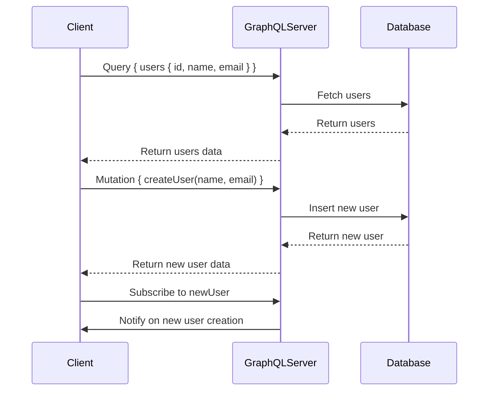

## 13.7. GraphQL APIs with Absinthe

In today's fast-paced digital world, building efficient and flexible APIs is crucial. GraphQL, a query language for APIs, has emerged as a powerful tool for developers to provide clients with the exact data they need, without over-fetching or under-fetching. In this section, we'll explore how to leverage GraphQL in Elixir using Absinthe, a robust toolkit designed for building GraphQL APIs in Elixir.

### Introduction to GraphQL

GraphQL, developed by Facebook in 2012 and released publicly in 2015, is a query language and runtime for APIs that allows clients to request only the data they need. Unlike REST, where endpoints return fixed data structures, GraphQL enables clients to specify the shape and size of the data returned. This flexibility reduces the problems of over-fetching and under-fetching, common in traditional REST APIs.

#### Key Concepts of GraphQL

- **Schema**: Defines the types and relationships in your API. It's a contract between the client and server.
- **Queries**: Allow clients to request specific data. Clients can specify exactly what they need, and the server returns precisely that.
- **Mutations**: Enable clients to modify data on the server. They are similar to queries but are used for creating, updating, or deleting data.
- **Resolvers**: Functions that handle fetching the data for a particular field in a schema.
- **Subscriptions**: Allow clients to receive real-time updates from the server.

### Using Absinthe

Absinthe is a comprehensive toolkit for building GraphQL APIs in Elixir. It integrates seamlessly with the Phoenix framework, making it a popular choice for Elixir developers. Absinthe is designed to be idiomatic to Elixir, leveraging its strengths in concurrency and fault tolerance.

#### Key Features of Absinthe

- **Schema Definition**: Absinthe provides a DSL for defining GraphQL schemas in Elixir.
- **Resolvers**: Absinthe allows you to define resolvers in a flexible manner, enabling efficient data fetching.
- **Middleware**: Supports middleware functions for modifying behavior of resolvers.
- **Subscriptions**: Built-in support for GraphQL subscriptions, leveraging Elixir's strengths in handling real-time data.
- **Integration with Phoenix**: Absinthe integrates well with Phoenix, providing tools for building robust web applications.

### Benefits of GraphQL with Absinthe

Using GraphQL with Absinthe offers several advantages:

- **Reduced Over-fetching and Under-fetching**: Clients can request exactly what they need, reducing bandwidth and improving performance.
- **Improved Client Flexibility**: Clients have more control over the data they receive, allowing for more dynamic applications.
- **Strong Typing**: GraphQL's strong typing system helps catch errors early in development.
- **Real-time Capabilities**: With subscriptions, clients can receive updates in real-time, enhancing user experience.
- **Scalability**: Absinthe's design leverages Elixir's concurrency model, making it suitable for high-load applications.

### Building a GraphQL API with Absinthe

Let's dive into building a GraphQL API using Absinthe. We'll go through setting up a basic API, defining a schema, implementing queries and mutations, and adding subscriptions for real-time updates.

#### Setting Up a New Phoenix Project with Absinthe

First, ensure you have Elixir and Phoenix installed. Create a new Phoenix project:

```bash
mix phx.new my_graphql_app --no-html --no-webpack
cd my_graphql_app
```

Add Absinthe and Absinthe Phoenix to your `mix.exs` file:

```elixir
defp deps do
  [
    {:phoenix, "~> 1.5.9"},
    {:phoenix_pubsub, "~> 2.0"},
    {:phoenix_ecto, "~> 4.1"},
    {:ecto_sql, "~> 3.4"},
    {:postgrex, ">= 0.0.0"},
    {:phoenix_live_dashboard, "~> 0.4"},
    {:telemetry_metrics, "~> 0.4"},
    {:telemetry_poller, "~> 0.4"},
    {:gettext, "~> 0.11"},
    {:jason, "~> 1.0"},
    {:plug_cowboy, "~> 2.0"},
    {:absinthe, "~> 1.6"},
    {:absinthe_plug, "~> 1.5"},
    {:absinthe_phoenix, "~> 2.0"}
  ]
end
```

Run `mix deps.get` to fetch the dependencies.

#### Defining the GraphQL Schema

Create a new schema module in `lib/my_graphql_app_web/schema.ex`:

```elixir
defmodule MyGraphqlAppWeb.Schema do
  use Absinthe.Schema

  query do
    field :hello, :string do
      resolve fn _, _ ->
        {:ok, "world"}
      end
    end
  end
end
```

This simple schema defines a query `hello` that returns the string "world".

#### Setting Up the GraphQL Endpoint

In `lib/my_graphql_app_web/router.ex`, add a new route for the GraphQL endpoint:

```elixir
scope "/api" do
  pipe_through :api

  forward "/graphql", Absinthe.Plug,
    schema: MyGraphqlAppWeb.Schema

  if Mix.env() == :dev do
    forward "/graphiql", Absinthe.Plug.GraphiQL,
      schema: MyGraphqlAppWeb.Schema,
      interface: :simple
  end
end
```

This sets up the `/api/graphql` endpoint for GraphQL requests and `/api/graphiql` for the GraphiQL interface in development.

#### Implementing Queries

Let's expand our schema with a more complex query. Assume we have a `User` model in our application. We can define a query to fetch users:

```elixir
defmodule MyGraphqlAppWeb.Schema do
  use Absinthe.Schema

  alias MyGraphqlApp.Accounts

  query do
    field :users, list_of(:user) do
      resolve &Accounts.list_users/2
    end
  end

  object :user do
    field :id, :id
    field :name, :string
    field :email, :string
  end
end
```

In this example, `Accounts.list_users/2` is a resolver function that fetches a list of users from the database.

#### Implementing Mutations

Mutations allow clients to modify data. Let's add a mutation to create a new user:

```elixir
mutation do
  field :create_user, :user do
    arg :name, non_null(:string)
    arg :email, non_null(:string)

    resolve &Accounts.create_user/2
  end
end
```

The `create_user/2` function in the `Accounts` module handles the logic for creating a new user.

#### Adding Subscriptions

Subscriptions enable real-time updates. Let's add a subscription for new users:

```elixir
subscription do
  field :new_user, :user do
    config fn _, _ ->
      {:ok, topic: "users"}
    end

    trigger :create_user, topic: fn _user ->
      "users"
    end
  end
end
```

This subscription listens for the `create_user` mutation and notifies clients of new users.

### Visualizing GraphQL with Mermaid.js

To better understand the flow of GraphQL queries, mutations, and subscriptions, let's visualize it with a Mermaid.js sequence diagram:


```mermaid
sequenceDiagram
    participant Client
    participant GraphQLServer
    participant Database

    Client->>GraphQLServer: Query { users { id, name, email } }
    GraphQLServer->>Database: Fetch users
    Database-->>GraphQLServer: Return users
    GraphQLServer-->>Client: Return users data

    Client->>GraphQLServer: Mutation { createUser(name, email) }
    GraphQLServer->>Database: Insert new user
    Database-->>GraphQLServer: Return new user
    GraphQLServer-->>Client: Return new user data

    Client->>GraphQLServer: Subscribe to newUser
    GraphQLServer->>Client: Notify on new user creation
```

### Best Practices for GraphQL APIs with Absinthe

- **Schema Design**: Design your schema carefully. It should be intuitive and reflect the needs of your clients.
- **Efficient Resolvers**: Write efficient resolvers to minimize database queries and improve performance.
- **Authorization**: Implement authorization logic in resolvers to ensure data security.
- **Error Handling**: Use Absinthe's error handling features to provide meaningful error messages to clients.
- **Testing**: Write tests for your GraphQL API to ensure reliability and prevent regressions.

### Try It Yourself

Experiment with the code examples provided. Here are some suggestions:

- **Modify the Schema**: Add new fields or types to the schema and see how it affects the queries.
- **Optimize Resolvers**: Experiment with different ways to optimize resolvers for performance.
- **Add More Subscriptions**: Implement additional subscriptions for other events in your application.

### References and Further Reading

- [GraphQL Official Documentation](https://graphql.org/learn/)
- [Absinthe GraphQL Toolkit](https://hexdocs.pm/absinthe/overview.html)
- [Phoenix Framework](https://hexdocs.pm/phoenix/overview.html)

### Knowledge Check

- **What is the primary advantage of using GraphQL over REST?**
- **How does Absinthe leverage Elixir's strengths in concurrency?**
- **What are the key components of a GraphQL schema?**

### Embrace the Journey

Remember, building GraphQL APIs with Absinthe is just the beginning. As you continue to explore and experiment, you'll discover new ways to enhance your applications. Keep learning, stay curious, and enjoy the journey!

## Quiz Time!



### What is the main benefit of using GraphQL over REST?

- [x] Clients can request exactly the data they need
- [ ] It is faster than REST
- [ ] It uses less bandwidth
- [ ] It is easier to implement

> **Explanation:** The primary advantage of GraphQL is that it allows clients to request exactly the data they need, reducing over-fetching and under-fetching.

### What does Absinthe provide for building GraphQL APIs in Elixir?

- [x] A schema definition DSL
- [x] Middleware support
- [x] Integration with Phoenix
- [ ] Built-in database support

> **Explanation:** Absinthe provides a schema definition DSL, middleware support, and integration with Phoenix, but it does not include built-in database support.

### What is a resolver in GraphQL?

- [x] A function that fetches data for a field
- [ ] A type definition in the schema
- [ ] A query that modifies data
- [ ] A subscription handler

> **Explanation:** A resolver is a function that fetches the data for a particular field in a GraphQL schema.

### How do subscriptions work in Absinthe?

- [x] They allow clients to receive real-time updates
- [ ] They cache query results
- [ ] They optimize database queries
- [ ] They handle authentication

> **Explanation:** Subscriptions in Absinthe allow clients to receive real-time updates from the server.

### What is the role of middleware in Absinthe?

- [x] Modifying behavior of resolvers
- [ ] Handling database connections
- [ ] Defining schema types
- [ ] Managing subscriptions

> **Explanation:** Middleware in Absinthe is used to modify the behavior of resolvers, such as adding authorization checks.

### Which of the following is a key component of a GraphQL schema?

- [x] Types
- [x] Queries
- [x] Mutations
- [ ] Controllers

> **Explanation:** A GraphQL schema consists of types, queries, and mutations, but not controllers.

### What is the purpose of the `forward` function in Phoenix router?

- [x] To route requests to a specific endpoint
- [ ] To define middleware
- [ ] To handle errors
- [ ] To manage subscriptions

> **Explanation:** The `forward` function in Phoenix router is used to route requests to a specific endpoint, such as the GraphQL endpoint.

### How can you test a GraphQL API built with Absinthe?

- [x] Using ExUnit and Absinthe's test helpers
- [ ] Using only manual testing
- [ ] Using a separate testing framework
- [ ] Without any tests

> **Explanation:** You can test a GraphQL API built with Absinthe using ExUnit and Absinthe's test helpers.

### What is the role of the `trigger` function in subscriptions?

- [x] To specify events that trigger a subscription
- [ ] To handle errors in queries
- [ ] To manage database connections
- [ ] To define schema types

> **Explanation:** The `trigger` function in subscriptions specifies the events that will trigger the subscription notifications.

### True or False: Absinthe can only be used with the Phoenix framework.

- [ ] True
- [x] False

> **Explanation:** False. While Absinthe integrates well with Phoenix, it can be used independently or with other frameworks.


