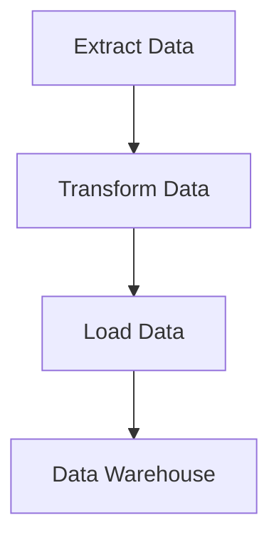

## 13.8. Batch Processing and ETL Pipelines

In the realm of data engineering, **Batch Processing** and **ETL (Extract, Transform, Load) Pipelines** are fundamental concepts for moving and transforming data between systems. As data continues to grow exponentially, the need for efficient and scalable data processing solutions becomes paramount. Elixir, with its robust concurrency model and functional programming paradigm, offers powerful tools to implement these processes effectively. In this section, we will delve into the intricacies of batch processing and ETL pipelines in Elixir, exploring how to leverage GenStage, Flow, and Quantum for efficient data handling.

### Extract, Transform, Load (ETL)

ETL is a process that involves extracting data from various sources, transforming it into a format suitable for analysis, and loading it into a destination system, such as a data warehouse. This process is crucial for integrating data from disparate sources and making it accessible for business intelligence and analytics.

#### Extract

The extraction phase involves retrieving data from different sources, which could be databases, APIs, or flat files. The challenge here is to handle diverse data formats and ensure data consistency.

#### Transform

Transformation is the core of the ETL process, where data is cleansed, enriched, and converted into a desired format. This phase may involve filtering, aggregating, and joining data from multiple sources.

#### Load

The final phase is loading the transformed data into a target system, such as a data warehouse or a data lake. This step requires ensuring data integrity and optimizing for performance.

### Implementing ETL in Elixir

Elixir provides several libraries and tools to implement ETL processes efficiently. Two of the most prominent libraries are **GenStage** and **Flow**. These libraries leverage Elixir's concurrency model to handle large volumes of data in a scalable manner.

#### GenStage

**GenStage** is a library for building data processing pipelines. It provides a framework for defining stages that can produce, consume, and transform data. GenStage is particularly useful for implementing backpressure, ensuring that data producers do not overwhelm consumers.

```elixir
defmodule DataProducer do
  use GenStage

  def start_link(initial) do
    GenStage.start_link(__MODULE__, initial, name: __MODULE__)
  end

  def init(initial) do
    {:producer, initial}
  end

  def handle_demand(demand, state) do
    events = Enum.to_list(state..(state + demand - 1))
    {:noreply, events, state + demand}
  end
end

defmodule DataConsumer do
  use GenStage

  def start_link() do
    GenStage.start_link(__MODULE__, :ok, name: __MODULE__)
  end

  def init(:ok) do
    {:consumer, :ok}
  end

  def handle_events(events, _from, state) do
    Enum.each(events, fn event ->
      IO.inspect(event, label: "Consumed")
    end)
    {:noreply, [], state}
  end
end

{:ok, producer} = DataProducer.start_link(0)
{:ok, consumer} = DataConsumer.start_link()

GenStage.sync_subscribe(consumer, to: producer)
```

In this example, we define a simple producer-consumer pipeline using GenStage. The `DataProducer` generates a sequence of numbers, while the `DataConsumer` processes these numbers.

#### Flow

**Flow** builds on top of GenStage to provide a higher-level abstraction for parallel data processing. It is designed for processing large datasets efficiently by leveraging multiple cores.

```elixir
alias Experimental.Flow

Flow.from_enumerable(1..1000)
|> Flow.map(&(&1 * 2))
|> Flow.filter(&rem(&1, 3) == 0)
|> Flow.partition()
|> Flow.reduce(fn -> 0 end, &(&1 + &2))
|> Enum.to_list()
```

In this example, we use Flow to process a range of numbers. We double each number, filter out those not divisible by 3, and then sum the results. Flow automatically manages parallel execution and partitioning of data.

### Scheduling Jobs

Batch processing often involves scheduling jobs to run at specific intervals. Elixir provides the **Quantum** library for job scheduling, allowing you to define cron-like schedules for executing tasks.

#### Quantum

Quantum is a powerful job scheduler for Elixir, enabling you to run tasks at specified times or intervals. It supports cron expressions and provides a flexible API for managing jobs.

```elixir
defmodule MyApp.Scheduler do
  use Quantum, otp_app: :my_app
end

config :my_app, MyApp.Scheduler,
  jobs: [
    {"* * * * *", fn -> IO.puts("Running every minute") end},
    {"@daily", fn -> IO.puts("Running daily") end}
  ]
```

In this example, we configure Quantum to run a job every minute and another job daily. The `MyApp.Scheduler` module uses Quantum to manage these jobs.

### Visualizing ETL Pipelines

To better understand the flow of data through an ETL pipeline, let's visualize a simple pipeline using a Mermaid.js flowchart.



This diagram represents a basic ETL pipeline, where data is extracted, transformed, and loaded into a data warehouse.

### Key Considerations for ETL in Elixir

- **Concurrency**: Leverage Elixir's concurrency model to handle large volumes of data efficiently.
- **Backpressure**: Use GenStage to implement backpressure, ensuring that data producers do not overwhelm consumers.
- **Scalability**: Design your ETL pipelines to scale horizontally by distributing workloads across multiple nodes.
- **Error Handling**: Implement robust error handling to manage failures gracefully and ensure data integrity.
- **Monitoring**: Use tools like Telemetry to monitor the performance and health of your ETL pipelines.

### Elixir Unique Features

Elixir's unique features, such as its actor model and lightweight processes, make it an ideal choice for implementing ETL pipelines. The language's emphasis on immutability and functional programming ensures that data transformations are predictable and side-effect-free.

### Differences and Similarities

While GenStage and Flow are both used for data processing, they serve different purposes. GenStage provides a low-level framework for building custom data processing pipelines, while Flow offers a higher-level abstraction for parallel data processing. Understanding the differences between these libraries will help you choose the right tool for your specific use case.

### Try It Yourself

To deepen your understanding of ETL pipelines in Elixir, try modifying the code examples provided. Experiment with different data sources, transformations, and load targets. Consider integrating external data sources, such as APIs or databases, into your pipeline.

### Knowledge Check

- How does GenStage handle backpressure in data processing pipelines?
- What are the key differences between GenStage and Flow?
- How can Quantum be used to schedule ETL jobs in Elixir?

### Embrace the Journey

Remember, mastering ETL pipelines in Elixir is a journey. As you progress, you'll build more complex and efficient data processing solutions. Keep experimenting, stay curious, and enjoy the process!

## Quiz: Batch Processing and ETL Pipelines



### What is the primary purpose of an ETL pipeline?

- [x] To extract, transform, and load data between systems
- [ ] To encrypt data for secure transmission
- [ ] To generate reports from data
- [ ] To store data in a database

> **Explanation:** ETL pipelines are designed to extract data from various sources, transform it into a suitable format, and load it into a destination system.

### Which Elixir library is used for building data processing pipelines with backpressure?

- [x] GenStage
- [ ] Quantum
- [ ] Ecto
- [ ] Phoenix

> **Explanation:** GenStage is a library for building data processing pipelines in Elixir, providing backpressure mechanisms to manage data flow.

### How does Flow differ from GenStage in Elixir?

- [x] Flow provides a higher-level abstraction for parallel data processing
- [ ] Flow is used for scheduling jobs
- [ ] Flow is a database library
- [ ] Flow is a web framework

> **Explanation:** Flow builds on top of GenStage to offer a higher-level abstraction for parallel data processing, making it easier to work with large datasets.

### What is the role of Quantum in Elixir?

- [x] To schedule jobs at specified times or intervals
- [ ] To manage database connections
- [ ] To handle HTTP requests
- [ ] To generate random numbers

> **Explanation:** Quantum is a job scheduler for Elixir, allowing you to define cron-like schedules for executing tasks.

### Which phase of the ETL process involves cleansing and enriching data?

- [ ] Extract
- [x] Transform
- [ ] Load
- [ ] Analyze

> **Explanation:** The transformation phase involves cleansing, enriching, and converting data into a desired format.

### What is a key benefit of using Elixir for ETL pipelines?

- [x] Concurrency and scalability
- [ ] Built-in machine learning algorithms
- [ ] Native support for JavaScript
- [ ] Automatic UI generation

> **Explanation:** Elixir's concurrency model and lightweight processes make it well-suited for handling large volumes of data efficiently.

### How can you visualize an ETL pipeline in Elixir?

- [x] Using a flowchart with Mermaid.js
- [ ] By writing SQL queries
- [ ] Through a web interface
- [ ] By using a spreadsheet

> **Explanation:** Mermaid.js can be used to create flowcharts that visually represent the flow of data through an ETL pipeline.

### What is the purpose of backpressure in data processing?

- [x] To prevent data producers from overwhelming consumers
- [ ] To increase data processing speed
- [ ] To encrypt data
- [ ] To store data in memory

> **Explanation:** Backpressure mechanisms ensure that data producers do not overwhelm consumers, maintaining a balanced data flow.

### Which Elixir feature ensures that data transformations are predictable and side-effect-free?

- [x] Immutability
- [ ] Dynamic typing
- [ ] Object-oriented programming
- [ ] Global variables

> **Explanation:** Elixir's emphasis on immutability ensures that data transformations are predictable and free from side effects.

### True or False: GenStage can be used to implement both producers and consumers in a data processing pipeline.

- [x] True
- [ ] False

> **Explanation:** GenStage provides a framework for defining stages that can act as producers, consumers, or both in a data processing pipeline.



By understanding and implementing batch processing and ETL pipelines in Elixir, you can build robust, scalable data processing solutions that meet the demands of modern data-driven applications. Keep exploring and refining your skills to harness the full potential of Elixir in your data engineering endeavors.
