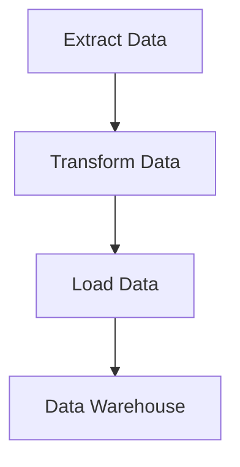

## 13.8. Batch Processing and ETL Pipelines

In the realm of data engineering, **Batch Processing and ETL (Extract, Transform, Load) Pipelines** are crucial for moving and transforming data between systems. This section delves into how you can leverage Elixir's powerful concurrency model and functional programming paradigm to efficiently implement these processes. We'll explore using tools like GenStage, Flow, and Quantum to build scalable and maintainable ETL pipelines.

### Understanding Batch Processing and ETL

Before diving into implementation, let's clarify what batch processing and ETL entail:

- **Batch Processing**: This involves processing large volumes of data in batches, rather than one at a time. It's typically used for tasks that don't require immediate feedback, such as data aggregation, reporting, and system backups.

- **ETL (Extract, Transform, Load)**: This is a data integration process that involves:
  - **Extracting** data from various sources.
  - **Transforming** it into a suitable format or structure for analysis.
  - **Loading** it into a target system, such as a data warehouse.

These processes are essential for data warehousing, business intelligence, and analytics applications. 

### Implementing ETL in Elixir

Elixir, with its robust concurrency model and functional programming features, provides several tools for implementing ETL pipelines efficiently. Here, we'll focus on GenStage and Flow, which are designed for building data processing pipelines.

#### GenStage

**GenStage** is a specification for exchanging events between producers and consumers. It allows you to build concurrent and distributed data processing pipelines. Here's how it works:

- **Producer**: Generates data and sends it downstream.
- **Consumer**: Receives and processes data from upstream.
- **ProducerConsumer**: Acts as both a producer and consumer, transforming data as it passes through.

Let's see a simple example of a GenStage pipeline:

```elixir
defmodule MyProducer do
  use GenStage

  def start_link(initial) do
    GenStage.start_link(__MODULE__, initial, name: __MODULE__)
  end

  def init(initial) do
    {:producer, initial}
  end

  def handle_demand(demand, state) when demand > 0 do
    events = Enum.take(state, demand)
    {:noreply, events, state -- events}
  end
end

defmodule MyConsumer do
  use GenStage

  def start_link() do
    GenStage.start_link(__MODULE__, :ok, name: __MODULE__)
  end

  def init(:ok) do
    {:consumer, :the_state_does_not_matter}
  end

  def handle_events(events, _from, state) do
    for event <- events do
      IO.inspect(event)
    end
    {:noreply, [], state}
  end
end

{:ok, producer} = MyProducer.start_link(Enum.to_list(1..100))
{:ok, consumer} = MyConsumer.start_link()

GenStage.sync_subscribe(consumer, to: producer)
```

In this example, `MyProducer` generates a list of numbers, and `MyConsumer` prints them. This simple setup demonstrates the basic producer-consumer relationship in GenStage.

#### Flow

**Flow** builds on top of GenStage to provide a higher-level abstraction for data processing. It introduces concepts like partitioning and parallel processing, making it ideal for large-scale data processing tasks.

Here's how you can use Flow for ETL:

```elixir
alias Experimental.Flow

data = 1..1000

flow = Flow.from_enumerable(data)
|> Flow.map(&(&1 * 2))
|> Flow.filter(&rem(&1, 2) == 0)

Flow.run(flow)
```

In this example, we create a flow from an enumerable, double each number, and filter out odd numbers. Flow automatically handles partitioning and parallel processing, making it efficient for large datasets.

### Scheduling Jobs with Quantum

For batch processing and ETL pipelines, scheduling is often a critical component. **Quantum** is a powerful Elixir library for job scheduling, similar to cron jobs but with more flexibility and features.

Here's how to set up a simple scheduled task with Quantum:

1. Add Quantum to your `mix.exs` dependencies:

```elixir
defp deps do
  [
    {:quantum, "~> 3.0"}
  ]
end
```

2. Configure a job in your application's config file:

```elixir
config :my_app, MyApp.Scheduler,
  jobs: [
    {"* * * * *", {MyApp.Task, :run, []}}
  ]
```

3. Define the task to be run:

```elixir
defmodule MyApp.Task do
  def run do
    IO.puts("Running scheduled task...")
  end
end
```

This setup will print "Running scheduled task..." every minute. Quantum supports complex scheduling scenarios and is highly customizable.

### Visualizing ETL Pipelines

To better understand ETL pipelines, let's visualize a simple pipeline using Mermaid.js:


```mermaid
flowchart TD
    A[Extract Data] --> B[Transform Data]
    B --> C[Load Data]
    C --> D[Data Warehouse]
```

In this diagram:
- **Extract Data**: Represents the process of retrieving data from sources.
- **Transform Data**: Involves cleaning, normalizing, and structuring data.
- **Load Data**: Refers to inserting the transformed data into a target system.

### Key Considerations for ETL in Elixir

When implementing ETL pipelines in Elixir, consider the following:

- **Concurrency**: Leverage Elixir's concurrency model to handle large volumes of data efficiently.
- **Fault Tolerance**: Use OTP principles to ensure your pipelines are resilient to failures.
- **Scalability**: Design your pipelines to scale horizontally by distributing workloads across multiple nodes.
- **Monitoring**: Implement logging and monitoring to track the performance and health of your pipelines.

### Elixir's Unique Features for ETL

Elixir offers several unique features that make it well-suited for ETL:

- **Immutable Data Structures**: Ensure data consistency and safety across concurrent processes.
- **Pattern Matching**: Simplifies data transformation logic.
- **Lightweight Processes**: Efficiently manage thousands of concurrent tasks.

### Differences and Similarities with Other Languages

Elixir's approach to ETL shares similarities with other functional languages like Scala and Clojure but stands out with its emphasis on concurrency and fault tolerance. Unlike Java or Python, Elixir's lightweight processes and OTP framework provide a more robust foundation for building resilient ETL pipelines.

### Try It Yourself

To deepen your understanding, try modifying the examples provided:

- Experiment with different data transformations in the Flow example.
- Schedule more complex tasks with Quantum, such as invoking an external API or updating a database.

### Knowledge Check

- How does GenStage facilitate data processing in Elixir?
- What are the benefits of using Flow over GenStage?
- How can Quantum enhance your ETL pipeline?

Remember, mastering ETL in Elixir is a journey. As you experiment and build more complex pipelines, you'll gain a deeper understanding of Elixir's capabilities. Stay curious and keep pushing the boundaries of what's possible with Elixir!

## Quiz Time!



### What is the primary role of GenStage in Elixir?

- [x] To facilitate event-driven data processing by connecting producers and consumers.
- [ ] To provide a graphical interface for data processing.
- [ ] To replace the need for databases in ETL pipelines.
- [ ] To perform data encryption and security.

> **Explanation:** GenStage is designed to enable event-driven data processing by connecting producers and consumers in a pipeline.

### Which Elixir library provides a higher-level abstraction on top of GenStage for data processing?

- [x] Flow
- [ ] Quantum
- [ ] Ecto
- [ ] Phoenix

> **Explanation:** Flow is built on top of GenStage and provides a higher-level abstraction for data processing, including parallelism and partitioning.

### What is the purpose of Quantum in Elixir?

- [x] To schedule jobs and tasks similarly to cron jobs.
- [ ] To handle database migrations.
- [ ] To manage user authentication.
- [ ] To perform real-time data analytics.

> **Explanation:** Quantum is used for scheduling jobs and tasks, offering flexibility similar to cron jobs.

### In an ETL pipeline, what does the "Transform" step involve?

- [x] Cleaning, normalizing, and structuring data.
- [ ] Retrieving data from various sources.
- [ ] Loading data into a target system.
- [ ] Encrypting data for security.

> **Explanation:** The "Transform" step involves cleaning, normalizing, and structuring data to make it suitable for analysis.

### What is a key benefit of using Elixir for ETL pipelines?

- [x] Concurrency and fault tolerance.
- [ ] Built-in machine learning capabilities.
- [ ] Native support for all database types.
- [ ] Automatic data visualization.

> **Explanation:** Elixir's concurrency model and fault tolerance make it well-suited for building robust ETL pipelines.

### How does Flow handle large datasets efficiently?

- [x] By automatically partitioning and parallel processing data.
- [ ] By using a single-threaded approach.
- [ ] By storing data in memory.
- [ ] By compressing data before processing.

> **Explanation:** Flow automatically partitions and processes data in parallel, making it efficient for handling large datasets.

### Which of the following is NOT a step in a typical ETL process?

- [x] Encrypt
- [ ] Extract
- [ ] Transform
- [ ] Load

> **Explanation:** The typical ETL process involves Extract, Transform, and Load, but not Encrypt.

### What is the role of pattern matching in Elixir's ETL pipelines?

- [x] Simplifies data transformation logic.
- [ ] Automatically encrypts data.
- [ ] Schedules tasks for execution.
- [ ] Visualizes data flow.

> **Explanation:** Pattern matching in Elixir simplifies the logic needed for data transformation in ETL pipelines.

### Which of the following is a unique feature of Elixir that benefits ETL pipelines?

- [x] Lightweight processes
- [ ] Built-in GUI support
- [ ] Native JavaScript execution
- [ ] Automatic data encryption

> **Explanation:** Elixir's lightweight processes allow for efficient management of concurrent tasks, benefiting ETL pipelines.

### True or False: Elixir's immutable data structures ensure data consistency across concurrent processes.

- [x] True
- [ ] False

> **Explanation:** Elixir's immutable data structures help ensure data consistency and safety when processes run concurrently.


