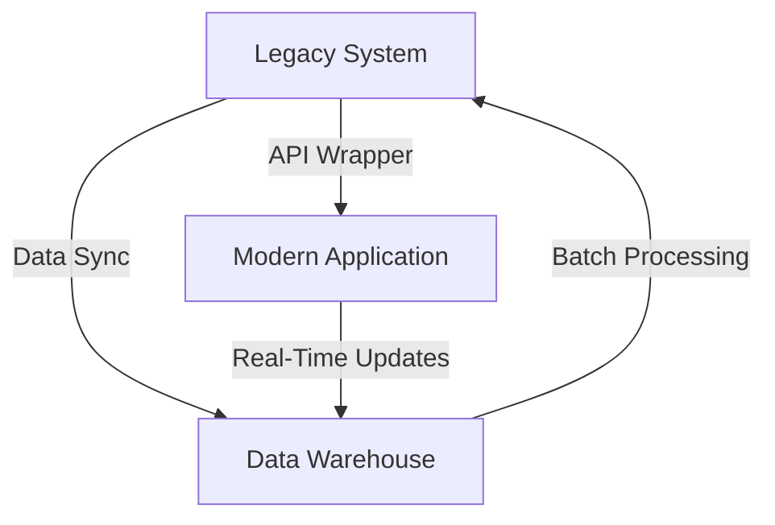

## 13.9. Handling Legacy Systems

In the ever-evolving landscape of software development, dealing with legacy systems is a common challenge faced by expert software engineers and architects. Legacy systems, while often critical to business operations, can become bottlenecks due to outdated technologies, protocols, and data formats. This section explores strategies for integrating and modernizing legacy systems using Elixir, addressing challenges, and ensuring seamless transitions.

### Understanding Legacy Systems

Legacy systems are older software applications or platforms that continue to be used within an organization. They are often built on outdated technologies but remain integral to business operations. These systems can be challenging to maintain and integrate with modern applications due to their age, lack of documentation, and reliance on obsolete technologies.

#### Characteristics of Legacy Systems

- **Outdated Technologies**: Often built using older programming languages and frameworks.
- **Limited Documentation**: Documentation may be sparse or outdated, making maintenance difficult.
- **Critical to Operations**: Despite their age, they are often mission-critical and cannot be easily replaced.
- **Monolithic Architecture**: Many legacy systems are monolithic, making them difficult to modify or scale.

### Integration Strategies

Integrating legacy systems with modern applications is crucial for maintaining business continuity while leveraging new technologies. Here are some strategies to consider:

#### Wrapping Legacy Systems with APIs

One effective way to integrate legacy systems is by wrapping them with APIs. This approach involves creating a modern interface that allows new applications to interact with the legacy system without altering its core functionality.

- **Benefits**: 
  - Provides a standardized interface for interaction.
  - Enables gradual modernization by decoupling the legacy system from new applications.
  - Facilitates data exchange and interoperability.

- **Implementation Steps**:
  1. **Identify Key Functions**: Determine which functions of the legacy system need to be exposed via the API.
  2. **Design the API**: Create a RESTful or GraphQL API that encapsulates the legacy system's functionality.
  3. **Develop the Wrapper**: Implement the API wrapper using Elixir, leveraging its concurrency and fault-tolerance features.
  4. **Test and Deploy**: Ensure the API functions correctly and deploy it to production.

```elixir
defmodule LegacyWrapper do
  use Plug.Router

  plug :match
  plug :dispatch

  get "/legacy-data" do
    # Fetch data from the legacy system
    data = LegacySystem.get_data()
    send_resp(conn, 200, Jason.encode!(data))
  end

  # Additional routes and logic for interacting with the legacy system
end
```

#### Data Synchronization

Data synchronization involves keeping data consistent between the legacy system and new applications. This can be achieved through batch processing or real-time synchronization.

- **Batch Processing**: Periodically transfer data between systems, suitable for non-time-sensitive data.
- **Real-Time Synchronization**: Use message queues or event-driven architectures to update data in real-time.

```elixir
defmodule DataSync do
  @moduledoc """
  Module for synchronizing data between legacy and modern systems.
  """

  def sync_data do
    # Fetch data from the legacy system
    legacy_data = LegacySystem.fetch_data()

    # Transform and send data to the modern system
    transformed_data = transform_data(legacy_data)
    ModernSystem.update_data(transformed_data)
  end

  defp transform_data(data) do
    # Logic for transforming legacy data to modern format
  end
end
```

### Challenges in Handling Legacy Systems

Dealing with legacy systems presents several challenges that need to be addressed to ensure successful integration and modernization.

#### Outdated Protocols and Data Formats

Legacy systems often use outdated protocols and data formats that are incompatible with modern applications. This requires conversion or translation layers to facilitate communication.

- **Solution**: Implement protocol converters or data format translators to bridge the gap between legacy and modern systems.

```elixir
defmodule ProtocolConverter do
  @moduledoc """
  Module for converting legacy protocols to modern formats.
  """

  def convert_legacy_to_modern(legacy_data) do
    # Conversion logic
  end
end
```

#### Limited Scalability

Legacy systems are often monolithic and not designed for scalability. This can hinder the ability to handle increased loads or integrate with scalable architectures.

- **Solution**: Use Elixir's concurrency model to offload processing tasks and improve scalability.

```elixir
defmodule ScalableWrapper do
  use GenServer

  def start_link(_) do
    GenServer.start_link(__MODULE__, %{}, name: __MODULE__)
  end

  def handle_call(:process, _from, state) do
    # Offload processing to a separate process
    Task.start(fn -> process_data() end)
    {:reply, :ok, state}
  end

  defp process_data do
    # Processing logic
  end
end
```

### Gradual Replacement

Phasing out legacy components without disrupting operations is a critical aspect of modernization. A gradual replacement strategy allows for a smooth transition to new systems.

#### Steps for Gradual Replacement

1. **Assess the Legacy System**: Evaluate the current system to identify components that need replacement.
2. **Prioritize Components**: Determine which components are most critical and should be replaced first.
3. **Develop New Components**: Build new components using modern technologies and architectures.
4. **Integrate and Test**: Integrate new components with the legacy system and conduct thorough testing.
5. **Deploy Incrementally**: Deploy new components incrementally to minimize disruption.
6. **Monitor and Optimize**: Continuously monitor the system and optimize as needed.

```elixir
defmodule ModernComponent do
  @moduledoc """
  New component to replace legacy functionality.
  """

  def perform_task do
    # New implementation of the task
  end
end
```

### Visualizing the Integration Process

To better understand the integration process, let's visualize the flow of data and interactions between legacy and modern systems.



**Diagram Description**: The diagram illustrates the integration process where the legacy system is wrapped with an API to interact with modern applications. Data synchronization occurs between the legacy system and a data warehouse, with real-time updates flowing to modern applications.

### Elixir's Unique Features for Handling Legacy Systems

Elixir offers several unique features that make it well-suited for handling legacy systems:

- **Concurrency and Fault Tolerance**: Elixir's lightweight processes and fault-tolerant design enable efficient handling of concurrent tasks and error recovery.
- **Pattern Matching and Guards**: These features simplify data transformation and protocol conversion tasks.
- **Supervision Trees**: Ensure system reliability by managing process lifecycles and recovery.

### Differences and Similarities with Other Patterns

Handling legacy systems shares similarities with other integration patterns, such as the Adapter and Facade patterns. However, it is distinct in its focus on modernizing and replacing outdated systems rather than merely adapting interfaces.

### Design Considerations

When handling legacy systems, consider the following:

- **Compatibility**: Ensure new components are compatible with existing systems.
- **Performance**: Optimize for performance to handle increased loads.
- **Security**: Address security vulnerabilities in legacy systems during integration.

### Try It Yourself

Experiment with the provided code examples by modifying them to suit your specific legacy system integration needs. Consider adding additional routes to the API wrapper or implementing custom data transformation logic.

### Knowledge Check

- What are the key characteristics of legacy systems?
- How can APIs be used to integrate legacy systems with modern applications?
- What challenges are associated with outdated protocols and data formats?
- Describe the steps involved in a gradual replacement strategy.

### Embrace the Journey

Handling legacy systems is a complex but rewarding task. By leveraging Elixir's unique features and following best practices, you can successfully integrate and modernize legacy systems, ensuring they continue to support business operations while embracing new technologies. Remember, this is just the beginning. As you progress, you'll build more robust and scalable systems. Keep experimenting, stay curious, and enjoy the journey!

## Quiz: Handling Legacy Systems



### What is a common characteristic of legacy systems?

- [x] Outdated technologies
- [ ] Modern architecture
- [ ] High scalability
- [ ] Extensive documentation

> **Explanation:** Legacy systems are often built on outdated technologies and may lack modern architectural features.

### How can APIs help in integrating legacy systems?

- [x] By providing a standardized interface
- [ ] By replacing the legacy system
- [ ] By increasing system complexity
- [ ] By reducing system security

> **Explanation:** APIs provide a standardized interface that allows modern applications to interact with legacy systems without altering their core functionality.

### What is a challenge when dealing with outdated protocols?

- [x] Incompatibility with modern applications
- [ ] Increased system security
- [ ] Simplified data exchange
- [ ] Enhanced scalability

> **Explanation:** Outdated protocols may be incompatible with modern applications, requiring conversion or translation layers.

### What is the first step in a gradual replacement strategy?

- [x] Assess the legacy system
- [ ] Deploy new components
- [ ] Monitor the system
- [ ] Optimize performance

> **Explanation:** The first step is to assess the legacy system to identify components that need replacement.

### Which Elixir feature aids in handling concurrent tasks?

- [x] Concurrency and fault tolerance
- [ ] Monolithic architecture
- [ ] Outdated protocols
- [ ] Limited documentation

> **Explanation:** Elixir's concurrency model and fault-tolerant design enable efficient handling of concurrent tasks.

### What is a benefit of wrapping legacy systems with APIs?

- [x] Enables gradual modernization
- [ ] Increases system complexity
- [ ] Reduces system security
- [ ] Replaces the legacy system

> **Explanation:** Wrapping legacy systems with APIs enables gradual modernization by decoupling them from new applications.

### How can data synchronization be achieved?

- [x] Through batch processing or real-time synchronization
- [ ] By ignoring data consistency
- [ ] By using outdated protocols
- [ ] By reducing data exchange

> **Explanation:** Data synchronization can be achieved through batch processing or real-time synchronization to keep data consistent.

### What is a key consideration when handling legacy systems?

- [x] Compatibility with existing systems
- [ ] Ignoring performance
- [ ] Reducing security
- [ ] Increasing system complexity

> **Explanation:** Ensuring compatibility with existing systems is crucial when handling legacy systems.

### What does the diagram illustrate in the integration process?

- [x] The flow of data and interactions between legacy and modern systems
- [ ] The replacement of the legacy system
- [ ] The elimination of data synchronization
- [ ] The reduction of system security

> **Explanation:** The diagram illustrates the flow of data and interactions between legacy and modern systems, highlighting the integration process.

### True or False: Elixir's pattern matching simplifies data transformation tasks.

- [x] True
- [ ] False

> **Explanation:** Elixir's pattern matching and guards simplify data transformation and protocol conversion tasks.


