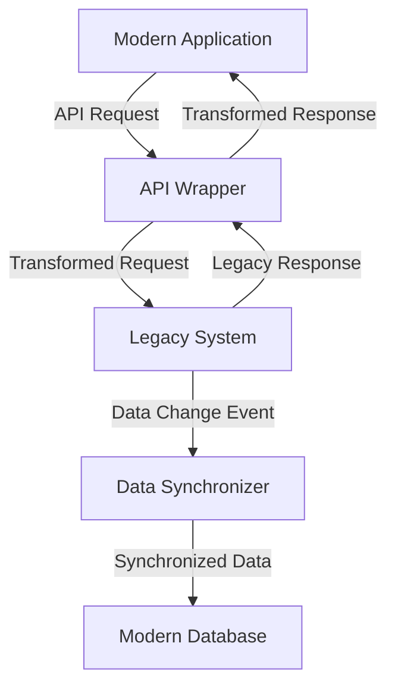

## 13.9. Handling Legacy Systems

Integrating legacy systems into modern architectures is a common challenge faced by software engineers and architects. Legacy systems often run on outdated protocols and data formats, yet they are critical to business operations. In this section, we will explore how Elixir can be leveraged to effectively handle legacy systems, focusing on integration strategies, challenges, and gradual replacement.

### 1. Understanding Legacy Systems

Legacy systems are often defined by their age, outdated technology stack, or lack of flexibility. They might be built on obsolete hardware or software, use deprecated programming languages, or rely on antiquated protocols. Despite these shortcomings, legacy systems are often mission-critical, making their integration into modern architectures a complex but necessary task.

### 2. Integration Strategies

#### 2.1. Wrapping Legacy Systems with APIs

One of the most effective ways to integrate legacy systems is by wrapping them with modern APIs. This approach involves creating a layer that translates modern requests into a format that the legacy system can understand and process.

- **Benefits**: 
  - **Abstraction**: APIs abstract the complexities of the legacy system, providing a clean interface for modern applications.
  - **Decoupling**: By using APIs, the legacy system is decoupled from the rest of the architecture, allowing for independent evolution.
  - **Security**: APIs can enforce security measures that the legacy system might lack.

- **Implementation in Elixir**:
  - Use Elixir's `Plug` library to create HTTP APIs that communicate with the legacy system.
  - Implement data transformation logic within the API to handle the conversion between modern and legacy data formats.

```elixir
defmodule LegacyAPI do
  use Plug.Router

  plug :match
  plug :dispatch

  get "/legacy_data" do
    # Fetch data from the legacy system
    legacy_data = LegacySystem.fetch_data()
    # Transform data to modern format
    modern_data = transform_to_modern_format(legacy_data)
    send_resp(conn, 200, modern_data)
  end

  defp transform_to_modern_format(legacy_data) do
    # Implement transformation logic
  end
end
```

#### 2.2. Data Synchronization

Data synchronization involves keeping data consistent across the legacy system and modern applications. This can be achieved through batch processing or real-time synchronization.

- **Batch Processing**: Periodically extract data from the legacy system, transform it, and load it into the modern system.
- **Real-Time Synchronization**: Use message queues or event streams to propagate changes from the legacy system to the modern system as they occur.

- **Implementation in Elixir**:
  - Use `GenStage` or `Flow` for real-time data processing and synchronization.
  - Employ `Ecto` for batch data extraction and transformation.

```elixir
defmodule DataSynchronizer do
  use GenStage

  def start_link(_) do
    GenStage.start_link(__MODULE__, :ok, name: __MODULE__)
  end

  def init(:ok) do
    {:consumer, :ok, subscribe_to: [LegacyDataProducer]}
  end

  def handle_events(events, _from, state) do
    # Process and synchronize events
    Enum.each(events, &synchronize_event/1)
    {:noreply, [], state}
  end

  defp synchronize_event(event) do
    # Implement synchronization logic
  end
end
```

### 3. Challenges

#### 3.1. Dealing with Outdated Protocols

Legacy systems may use outdated protocols that are not supported by modern technologies. This requires creating adapters or converters to bridge the gap.

- **Solution**: Use Elixir's interoperability with Erlang to leverage existing libraries or create custom protocol converters.

#### 3.2. Handling Obsolete Data Formats

Legacy systems might store data in obsolete formats that need to be converted to modern formats for integration.

- **Solution**: Implement data transformation layers using Elixir's pattern matching and functional programming capabilities.

### 4. Gradual Replacement

Phasing out legacy components without disrupting operations is a delicate process. It involves gradually replacing parts of the legacy system with modern components.

#### 4.1. Strangler Fig Pattern

The Strangler Fig Pattern involves building a new system around the legacy system, gradually replacing its functionality until the legacy system can be decommissioned.

- **Implementation in Elixir**:
  - Use Elixir's `Phoenix` framework to build new components.
  - Gradually redirect traffic from the legacy system to the new components.

```elixir
defmodule NewComponent do
  use Phoenix.Router

  # Define routes for new functionality
  get "/new_feature", NewFeatureController, :index
end
```

#### 4.2. Incremental Data Migration

Incremental data migration involves moving data from the legacy system to the new system in phases, ensuring that both systems remain operational during the transition.

- **Implementation in Elixir**:
  - Use `Ecto` for data migration, leveraging its support for multiple database connections.
  - Implement data validation and transformation logic to ensure data integrity.

```elixir
defmodule DataMigrator do
  alias MyApp.Repo
  alias MyApp.LegacyRepo

  def migrate_data do
    legacy_data = LegacyRepo.all(LegacyModel)
    Enum.each(legacy_data, &migrate_record/1)
  end

  defp migrate_record(legacy_record) do
    # Transform and insert data into the new system
    new_record = transform_record(legacy_record)
    Repo.insert!(new_record)
  end

  defp transform_record(legacy_record) do
    # Implement transformation logic
  end
end
```

### 5. Design Considerations

- **Scalability**: Ensure that the integration solution can handle increased loads as the system evolves.
- **Fault Tolerance**: Implement robust error handling and recovery mechanisms to maintain system stability.
- **Performance**: Optimize data transformation and synchronization processes to minimize latency.

### 6. Elixir Unique Features

- **Concurrency**: Leverage Elixir's lightweight processes for efficient data synchronization and transformation.
- **Fault Tolerance**: Utilize OTP's supervision trees to build resilient integration solutions.
- **Interoperability**: Take advantage of Elixir's seamless integration with Erlang to access a wide range of libraries and tools.

### 7. Differences and Similarities

- **Similar Patterns**: The Adapter Pattern is similar to API wrapping, as both involve creating a layer to translate between systems.
- **Distinct Patterns**: The Strangler Fig Pattern is distinct in its focus on gradually replacing legacy systems, rather than simply integrating them.

### 8. Visualizing Legacy System Integration

Below is a diagram illustrating the integration of a legacy system using API wrapping and data synchronization.


```mermaid
graph TD;
    A[Modern Application] -->|API Request| B[API Wrapper];
    B -->|Transformed Request| C[Legacy System];
    C -->|Legacy Response| B;
    B -->|Transformed Response| A;
    C -->|Data Change Event| D[Data Synchronizer];
    D -->|Synchronized Data| E[Modern Database];
```

**Diagram Description**: This flowchart illustrates the interaction between a modern application and a legacy system. The API Wrapper serves as an intermediary, translating requests and responses. Data changes in the legacy system are synchronized with the modern database through the Data Synchronizer.

### 9. Knowledge Check

- **Question**: What are the benefits of wrapping legacy systems with APIs?
- **Exercise**: Implement a simple API wrapper in Elixir for a hypothetical legacy system that returns data in XML format.

### 10. Embrace the Journey

Integrating legacy systems is a challenging but rewarding task. As you work through these strategies, remember that each step brings you closer to a more modern and efficient architecture. Keep experimenting, stay curious, and enjoy the journey!

### 11. References and Links

- [Elixir Lang](https://elixir-lang.org/)
- [Phoenix Framework](https://www.phoenixframework.org/)
- [Ecto](https://hexdocs.pm/ecto/Ecto.html)
- [GenStage](https://hexdocs.pm/gen_stage/GenStage.html)

## Quiz Time!



### What is one benefit of wrapping legacy systems with APIs?

- [x] Abstraction of complexities
- [ ] Increased coupling
- [ ] Reduced security
- [ ] Direct database access

> **Explanation:** Wrapping legacy systems with APIs abstracts the complexities of the legacy system, providing a clean interface for modern applications.

### Which Elixir library can be used for real-time data synchronization?

- [x] GenStage
- [ ] Plug
- [ ] Ecto
- [ ] Phoenix

> **Explanation:** GenStage is used for real-time data processing and synchronization in Elixir.

### What is the Strangler Fig Pattern?

- [x] A pattern for gradually replacing legacy systems
- [ ] A pattern for direct database access
- [ ] A pattern for increasing coupling
- [ ] A pattern for data encryption

> **Explanation:** The Strangler Fig Pattern involves building a new system around the legacy system, gradually replacing its functionality.

### What is a challenge of dealing with outdated protocols?

- [x] Lack of support by modern technologies
- [ ] Increased security
- [ ] Simplified data formats
- [ ] Enhanced performance

> **Explanation:** Outdated protocols may not be supported by modern technologies, requiring adapters or converters.

### How can Elixir's concurrency model benefit legacy system integration?

- [x] Efficient data synchronization
- [ ] Increased coupling
- [ ] Reduced fault tolerance
- [ ] Direct hardware access

> **Explanation:** Elixir's lightweight processes allow for efficient data synchronization and transformation.

### Which pattern is similar to API wrapping?

- [x] Adapter Pattern
- [ ] Singleton Pattern
- [ ] Observer Pattern
- [ ] Strategy Pattern

> **Explanation:** The Adapter Pattern is similar to API wrapping, as both involve creating a layer to translate between systems.

### What is a key consideration in designing integration solutions?

- [x] Scalability
- [ ] Increased complexity
- [ ] Reduced security
- [ ] Direct database access

> **Explanation:** Scalability is crucial to ensure that the integration solution can handle increased loads as the system evolves.

### What Elixir feature supports fault tolerance in integration solutions?

- [x] OTP supervision trees
- [ ] Direct hardware access
- [ ] Increased coupling
- [ ] Simplified data formats

> **Explanation:** OTP supervision trees are used to build resilient integration solutions in Elixir.

### What is a common data synchronization method?

- [x] Batch processing
- [ ] Direct database access
- [ ] Increased coupling
- [ ] Simplified data formats

> **Explanation:** Batch processing involves periodically extracting data from the legacy system, transforming it, and loading it into the modern system.

### Elixir's interoperability with which language can aid in handling outdated protocols?

- [x] Erlang
- [ ] Python
- [ ] JavaScript
- [ ] Ruby

> **Explanation:** Elixir's interoperability with Erlang allows access to a wide range of libraries and tools, aiding in handling outdated protocols.




