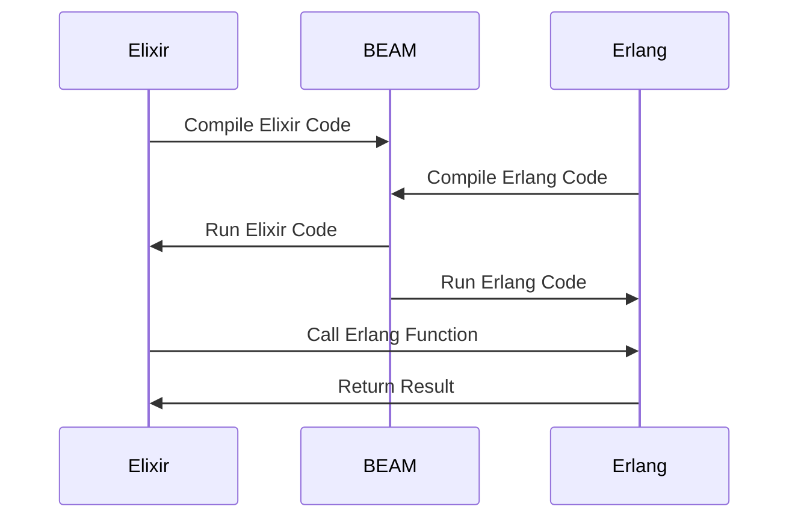

## 14.1. Interoperability with Erlang

In the world of functional programming, Elixir and Erlang stand out as powerful languages that run on the BEAM (Bogdan/Björn's Erlang Abstract Machine) virtual machine. This shared VM provides a unique opportunity for interoperability between the two languages, allowing developers to leverage the strengths of both. In this section, we will explore how Elixir and Erlang can work together seamlessly, the benefits of this interoperability, and practical use cases for integrating Erlang modules into Elixir applications.

### Shared VM: Running Elixir and Erlang Code Together

The BEAM VM is the cornerstone of both Elixir and Erlang, providing a robust platform for building concurrent, distributed, and fault-tolerant systems. This shared foundation allows Elixir and Erlang code to coexist and interact within the same runtime environment. Let's delve into how this interoperability is achieved and the advantages it offers.

#### Understanding the BEAM VM

The BEAM VM is designed to support highly concurrent applications with minimal overhead. It provides lightweight processes, garbage collection, and a message-passing model that is ideal for building scalable systems. By running on the BEAM, both Elixir and Erlang inherit these capabilities, making them well-suited for applications that require high availability and resilience.

#### Seamless Integration

One of the key benefits of the shared VM is the ability to call Erlang functions directly from Elixir and vice versa. This seamless integration is made possible by the fact that both languages compile down to the same bytecode, allowing them to share data structures and communicate efficiently.

#### Code Example: Calling Erlang from Elixir

Let's look at a simple example of calling an Erlang module from Elixir. Suppose we have an Erlang module `math_utils` with a function `add/2`:

```erlang
-module(math_utils).
-export([add/2]).

add(A, B) ->
    A + B.
```

We can call this function from Elixir as follows:

```elixir
defmodule MathExample do
  def add_numbers(a, b) do
    :math_utils.add(a, b)
  end
end

IO.puts MathExample.add_numbers(5, 3) # Output: 8
```

In this example, we use the `:` prefix to denote the Erlang module and call the `add/2` function directly. This demonstrates how easily Elixir can leverage existing Erlang code.

#### Benefits of Shared VM

- **Resource Sharing**: Elixir and Erlang can share resources such as memory and processes, reducing overhead and improving performance.
- **Code Reuse**: Developers can reuse existing Erlang libraries and tools in Elixir applications, saving time and effort.
- **Unified Ecosystem**: The shared VM fosters a unified ecosystem where tools and libraries can be developed for both languages.

### Calling Erlang Modules: Accessing Erlang Functionality from Elixir

Elixir's interoperability with Erlang extends beyond simple function calls. Developers can access a wide range of Erlang functionality, from standard libraries to third-party packages. This section will explore how to call Erlang modules and the benefits of doing so.

#### Accessing Erlang Libraries

Erlang has a rich set of libraries that have been developed and tested over decades. By accessing these libraries from Elixir, developers can leverage mature solutions for common problems such as networking, cryptography, and data processing.

#### Code Example: Using Erlang's `:crypto` Module

The `:crypto` module in Erlang provides a comprehensive set of cryptographic functions. Let's see how we can use it in an Elixir application:

```elixir
defmodule CryptoExample do
  def hash_password(password) do
    :crypto.hash(:sha256, password)
    |> Base.encode16()
  end
end

IO.puts CryptoExample.hash_password("my_secret_password")
```

In this example, we use the `:crypto.hash/2` function to compute a SHA-256 hash of a password and then encode it in hexadecimal format using Elixir's `Base` module.

#### Interfacing with Erlang Processes

Elixir can also interact with Erlang processes, enabling developers to build distributed systems that take advantage of Erlang's robust process model. This is particularly useful for applications that require high concurrency and fault tolerance.

#### Code Example: Sending Messages to Erlang Processes

Suppose we have an Erlang process that listens for messages and responds with a greeting:

```erlang
-module(greeter).
-behaviour(gen_server).

-export([start_link/0, init/1, handle_call/3]).

start_link() ->
    gen_server:start_link({local, ?MODULE}, ?MODULE, [], []).

init([]) ->
    {ok, []}.

handle_call({greet, Name}, _From, State) ->
    {reply, {ok, "Hello, " ++ Name ++ "!"}, State}.
```

We can send a message to this process from Elixir:

```elixir
defmodule GreeterClient do
  def greet(name) do
    {:ok, pid} = :greeter.start_link()
    :gen_server.call(pid, {:greet, name})
  end
end

IO.puts GreeterClient.greet("Alice") # Output: Hello, Alice!
```

In this example, we start the Erlang `greeter` process and use `:gen_server.call/2` to send a message and receive a response.

### Use Cases: Leveraging Mature Erlang Libraries and Tools

The interoperability between Elixir and Erlang opens up a wide range of use cases where developers can leverage mature Erlang libraries and tools. Let's explore some practical scenarios where this integration can be beneficial.

#### Networking and Communication

Erlang's `:gen_tcp` and `:gen_udp` modules provide powerful tools for building networked applications. By using these modules in Elixir, developers can create robust communication systems with minimal effort.

#### Code Example: Building a TCP Server

```elixir
defmodule TcpServer do
  def start(port) do
    {:ok, socket} = :gen_tcp.listen(port, [:binary, packet: :line, active: false, reuseaddr: true])
    loop_acceptor(socket)
  end

  defp loop_acceptor(socket) do
    {:ok, client} = :gen_tcp.accept(socket)
    spawn(fn -> handle_client(client) end)
    loop_acceptor(socket)
  end

  defp handle_client(client) do
    client
    |> :gen_tcp.recv(0)
    |> handle_message(client)
  end

  defp handle_message({:ok, message}, client) do
    IO.puts("Received message: #{message}")
    :gen_tcp.send(client, "Echo: #{message}")
    handle_client(client)
  end

  defp handle_message({:error, _reason}, _client), do: :ok
end

TcpServer.start(4000)
```

This example demonstrates how to build a simple TCP server in Elixir using Erlang's `:gen_tcp` module. The server listens for incoming connections, spawns a new process for each client, and echoes received messages back to the client.

#### Distributed Systems

Erlang's distributed capabilities are well-known, and Elixir can take full advantage of them. By using Erlang's distribution features, developers can build scalable systems that span multiple nodes.

#### Code Example: Connecting Elixir Nodes

```elixir
defmodule NodeConnector do
  def connect_nodes(node1, node2) do
    Node.connect(node1)
    Node.connect(node2)
  end
end

NodeConnector.connect_nodes(:"node1@localhost", :"node2@localhost")
```

In this example, we use Elixir's `Node` module to connect two nodes, enabling them to communicate and share resources.

#### Fault Tolerance and Supervision

Erlang's OTP (Open Telecom Platform) provides a robust framework for building fault-tolerant applications. Elixir can leverage OTP's supervision trees to create resilient systems that can recover from failures automatically.

#### Code Example: Creating a Supervisor

```elixir
defmodule MyApp.Supervisor do
  use Supervisor

  def start_link(init_arg) do
    Supervisor.start_link(__MODULE__, init_arg, name: __MODULE__)
  end

  def init(_init_arg) do
    children = [
      {MyApp.Worker, []}
    ]

    Supervisor.init(children, strategy: :one_for_one)
  end
end
```

This example shows how to create a simple supervisor in Elixir that manages a worker process. The supervisor will restart the worker if it crashes, ensuring the application's reliability.

### Visualizing Elixir and Erlang Interoperability

To better understand how Elixir and Erlang work together on the BEAM VM, let's visualize the interaction between the two languages using a sequence diagram.



This diagram illustrates the process of compiling and running Elixir and Erlang code on the BEAM VM. It also shows how Elixir can call Erlang functions and receive results, highlighting the seamless interoperability between the two languages.

### Key Takeaways

- **Shared VM**: Elixir and Erlang run on the same BEAM VM, allowing them to share resources and communicate efficiently.
- **Calling Erlang Modules**: Elixir can access a wide range of Erlang functionality, from standard libraries to third-party packages.
- **Use Cases**: Interoperability enables developers to leverage mature Erlang libraries and tools for networking, distributed systems, and fault tolerance.

### Try It Yourself

To deepen your understanding of Elixir and Erlang interoperability, try modifying the code examples provided in this section. Experiment with calling different Erlang modules from Elixir and explore how you can integrate Erlang's powerful features into your Elixir applications.

### Further Reading

For more information on Elixir and Erlang interoperability, check out the following resources:

- [Elixir Official Documentation](https://elixir-lang.org/docs.html)
- [Erlang Official Documentation](https://erlang.org/doc/)
- [Programming Elixir ≥ 1.6](https://pragprog.com/titles/elixir16/programming-elixir-1-6/)
- [Learn You Some Erlang for Great Good!](http://learnyousomeerlang.com/)

## Quiz: Interoperability with Erlang



### What is the BEAM VM?

- [x] A virtual machine that runs both Elixir and Erlang code
- [ ] A compiler for Elixir code
- [ ] A library for Erlang
- [ ] A tool for debugging Elixir applications

> **Explanation:** The BEAM VM is the virtual machine that runs both Elixir and Erlang code, providing a shared runtime environment.

### How can Elixir call an Erlang function?

- [x] By using the `:` prefix to denote the Erlang module
- [ ] By importing the Erlang module into Elixir
- [ ] By converting Erlang code to Elixir
- [ ] By using a special Elixir library

> **Explanation:** Elixir can call an Erlang function by using the `:` prefix to denote the Erlang module, allowing direct access to Erlang functionality.

### What is a benefit of Elixir and Erlang running on the same VM?

- [x] Resource sharing and improved performance
- [ ] Easier debugging of Elixir code
- [ ] Automatic code conversion between Elixir and Erlang
- [ ] Simplified syntax for both languages

> **Explanation:** Running on the same VM allows Elixir and Erlang to share resources, reducing overhead and improving performance.

### Which Erlang module provides cryptographic functions?

- [x] `:crypto`
- [ ] `:ssl`
- [ ] `:gen_tcp`
- [ ] `:os`

> **Explanation:** The `:crypto` module in Erlang provides a comprehensive set of cryptographic functions.

### How can Elixir interact with Erlang processes?

- [x] By sending messages using `:gen_server.call/2`
- [ ] By converting Elixir processes to Erlang processes
- [ ] By using a special Elixir library
- [ ] By importing Erlang processes into Elixir

> **Explanation:** Elixir can interact with Erlang processes by sending messages using `:gen_server.call/2`, enabling communication between the two languages.

### What is a use case for Elixir and Erlang interoperability?

- [x] Leveraging mature Erlang libraries for networking
- [ ] Simplifying Elixir syntax
- [ ] Automatically converting Erlang code to Elixir
- [ ] Debugging Elixir applications

> **Explanation:** Interoperability allows developers to leverage mature Erlang libraries for networking and other use cases.

### What is the purpose of a supervisor in Elixir?

- [x] To manage and restart worker processes
- [ ] To compile Elixir code
- [ ] To convert Erlang code to Elixir
- [ ] To debug Elixir applications

> **Explanation:** A supervisor in Elixir is used to manage and restart worker processes, ensuring the application's reliability.

### How can Elixir connect to other nodes?

- [x] By using the `Node` module
- [ ] By importing node connections
- [ ] By converting nodes to Elixir processes
- [ ] By using a special Elixir library

> **Explanation:** Elixir can connect to other nodes using the `Node` module, enabling communication and resource sharing.

### What is the `:gen_tcp` module used for?

- [x] Building TCP servers and clients
- [ ] Encrypting data
- [ ] Debugging Elixir applications
- [ ] Compiling Erlang code

> **Explanation:** The `:gen_tcp` module in Erlang is used for building TCP servers and clients, providing tools for network communication.

### True or False: Elixir and Erlang can share data structures on the BEAM VM.

- [x] True
- [ ] False

> **Explanation:** True. Elixir and Erlang can share data structures on the BEAM VM, allowing efficient communication and resource sharing.



Remember, this is just the beginning. As you progress, you'll discover more ways to harness the power of Elixir and Erlang together. Keep experimenting, stay curious, and enjoy the journey!
