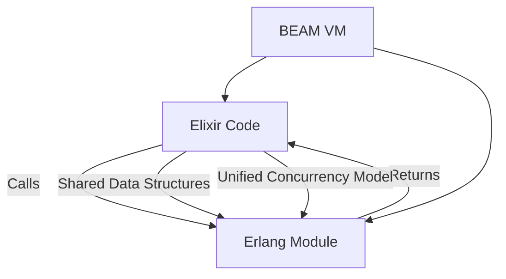

## 14.1. Interoperability with Erlang

Elixir and Erlang share a unique relationship, both running on the BEAM VM, which allows them to interoperate seamlessly. This interoperability is a significant advantage for developers, enabling them to leverage the strengths of both languages. In this section, we will explore how Elixir can interact with Erlang, the benefits of doing so, and practical examples to illustrate these concepts.

### Shared VM

One of the most compelling features of Elixir is its ability to run alongside Erlang on the BEAM VM. This shared virtual machine provides a robust environment for concurrent, fault-tolerant, and distributed applications. Let's delve into how this shared VM enables interoperability.

#### Running Elixir and Erlang Code Together

The BEAM VM is designed to support multiple languages, with Elixir and Erlang being the most prominent. This shared environment means that both languages can call each other's functions and use each other's libraries without any additional overhead.

- **Seamless Function Calls**: Elixir can call Erlang functions directly and vice versa. This seamless interaction is possible because both languages compile down to the same bytecode, which the BEAM VM executes.

- **Shared Data Structures**: Both languages use the same data structures, such as lists, tuples, and maps, allowing data to be passed between Elixir and Erlang without conversion.

- **Unified Concurrency Model**: The concurrency model, based on lightweight processes, is shared between Elixir and Erlang, enabling processes written in either language to communicate effortlessly.

#### Code Example: Calling Erlang from Elixir

Let's consider a simple example where we call an Erlang module from Elixir. Suppose we have an Erlang module `math_utils` with a function `add/2`:

```erlang
%% math_utils.erl
-module(math_utils).
-export([add/2]).

add(A, B) ->
    A + B.
```

We can call this Erlang function from Elixir as follows:

```elixir
# elixir_example.exs
defmodule ElixirExample do
  def add_numbers(a, b) do
    :math_utils.add(a, b)
  end
end

# Usage
IO.puts ElixirExample.add_numbers(3, 5) # Output: 8
```

**Explanation**: In the Elixir code, we use the Erlang module name prefixed with a colon (`:`) to call the `add/2` function. This demonstrates the ease of calling Erlang functions from Elixir.

### Calling Erlang Modules

Elixir's ability to call Erlang modules is one of its standout features. This capability allows developers to access a wealth of mature libraries and tools developed in Erlang over the years.

#### Accessing Erlang Functionality

To call an Erlang function from Elixir, you need to know the module and function names, as well as the arity (number of arguments) of the function. The syntax is straightforward:

```elixir
:module_name.function_name(arg1, arg2, ...)
```

#### Example: Using the `:crypto` Module

Erlang's `:crypto` module provides cryptographic functions that can be used in Elixir. Here's an example of using the `:crypto` module to generate a hash:

```elixir
defmodule CryptoExample do
  def sha256_hash(data) do
    :crypto.hash(:sha256, data)
    |> Base.encode16()
  end
end

# Usage
IO.puts CryptoExample.sha256_hash("Hello, Elixir!") # Output: SHA256 hash of the string
```

**Explanation**: In this example, we call the `hash/2` function from the `:crypto` module to generate a SHA256 hash of the input data. We then encode the binary result to a hexadecimal string using `Base.encode16/1`.

### Use Cases

The interoperability between Elixir and Erlang opens up numerous possibilities for developers. Here are some common use cases:

#### Leveraging Mature Erlang Libraries

Erlang has been around for decades, and its ecosystem includes many mature and battle-tested libraries. By calling Erlang modules from Elixir, developers can leverage these libraries without having to reinvent the wheel.

- **Networking**: Use Erlang's `:gen_tcp` and `:gen_udp` for low-level networking.

- **Database Connectivity**: Access databases using Erlang drivers, such as `:epgsql` for PostgreSQL.

- **Cryptography**: Utilize the `:crypto` module for encryption and hashing.

#### Enhancing Elixir Applications

By integrating Erlang libraries, Elixir applications can be enhanced with additional functionality and performance optimizations.

- **Performance**: Erlang's libraries are often highly optimized, providing performance benefits.

- **Stability**: Mature Erlang libraries have been tested extensively, offering stability and reliability.

### Visualizing Elixir and Erlang Interoperability

To better understand how Elixir and Erlang interact on the BEAM VM, let's visualize this relationship using a diagram.


```mermaid
graph TD;
    A[Elixir Code] -->|Calls| B[Erlang Module];
    B -->|Returns| A;
    C[BEAM VM] --> A;
    C --> B;
    A -->|Shared Data Structures| B;
    A -->|Unified Concurrency Model| B;
```

**Description**: This diagram illustrates the interaction between Elixir and Erlang on the BEAM VM. Both languages can call each other's modules, share data structures, and use the same concurrency model.

### Practical Examples

Let's explore some practical examples to solidify our understanding of Elixir and Erlang interoperability.

#### Example 1: Using Erlang's `:timer` Module

The `:timer` module in Erlang provides functions for working with time. We can use it to create a simple timer in Elixir:

```elixir
defmodule TimerExample do
  def start_timer(milliseconds) do
    :timer.sleep(milliseconds)
    IO.puts "Timer finished!"
  end
end

# Usage
TimerExample.start_timer(2000) # Waits for 2 seconds, then prints "Timer finished!"
```

**Explanation**: In this example, we use the `:timer.sleep/1` function from Erlang to pause execution for a specified number of milliseconds.

#### Example 2: Integrating with Erlang's `:gen_server`

Erlang's `:gen_server` is a generic server behavior that can be used to implement server processes. We can leverage this in Elixir to create a simple server:

```elixir
defmodule SimpleServer do
  use GenServer

  # Client API
  def start_link(initial_state) do
    GenServer.start_link(__MODULE__, initial_state, name: __MODULE__)
  end

  def get_state do
    GenServer.call(__MODULE__, :get_state)
  end

  # Server Callbacks
  def init(initial_state) do
    {:ok, initial_state}
  end

  def handle_call(:get_state, _from, state) do
    {:reply, state, state}
  end
end

# Usage
{:ok, _pid} = SimpleServer.start_link(42)
IO.puts SimpleServer.get_state() # Output: 42
```

**Explanation**: This example demonstrates how to use Elixir's `GenServer` to create a server process that can maintain state and respond to client requests.

### Design Considerations

When integrating Erlang with Elixir, consider the following design aspects:

- **Compatibility**: Ensure that the Erlang libraries you use are compatible with the version of the BEAM VM you are running.

- **Error Handling**: Handle errors gracefully when calling Erlang functions, as they may have different error semantics compared to Elixir.

- **Performance**: While Erlang libraries are often optimized, consider the performance implications of integrating them into your Elixir application.

### Elixir Unique Features

Elixir provides several unique features that enhance its interoperability with Erlang:

- **Macros and Metaprogramming**: Use Elixir's metaprogramming capabilities to create DSLs that wrap Erlang libraries, making them easier to use.

- **Pipe Operator**: Leverage Elixir's pipe operator to create more readable code when chaining calls to Erlang functions.

### Differences and Similarities

While Elixir and Erlang share many similarities, there are also differences to be aware of:

- **Syntax**: Elixir's syntax is more modern and Ruby-like, while Erlang uses a more traditional syntax.

- **Tooling**: Elixir provides additional tooling, such as `Mix` for project management and `ExUnit` for testing, which are not present in Erlang.

- **Community**: Both languages have active communities, but Elixir's community is often more focused on web development and modern application architectures.

### Try It Yourself

Now that we've covered the basics of Elixir and Erlang interoperability, try modifying the examples provided. Experiment with calling different Erlang modules and functions from Elixir. Consider creating a small project that integrates multiple Erlang libraries to see how they can enhance your Elixir application.

### References and Further Reading

- [Erlang Documentation](https://www.erlang.org/docs)
- [Elixir Documentation](https://elixir-lang.org/docs.html)
- [BEAM VM Overview](https://www.erlang.org/doc/system_architecture_intro/sys_arch_intro.html)

### Knowledge Check

- What are the benefits of running Elixir and Erlang on the same VM?
- How can you call an Erlang function from Elixir?
- What are some common use cases for integrating Erlang libraries into Elixir applications?

### Embrace the Journey

Interoperability with Erlang is just one of the many powerful features of Elixir. As you continue to explore this relationship, you'll discover new ways to leverage the strengths of both languages. Keep experimenting, stay curious, and enjoy the journey!

## Quiz Time!



### What is a key benefit of Elixir and Erlang running on the same VM?

- [x] Seamless function calls between the two languages
- [ ] Separate data structures for each language
- [ ] Different concurrency models
- [ ] Incompatible bytecode

> **Explanation:** Elixir and Erlang can call each other's functions seamlessly because they run on the same BEAM VM and share the same bytecode.

### How do you call an Erlang function from Elixir?

- [x] Using the colon (`:`) syntax followed by the module and function name
- [ ] Using a special Elixir library
- [ ] By converting the Erlang code to Elixir
- [ ] By running a separate Erlang VM

> **Explanation:** In Elixir, you call an Erlang function using the colon (`:`) syntax, followed by the module and function name.

### Which Erlang module can be used for cryptographic operations in Elixir?

- [x] :crypto
- [ ] :math
- [ ] :timer
- [ ] :gen_server

> **Explanation:** The `:crypto` module in Erlang provides cryptographic functions that can be used in Elixir.

### What is a common use case for leveraging Erlang libraries in Elixir?

- [x] Accessing mature and optimized libraries
- [ ] Avoiding the use of Elixir's features
- [ ] Running Elixir on a different VM
- [ ] Reducing the performance of the application

> **Explanation:** Erlang libraries are often mature and optimized, providing additional functionality and performance benefits when integrated into Elixir applications.

### Which syntax is used to call an Erlang function from Elixir?

- [x] :module_name.function_name(args)
- [ ] module_name.function_name(args)
- [ ] ModuleName.functionName(args)
- [ ] module_name::function_name(args)

> **Explanation:** The colon (`:`) syntax is used in Elixir to call functions from Erlang modules.

### What is the purpose of the `:timer` module in Erlang?

- [x] Working with time-related functions
- [ ] Performing mathematical calculations
- [ ] Handling cryptographic operations
- [ ] Managing server processes

> **Explanation:** The `:timer` module in Erlang provides functions for working with time, such as creating timers and scheduling tasks.

### How can Elixir's pipe operator be used with Erlang functions?

- [x] To create more readable code when chaining calls
- [ ] To convert Erlang functions to Elixir
- [ ] To run Erlang functions on a separate VM
- [ ] To avoid using Erlang functions

> **Explanation:** Elixir's pipe operator can be used to create more readable code when chaining calls to Erlang functions.

### What is a design consideration when integrating Erlang with Elixir?

- [x] Ensuring compatibility with the BEAM VM version
- [ ] Avoiding the use of Elixir's unique features
- [ ] Running Erlang on a different VM
- [ ] Using separate data structures for each language

> **Explanation:** When integrating Erlang with Elixir, it's important to ensure that the Erlang libraries are compatible with the version of the BEAM VM you are running.

### Which Elixir feature can enhance the use of Erlang libraries?

- [x] Macros and metaprogramming
- [ ] Separate concurrency model
- [ ] Different data structures
- [ ] Incompatible syntax

> **Explanation:** Elixir's macros and metaprogramming capabilities can be used to create DSLs that wrap Erlang libraries, enhancing their usability.

### True or False: Elixir and Erlang can share data structures without conversion.

- [x] True
- [ ] False

> **Explanation:** Elixir and Erlang use the same data structures, allowing them to share data without conversion.


