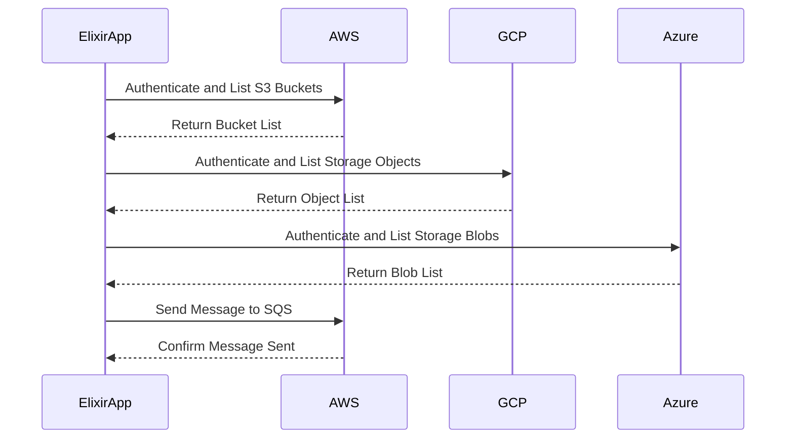

## 14.10. Integrating with Cloud Services

In today's rapidly evolving technological landscape, integrating with cloud services is a crucial aspect of building scalable, resilient, and efficient applications. Elixir, with its robust concurrency model and functional programming paradigm, offers unique advantages when interacting with cloud platforms such as Amazon Web Services (AWS), Google Cloud Platform (GCP), and Microsoft Azure. This section will guide you through the process of integrating Elixir applications with these cloud services, focusing on using SDKs and APIs, managing storage and queues, and ensuring secure authentication.

### Understanding Cloud Integration

Before diving into specifics, it's essential to understand what cloud integration entails. Cloud integration involves connecting various applications, systems, and IT environments for the real-time exchange of data and processes. This integration can be achieved through APIs, SDKs, and other tools provided by cloud service providers.

### Using SDKs and APIs to Interact with Cloud Services

#### AWS Integration

AWS offers a comprehensive suite of services that can be accessed via their SDKs and APIs. Elixir developers can leverage the `ex_aws` library, which provides a convenient interface to interact with AWS services.

```elixir
# Example: Listing S3 Buckets using ExAws

defmodule S3Example do
  @moduledoc """
  A module to demonstrate interaction with AWS S3 using ExAws.
  """

  alias ExAws.S3

  def list_buckets do
    S3.list_buckets()
    |> ExAws.request()
    |> handle_response()
  end

  defp handle_response({:ok, %{body: body}}) do
    IO.inspect(body, label: "S3 Buckets")
  end

  defp handle_response({:error, reason}) do
    IO.inspect(reason, label: "Error")
  end
end
```

In this example, we use the `ExAws.S3` module to list all S3 buckets. The `ExAws.request/1` function sends the request to AWS, and the response is handled accordingly.

#### GCP Integration

For Google Cloud Platform, the `goth` library is commonly used to manage authentication and interact with GCP services. Here's how you can authenticate and access Google Cloud Storage:

```elixir
# Example: Authenticating with GCP and Accessing Cloud Storage

defmodule GCPExample do
  @moduledoc """
  A module to demonstrate interaction with Google Cloud Storage.
  """

  alias Goth.Token
  alias GoogleApi.Storage.V1.Connection
  alias GoogleApi.Storage.V1.Api.Objects

  def list_objects(bucket_name) do
    {:ok, token} = Token.for_scope("https://www.googleapis.com/auth/devstorage.read_only")
    conn = Connection.new(token.token)

    Objects.storage_objects_list(conn, bucket_name)
    |> handle_response()
  end

  defp handle_response({:ok, response}) do
    IO.inspect(response, label: "GCP Storage Objects")
  end

  defp handle_response({:error, reason}) do
    IO.inspect(reason, label: "Error")
  end
end
```

This example demonstrates how to authenticate with GCP using `goth` and list objects in a Google Cloud Storage bucket.

#### Azure Integration

Azure provides the `azure` library for Elixir, which can be used to interact with Azure services. Here's an example of how to list blobs in an Azure Storage account:

```elixir
# Example: Listing Azure Storage Blobs

defmodule AzureExample do
  @moduledoc """
  A module to demonstrate interaction with Azure Storage.
  """

  alias Azure.Storage.Blob

  def list_blobs(container_name) do
    Blob.list_blobs(container_name)
    |> handle_response()
  end

  defp handle_response({:ok, blobs}) do
    IO.inspect(blobs, label: "Azure Storage Blobs")
  end

  defp handle_response({:error, reason}) do
    IO.inspect(reason, label: "Error")
  end
end
```

This code snippet shows how to list blobs in a specified Azure Storage container using the `azure` library.

### Storage and Queues

#### Integrating with S3 and Cloud Storage

Cloud storage services like AWS S3 and Google Cloud Storage are essential for storing and retrieving large amounts of data. Elixir's concurrency model makes it particularly well-suited for handling multiple storage operations simultaneously.

```elixir
# Example: Uploading a File to AWS S3

defmodule S3UploadExample do
  @moduledoc """
  A module to demonstrate file upload to AWS S3.
  """

  alias ExAws.S3

  def upload_file(bucket, file_path) do
    file_content = File.read!(file_path)
    S3.put_object(bucket, Path.basename(file_path), file_content)
    |> ExAws.request()
    |> handle_response()
  end

  defp handle_response({:ok, _response}) do
    IO.puts("File uploaded successfully!")
  end

  defp handle_response({:error, reason}) do
    IO.inspect(reason, label: "Error")
  end
end
```

This example demonstrates how to upload a file to an S3 bucket using `ExAws`.

#### Message Queues like SQS

Message queues are crucial for building decoupled and scalable systems. AWS SQS and similar services on GCP and Azure can be integrated with Elixir applications to handle asynchronous message processing.

```elixir
# Example: Sending a Message to AWS SQS

defmodule SQSExample do
  @moduledoc """
  A module to demonstrate sending a message to AWS SQS.
  """

  alias ExAws.SQS

  def send_message(queue_url, message_body) do
    SQS.send_message(queue_url, message_body)
    |> ExAws.request()
    |> handle_response()
  end

  defp handle_response({:ok, _response}) do
    IO.puts("Message sent successfully!")
  end

  defp handle_response({:error, reason}) do
    IO.inspect(reason, label: "Error")
  end
end
```

This code snippet shows how to send a message to an AWS SQS queue using `ExAws`.

### Authentication

#### Managing Credentials and Secure Access

Security is a paramount concern when integrating with cloud services. Elixir provides several libraries and best practices for managing credentials and ensuring secure access.

- **Environment Variables**: Store sensitive information like API keys and secrets in environment variables.
- **Vault**: Use HashiCorp Vault for managing secrets and credentials securely.
- **IAM Roles**: Leverage IAM roles and policies to control access to cloud resources.

```elixir
# Example: Using Environment Variables for AWS Credentials

defmodule ConfigExample do
  @moduledoc """
  A module to demonstrate secure configuration using environment variables.
  """

  def get_aws_credentials do
    %{
      access_key_id: System.get_env("AWS_ACCESS_KEY_ID"),
      secret_access_key: System.get_env("AWS_SECRET_ACCESS_KEY")
    }
  end
end
```

This example shows how to retrieve AWS credentials from environment variables, ensuring they are not hard-coded in the application.

### Visualizing Cloud Integration

To better understand how Elixir applications interact with cloud services, let's visualize a typical architecture using a sequence diagram.



This diagram illustrates the interaction between an Elixir application and various cloud services, highlighting the authentication and data retrieval processes.

### Try It Yourself

To deepen your understanding, try modifying the code examples provided:

- **Change the bucket or container names** to interact with different storage resources.
- **Experiment with different message bodies** when sending messages to SQS.
- **Implement error handling** for network failures or invalid credentials.

### References and Further Reading

- [AWS SDK for Elixir - ExAws](https://github.com/ex-aws/ex_aws)
- [Google Cloud Platform - Goth](https://github.com/peburrows/goth)
- [Azure SDK for Elixir](https://github.com/azukiapp/azure)

### Knowledge Check

- **What are the benefits of using environment variables for storing credentials?**
- **How does Elixir's concurrency model benefit cloud integration?**
- **What are the key differences between AWS S3 and Google Cloud Storage?**

### Embrace the Journey

Integrating Elixir applications with cloud services opens up a world of possibilities for building scalable and resilient systems. Remember, this is just the beginning. As you continue to explore and experiment, you'll discover new ways to leverage the power of Elixir and cloud platforms. Keep pushing the boundaries, stay curious, and enjoy the journey!

## Quiz: Integrating with Cloud Services



### What is the primary purpose of using SDKs and APIs in cloud integration?

- [x] To interact with cloud services programmatically
- [ ] To store data locally
- [ ] To enhance application security
- [ ] To reduce application size

> **Explanation:** SDKs and APIs provide the necessary tools and interfaces to interact with cloud services programmatically.

### Which Elixir library is commonly used for AWS integration?

- [x] ExAws
- [ ] Goth
- [ ] Azure
- [ ] Phoenix

> **Explanation:** ExAws is a popular library for interacting with AWS services in Elixir.

### How can you securely manage credentials in an Elixir application?

- [x] Use environment variables
- [x] Use HashiCorp Vault
- [ ] Hard-code them in the application
- [ ] Share them publicly

> **Explanation:** Environment variables and HashiCorp Vault are secure methods for managing credentials, while hard-coding and sharing publicly are insecure practices.

### What is the benefit of using message queues like AWS SQS?

- [x] To handle asynchronous message processing
- [ ] To store large files
- [ ] To enhance application speed
- [ ] To reduce code complexity

> **Explanation:** Message queues like AWS SQS are used to handle asynchronous message processing, allowing for decoupled and scalable systems.

### Which library is used for Google Cloud Platform integration in Elixir?

- [ ] ExAws
- [x] Goth
- [ ] Azure
- [ ] Ecto

> **Explanation:** Goth is used for managing authentication and interacting with Google Cloud Platform services in Elixir.

### What is a common use case for cloud storage services like AWS S3?

- [x] Storing and retrieving large amounts of data
- [ ] Processing real-time data streams
- [ ] Running machine learning models
- [ ] Managing user authentication

> **Explanation:** Cloud storage services like AWS S3 are primarily used for storing and retrieving large amounts of data.

### How does Elixir's concurrency model benefit cloud integration?

- [x] It allows handling multiple operations simultaneously
- [ ] It reduces the need for cloud services
- [ ] It simplifies code structure
- [ ] It enhances security

> **Explanation:** Elixir's concurrency model allows for handling multiple operations simultaneously, which is beneficial for cloud integration.

### What is the purpose of IAM roles in cloud services?

- [x] To control access to cloud resources
- [ ] To store application data
- [ ] To enhance application performance
- [ ] To reduce cloud costs

> **Explanation:** IAM roles are used to control access to cloud resources, ensuring secure and managed access.

### Which of the following is a secure practice for managing cloud credentials?

- [x] Using environment variables
- [ ] Hard-coding credentials in the application
- [ ] Sharing credentials via email
- [ ] Storing credentials in plaintext files

> **Explanation:** Using environment variables is a secure practice, while the other options are insecure.

### True or False: Elixir can only integrate with AWS cloud services.

- [ ] True
- [x] False

> **Explanation:** Elixir can integrate with various cloud services, including AWS, GCP, and Azure, using appropriate libraries and tools.


