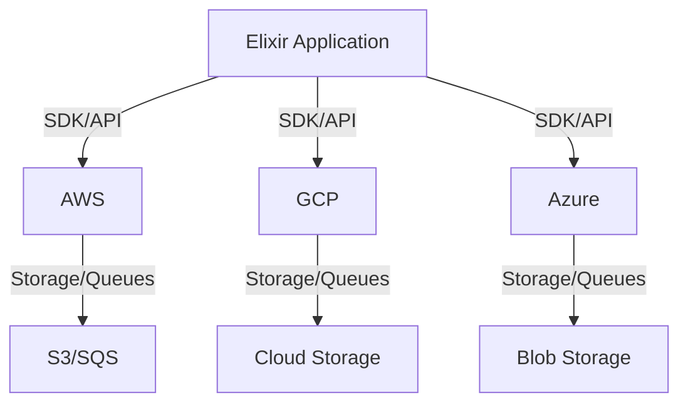

## 14.10. Integrating with Cloud Services

In today's digital landscape, cloud services are an integral part of building scalable and robust applications. Elixir, with its concurrent and fault-tolerant nature, can seamlessly integrate with major cloud platforms like AWS, GCP, and Azure. This section will guide you through the process of integrating Elixir applications with these cloud services, leveraging SDKs, APIs, and secure authentication mechanisms. By the end of this section, you will have a comprehensive understanding of how to harness the power of cloud computing in your Elixir applications.

### 1. Introduction to Cloud Integration

Cloud services offer a plethora of tools and resources for developers, ranging from storage solutions to machine learning capabilities. Integrating Elixir with cloud services involves using SDKs (Software Development Kits) and APIs (Application Programming Interfaces) to interact with these services programmatically. This integration allows Elixir applications to scale dynamically, manage data efficiently, and leverage cloud-based functionalities.

### 2. Using SDKs and APIs

#### 2.1. Understanding SDKs and APIs

An SDK is a collection of software development tools that allow developers to create applications for specific platforms. APIs, on the other hand, are sets of rules and protocols that allow different software entities to communicate with each other. When integrating with cloud services, SDKs provide a more comprehensive toolkit, while APIs offer a more lightweight and flexible approach.

#### 2.2. Elixir and AWS SDK

AWS (Amazon Web Services) offers a robust SDK for Elixir, known as `ex_aws`. This library provides a comprehensive interface to interact with various AWS services such as S3, DynamoDB, and Lambda.

```elixir
# Example of using ExAws to list S3 buckets

defmodule MyApp.AWS do
  alias ExAws.S3

  def list_buckets do
    S3.list_buckets()
    |> ExAws.request()
    |> case do
      {:ok, response} -> IO.inspect(response)
      {:error, reason} -> IO.inspect(reason)
    end
  end
end
```

In this example, we use the `ExAws.S3` module to list all S3 buckets. The `ExAws.request/1` function sends the request to AWS and handles the response.

#### 2.3. Elixir and GCP APIs

Google Cloud Platform (GCP) provides APIs for interacting with its services. Elixir developers can use HTTP clients like `Tesla` or `HTTPoison` to make requests to these APIs.

```elixir
# Example of using Tesla to interact with GCP's Cloud Storage API

defmodule MyApp.GCP do
  use Tesla

  plug Tesla.Middleware.BaseUrl, "https://storage.googleapis.com"
  plug Tesla.Middleware.JSON

  def list_buckets(project_id, access_token) do
    headers = [{"Authorization", "Bearer #{access_token}"}]
    get("/storage/v1/b?project=#{project_id}", headers: headers)
  end
end
```

This example demonstrates how to use the `Tesla` library to list buckets in GCP's Cloud Storage. The `Authorization` header is used to authenticate the request.

#### 2.4. Elixir and Azure SDK

Azure provides the `azure` library for Elixir, which allows developers to interact with Azure services such as Blob Storage and Azure Functions.

```elixir
# Example of using Azure SDK to list Blob Storage containers

defmodule MyApp.Azure do
  alias Azure.Storage.Blob

  def list_containers(account, key) do
    Blob.list_containers(account, key)
    |> case do
      {:ok, containers} -> IO.inspect(containers)
      {:error, reason} -> IO.inspect(reason)
    end
  end
end
```

In this example, we use the `Azure.Storage.Blob` module to list all containers in Azure Blob Storage.

### 3. Storage and Queues

Cloud storage and message queues are essential components for building scalable applications. Elixir can efficiently integrate with cloud storage services like AWS S3, GCP Cloud Storage, and Azure Blob Storage, as well as message queues like AWS SQS and Azure Service Bus.

#### 3.1. Integrating with AWS S3

AWS S3 is a scalable object storage service. Using the `ExAws` library, Elixir applications can perform operations such as uploading, downloading, and deleting objects in S3.

```elixir
# Example of uploading a file to S3

defmodule MyApp.S3 do
  alias ExAws.S3

  def upload_file(bucket, file_path, key) do
    file_path
    |> File.read!()
    |> S3.put_object(bucket, key)
    |> ExAws.request()
  end
end
```

This example demonstrates how to upload a file to an S3 bucket using the `ExAws.S3.put_object/3` function.

#### 3.2. Integrating with GCP Cloud Storage

GCP Cloud Storage is a unified object storage service. Elixir applications can use HTTP clients to interact with Cloud Storage APIs.

```elixir
# Example of uploading a file to GCP Cloud Storage

defmodule MyApp.GCPStorage do
  use Tesla

  plug Tesla.Middleware.BaseUrl, "https://storage.googleapis.com"
  plug Tesla.Middleware.JSON

  def upload_file(bucket, file_path, key, access_token) do
    headers = [{"Authorization", "Bearer #{access_token}"}]
    body = File.read!(file_path)

    put("/upload/storage/v1/b/#{bucket}/o?uploadType=media&name=#{key}", body, headers: headers)
  end
end
```

This example shows how to upload a file to GCP Cloud Storage using the `Tesla` library.

#### 3.3. Integrating with Azure Blob Storage

Azure Blob Storage is a service for storing large amounts of unstructured data. The `azure` library provides an interface for interacting with Blob Storage.

```elixir
# Example of uploading a file to Azure Blob Storage

defmodule MyApp.AzureBlob do
  alias Azure.Storage.Blob

  def upload_file(account, key, container, file_path, blob_name) do
    file_path
    |> File.read!()
    |> Blob.put_blob(account, key, container, blob_name)
  end
end
```

This example demonstrates how to upload a file to Azure Blob Storage using the `Azure.Storage.Blob.put_blob/5` function.

#### 3.4. Integrating with Message Queues

Message queues like AWS SQS and Azure Service Bus are used for decoupling components and handling asynchronous communication.

```elixir
# Example of sending a message to AWS SQS

defmodule MyApp.SQS do
  alias ExAws.SQS

  def send_message(queue_url, message_body) do
    SQS.send_message(queue_url, message_body)
    |> ExAws.request()
  end
end
```

This example shows how to send a message to an AWS SQS queue using the `ExAws.SQS.send_message/2` function.

### 4. Authentication

Securely managing credentials and access to cloud services is crucial for maintaining the integrity and confidentiality of your applications.

#### 4.1. Managing AWS Credentials

AWS credentials can be managed using environment variables, IAM roles, or AWS credentials files. The `ExAws` library automatically picks up credentials from these sources.

```elixir
# Example of configuring AWS credentials in config.exs

config :ex_aws,
  access_key_id: [{:system, "AWS_ACCESS_KEY_ID"}, :instance_role],
  secret_access_key: [{:system, "AWS_SECRET_ACCESS_KEY"}, :instance_role]
```

This configuration allows `ExAws` to use environment variables or IAM roles for authentication.

#### 4.2. Managing GCP Credentials

GCP credentials are typically managed using service account keys. These keys can be provided as JSON files and loaded into your application.

```elixir
# Example of loading GCP service account credentials

defmodule MyApp.GCPCredentials do
  def load_credentials do
    {:ok, credentials} = File.read("path/to/service_account.json")
    Jason.decode!(credentials)
  end
end
```

This example demonstrates how to load GCP service account credentials from a JSON file.

#### 4.3. Managing Azure Credentials

Azure credentials can be managed using environment variables or Azure Active Directory (AAD) authentication.

```elixir
# Example of configuring Azure credentials in config.exs

config :azure,
  client_id: System.get_env("AZURE_CLIENT_ID"),
  client_secret: System.get_env("AZURE_CLIENT_SECRET"),
  tenant_id: System.get_env("AZURE_TENANT_ID")
```

This configuration uses environment variables to manage Azure credentials.

### 5. Best Practices for Cloud Integration

1. **Security First**: Always prioritize security when integrating with cloud services. Use secure authentication mechanisms and avoid hardcoding credentials.
2. **Error Handling**: Implement robust error handling to manage network failures and service outages gracefully.
3. **Scalability**: Design your Elixir applications to scale with cloud resources, leveraging cloud-native features like auto-scaling and load balancing.
4. **Monitoring and Logging**: Use cloud monitoring tools to track application performance and log important events for troubleshooting.
5. **Cost Management**: Be aware of the costs associated with cloud services and optimize your usage to minimize expenses.

### 6. Visualizing Cloud Integration

Below is a diagram illustrating the interaction between an Elixir application and cloud services using SDKs and APIs.


```mermaid
flowchart TD
    A[Elixir Application] -->|SDK/API| B[AWS]
    A -->|SDK/API| C[GCP]
    A -->|SDK/API| D[Azure]
    B -->|Storage/Queues| E[S3/SQS]
    C -->|Storage/Queues| F[Cloud Storage]
    D -->|Storage/Queues| G[Blob Storage]
```

**Figure 1**: Visual representation of Elixir application integration with AWS, GCP, and Azure using SDKs and APIs.

### 7. Try It Yourself

Now that we've covered the basics of integrating Elixir with cloud services, try modifying the code examples to suit your own cloud projects. Experiment with different cloud services and explore the extensive capabilities they offer. Remember, the key to mastering cloud integration is practice and experimentation.

### 8. Knowledge Check

- **Question 1**: What is the primary difference between SDKs and APIs when integrating with cloud services?
- **Question 2**: How can Elixir applications authenticate with AWS services using the `ExAws` library?
- **Question 3**: Describe a method for managing GCP credentials in an Elixir application.
- **Question 4**: What are some best practices for integrating Elixir applications with cloud services?

### 9. Conclusion

Integrating Elixir with cloud services opens up a world of possibilities for building scalable, efficient, and robust applications. By leveraging SDKs, APIs, and secure authentication mechanisms, you can harness the full power of cloud computing in your Elixir projects. Remember, this is just the beginning. As you explore further, you'll discover even more ways to innovate and optimize your cloud-based applications. Keep experimenting, stay curious, and enjoy the journey!

## Quiz Time!



### What is the primary difference between SDKs and APIs when integrating with cloud services?

- [x] SDKs provide a comprehensive toolkit, while APIs offer a lightweight and flexible approach.
- [ ] SDKs are only available for AWS, while APIs are available for all cloud services.
- [ ] SDKs are used for authentication, while APIs are used for data storage.
- [ ] SDKs are faster than APIs.

> **Explanation:** SDKs offer a comprehensive set of tools for development, while APIs provide a more flexible and lightweight way to interact with cloud services.

### How can Elixir applications authenticate with AWS services using the `ExAws` library?

- [x] By configuring AWS credentials in the `config.exs` file.
- [ ] By hardcoding credentials in the application code.
- [ ] By using a separate authentication library.
- [ ] By manually sending authentication headers with each request.

> **Explanation:** The `ExAws` library can automatically use credentials from the `config.exs` file, environment variables, or IAM roles for authentication.

### Describe a method for managing GCP credentials in an Elixir application.

- [x] Using service account keys provided as JSON files.
- [ ] Hardcoding credentials in the application code.
- [ ] Using a separate authentication library.
- [ ] Manually sending authentication headers with each request.

> **Explanation:** GCP credentials are typically managed using service account keys stored as JSON files and loaded into the application.

### What are some best practices for integrating Elixir applications with cloud services?

- [x] Prioritizing security, implementing robust error handling, and monitoring application performance.
- [ ] Hardcoding credentials for easy access.
- [ ] Ignoring network failures to focus on core functionality.
- [ ] Using only one cloud service to minimize complexity.

> **Explanation:** Best practices include prioritizing security, implementing error handling, monitoring performance, and optimizing costs.

### Which library is commonly used in Elixir for interacting with AWS services?

- [x] `ExAws`
- [ ] `Tesla`
- [ ] `HTTPoison`
- [ ] `Azure`

> **Explanation:** `ExAws` is a popular library for interacting with AWS services in Elixir.

### What is a common use case for message queues in cloud integration?

- [x] Decoupling components and handling asynchronous communication.
- [ ] Storing large files.
- [ ] Authenticating users.
- [ ] Managing cloud costs.

> **Explanation:** Message queues are used to decouple components and manage asynchronous communication between services.

### How can Elixir applications interact with GCP's Cloud Storage?

- [x] Using HTTP clients like `Tesla` or `HTTPoison` to make API requests.
- [ ] Using the `ExAws` library.
- [ ] Hardcoding URLs in the application code.
- [ ] Using Azure SDK.

> **Explanation:** Elixir applications can use HTTP clients to interact with GCP's Cloud Storage APIs.

### What is the role of environment variables in managing cloud credentials?

- [x] They provide a secure way to manage credentials without hardcoding them.
- [ ] They are used to store application data.
- [ ] They are only used for local development.
- [ ] They are not recommended for production environments.

> **Explanation:** Environment variables provide a secure way to manage credentials, avoiding hardcoding and enabling secure access.

### How does the `Tesla` library help in integrating Elixir with cloud services?

- [x] It provides an HTTP client to make API requests to cloud services.
- [ ] It is used for data storage.
- [ ] It manages cloud costs.
- [ ] It provides authentication for cloud services.

> **Explanation:** `Tesla` is an HTTP client library that helps make API requests to cloud services.

### True or False: Azure Blob Storage is used for storing structured data.

- [ ] True
- [x] False

> **Explanation:** Azure Blob Storage is used for storing large amounts of unstructured data, such as text or binary data.


