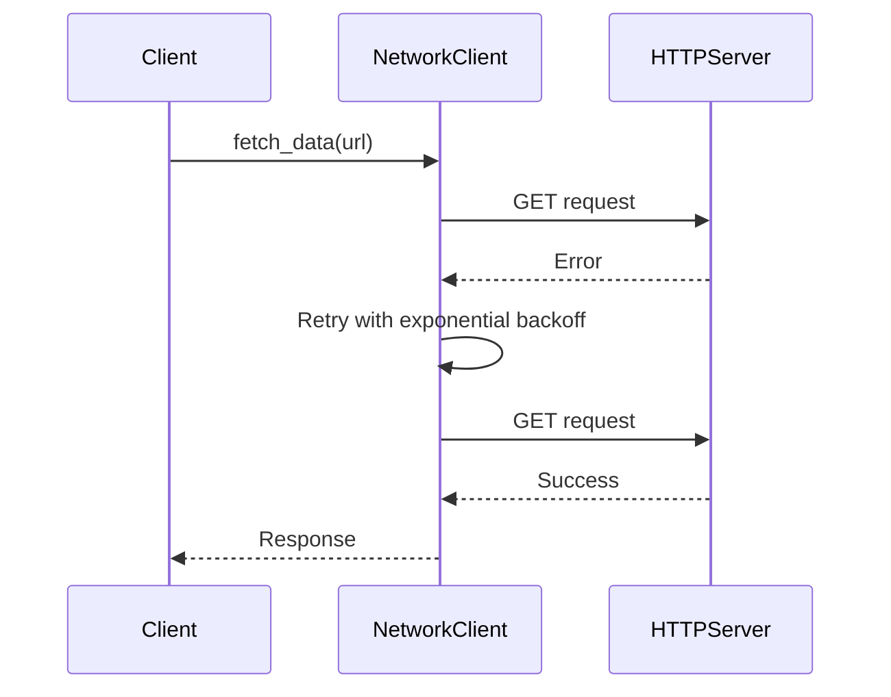

## 14.11. Handling Network Errors and Retries

In the world of distributed systems and networked applications, handling network errors and implementing retry strategies are crucial for building resilient and reliable systems. Elixir, with its robust concurrency model and fault-tolerant design, provides powerful tools and patterns to manage these challenges effectively. In this section, we will explore how to design for intermittent network failures, implement retry strategies like exponential backoff and circuit breakers, and set appropriate timeouts to prevent hanging requests.

### Resilience in Connectivity

Network errors are inevitable in any distributed system. They can occur due to various reasons such as network congestion, server downtime, or transient errors. Designing for resilience in connectivity involves anticipating these failures and implementing strategies to handle them gracefully.

#### Designing for Intermittent Network Failures

1. **Identify Critical Network Operations**: Start by identifying the network operations that are critical to your application's functionality. These operations should be prioritized for error handling and retry strategies.

2. **Implement Idempotency**: Ensure that network operations are idempotent, meaning that they can be safely retried without causing unintended side effects. This is crucial for operations like HTTP POST requests, which may be retried multiple times.

3. **Use Supervisors for Fault Tolerance**: Leverage Elixir's OTP (Open Telecom Platform) supervisors to monitor and restart processes that encounter network errors. Supervisors provide a structured way to handle failures and ensure system stability.

4. **Graceful Degradation**: Design your application to degrade gracefully in the event of network failures. For example, cache data locally to provide limited functionality when the network is unavailable.

5. **Monitor and Log Errors**: Implement monitoring and logging to track network errors and their frequency. This data can help you identify patterns and improve your error handling strategies.

### Retry Strategies

Retry strategies are essential for handling transient network errors. They involve retrying failed operations with the hope that the error is temporary and will resolve itself. However, retries must be implemented carefully to avoid overwhelming the network or the server.

#### Implementing Exponential Backoff

Exponential backoff is a common retry strategy that involves increasing the delay between retries exponentially. This approach helps to reduce the load on the network and server during periods of high error rates.

```elixir
defmodule NetworkClient do
  @max_retries 5
  @initial_delay 1000 # milliseconds

  def fetch_data(url) do
    try_request(url, 0, @initial_delay)
  end

  defp try_request(url, attempt, delay) when attempt < @max_retries do
    case HTTPClient.get(url) do
      {:ok, response} -> {:ok, response}
      {:error, reason} ->
        :timer.sleep(delay)
        try_request(url, attempt + 1, delay * 2)
    end
  end

  defp try_request(_url, _attempt, _delay) do
    {:error, :max_retries_exceeded}
  end
end
```

In this example, the `try_request` function retries the HTTP GET request with an exponentially increasing delay. The maximum number of retries is controlled by the `@max_retries` variable.

#### Circuit Breakers

Circuit breakers are another powerful pattern for handling network errors. They prevent an application from repeatedly trying to execute an operation that is likely to fail, thereby reducing the load on the network and allowing time for recovery.

```elixir
defmodule CircuitBreaker do
  @threshold 5
  @timeout 10_000 # milliseconds

  defstruct state: :closed, failure_count: 0, last_failure_time: nil

  def call(breaker, func) do
    case breaker.state do
      :open -> {:error, :circuit_open}
      :half_open -> try_call(breaker, func)
      :closed -> try_call(breaker, func)
    end
  end

  defp try_call(breaker, func) do
    case func.() do
      {:ok, result} -> {:ok, result, reset_breaker(breaker)}
      {:error, _reason} -> {:error, :failure, increment_failure(breaker)}
    end
  end

  defp reset_breaker(breaker) do
    %CircuitBreaker{breaker | state: :closed, failure_count: 0, last_failure_time: nil}
  end

  defp increment_failure(breaker) do
    failure_count = breaker.failure_count + 1
    if failure_count >= @threshold do
      %CircuitBreaker{breaker | state: :open, last_failure_time: :os.system_time(:millisecond)}
    else
      %CircuitBreaker{breaker | failure_count: failure_count}
    end
  end
end
```

In this example, the `CircuitBreaker` module tracks the number of failures and changes its state from `closed` to `open` when the failure threshold is exceeded. The circuit remains open for a specified timeout period before transitioning to `half_open`, where it allows a limited number of test requests to determine if the network issue has been resolved.

### Time-outs

Setting appropriate timeouts is crucial to prevent hanging requests and ensure that your application remains responsive. Timeouts should be set based on the expected response time of the network operation and the criticality of the operation.

#### Setting Timeouts in Elixir

1. **HTTP Requests**: Use libraries like `HTTPoison` or `Tesla` to set timeouts for HTTP requests. These libraries allow you to specify connect and receive timeouts.

```elixir
defmodule TimeoutExample do
  use HTTPoison.Base

  def fetch_data(url) do
    HTTPoison.get(url, [], timeout: 5000, recv_timeout: 5000)
  end
end
```

2. **GenServer Calls**: When making synchronous calls to a `GenServer`, specify a timeout to prevent the caller from waiting indefinitely.

```elixir
defmodule MyGenServer do
  use GenServer

  def handle_call(:get_data, _from, state) do
    {:reply, state, state}
  end
end

# Client
GenServer.call(pid, :get_data, 5000) # 5-second timeout
```

3. **Task.async/await**: When using `Task.async` and `Task.await`, specify a timeout to avoid blocking the caller indefinitely.

```elixir
task = Task.async(fn -> perform_long_running_operation() end)
result = Task.await(task, 5000) # 5-second timeout
```

### Visualizing Network Error Handling

To better understand the flow of handling network errors and retries, let's visualize the process using a sequence diagram.



**Diagram Description**: This sequence diagram illustrates the process of handling a network error with retries. The `NetworkClient` attempts to fetch data from the `HTTPServer`. Upon encountering an error, it retries the request with exponential backoff until it succeeds or the maximum retries are reached.

### Knowledge Check

- **Question**: What is the purpose of implementing exponential backoff in retry strategies?
  - **Answer**: To reduce the load on the network and server during periods of high error rates by increasing the delay between retries.

- **Question**: How does a circuit breaker pattern help in handling network errors?
  - **Answer**: It prevents an application from repeatedly trying to execute an operation that is likely to fail, reducing the load on the network and allowing time for recovery.

### Try It Yourself

Experiment with the provided code examples by modifying the retry strategy parameters, such as the maximum number of retries or the initial delay. Observe how these changes affect the behavior of the network client in different error scenarios.

### References and Links

- [Elixir Documentation](https://elixir-lang.org/docs.html)
- [HTTPoison Library](https://hexdocs.pm/httpoison/HTTPoison.html)
- [Tesla Library](https://hexdocs.pm/tesla/Tesla.html)

### Embrace the Journey

Handling network errors and implementing retry strategies are essential skills for building resilient Elixir applications. Remember, this is just the beginning. As you progress, you'll build more robust and fault-tolerant systems. Keep experimenting, stay curious, and enjoy the journey!

## Quiz: Handling Network Errors and Retries



### What is the primary goal of implementing retry strategies in network operations?

- [x] To handle transient network errors gracefully
- [ ] To increase the load on the server
- [ ] To decrease the application's performance
- [ ] To eliminate the need for error handling

> **Explanation:** Retry strategies are designed to handle transient network errors gracefully, allowing operations to succeed after temporary issues are resolved.

### Which pattern helps prevent an application from repeatedly trying to execute a failing operation?

- [ ] Exponential Backoff
- [x] Circuit Breaker
- [ ] Idempotency
- [ ] Graceful Degradation

> **Explanation:** The Circuit Breaker pattern helps prevent an application from repeatedly trying to execute a failing operation, reducing load and allowing time for recovery.

### What is the purpose of setting timeouts in network operations?

- [x] To prevent hanging requests and ensure responsiveness
- [ ] To increase the complexity of the code
- [ ] To make the application slower
- [ ] To avoid using retries

> **Explanation:** Setting timeouts prevents hanging requests and ensures that the application remains responsive by specifying a maximum wait time for operations.

### In the context of retry strategies, what does "exponential backoff" refer to?

- [x] Increasing the delay between retries exponentially
- [ ] Decreasing the delay between retries linearly
- [ ] Keeping the delay constant between retries
- [ ] Eliminating retries altogether

> **Explanation:** Exponential backoff refers to increasing the delay between retries exponentially, which helps reduce the load on the network and server.

### What is the role of idempotency in network operations?

- [x] Ensuring operations can be safely retried without side effects
- [ ] Increasing the number of retries
- [ ] Decreasing the application's reliability
- [ ] Eliminating the need for error handling

> **Explanation:** Idempotency ensures that network operations can be safely retried without causing unintended side effects, which is crucial for reliable error handling.

### How does a circuit breaker transition from "open" to "half_open" state?

- [x] After a specified timeout period
- [ ] Immediately after a failure
- [ ] When the application restarts
- [ ] When the network is down

> **Explanation:** A circuit breaker transitions from "open" to "half_open" state after a specified timeout period, allowing test requests to determine if the issue is resolved.

### What is a key benefit of using supervisors in Elixir for network error handling?

- [x] They provide a structured way to handle failures and ensure system stability
- [ ] They increase the complexity of the application
- [ ] They eliminate the need for retries
- [ ] They decrease the application's performance

> **Explanation:** Supervisors in Elixir provide a structured way to handle failures and ensure system stability by monitoring and restarting processes that encounter errors.

### Which Elixir library can be used to set timeouts for HTTP requests?

- [x] HTTPoison
- [ ] GenServer
- [ ] Task
- [ ] Supervisor

> **Explanation:** The HTTPoison library can be used to set timeouts for HTTP requests, allowing you to specify connect and receive timeouts.

### What is the primary purpose of monitoring and logging network errors?

- [x] To track errors and improve error handling strategies
- [ ] To increase the application's complexity
- [ ] To eliminate the need for retries
- [ ] To decrease the application's performance

> **Explanation:** Monitoring and logging network errors help track errors and improve error handling strategies by identifying patterns and areas for improvement.

### True or False: Exponential backoff helps reduce the load on the network during high error rates.

- [x] True
- [ ] False

> **Explanation:** True. Exponential backoff helps reduce the load on the network during high error rates by increasing the delay between retries.




