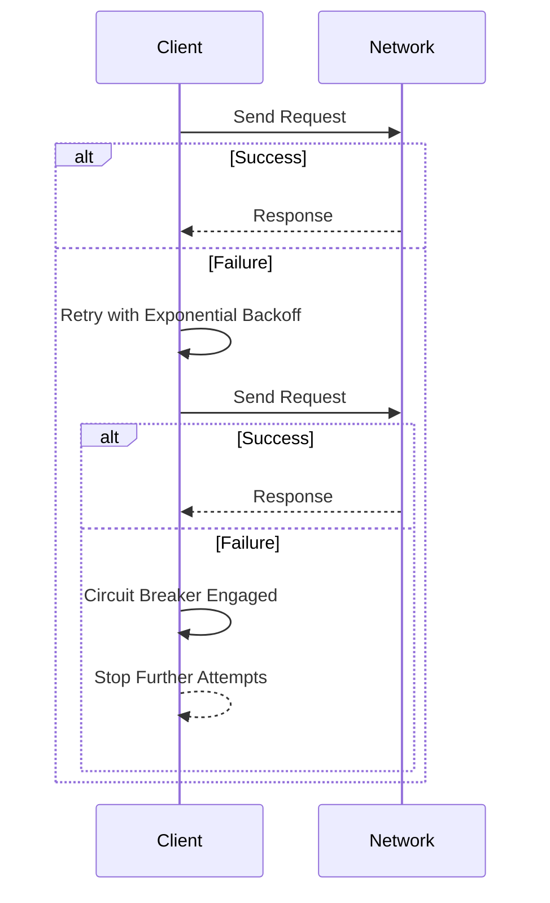

## 14.11. Handling Network Errors and Retries

In today's interconnected world, applications often rely on network communication to interact with external services, databases, and APIs. However, network communication is inherently unreliable due to factors such as latency, packet loss, or temporary outages. As expert software engineers and architects, it's crucial to design systems that can gracefully handle these challenges. In this section, we'll explore strategies for managing network errors and implementing robust retry mechanisms in Elixir applications.

### Resilience in Connectivity

**Designing for Intermittent Network Failures**

Network failures can occur at any time, and systems must be designed to handle these gracefully. This involves anticipating potential issues and implementing strategies to mitigate their impact. Here are some key considerations:

1. **Graceful Degradation**: Ensure that your application can continue to function, even with limited connectivity. This might involve caching data locally or providing fallback functionality.

2. **Retry Logic**: Implement retry mechanisms to automatically attempt failed operations. This can help mitigate temporary network issues.

3. **Circuit Breakers**: Use circuit breakers to prevent your system from repeatedly attempting operations that are likely to fail, thereby avoiding cascading failures.

4. **Monitoring and Alerts**: Continuously monitor network operations and set up alerts to notify you of any significant issues.

### Retry Strategies

**Implementing Exponential Backoff and Circuit Breakers**

Retry strategies are essential for handling transient network errors. A well-designed retry mechanism can significantly improve the resilience of your application. Let's explore some common retry strategies:

#### Exponential Backoff

Exponential backoff is a retry strategy that involves waiting for progressively longer intervals between retries. This approach helps to reduce the load on the network and increase the chances of a successful retry. Here's a basic implementation in Elixir:

```elixir
defmodule NetworkClient do
  @max_retries 5
  @base_delay 100

  def request_with_retry(url, retries \\ 0) do
    case HTTPoison.get(url) do
      {:ok, response} ->
        {:ok, response}

      {:error, reason} when retries < @max_retries ->
        :timer.sleep(:math.pow(2, retries) * @base_delay)
        request_with_retry(url, retries + 1)

      {:error, reason} ->
        {:error, reason}
    end
  end
end
```

In this example, we use the `HTTPoison` library to make HTTP requests. If a request fails, we wait for an exponentially increasing delay before retrying. The delay is calculated as `2^retries * base_delay`, where `base_delay` is the initial delay in milliseconds.

#### Circuit Breakers

Circuit breakers are a design pattern used to detect failures and prevent the system from trying to perform an operation that's likely to fail. This can help avoid overloading the system with repeated failed attempts. Here's a simple example using the `fuse` library:

```elixir
defmodule CircuitBreakerExample do
  use Fuse

  def call_service do
    case Fuse.ask(:my_service, :sync) do
      :ok ->
        case HTTPoison.get("http://example.com") do
          {:ok, response} ->
            {:ok, response}

          {:error, reason} ->
            Fuse.melt(:my_service)
            {:error, reason}
        end

      :blown ->
        {:error, :circuit_open}
    end
  end
end
```

In this example, we use the `fuse` library to implement a circuit breaker. If the service call fails, we "melt" the circuit, which prevents further attempts until the circuit is reset.

### Time-outs

**Setting Appropriate Timeouts to Prevent Hanging Requests**

Timeouts are crucial in network communication to prevent operations from hanging indefinitely. They define the maximum time a request should take before being considered failed. Here's how you can set timeouts in Elixir:

```elixir
defmodule TimeoutExample do
  def fetch_data_with_timeout(url) do
    HTTPoison.get(url, [], timeout: 5000, recv_timeout: 5000)
  end
end
```

In this example, we set both the connection timeout and the receive timeout to 5000 milliseconds (5 seconds). This ensures that if the server does not respond within this time, the request will fail.

### Visualizing Network Error Handling

To better understand the flow of handling network errors and retries, let's visualize the process using a sequence diagram:


```mermaid
sequenceDiagram
    participant Client
    participant Network
    Client->>Network: Send Request
    alt Success
        Network-->>Client: Response
    else Failure
        Client->>Client: Retry with Exponential Backoff
        Client->>Network: Send Request
        alt Success
            Network-->>Client: Response
        else Failure
            Client->>Client: Circuit Breaker Engaged
            Client-->>Client: Stop Further Attempts
        end
    end
```

This diagram illustrates the process of sending a request, handling failures with retries, and using a circuit breaker to prevent repeated failures.

### Elixir Unique Features

Elixir, built on the Erlang VM, provides unique features that facilitate robust network error handling:

- **Concurrency**: Elixir's lightweight processes make it easy to handle concurrent network requests and retries without blocking the main thread.

- **Fault Tolerance**: The "let it crash" philosophy and OTP's supervision trees help manage failures gracefully.

- **Libraries**: Libraries like `HTTPoison` and `fuse` provide built-in support for timeouts, retries, and circuit breakers.

### Differences and Similarities

When implementing network error handling, it's important to distinguish between retry strategies and circuit breakers:

- **Retry Strategies** focus on recovering from transient errors by attempting the operation again after a delay.

- **Circuit Breakers** protect the system from repeated failures by stopping attempts when a threshold is reached.

Both patterns are complementary and can be used together to build resilient systems.

### Design Considerations

When implementing network error handling in Elixir, consider the following:

- **Error Classification**: Differentiate between transient and permanent errors to decide when to retry.

- **Resource Management**: Ensure that retries do not exhaust system resources.

- **User Experience**: Balance retries and timeouts to provide a responsive user experience.

### Try It Yourself

Experiment with the provided code examples by modifying the retry logic or timeout settings. Try integrating these patterns into a real-world application and observe how they improve resilience.

### Key Takeaways

- **Design for Resilience**: Anticipate network failures and design your system to handle them gracefully.

- **Implement Robust Retries**: Use exponential backoff and circuit breakers to manage retries effectively.

- **Set Appropriate Timeouts**: Prevent hanging requests by setting reasonable timeouts.

- **Leverage Elixir's Strengths**: Use Elixir's concurrency and fault tolerance features to build resilient systems.

### References and Links

- [HTTPoison Documentation](https://hexdocs.pm/httpoison/HTTPoison.html)
- [Fuse Library Documentation](https://hexdocs.pm/fuse/readme.html)
- [Elixir's "Let It Crash" Philosophy](https://elixir-lang.org/getting-started/mix-otp/introduction-to-mix.html)

### Knowledge Check

- What is the purpose of exponential backoff in retry strategies?
- How do circuit breakers help in handling network errors?
- Why is it important to set timeouts for network requests?

### Embrace the Journey

Remember, mastering network error handling is a journey. As you progress, you'll build more resilient and fault-tolerant applications. Keep experimenting, stay curious, and enjoy the journey!

## Quiz Time!



### What is the primary purpose of exponential backoff in retry strategies?

- [x] To reduce the load on the network and increase the chances of a successful retry.
- [ ] To speed up the retry process.
- [ ] To ensure retries happen at fixed intervals.
- [ ] To immediately retry after a failure.

> **Explanation:** Exponential backoff helps reduce the load on the network by increasing the wait time between retries, which increases the chances of a successful retry.

### How do circuit breakers help in handling network errors?

- [x] They prevent the system from repeatedly attempting operations that are likely to fail.
- [ ] They ensure retries happen immediately.
- [ ] They increase the frequency of retries.
- [ ] They eliminate the need for retries.

> **Explanation:** Circuit breakers stop further attempts when a threshold of failures is reached, preventing the system from being overloaded with repeated failures.

### What is a key benefit of setting timeouts for network requests?

- [x] To prevent operations from hanging indefinitely.
- [ ] To ensure retries happen faster.
- [ ] To increase the number of retries.
- [ ] To eliminate network errors.

> **Explanation:** Timeouts define the maximum time a request should take, preventing operations from hanging indefinitely.

### Which Elixir feature is particularly useful for handling concurrent network requests?

- [x] Lightweight processes.
- [ ] Macros.
- [ ] Pattern matching.
- [ ] Protocols.

> **Explanation:** Elixir's lightweight processes allow for handling concurrent network requests without blocking the main thread.

### What is the role of the "let it crash" philosophy in Elixir?

- [x] To manage failures gracefully by allowing processes to crash and be restarted.
- [ ] To prevent any process from crashing.
- [ ] To increase the frequency of retries.
- [ ] To eliminate the need for error handling.

> **Explanation:** The "let it crash" philosophy allows processes to crash and be restarted by supervisors, managing failures gracefully.

### Which library can be used in Elixir to implement circuit breakers?

- [x] Fuse.
- [ ] HTTPoison.
- [ ] ExUnit.
- [ ] Mix.

> **Explanation:** The `fuse` library is used to implement circuit breakers in Elixir.

### What is a key consideration when implementing retry strategies?

- [x] Differentiating between transient and permanent errors.
- [ ] Increasing the number of retries.
- [ ] Eliminating the need for retries.
- [ ] Ensuring retries happen at fixed intervals.

> **Explanation:** Differentiating between transient and permanent errors helps decide when to retry and when not to.

### How can retries affect user experience?

- [x] They can balance retries and timeouts to provide a responsive user experience.
- [ ] They always improve user experience.
- [ ] They eliminate the need for error handling.
- [ ] They ensure operations never fail.

> **Explanation:** Balancing retries and timeouts can help maintain a responsive user experience, even in the face of network errors.

### What is the primary goal of using both retry strategies and circuit breakers?

- [x] To build resilient systems that handle network errors gracefully.
- [ ] To eliminate the need for error handling.
- [ ] To increase the frequency of retries.
- [ ] To ensure operations never fail.

> **Explanation:** Using both retry strategies and circuit breakers helps build resilient systems that can handle network errors gracefully.

### True or False: Exponential backoff always eliminates network errors.

- [ ] True
- [x] False

> **Explanation:** Exponential backoff reduces the load on the network and increases the chances of a successful retry, but it does not eliminate network errors entirely.


