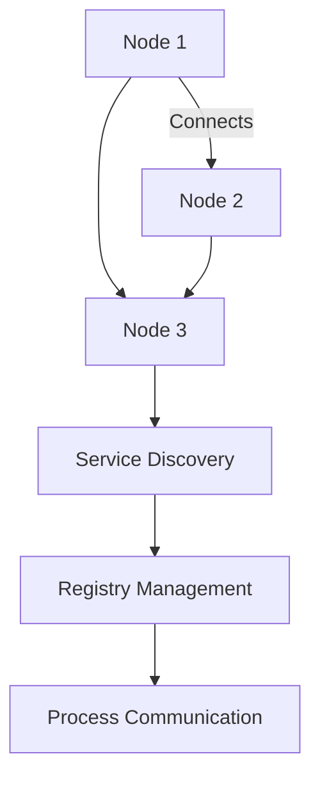

## 14.12. Distributed Systems and Service Discovery

In the realm of modern software architecture, distributed systems have become a cornerstone for building scalable and resilient applications. Elixir, with its roots in the Erlang ecosystem, is inherently designed to support distributed computing. This section delves into the concepts of distributed systems and service discovery in Elixir, focusing on clustering, discovery mechanisms, and registry management.

### Understanding Distributed Systems

Distributed systems are collections of independent computers that appear to the users as a single coherent system. They offer numerous advantages, such as improved performance, fault tolerance, and scalability. However, they also introduce challenges like network latency, partial failures, and the need for effective service discovery.

#### Key Characteristics of Distributed Systems

- **Scalability**: The ability to handle increased load by adding more nodes.
- **Fault Tolerance**: The system's capacity to continue operating despite failures.
- **Consistency**: Ensuring data consistency across distributed nodes.
- **Latency**: Minimizing the time taken for data to travel across the network.

### Clustering in Elixir

Clustering is the process of connecting multiple nodes to form a distributed system. In Elixir, clustering is facilitated by the BEAM (Bogdan/Björn's Erlang Abstract Machine) virtual machine, which allows nodes to communicate seamlessly.

#### Setting Up a Cluster

To set up a cluster in Elixir, you need to connect multiple nodes. Each node runs an instance of the BEAM VM and can communicate with other nodes in the cluster.

```elixir
# Start the Elixir shell with a node name
$ iex --sname node1

# Connect to another node
Node.connect(:'node2@hostname')

# Verify the connection
Node.list() # Should return [:'node2@hostname']
```

#### Clustering with `libcluster`

`libcluster` is a popular library in Elixir for automatic node discovery and clustering. It supports various strategies for node discovery, such as DNS, Kubernetes, and multicast.

To use `libcluster`, add it to your `mix.exs` dependencies:

```elixir
defp deps do
  [
    {:libcluster, "~> 3.3"}
  ]
end
```

Configure `libcluster` in your application:

```elixir
config :libcluster,
  topologies: [
    example: [
      strategy: Cluster.Strategy.Gossip,
      config: [
        port: 45892
      ]
    ]
  ]
```

### Service Discovery Mechanisms

Service discovery is crucial in distributed systems to enable nodes to find and communicate with each other. Elixir provides several mechanisms for service discovery, including built-in tools and third-party libraries.

#### Using `libcluster` for Service Discovery

`libcluster` not only helps in clustering but also in service discovery. It automatically discovers nodes based on the configured strategy and connects them.

```elixir
# Example configuration for Kubernetes
config :libcluster,
  topologies: [
    k8s_example: [
      strategy: Cluster.Strategy.Kubernetes,
      config: [
        kubernetes_node_basename: "myapp",
        kubernetes_selector: "app=myapp",
        kubernetes_namespace: "default"
      ]
    ]
  ]
```

#### Other Discovery Libraries

- **Consul**: A service mesh solution providing service discovery, configuration, and segmentation.
- **Eureka**: A service registry for resilient mid-tier load balancing and failover.

### Registry Management

In distributed systems, managing processes and their discovery is essential. Elixir provides robust tools for registry management, allowing you to track and communicate with distributed processes.

#### Using `Registry` Module

Elixir's `Registry` module is a local process registry that can be used to register and look up processes by name.

```elixir
# Define a registry
defmodule MyApp.Registry do
  use Registry, keys: :unique, name: MyApp.Registry
end

# Start the registry
{:ok, _} = Registry.start_link(keys: :unique, name: MyApp.Registry)

# Register a process
Registry.register(MyApp.Registry, :my_process, :some_value)

# Lookup a process
Registry.lookup(MyApp.Registry, :my_process)
```

#### Distributed Registry with `Horde`

`Horde` is a library for building distributed registries and supervisors. It allows you to create a distributed registry that spans multiple nodes.

```elixir
# Add Horde to your dependencies
defp deps do
  [
    {:horde, "~> 0.8.3"}
  ]
end

# Start a distributed registry
{:ok, _} = Horde.Registry.start_link(name: MyApp.DistributedRegistry, keys: :unique)

# Register a process
Horde.Registry.register(MyApp.DistributedRegistry, :my_process, :some_value)

# Lookup a process
Horde.Registry.lookup(MyApp.DistributedRegistry, :my_process)
```

### Visualizing Distributed Systems and Service Discovery

To better understand the architecture of distributed systems and service discovery, let's visualize the process using a Mermaid.js diagram.



**Diagram Description**: This diagram illustrates a simple distributed system with three nodes connected. The nodes utilize service discovery to manage process communication through a registry.

### Design Considerations

When designing distributed systems in Elixir, consider the following:

- **Network Reliability**: Ensure your system can handle network partitions and latency.
- **Data Consistency**: Choose the right consistency model for your application.
- **Fault Tolerance**: Implement strategies to recover from node failures.
- **Scalability**: Design your system to scale horizontally by adding more nodes.

### Elixir Unique Features

Elixir's unique features, such as lightweight processes, message passing, and the BEAM's fault-tolerant design, make it an excellent choice for building distributed systems. The language's concurrency model allows developers to create scalable and resilient applications with ease.

### Differences and Similarities

Distributed systems in Elixir share similarities with other languages, such as using service discovery and clustering. However, Elixir's actor model and process isolation provide a distinct approach to handling concurrency and fault tolerance.

### Try It Yourself

Experiment with the code examples provided in this section. Try modifying the `libcluster` configuration to use different strategies, or implement a distributed registry using `Horde`. Observe how nodes discover each other and communicate within the cluster.

### Knowledge Check

- What are the key characteristics of distributed systems?
- How does Elixir facilitate clustering and service discovery?
- What role does the `Registry` module play in distributed systems?

### Summary

In this section, we've explored the concepts of distributed systems and service discovery in Elixir. We've covered clustering, discovery mechanisms, and registry management, providing you with the tools to build scalable and resilient distributed applications. Remember, this is just the beginning. As you progress, you'll build more complex and interactive distributed systems. Keep experimenting, stay curious, and enjoy the journey!

## Quiz: Distributed Systems and Service Discovery



### What is the primary purpose of clustering in Elixir?

- [x] To connect multiple nodes for distributed processing
- [ ] To improve the speed of a single node
- [ ] To reduce memory usage
- [ ] To simplify code structure

> **Explanation:** Clustering connects multiple nodes to form a distributed system, allowing for distributed processing.

### Which library is commonly used for automatic node discovery in Elixir?

- [x] libcluster
- [ ] Phoenix
- [ ] Ecto
- [ ] Plug

> **Explanation:** `libcluster` is a popular library in Elixir for automatic node discovery and clustering.

### What is the role of the `Registry` module in Elixir?

- [x] To manage process registration and lookup
- [ ] To handle HTTP requests
- [ ] To manage database connections
- [ ] To perform mathematical calculations

> **Explanation:** The `Registry` module is used for managing process registration and lookup in Elixir.

### How does `libcluster` facilitate service discovery?

- [x] By automatically discovering and connecting nodes based on configured strategies
- [ ] By providing a web interface for node management
- [ ] By storing node information in a database
- [ ] By using a command-line tool for node configuration

> **Explanation:** `libcluster` automatically discovers and connects nodes based on the configured strategies.

### What is a key characteristic of distributed systems?

- [x] Scalability
- [ ] Single-threaded execution
- [ ] Centralized control
- [ ] Limited fault tolerance

> **Explanation:** Scalability is a key characteristic of distributed systems, allowing them to handle increased load by adding more nodes.

### Which library can be used for building a distributed registry in Elixir?

- [x] Horde
- [ ] Plug
- [ ] Ecto
- [ ] Phoenix

> **Explanation:** `Horde` is a library for building distributed registries and supervisors in Elixir.

### What is the primary advantage of using the BEAM VM for distributed systems?

- [x] Fault tolerance and lightweight process management
- [ ] High memory usage
- [ ] Complex configuration
- [ ] Limited scalability

> **Explanation:** The BEAM VM provides fault tolerance and lightweight process management, making it ideal for distributed systems.

### How can you verify a node connection in Elixir?

- [x] Using `Node.list()`
- [ ] Using `Process.info()`
- [ ] Using `Registry.lookup()`
- [ ] Using `GenServer.call()`

> **Explanation:** `Node.list()` returns a list of connected nodes, allowing you to verify node connections.

### What is a common challenge in distributed systems?

- [x] Network latency and partial failures
- [ ] Single-threaded execution
- [ ] Centralized control
- [ ] Limited fault tolerance

> **Explanation:** Network latency and partial failures are common challenges in distributed systems.

### True or False: Elixir's actor model provides a distinct approach to handling concurrency and fault tolerance.

- [x] True
- [ ] False

> **Explanation:** Elixir's actor model and process isolation provide a unique approach to handling concurrency and fault tolerance.




