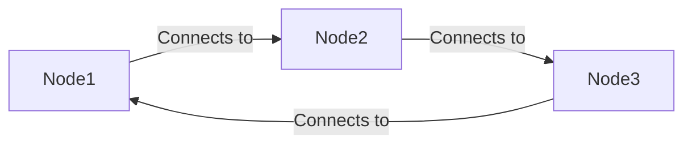
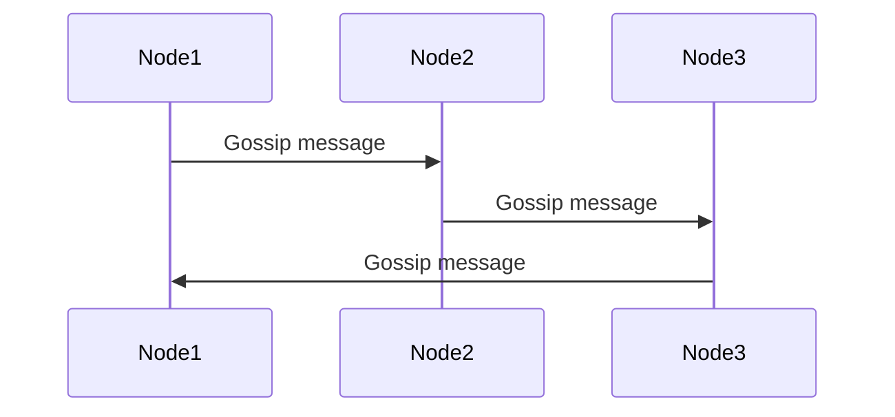
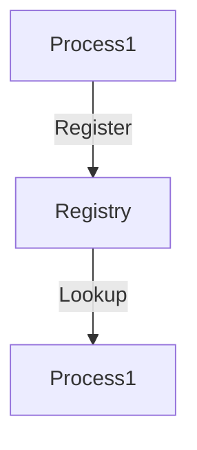

## 14.12. Distributed Systems and Service Discovery

As systems grow in complexity and scale, the need for distributed systems becomes apparent. Elixir, with its roots in Erlang, is uniquely suited for building distributed systems due to its concurrency model and fault-tolerance capabilities. In this section, we will delve into the intricacies of distributed systems and service discovery in Elixir, focusing on clustering, discovery mechanisms, and registry management for distributed processes.

### Understanding Distributed Systems

Distributed systems are collections of independent computers that appear to the user as a single coherent system. They offer several advantages, including:

- **Scalability:** Ability to handle increased load by adding more nodes.
- **Fault Tolerance:** Continued operation despite failures in individual components.
- **Resource Sharing:** Efficient utilization of resources across multiple nodes.

In Elixir, distributed systems leverage the BEAM VM's capabilities to manage processes across nodes seamlessly.

### Clustering in Elixir

**Clustering** is the process of connecting multiple nodes so they can communicate and work together. In Elixir, nodes are individual instances of the BEAM VM that can be connected to form a cluster. Each node has a unique name and can communicate with other nodes in the cluster.

#### Setting Up a Basic Cluster

To set up a cluster in Elixir, you need to start multiple nodes and connect them. Here's a simple example:

```elixir
# Start nodes with names
iex --sname node1 -S mix
iex --sname node2 -S mix

# Connect nodes
Node.connect(:node2@hostname)
```

**Key Points:**

- **Node Names:** Nodes are identified by their names, which include the hostname.
- **Connection:** Use `Node.connect/1` to establish a connection between nodes.

#### Visualizing Node Connections

Below is a diagram illustrating how nodes connect in a cluster:


```mermaid
graph LR
    A[Node1] -- Connects to --> B[Node2]
    B -- Connects to --> C[Node3]
    C -- Connects to --> A
```

**Diagram Explanation:** This diagram shows a simple cluster with three nodes, each connected to the others, forming a fully connected network.

### Discovery Mechanisms

In a distributed system, nodes must discover each other to form a cluster. Manual configuration is impractical in large systems, so automatic discovery mechanisms are essential.

#### Using `libcluster` for Automatic Node Discovery

`libcluster` is a popular library in Elixir for automatic node discovery. It supports various strategies for discovering nodes, such as DNS, Kubernetes, and gossip protocols.

**Installation:**

Add `libcluster` to your `mix.exs` dependencies:

```elixir
defp deps do
  [
    {:libcluster, "~> 3.3"}
  ]
end
```

**Configuration:**

Configure `libcluster` in your application:

```elixir
config :libcluster,
  topologies: [
    example: [
      strategy: Cluster.Strategy.Gossip,
      config: [
        port: 45892
      ]
    ]
  ]
```

**Key Points:**

- **Strategies:** `libcluster` supports multiple strategies for different environments.
- **Configuration:** Customize the configuration to suit your network topology.

#### Visualizing Discovery Mechanisms

Here's a diagram illustrating how `libcluster` discovers nodes using a gossip strategy:


```mermaid
sequenceDiagram
    participant A as Node1
    participant B as Node2
    participant C as Node3

    A->>B: Gossip message
    B->>C: Gossip message
    C->>A: Gossip message
```

**Diagram Explanation:** This sequence diagram shows how nodes exchange gossip messages to discover each other and form a cluster.

### Registry Management

In a distributed system, managing processes and their discovery is crucial. Elixir provides several tools for registry management, allowing you to keep track of distributed processes.

#### Using `Registry` for Process Management

Elixir's `Registry` module provides a way to register and look up processes by name. This is useful in a distributed system where processes may reside on different nodes.

**Example:**

```elixir
defmodule MyApp.Registry do
  use GenServer

  def start_link(_) do
    Registry.start_link(keys: :unique, name: MyApp.Registry)
  end

  def register(name, pid) do
    Registry.register(MyApp.Registry, name, pid)
  end

  def lookup(name) do
    case Registry.lookup(MyApp.Registry, name) do
      [{pid, _}] -> {:ok, pid}
      [] -> :error
    end
  end
end
```

**Key Points:**

- **Unique Keys:** Use unique keys to register processes.
- **Lookup:** Efficiently look up processes by name.

#### Visualizing Registry Management

Below is a diagram illustrating how processes are registered and looked up in a registry:


```mermaid
graph TD
    A[Process1] -->|Register| B[Registry]
    B -->|Lookup| C[Process1]
```

**Diagram Explanation:** This diagram shows how a process is registered with a registry and then looked up by name.

### Elixir Unique Features for Distributed Systems

Elixir offers several unique features that make it well-suited for distributed systems:

- **Lightweight Processes:** The BEAM VM supports millions of lightweight processes, making it ideal for concurrent and distributed applications.
- **Fault Tolerance:** Supervisors and the "let it crash" philosophy ensure robust fault tolerance.
- **Hot Code Upgrades:** Elixir supports upgrading code without stopping the system, essential for distributed systems.

### Differences and Similarities with Other Patterns

Distributed systems in Elixir share similarities with other patterns, such as microservices, but differ in their focus on process management and fault tolerance.

- **Similarities:** Both patterns emphasize scalability and fault tolerance.
- **Differences:** Distributed systems focus on process-level management, while microservices often focus on service-level management.

### Design Considerations

When designing distributed systems in Elixir, consider the following:

- **Network Latency:** Minimize latency by optimizing communication between nodes.
- **Data Consistency:** Ensure data consistency across nodes, especially in distributed databases.
- **Fault Tolerance:** Design with fault tolerance in mind, using supervisors and redundancy.

### Sample Code Snippet

Here's a complete example demonstrating a simple distributed system with node discovery and registry management:

```elixir
defmodule MyApp.Application do
  use Application

  def start(_type, _args) do
    children = [
      {Cluster.Supervisor, [Application.get_env(:libcluster, :topologies), [name: MyApp.ClusterSupervisor]]},
      MyApp.Registry
    ]

    opts = [strategy: :one_for_one, name: MyApp.Supervisor]
    Supervisor.start_link(children, opts)
  end
end

defmodule MyApp.Worker do
  use GenServer

  def start_link(name) do
    GenServer.start_link(__MODULE__, name, name: via_tuple(name))
  end

  defp via_tuple(name), do: {:via, Registry, {MyApp.Registry, name}}

  def init(name) do
    {:ok, name}
  end
end
```

**Code Explanation:**

- **Cluster.Supervisor:** Manages node discovery using `libcluster`.
- **Registry:** Manages process registration and lookup.
- **Worker:** A simple GenServer registered with the registry.

### Try It Yourself

Experiment with the code by:

- **Adding More Nodes:** Start additional nodes and observe how they join the cluster.
- **Simulating Failures:** Kill a node and see how the system handles the failure.
- **Extending Functionality:** Add more processes and register them with the registry.

### Knowledge Check

- **What are the benefits of using distributed systems?**
- **How does `libcluster` facilitate node discovery?**
- **What role does the `Registry` module play in process management?**

### Embrace the Journey

Remember, building distributed systems is a journey. As you progress, you'll encounter challenges and opportunities to optimize your system. Keep experimenting, stay curious, and enjoy the journey!

## Quiz Time!



### What is a key advantage of distributed systems?

- [x] Scalability
- [ ] Complexity
- [ ] Single point of failure
- [ ] Increased latency

> **Explanation:** Distributed systems are designed to scale by adding more nodes to handle increased load.

### Which library is commonly used for automatic node discovery in Elixir?

- [ ] Ecto
- [x] libcluster
- [ ] Phoenix
- [ ] ExUnit

> **Explanation:** `libcluster` is a popular library in Elixir for automatic node discovery.

### What is the purpose of the `Registry` module in Elixir?

- [ ] To manage database connections
- [ ] To handle HTTP requests
- [x] To register and look up processes by name
- [ ] To compile Elixir code

> **Explanation:** The `Registry` module is used to register and look up processes by name in Elixir.

### How do nodes communicate in a cluster?

- [x] By connecting to each other using node names
- [ ] By sharing a common database
- [ ] By using HTTP requests
- [ ] By sending emails

> **Explanation:** Nodes communicate in a cluster by connecting to each other using their unique node names.

### What strategy does `libcluster` use for node discovery in the example?

- [ ] DNS
- [ ] Kubernetes
- [x] Gossip
- [ ] Static

> **Explanation:** The example uses the gossip strategy for node discovery with `libcluster`.

### Which of the following is a unique feature of Elixir for distributed systems?

- [x] Lightweight processes
- [ ] Heavyweight threads
- [ ] Single-threaded execution
- [ ] Manual memory management

> **Explanation:** Elixir supports lightweight processes, which are ideal for concurrent and distributed applications.

### What is the "let it crash" philosophy in Elixir?

- [x] Allowing processes to crash and be restarted by supervisors
- [ ] Preventing all crashes at any cost
- [ ] Ignoring errors completely
- [ ] Manually restarting crashed processes

> **Explanation:** The "let it crash" philosophy in Elixir involves allowing processes to crash and be restarted by supervisors for fault tolerance.

### What is a key consideration when designing distributed systems?

- [x] Network latency
- [ ] Single-threaded execution
- [ ] Manual memory management
- [ ] Ignoring errors

> **Explanation:** Network latency is a key consideration when designing distributed systems to ensure efficient communication between nodes.

### How can you extend the functionality of the sample code provided?

- [x] By adding more processes and registering them with the registry
- [ ] By removing the registry
- [ ] By using HTTP requests instead of node connections
- [ ] By disabling node discovery

> **Explanation:** You can extend the functionality by adding more processes and registering them with the registry for better process management.

### True or False: Elixir supports hot code upgrades without stopping the system.

- [x] True
- [ ] False

> **Explanation:** Elixir supports hot code upgrades, allowing you to update code without stopping the system, which is essential for distributed systems.


