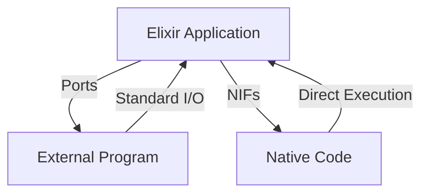

## 14.2. Using Ports and NIFs for Native Integration

As expert software engineers and architects, we often encounter scenarios where we need to integrate Elixir applications with external systems or optimize performance-critical sections of our code. Elixir provides two powerful mechanisms for such native integrations: Ports and Native Implemented Functions (NIFs). This section will delve into these mechanisms, exploring their use cases, implementation details, and best practices.

### Introduction to Native Integration

Native integration in Elixir allows us to extend the capabilities of our applications by interacting with external programs or leveraging native code for performance improvements. This is crucial when dealing with legacy systems, performing computationally intensive tasks, or interfacing with hardware.

### Ports: Communicating with External Programs

Ports provide a way to communicate with external programs using standard input and output. They are ideal for scenarios where you need to run an external program and exchange data with it. Ports are managed by the BEAM (Erlang Virtual Machine), ensuring that the external program runs as a separate OS process, thus maintaining the fault-tolerant nature of Elixir applications.

#### How Ports Work

Ports act as a bridge between the Elixir application and the external program. They use the operating system's process management to start and communicate with the external program. The communication is typically done through standard input/output streams.

```elixir
# Example of using a port to communicate with an external program
defmodule PortExample do
  def start_external_program do
    port = Port.open({:spawn, "external_program"}, [:binary])
    send(port, {self(), {:command, "input_data"}})
    receive do
      {^port, {:data, data}} ->
        IO.puts("Received data: #{data}")
    end
  end
end
```

In this example, we spawn an external program and send data to it. We then receive the processed data back from the program.

#### Advantages of Using Ports

- **Isolation**: Since the external program runs as a separate OS process, it does not affect the BEAM's stability.
- **Fault Tolerance**: If the external program crashes, it does not bring down the Elixir application.
- **Flexibility**: Ports can be used to interface with any program that can read from stdin and write to stdout.

#### Considerations When Using Ports

- **Performance**: Communication with external programs can introduce latency due to context switching between processes.
- **Error Handling**: Ensure robust error handling for scenarios where the external program might fail or produce unexpected output.

### Native Implemented Functions (NIFs): Writing Performance-Critical Code

NIFs allow you to write functions in C (or other languages) that can be called directly from Elixir code. This is particularly useful for performance-critical sections where the overhead of calling an external program would be too high.

#### How NIFs Work

NIFs are shared libraries loaded into the BEAM. They provide a way to execute native code directly within the BEAM process, offering significant performance improvements for computationally intensive tasks.

```c
// Example of a simple NIF in C
#include "erl_nif.h"

static ERL_NIF_TERM add(ErlNifEnv* env, int argc, const ERL_NIF_TERM argv[]) {
    int a, b;
    if (!enif_get_int(env, argv[0], &a) || !enif_get_int(env, argv[1], &b)) {
        return enif_make_badarg(env);
    }
    return enif_make_int(env, a + b);
}

static ErlNifFunc nif_funcs[] = {
    {"add", 2, add}
};

ERL_NIF_INIT(Elixir.MyModule, nif_funcs, NULL, NULL, NULL, NULL)
```

In this example, we define a simple NIF that adds two integers. The NIF is then loaded into an Elixir module, allowing us to call the `add` function from Elixir code.

#### Advantages of Using NIFs

- **Performance**: NIFs execute within the BEAM process, minimizing the overhead of context switching.
- **Direct Access**: NIFs provide direct access to system resources and libraries, enabling complex operations that are not feasible in pure Elixir.

#### Considerations When Using NIFs

- **Blocking**: Long-running NIFs can block the BEAM scheduler, affecting the responsiveness of the entire system. Always ensure that NIFs execute quickly or offload long-running tasks to separate threads.
- **Stability**: Since NIFs run within the BEAM process, a crash in a NIF can bring down the entire VM. Implement thorough error handling and testing.
- **Complexity**: Writing and maintaining NIFs requires knowledge of both Elixir and the native language used.

### Design Considerations for Native Integration

When deciding between Ports and NIFs, consider the following:

- **Use Ports** when you need to interact with existing external programs or when isolation and fault tolerance are critical.
- **Use NIFs** for performance-critical tasks where the overhead of inter-process communication would be prohibitive.

### Elixir Unique Features

Elixir's integration with the BEAM provides unique advantages for native integration:

- **Concurrency**: Elixir's lightweight processes and message-passing model make it easy to manage communication with external programs.
- **Fault Tolerance**: The BEAM's supervision trees ensure that failures in external programs or NIFs can be gracefully handled.
- **Hot Code Swapping**: Elixir's ability to update code without stopping the system can be leveraged to update NIFs or change port configurations dynamically.

### Differences and Similarities

While both Ports and NIFs enable native integration, they serve different purposes and have distinct characteristics:

- **Ports** are ideal for interfacing with external programs, providing isolation and fault tolerance.
- **NIFs** are suited for performance-critical tasks, offering direct execution within the BEAM.

### Try It Yourself

Experiment with the provided examples by modifying the external program or NIF code. Try creating a port that communicates with a Python script or a NIF that performs complex mathematical operations.

### Visualizing Native Integration

Below is a diagram illustrating the interaction between Elixir, Ports, and NIFs:



This diagram shows how Elixir applications can communicate with external programs via Ports and execute native code using NIFs.

### References and Links

- [Elixir Ports Documentation](https://hexdocs.pm/elixir/Port.html)
- [Erlang NIFs Documentation](https://erlang.org/doc/man/erl_nif.html)
- [Elixir Forum: Ports vs. NIFs](https://elixirforum.com/t/ports-vs-nifs/)

### Knowledge Check

- What are the primary differences between Ports and NIFs?
- How can you ensure that a NIF does not block the BEAM scheduler?
- What are the advantages of using Ports for native integration?

### Embrace the Journey

Remember, mastering native integration in Elixir is a journey. As you progress, you'll gain the ability to create more efficient and powerful applications. Keep experimenting, stay curious, and enjoy the process!

## Quiz: Using Ports and NIFs for Native Integration



### What is the primary purpose of using Ports in Elixir?

- [x] To communicate with external programs via stdin/stdout.
- [ ] To execute native code directly within the BEAM.
- [ ] To manage concurrency in Elixir applications.
- [ ] To handle errors in Elixir applications.

> **Explanation:** Ports are used to communicate with external programs using standard input and output.

### What is a key advantage of using NIFs over Ports?

- [x] NIFs offer direct execution within the BEAM, minimizing overhead.
- [ ] NIFs provide isolation from the BEAM process.
- [ ] NIFs are easier to implement than Ports.
- [ ] NIFs automatically handle errors in native code.

> **Explanation:** NIFs execute directly within the BEAM, offering performance benefits by minimizing context switching.

### How can you prevent a NIF from blocking the BEAM scheduler?

- [x] Ensure that NIFs execute quickly or offload long-running tasks to separate threads.
- [ ] Use Ports instead of NIFs for all native integrations.
- [ ] Implement error handling within the NIF.
- [ ] Use a different programming language for the NIF.

> **Explanation:** To prevent blocking, NIFs should execute quickly or use separate threads for long-running tasks.

### Which of the following is a disadvantage of using NIFs?

- [x] A crash in a NIF can bring down the entire BEAM VM.
- [ ] NIFs cannot access system resources directly.
- [ ] NIFs are slower than Ports for performance-critical tasks.
- [ ] NIFs cannot be used for computationally intensive tasks.

> **Explanation:** Since NIFs run within the BEAM process, a crash can affect the entire VM.

### What is a common use case for Ports in Elixir?

- [x] Interfacing with existing external programs.
- [ ] Performing computationally intensive tasks.
- [ ] Accessing system resources directly.
- [ ] Managing concurrency in Elixir applications.

> **Explanation:** Ports are commonly used to interface with external programs, leveraging their existing functionality.

### What is the role of the BEAM in managing Ports?

- [x] The BEAM manages Ports by running external programs as separate OS processes.
- [ ] The BEAM executes Ports directly within its process.
- [ ] The BEAM uses Ports to handle concurrency.
- [ ] The BEAM prevents Ports from accessing system resources.

> **Explanation:** The BEAM ensures that external programs run as separate OS processes, maintaining isolation.

### How does Elixir's concurrency model benefit native integration?

- [x] It allows easy management of communication with external programs.
- [ ] It automatically optimizes performance-critical tasks.
- [ ] It prevents all errors in native code.
- [ ] It simplifies the implementation of NIFs.

> **Explanation:** Elixir's concurrency model facilitates communication with external programs through message passing.

### What is a key consideration when using NIFs?

- [x] Avoiding long-running NIFs that could block the scheduler.
- [ ] Ensuring that NIFs are written in Elixir.
- [ ] Using NIFs for all native integrations.
- [ ] Implementing NIFs without error handling.

> **Explanation:** Long-running NIFs can block the BEAM scheduler, affecting system responsiveness.

### Which of the following is a benefit of using Ports?

- [x] Ports provide fault tolerance by running external programs as separate processes.
- [ ] Ports execute native code directly within the BEAM.
- [ ] Ports are faster than NIFs for performance-critical tasks.
- [ ] Ports automatically handle errors in external programs.

> **Explanation:** Ports maintain fault tolerance by isolating external programs as separate OS processes.

### True or False: NIFs are always the best choice for native integration in Elixir.

- [ ] True
- [x] False

> **Explanation:** While NIFs offer performance benefits, they are not always the best choice due to potential stability issues and blocking concerns.


