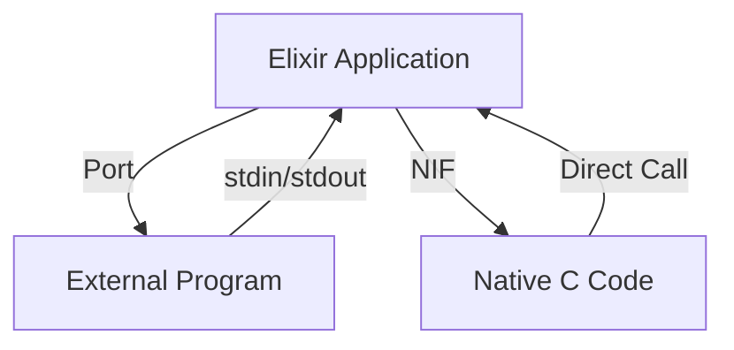

## 14.2. Using Ports and NIFs for Native Integration

In the realm of software engineering, integrating a high-level language like Elixir with lower-level native code can unlock significant performance improvements and allow access to system-level operations. This section delves into two primary mechanisms for achieving native integration in Elixir: **Ports** and **Native Implemented Functions (NIFs)**. These tools enable Elixir developers to harness the power of C and other languages, ensuring that Elixir applications remain both efficient and versatile.

### Introduction to Native Integration

Native integration refers to the ability of Elixir to interact with code written in languages like C, C++, or Rust. This is crucial for tasks that require high performance or system-level access, such as image processing, cryptography, or interfacing with hardware.

**Ports** and **NIFs** are the two primary mechanisms Elixir provides for native integration:

- **Ports**: Allow communication with external programs via standard input and output.
- **NIFs**: Enable writing performance-critical code in C for direct integration with Elixir.

### Understanding Ports

Ports in Elixir provide a way to communicate with external programs. This is done by starting an external OS process and communicating with it using standard input/output. Ports are useful when you need to leverage existing programs or libraries without rewriting them in Elixir.

#### How Ports Work

A Port in Elixir is essentially a communication channel between the Erlang VM and an external program. Here's how it works:

1. **Start the External Program**: Use the `Port.open/2` function to start an external program.
2. **Communicate via Messages**: Send and receive messages to and from the external program using the port.
3. **Handle Responses**: Process the responses from the external program within your Elixir application.

#### Example: Using Ports to Communicate with a Python Script

Let's consider a simple example where we use a Port to communicate with a Python script that performs a mathematical operation:

```elixir
defmodule MathPort do
  def start do
    # Open a port to the Python script
    port = Port.open({:spawn, "python3 math_script.py"}, [:binary])

    # Send a message to the Python script
    send(port, {self(), {:command, "5 3"}})

    # Receive the response
    receive do
      {^port, {:data, result}} ->
        IO.puts("Result from Python: #{result}")
    end
  end
end
```

The corresponding Python script (`math_script.py`) might look like this:

```python
import sys

for line in sys.stdin:
    numbers = line.strip().split()
    result = int(numbers[0]) + int(numbers[1])
    print(result)
    sys.stdout.flush()
```

**Key Points**:
- **Port.open/2** is used to start the external program.
- Communication is done via message passing.
- The external program reads from `stdin` and writes to `stdout`.

#### Considerations When Using Ports

- **Performance**: Ports introduce some overhead due to inter-process communication.
- **Error Handling**: Ensure proper error handling in both the Elixir and external program.
- **Security**: Be cautious when executing external programs to avoid security vulnerabilities.

### Native Implemented Functions (NIFs)

NIFs allow you to write functions in C and call them directly from Elixir. This is ideal for performance-critical operations where the overhead of Ports is unacceptable.

#### How NIFs Work

NIFs are shared libraries written in C that are dynamically loaded into the Erlang VM. They provide a way to execute native code directly from Elixir, offering significant performance benefits.

#### Example: Writing a Simple NIF

Let's create a simple NIF that adds two numbers:

1. **Create the C Code**: Write a C function that performs the addition.

```c
#include "erl_nif.h"

static ERL_NIF_TERM add(ErlNifEnv* env, int argc, const ERL_NIF_TERM argv[]) {
    int a, b;
    if (!enif_get_int(env, argv[0], &a) || !enif_get_int(env, argv[1], &b)) {
        return enif_make_badarg(env);
    }
    return enif_make_int(env, a + b);
}

static ErlNifFunc nif_funcs[] = {
    {"add", 2, add}
};

ERL_NIF_INIT(Elixir.MathNif, nif_funcs, NULL, NULL, NULL, NULL)
```

2. **Compile the C Code**: Use a Makefile to compile the C code into a shared library.

```makefile
ERL_CFLAGS := $(shell erl -eval 'io:format("~s", [code:root_dir()])' -s init stop -noshell)/usr/include
ERL_LIB := $(shell erl -eval 'io:format("~s", [code:root_dir()])' -s init stop -noshell)/usr/lib

CFLAGS = -I$(ERL_CFLAGS)
LDFLAGS = -shared -L$(ERL_LIB) -lerl_interface -lei -lpthread

math_nif.so: math_nif.c
    gcc $(CFLAGS) $(LDFLAGS) -o $@ $^

clean:
    rm -f math_nif.so
```

3. **Load the NIF in Elixir**: Create an Elixir module that loads and uses the NIF.

```elixir
defmodule MathNif do
  use Rustler, otp_app: :my_app, crate: "math_nif"

  # Define the NIF function
  def add(_a, _b), do: :erlang.nif_error(:nif_not_loaded)
end
```

4. **Call the NIF from Elixir**: Use the NIF in your Elixir code.

```elixir
defmodule Example do
  def calculate do
    result = MathNif.add(5, 3)
    IO.puts("Result from NIF: #{result}")
  end
end
```

**Key Points**:
- NIFs are ideal for performance-critical code.
- They are written in C and compiled into shared libraries.
- Use the `Rustler` library to simplify NIF creation.

#### Considerations When Using NIFs

- **Blocking**: Avoid long-running NIFs as they can block the Erlang scheduler.
- **Crash Safety**: A crash in a NIF can bring down the entire VM.
- **Complexity**: Writing NIFs requires knowledge of C and the Erlang NIF API.

### Visualizing the Interaction Between Elixir and Native Code

Below is a diagram illustrating the interaction between Elixir and native code using Ports and NIFs:


```mermaid
graph TD;
    A[Elixir Application] -->|Port| B[External Program];
    A -->|NIF| C[Native C Code];
    B -->|stdin/stdout| A;
    C -->|Direct Call| A;
```

**Diagram Explanation**:
- **Ports**: Represented by the communication between the Elixir application and an external program via `stdin` and `stdout`.
- **NIFs**: Represented by the direct call from Elixir to native C code.

### When to Use Ports vs. NIFs

- **Use Ports** when:
  - You need to integrate with existing external programs.
  - The external process might crash, and you want to isolate it from the Elixir VM.
  - The communication overhead is acceptable.

- **Use NIFs** when:
  - You require high performance and low latency.
  - The native code is stable and unlikely to crash.
  - You have control over the native code and can ensure it runs quickly.

### Best Practices for Native Integration

- **Isolate Long-Running Tasks**: Use Ports for long-running or potentially unstable tasks to avoid crashing the VM.
- **Optimize NIFs**: Ensure NIFs are short and efficient to prevent blocking the scheduler.
- **Error Handling**: Implement robust error handling in both Elixir and native code.
- **Security**: Validate all inputs to native code to prevent vulnerabilities.

### Try It Yourself

To deepen your understanding, try modifying the examples provided:

- **Experiment with Ports**: Change the Python script to perform a different operation or use a different language.
- **Enhance the NIF**: Add more functions to the NIF or optimize the existing function for better performance.

### References and Further Reading

- [Elixir Official Documentation](https://elixir-lang.org/docs.html)
- [Erlang Ports Documentation](https://erlang.org/doc/reference_manual/ports.html)
- [Erlang NIFs Documentation](https://erlang.org/doc/man/erl_nif.html)

### Knowledge Check

Reflect on the following questions to test your understanding:

- What are the main differences between Ports and NIFs?
- How can you ensure that a NIF does not block the Erlang scheduler?
- What are some security considerations when using Ports?

### Conclusion

Using Ports and NIFs for native integration in Elixir opens up a world of possibilities for performance optimization and system-level access. By understanding the strengths and limitations of each approach, you can make informed decisions about when and how to use them in your applications. Remember, this is just the beginning. Keep experimenting, stay curious, and enjoy the journey!

## Quiz Time!



### What is the primary purpose of using Ports in Elixir?

- [x] Communicating with external programs via stdin/stdout.
- [ ] Writing performance-critical code in C.
- [ ] Accessing system-level operations directly.
- [ ] Managing concurrency in Elixir applications.

> **Explanation:** Ports are used to communicate with external programs through standard input and output.

### What is a key advantage of using NIFs over Ports?

- [x] Direct integration with Elixir for performance-critical code.
- [ ] Isolation of external processes to prevent VM crashes.
- [ ] Easier error handling in external programs.
- [ ] Reduced complexity in writing native code.

> **Explanation:** NIFs allow direct integration with Elixir, providing significant performance benefits for critical code.

### Why should long-running NIFs be avoided?

- [x] They can block the Erlang scheduler.
- [ ] They increase the complexity of the code.
- [ ] They are difficult to write and maintain.
- [ ] They cannot handle errors effectively.

> **Explanation:** Long-running NIFs can block the Erlang scheduler, affecting the performance of the entire system.

### Which of the following is a potential risk when using NIFs?

- [x] A crash in a NIF can bring down the entire VM.
- [ ] Increased communication overhead.
- [ ] Difficulty in integrating with existing programs.
- [ ] Limited access to system-level operations.

> **Explanation:** A crash in a NIF can bring down the entire VM because NIFs run in the same memory space as the Erlang VM.

### When is it preferable to use Ports instead of NIFs?

- [x] When integrating with existing external programs.
- [ ] When performance is the top priority.
- [ ] When the native code is stable and unlikely to crash.
- [ ] When you have control over the native code.

> **Explanation:** Ports are preferable when integrating with existing external programs to isolate them from the Elixir VM.

### Which function is used to start an external program with Ports in Elixir?

- [x] Port.open/2
- [ ] Port.start/1
- [ ] Port.run/3
- [ ] Port.execute/2

> **Explanation:** `Port.open/2` is the function used to start an external program with Ports in Elixir.

### What is a key security consideration when using Ports?

- [x] Validating all inputs to prevent vulnerabilities.
- [ ] Ensuring the native code runs quickly.
- [ ] Implementing robust error handling in native code.
- [ ] Using the Rustler library for NIF creation.

> **Explanation:** Validating all inputs is crucial to prevent vulnerabilities when using Ports.

### How can you prevent a NIF from blocking the Erlang scheduler?

- [x] Ensure NIFs are short and efficient.
- [ ] Use Ports instead of NIFs.
- [ ] Write NIFs in a higher-level language.
- [ ] Use the Rustler library for NIF creation.

> **Explanation:** Ensuring NIFs are short and efficient prevents them from blocking the Erlang scheduler.

### What is the role of the `Rustler` library in NIF creation?

- [x] Simplifying NIF creation.
- [ ] Compiling C code into shared libraries.
- [ ] Managing concurrency in Elixir applications.
- [ ] Communicating with external programs.

> **Explanation:** The `Rustler` library simplifies the creation of NIFs in Elixir.

### True or False: Ports introduce some overhead due to inter-process communication.

- [x] True
- [ ] False

> **Explanation:** Ports introduce some overhead due to the nature of inter-process communication.


