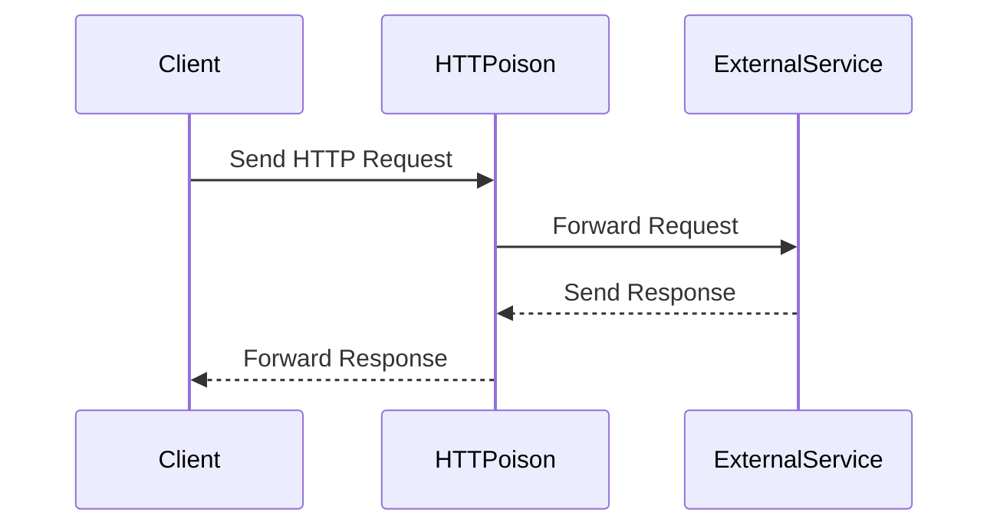

## 14.3. Communicating with External Services

In today's interconnected world, applications rarely operate in isolation. They often need to communicate with external services, whether it's to fetch data, send notifications, or interact with third-party APIs. Elixir, with its robust concurrency model and functional programming paradigm, offers powerful tools and libraries to facilitate these interactions. In this section, we'll explore how to effectively communicate with external services using HTTP clients, WebSockets, and best practices for error handling and retries.

### HTTP Clients

HTTP is the backbone of web communication, and Elixir provides several libraries to make HTTP requests seamless and efficient. Two popular libraries for handling HTTP requests in Elixir are `HTTPoison` and `Tesla`.

#### Using `HTTPoison` for RESTful Interactions

`HTTPoison` is a widely-used HTTP client for Elixir, built on top of the `hackney` library. It provides a simple and intuitive API for making HTTP requests.

**Installation**

To get started with `HTTPoison`, add it to your `mix.exs` file:

```elixir
defp deps do
  [
    {:httpoison, "~> 1.8"}
  ]
end
```

Run `mix deps.get` to fetch the dependency.

**Making Requests**

Here's a basic example of making a GET request using `HTTPoison`:

```elixir
defmodule MyApp.HttpClient do
  def fetch_data(url) do
    case HTTPoison.get(url) do
      {:ok, %HTTPoison.Response{status_code: 200, body: body}} ->
        {:ok, body}

      {:ok, %HTTPoison.Response{status_code: status_code}} ->
        {:error, "Request failed with status code: #{status_code}"}

      {:error, %HTTPoison.Error{reason: reason}} ->
        {:error, "Request failed due to: #{reason}"}
    end
  end
end
```

**Handling JSON Responses**

Often, the response from an HTTP request is in JSON format. You can use the `Jason` library to parse JSON responses:

```elixir
defp parse_json_response(body) do
  case Jason.decode(body) do
    {:ok, json} -> {:ok, json}
    {:error, _} -> {:error, "Failed to parse JSON"}
  end
end
```

**Try It Yourself**

Experiment with modifying the `fetch_data` function to handle different HTTP methods like POST, PUT, and DELETE. You can also try adding headers or query parameters to your requests.

#### Using `Tesla` for RESTful Interactions

`Tesla` is another powerful HTTP client for Elixir, known for its middleware architecture, which allows you to customize and extend its functionality.

**Installation**

Add `Tesla` and an adapter like `hackney` to your `mix.exs` file:

```elixir
defp deps do
  [
    {:tesla, "~> 1.4"},
    {:hackney, "~> 1.17"}
  ]
end
```

Run `mix deps.get` to fetch the dependencies.

**Configuring Tesla**

Here's how you can configure a basic Tesla client:

```elixir
defmodule MyApp.TeslaClient do
  use Tesla

  plug Tesla.Middleware.BaseUrl, "https://api.example.com"
  plug Tesla.Middleware.JSON

  adapter Tesla.Adapter.Hackney
end
```

**Making Requests**

With Tesla, making a GET request is straightforward:

```elixir
def fetch_data(client, endpoint) do
  case client.get(endpoint) do
    {:ok, %Tesla.Env{status: 200, body: body}} ->
      {:ok, body}

    {:ok, %Tesla.Env{status: status}} ->
      {:error, "Request failed with status code: #{status}"}

    {:error, reason} ->
      {:error, "Request failed due to: #{reason}"}
  end
end
```

**Middleware**

Tesla's middleware system is one of its standout features. You can add middleware for logging, authentication, or custom headers:

```elixir
plug Tesla.Middleware.Logger
plug Tesla.Middleware.Headers, [{"Authorization", "Bearer token"}]
```

**Try It Yourself**

Create a custom middleware in Tesla to handle retries for failed requests. Experiment with different middleware combinations to see how they affect the request flow.

### WebSocket Communication

WebSockets provide a full-duplex communication channel over a single TCP connection, making them ideal for real-time applications. In Elixir, the `websocket_client` library is a popular choice for implementing WebSocket communication.

#### Implementing Real-Time Communication with `websocket_client`

**Installation**

Add `websocket_client` to your `mix.exs` file:

```elixir
defp deps do
  [
    {:websocket_client, "~> 1.4"}
  ]
end
```

Run `mix deps.get` to fetch the dependency.

**Connecting to a WebSocket Server**

Here's a basic example of connecting to a WebSocket server:

```elixir
defmodule MyApp.WebSocketClient do
  use GenServer

  def start_link(url) do
    GenServer.start_link(__MODULE__, url, name: __MODULE__)
  end

  def init(url) do
    {:ok, _pid} = :websocket_client.start_link(url, __MODULE__, %{})
    {:ok, %{}}
  end

  def handle_info({:websocket, :connected}, state) do
    IO.puts("Connected to WebSocket server")
    {:noreply, state}
  end

  def handle_info({:websocket, {:text, message}}, state) do
    IO.puts("Received message: #{message}")
    {:noreply, state}
  end

  def handle_info({:websocket, :closed}, state) do
    IO.puts("WebSocket connection closed")
    {:stop, :normal, state}
  end
end
```

**Sending and Receiving Messages**

You can send messages to the WebSocket server using the `:websocket_client.send` function:

```elixir
def send_message(pid, message) do
  :websocket_client.send(pid, {:text, message})
end
```

**Try It Yourself**

Modify the `MyApp.WebSocketClient` module to handle binary messages. Experiment with different message types and observe how they are processed.

### Best Practices

When communicating with external services, it's crucial to implement best practices to ensure reliability and robustness.

#### Handling Retries

Implementing retries for failed requests can improve the resilience of your application. Both `HTTPoison` and `Tesla` can be configured to retry requests on failure.

**Example: Retry Logic with Tesla**

```elixir
defmodule MyApp.RetryMiddleware do
  @behaviour Tesla.Middleware

  def call(env, next, opts) do
    retry(env, next, opts[:retries] || 3)
  end

  defp retry(env, next, retries) when retries > 0 do
    case Tesla.run(env, next) do
      {:ok, result} -> {:ok, result}
      {:error, _} -> retry(env, next, retries - 1)
    end
  end

  defp retry(_, _, 0), do: {:error, "Max retries reached"}
end
```

**Try It Yourself**

Integrate the `MyApp.RetryMiddleware` into your Tesla client and test it with a service that occasionally fails.

#### Handling Timeouts

Timeouts are essential to prevent your application from hanging indefinitely when waiting for a response. Both `HTTPoison` and `Tesla` allow you to specify timeouts.

**Example: Setting Timeouts in HTTPoison**

```elixir
HTTPoison.get(url, [], timeout: 5000, recv_timeout: 5000)
```

**Try It Yourself**

Experiment with different timeout values and observe how they affect the behavior of your application.

#### Error Handling

Proper error handling is crucial when dealing with external services. Always handle potential errors gracefully and provide meaningful feedback to the user.

**Example: Error Handling in Tesla**

```elixir
def fetch_data(client, endpoint) do
  case client.get(endpoint) do
    {:ok, %Tesla.Env{status: 200, body: body}} ->
      {:ok, body}

    {:ok, %Tesla.Env{status: status}} when status in 400..499 ->
      {:error, "Client error: #{status}"}

    {:ok, %Tesla.Env{status: status}} when status in 500..599 ->
      {:error, "Server error: #{status}"}

    {:error, reason} ->
      {:error, "Request failed due to: #{reason}"}
  end
end
```

**Try It Yourself**

Enhance the error handling logic to categorize errors based on their type (e.g., network errors, server errors) and take appropriate actions.

### Visualizing Communication Flow

To better understand the flow of communication with external services, let's visualize the process using a sequence diagram.



**Diagram Description:** This sequence diagram illustrates the flow of an HTTP request from the client to the external service via `HTTPoison`. The client sends a request, which is forwarded by `HTTPoison` to the external service. The service then sends a response back to `HTTPoison`, which forwards it to the client.

### References and Links

- [HTTPoison Documentation](https://hexdocs.pm/httpoison/readme.html)
- [Tesla Documentation](https://hexdocs.pm/tesla/readme.html)
- [WebSocket Client Documentation](https://hexdocs.pm/websocket_client/readme.html)
- [Jason Documentation](https://hexdocs.pm/jason/readme.html)

### Knowledge Check

- What are the key differences between `HTTPoison` and `Tesla`?
- How can you implement retry logic in Tesla?
- What are the benefits of using WebSockets for real-time communication?
- How do you handle timeouts in `HTTPoison`?
- What are some best practices for error handling when communicating with external services?

### Embrace the Journey

Remember, mastering communication with external services is a crucial skill for building robust and scalable applications. As you experiment with different libraries and techniques, you'll gain a deeper understanding of how to effectively integrate external services into your Elixir applications. Keep exploring, stay curious, and enjoy the journey!

## Quiz: Communicating with External Services



### What is the primary purpose of using HTTP clients like `HTTPoison` and `Tesla` in Elixir?

- [x] To make HTTP requests to external services
- [ ] To manage database connections
- [ ] To handle WebSocket connections
- [ ] To perform file I/O operations

> **Explanation:** HTTP clients like `HTTPoison` and `Tesla` are used to make HTTP requests to external services, enabling communication over the web.

### Which library is known for its middleware architecture in Elixir?

- [ ] HTTPoison
- [x] Tesla
- [ ] Jason
- [ ] Plug

> **Explanation:** Tesla is known for its middleware architecture, allowing developers to customize and extend its functionality.

### What is a key advantage of using WebSockets for communication?

- [x] Real-time, full-duplex communication
- [ ] Reduced memory usage
- [ ] Easier to implement than HTTP
- [ ] Better for batch processing

> **Explanation:** WebSockets provide real-time, full-duplex communication, making them ideal for applications that require instant data exchange.

### How can you set a timeout for an HTTP request in `HTTPoison`?

- [x] By specifying the `timeout` and `recv_timeout` options
- [ ] By using a middleware
- [ ] By setting a global configuration
- [ ] By modifying the request headers

> **Explanation:** In `HTTPoison`, you can set a timeout for an HTTP request by specifying the `timeout` and `recv_timeout` options.

### What is the purpose of the `websocket_client` library in Elixir?

- [ ] To make HTTP requests
- [x] To handle WebSocket connections
- [ ] To parse JSON data
- [ ] To manage database transactions

> **Explanation:** The `websocket_client` library in Elixir is used to handle WebSocket connections, enabling real-time communication.

### What is a common practice to improve the resilience of HTTP requests?

- [x] Implementing retry logic
- [ ] Increasing the timeout indefinitely
- [ ] Ignoring error responses
- [ ] Using synchronous requests only

> **Explanation:** Implementing retry logic is a common practice to improve the resilience of HTTP requests, allowing the application to recover from transient errors.

### How can you handle JSON responses in Elixir?

- [x] By using the `Jason` library to decode JSON
- [ ] By using the `Plug` library
- [ ] By writing custom parsing functions
- [ ] By using the `Ecto` library

> **Explanation:** The `Jason` library is commonly used in Elixir to decode JSON responses, providing a simple and efficient way to handle JSON data.

### What is the benefit of using middleware in Tesla?

- [x] It allows customization and extension of request handling
- [ ] It reduces the size of the HTTP request
- [ ] It simplifies database interactions
- [ ] It automatically retries failed requests

> **Explanation:** Middleware in Tesla allows customization and extension of request handling, enabling developers to add features like logging, authentication, and retries.

### What should you do if an HTTP request fails due to a server error?

- [x] Implement retry logic with exponential backoff
- [ ] Ignore the error and proceed
- [ ] Increase the timeout and retry immediately
- [ ] Log the error and terminate the application

> **Explanation:** Implementing retry logic with exponential backoff is a recommended approach for handling server errors, allowing the server time to recover.

### True or False: WebSockets are ideal for batch processing of data.

- [ ] True
- [x] False

> **Explanation:** WebSockets are not ideal for batch processing of data; they are better suited for real-time, interactive communication.


