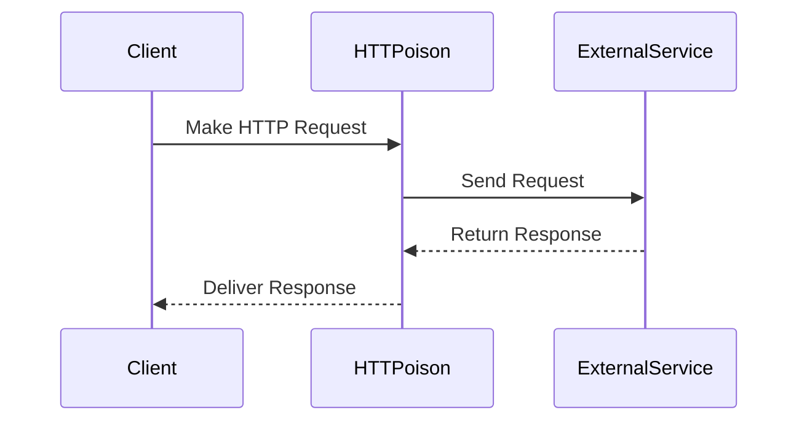

## 14.3. Communicating with External Services

As expert software engineers and architects, integrating Elixir applications with external services is a crucial skill. Whether you're consuming RESTful APIs or establishing real-time connections via WebSockets, Elixir provides robust tools and libraries to facilitate these interactions. In this section, we will delve into the intricacies of communicating with external services using Elixir, focusing on HTTP clients, WebSocket communication, and best practices for handling retries, timeouts, and error handling.

### HTTP Clients

When working with external RESTful services, choosing the right HTTP client is essential. Elixir offers several libraries, with `HTTPoison` and `Tesla` being among the most popular.

#### Using `HTTPoison`

`HTTPoison` is a widely-used HTTP client in Elixir, built on top of `hackney`. It provides a straightforward API for making HTTP requests.

**Installation:**

To use `HTTPoison`, add it to your `mix.exs` dependencies:

```elixir
defp deps do
  [
    {:httpoison, "~> 1.8"}
  ]
end
```

Run `mix deps.get` to install the dependency.

**Basic Usage:**

Here's a simple example of making a GET request using `HTTPoison`:

```elixir
defmodule MyApp.HttpClient do
  use HTTPoison.Base

  def fetch_data(url) do
    case get(url) do
      {:ok, %HTTPoison.Response{status_code: 200, body: body}} ->
        {:ok, body}

      {:ok, %HTTPoison.Response{status_code: status_code}} ->
        {:error, "Request failed with status code: #{status_code}"}

      {:error, %HTTPoison.Error{reason: reason}} ->
        {:error, "Request failed: #{reason}"}
    end
  end
end
```

**Key Features:**

- **Middleware:** `HTTPoison` supports middleware for request/response transformation.
- **Streaming:** It allows streaming of large responses to handle large datasets efficiently.
- **Timeouts and Retries:** Configure timeouts and implement retry logic for resilience.

#### Using `Tesla`

`Tesla` is another powerful HTTP client that offers a modular architecture with middleware support.

**Installation:**

Add `Tesla` to your `mix.exs`:

```elixir
defp deps do
  [
    {:tesla, "~> 1.4"},
    {:hackney, "~> 1.17"} # Tesla requires an adapter, hackney is a common choice
  ]
end
```

Run `mix deps.get` to install.

**Basic Usage:**

Here's how you can make a GET request using `Tesla`:

```elixir
defmodule MyApp.TeslaClient do
  use Tesla

  plug Tesla.Middleware.BaseUrl, "https://api.example.com"
  plug Tesla.Middleware.JSON

  def get_resource(resource_id) do
    get("/resources/#{resource_id}")
  end
end
```

**Key Features:**

- **Middleware:** Tesla's middleware system allows easy request/response customization.
- **Adapters:** It supports multiple adapters (`hackney`, `httpc`, etc.).
- **Retries:** Tesla provides built-in support for retries with exponential backoff.

#### Comparison: `HTTPoison` vs `Tesla`

| Feature         | HTTPoison                             | Tesla                                |
|-----------------|---------------------------------------|--------------------------------------|
| Middleware      | Basic support                         | Advanced, modular middleware system  |
| Adapters        | Built-in with `hackney`               | Multiple adapters                    |
| Streaming       | Supported                             | Supported                            |
| Configuration   | Directly in code                      | Through middleware                   |
| Community       | Large, active community               | Growing community                    |

### WebSocket Communication

WebSockets enable real-time, bidirectional communication between clients and servers. In Elixir, the `websocket_client` library is a popular choice for implementing WebSocket clients.

#### Implementing Real-Time Communication with `websocket_client`

**Installation:**

Add `websocket_client` to your `mix.exs`:

```elixir
defp deps do
  [
    {:websocket_client, "~> 1.4"}
  ]
end
```

Run `mix deps.get` to install.

**Basic Usage:**

Here's an example of setting up a WebSocket client:

```elixir
defmodule MyApp.WebSocketClient do
  use WebSocketClient

  def start_link(url) do
    WebSocketClient.start_link(url, __MODULE__, nil)
  end

  def init(state) do
    {:ok, state}
  end

  def handle_frame({:text, msg}, state) do
    IO.puts("Received message: #{msg}")
    {:ok, state}
  end

  def handle_info({:send, msg}, state) do
    send_frame({:text, msg})
    {:ok, state}
  end

  def handle_disconnect(reason, state) do
    IO.puts("Disconnected: #{reason}")
    {:ok, state}
  end
end
```

**Key Features:**

- **Simplicity:** Easy to set up and use for basic WebSocket communication.
- **Callbacks:** Provides callbacks for handling frames, messages, and disconnections.
- **Concurrency:** Leverages Elixir's concurrency model to handle multiple connections.

### Best Practices

When communicating with external services, it's crucial to implement best practices to ensure reliability and performance.

#### Handling Retries

Implementing retry logic is essential for dealing with transient errors. Both `HTTPoison` and `Tesla` support customizable retry mechanisms. Consider using exponential backoff to avoid overwhelming the external service.

#### Managing Timeouts

Set appropriate timeouts for your HTTP requests and WebSocket connections to prevent resource exhaustion. This can be configured in both `HTTPoison` and `Tesla`.

#### Error Handling

Robust error handling is vital for maintaining application stability. Ensure that your error handling logic can gracefully recover from failures and provide meaningful feedback to users.

#### Security Considerations

- **HTTPS:** Always use HTTPS for secure communication.
- **Authentication:** Implement proper authentication mechanisms, such as OAuth or API keys.
- **Data Validation:** Validate all incoming and outgoing data to prevent security vulnerabilities.

### Visualizing Communication Flow

To better understand the communication flow between an Elixir application and external services, let's visualize the process using a sequence diagram.


```mermaid
sequenceDiagram
    participant Client
    participant HTTPoison
    participant ExternalService

    Client->>HTTPoison: Make HTTP Request
    HTTPoison->>ExternalService: Send Request
    ExternalService-->>HTTPoison: Return Response
    HTTPoison-->>Client: Deliver Response
```

**Diagram Description:** This sequence diagram illustrates the flow of an HTTP request from the client through `HTTPoison` to the external service, and back to the client.

### Try It Yourself

Experiment with the provided code examples to deepen your understanding. Try modifying the URL in the HTTP client examples or the message handling in the WebSocket client. Observe how changes affect the communication flow and behavior.

### Knowledge Check

- What are the advantages of using `HTTPoison` for HTTP requests in Elixir?
- How does `Tesla`'s middleware system enhance HTTP client functionality?
- What are the security best practices when communicating with external services?

### Summary

In this section, we've explored the essential tools and techniques for communicating with external services in Elixir. By leveraging libraries like `HTTPoison` and `Tesla`, and implementing WebSocket communication with `websocket_client`, you can build robust and efficient integrations. Remember to follow best practices for retries, timeouts, and error handling to ensure your applications remain resilient and secure.

## Quiz Time!



### Which Elixir library is built on top of `hackney` for making HTTP requests?

- [x] HTTPoison
- [ ] Tesla
- [ ] websocket_client
- [ ] Phoenix

> **Explanation:** HTTPoison is built on top of hackney for making HTTP requests.

### What is a key feature of `Tesla` that differentiates it from `HTTPoison`?

- [x] Advanced, modular middleware system
- [ ] Built-in streaming support
- [ ] Direct configuration in code
- [ ] Large community

> **Explanation:** Tesla's advanced, modular middleware system is a key differentiator.

### Which library is commonly used for WebSocket communication in Elixir?

- [ ] HTTPoison
- [ ] Tesla
- [x] websocket_client
- [ ] Phoenix

> **Explanation:** websocket_client is commonly used for WebSocket communication in Elixir.

### What is an essential practice when handling retries for HTTP requests?

- [x] Implementing exponential backoff
- [ ] Ignoring transient errors
- [ ] Increasing timeouts indefinitely
- [ ] Disabling retries

> **Explanation:** Implementing exponential backoff is essential for handling retries effectively.

### What should you always use for secure communication with external services?

- [x] HTTPS
- [ ] HTTP
- [ ] FTP
- [ ] SMTP

> **Explanation:** HTTPS should always be used for secure communication.

### Which of the following is a best practice for managing timeouts?

- [x] Setting appropriate timeouts for requests
- [ ] Disabling timeouts
- [ ] Using default timeout settings
- [ ] Increasing timeouts indefinitely

> **Explanation:** Setting appropriate timeouts is a best practice for managing them effectively.

### What is a crucial aspect of error handling in external service communication?

- [x] Gracefully recovering from failures
- [ ] Ignoring errors
- [ ] Logging errors only
- [ ] Retrying indefinitely

> **Explanation:** Gracefully recovering from failures is crucial for robust error handling.

### Which authentication mechanism can be used for secure communication?

- [x] OAuth
- [ ] Basic Auth
- [ ] FTP
- [ ] SMTP

> **Explanation:** OAuth is a secure authentication mechanism for communication.

### What is the purpose of the sequence diagram in this section?

- [x] To illustrate the flow of an HTTP request
- [ ] To demonstrate WebSocket connection setup
- [ ] To show the internal workings of `HTTPoison`
- [ ] To explain error handling

> **Explanation:** The sequence diagram illustrates the flow of an HTTP request.

### True or False: `websocket_client` is used for HTTP requests in Elixir.

- [ ] True
- [x] False

> **Explanation:** websocket_client is used for WebSocket communication, not HTTP requests.



Remember, this is just the beginning. As you progress, you'll build more complex integrations with external services. Keep experimenting, stay curious, and enjoy the journey!
