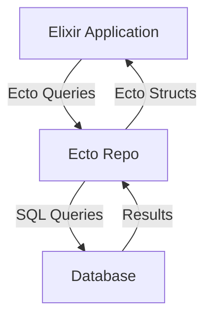

## 14.4. Working with Databases using Ecto

In the world of Elixir, Ecto stands out as a robust database wrapper and query generator, designed to simplify database interactions while maintaining the functional programming principles that Elixir is known for. In this section, we will delve into the intricacies of Ecto, exploring its features, supported databases, and how it can be leveraged to build efficient, scalable applications.

### Ecto Overview

Ecto is an essential tool for Elixir developers, providing a comprehensive suite of features for interacting with databases. It acts as a bridge between your Elixir application and the database, offering a high-level API for querying, data validation, and migrations.

#### Key Features of Ecto

- **Migrations**: Ecto provides a powerful mechanism for managing database schema changes over time, ensuring that your database evolves alongside your application.
- **Schemas**: Define the structure of your data and map it to your database tables, allowing for seamless data manipulation.
- **Changesets**: A robust way to validate and cast data before it is inserted or updated in the database, ensuring data integrity and consistency.

### Supported Databases

Ecto supports a variety of databases through adapters, making it a versatile choice for different projects. Some of the popular databases supported include:

- **PostgreSQL**: Known for its advanced features and reliability, PostgreSQL is a popular choice for many Elixir applications.
- **MySQL**: A widely-used open-source relational database management system.
- **SQLite**: A lightweight, file-based database, ideal for small to medium-sized applications or development environments.

### Setting Up Ecto

To get started with Ecto, you need to include it in your Elixir project. Let's walk through the setup process:

1. **Add Ecto and a Database Adapter to Your Mix Project**

   Open your `mix.exs` file and add the following dependencies:

   ```elixir
   defp deps do
     [
       {:ecto_sql, "~> 3.6"},
       {:postgrex, ">= 0.0.0"} # For PostgreSQL
     ]
   end
   ```

2. **Configure Your Database**

   In the `config/config.exs` file, add your database configuration:

   ```elixir
   config :my_app, MyApp.Repo,
     username: "postgres",
     password: "postgres",
     database: "my_app_db",
     hostname: "localhost",
     show_sensitive_data_on_connection_error: true,
     pool_size: 10
   ```

3. **Create a Repo Module**

   The Repo module is your interface to the database. Create a new module in your project:

   ```elixir
   defmodule MyApp.Repo do
     use Ecto.Repo,
       otp_app: :my_app,
       adapter: Ecto.Adapters.Postgres
   end
   ```

4. **Run Migrations**

   Generate and run migrations to set up your database schema:

   ```bash
   mix ecto.create
   mix ecto.migrate
   ```

### Defining Schemas

Schemas in Ecto are used to define the structure of your data and map it to database tables. Let's define a simple schema for a `User`:

```elixir
defmodule MyApp.User do
  use Ecto.Schema

  schema "users" do
    field :name, :string
    field :email, :string
    field :age, :integer

    timestamps()
  end
end
```

### Working with Changesets

Changesets are a powerful feature in Ecto, allowing you to validate and transform data before it is persisted to the database. Here's how you can define a changeset for the `User` schema:

```elixir
defmodule MyApp.User do
  use Ecto.Schema
  import Ecto.Changeset

  schema "users" do
    field :name, :string
    field :email, :string
    field :age, :integer

    timestamps()
  end

  def changeset(user, attrs) do
    user
    |> cast(attrs, [:name, :email, :age])
    |> validate_required([:name, :email])
    |> validate_format(:email, ~r/@/)
    |> validate_number(:age, greater_than: 0)
  end
end
```

### Querying with Ecto

Ecto provides a powerful query API that allows you to build complex queries in a composable and readable manner. Let's explore some common querying patterns:

#### Basic Queries

To fetch all users from the database:

```elixir
users = MyApp.Repo.all(MyApp.User)
```

#### Filtering Data

To filter users by age:

```elixir
young_users = from(u in MyApp.User, where: u.age < 30) |> MyApp.Repo.all()
```

#### Ordering and Limiting Results

To order users by name and limit the results:

```elixir
ordered_users = from(u in MyApp.User, order_by: u.name, limit: 5) |> MyApp.Repo.all()
```

### Advanced Querying Techniques

Ecto's query API is not only powerful but also flexible, allowing for advanced querying techniques such as joins, subqueries, and aggregations.

#### Joins

To join users with another table, say `posts`:

```elixir
query = from(u in MyApp.User,
             join: p in assoc(u, :posts),
             where: p.published == true,
             select: {u.name, p.title})

results = MyApp.Repo.all(query)
```

#### Subqueries

Subqueries can be used to perform more complex operations:

```elixir
subquery = from(p in MyApp.Post, where: p.published == true, select: p.user_id)
query = from(u in MyApp.User, where: u.id in subquery(subquery))

results = MyApp.Repo.all(query)
```

#### Aggregations

To perform aggregations, such as counting the number of users:

```elixir
count = from(u in MyApp.User, select: count(u.id)) |> MyApp.Repo.one()
```

### Transactions

Ecto supports transactions, allowing you to execute multiple operations atomically. Here's how you can use transactions in Ecto:

```elixir
MyApp.Repo.transaction(fn ->
  user = MyApp.Repo.insert!(%MyApp.User{name: "John", email: "john@example.com"})
  MyApp.Repo.update!(Ecto.Changeset.change(user, age: 30))
end)
```

### Optimizing Database Interactions

Optimizing database interactions is crucial for building high-performance applications. Here are some tips for optimizing your Ecto queries:

- **Use Indexes**: Ensure that your database tables are properly indexed to speed up query execution.
- **Batch Queries**: Use Ecto's `preload` to batch load associated data, reducing the number of queries executed.
- **Limit Data Retrieval**: Only select the fields you need to minimize data transfer.

### Visualizing Ecto's Architecture

To better understand how Ecto interacts with your Elixir application and the database, let's visualize its architecture:



**Diagram Description**: This diagram illustrates the flow of data between your Elixir application, Ecto, and the database. Ecto acts as an intermediary, converting Elixir data structures into SQL queries and vice versa.

### Try It Yourself

Now that we've covered the basics of working with databases using Ecto, it's time to experiment. Try modifying the code examples to:

- Add a new field to the `User` schema and update the changeset accordingly.
- Create a new schema for `Posts` and establish a relationship with `Users`.
- Write a query to fetch users who have published posts.

### References and Further Reading

- [Ecto Documentation](https://hexdocs.pm/ecto/Ecto.html)
- [PostgreSQL Official Site](https://www.postgresql.org/)
- [Elixir Official Site](https://elixir-lang.org/)

### Knowledge Check

Before we wrap up, let's reinforce what we've learned with some questions and exercises.

## Quiz: Working with Databases using Ecto



### What is Ecto in Elixir?

- [x] A database wrapper and query generator
- [ ] A web framework
- [ ] A testing library
- [ ] A logging tool

> **Explanation:** Ecto is a database wrapper and query generator for Elixir, providing an API for interacting with databases.

### Which of the following databases is NOT supported by Ecto?

- [ ] PostgreSQL
- [ ] MySQL
- [ ] SQLite
- [x] MongoDB

> **Explanation:** Ecto primarily supports relational databases like PostgreSQL, MySQL, and SQLite. MongoDB is a NoSQL database and is not directly supported by Ecto.

### What is the purpose of a changeset in Ecto?

- [x] To validate and cast data before database operations
- [ ] To define database migrations
- [ ] To manage database connections
- [ ] To generate SQL queries

> **Explanation:** Changesets in Ecto are used to validate and cast data before it is inserted or updated in the database.

### How do you define a schema in Ecto?

- [x] Using the `Ecto.Schema` module
- [ ] Using the `Ecto.Query` module
- [ ] Using the `Ecto.Changeset` module
- [ ] Using the `Ecto.Repo` module

> **Explanation:** Schemas in Ecto are defined using the `Ecto.Schema` module, which maps Elixir data structures to database tables.

### What is the role of the Repo module in Ecto?

- [x] It acts as the interface to the database
- [ ] It defines the database schema
- [ ] It validates data
- [ ] It generates migrations

> **Explanation:** The Repo module in Ecto acts as the interface to the database, handling queries and transactions.

### Which function is used to run migrations in Ecto?

- [x] `mix ecto.migrate`
- [ ] `mix ecto.create`
- [ ] `mix ecto.rollback`
- [ ] `mix ecto.gen.migration`

> **Explanation:** The `mix ecto.migrate` function is used to run migrations in Ecto, applying changes to the database schema.

### How can you perform a transaction in Ecto?

- [x] Using the `Repo.transaction/1` function
- [ ] Using the `Repo.insert/1` function
- [ ] Using the `Repo.update/1` function
- [ ] Using the `Repo.delete/1` function

> **Explanation:** Transactions in Ecto are performed using the `Repo.transaction/1` function, which allows multiple operations to be executed atomically.

### What is the purpose of the `preload` function in Ecto?

- [x] To batch load associated data
- [ ] To validate data
- [ ] To define database schemas
- [ ] To generate SQL queries

> **Explanation:** The `preload` function in Ecto is used to batch load associated data, reducing the number of queries executed.

### True or False: Ecto can only be used with PostgreSQL databases.

- [ ] True
- [x] False

> **Explanation:** Ecto supports multiple databases, including PostgreSQL, MySQL, and SQLite, through adapters.

### Which of the following is a feature of Ecto?

- [x] Migrations
- [x] Schemas
- [x] Changesets
- [ ] WebSockets

> **Explanation:** Ecto provides features such as migrations, schemas, and changesets for managing database interactions.



Remember, mastering Ecto is a journey. As you continue to explore its features and capabilities, you'll find new ways to optimize and enhance your database interactions. Keep experimenting, stay curious, and enjoy the journey!
