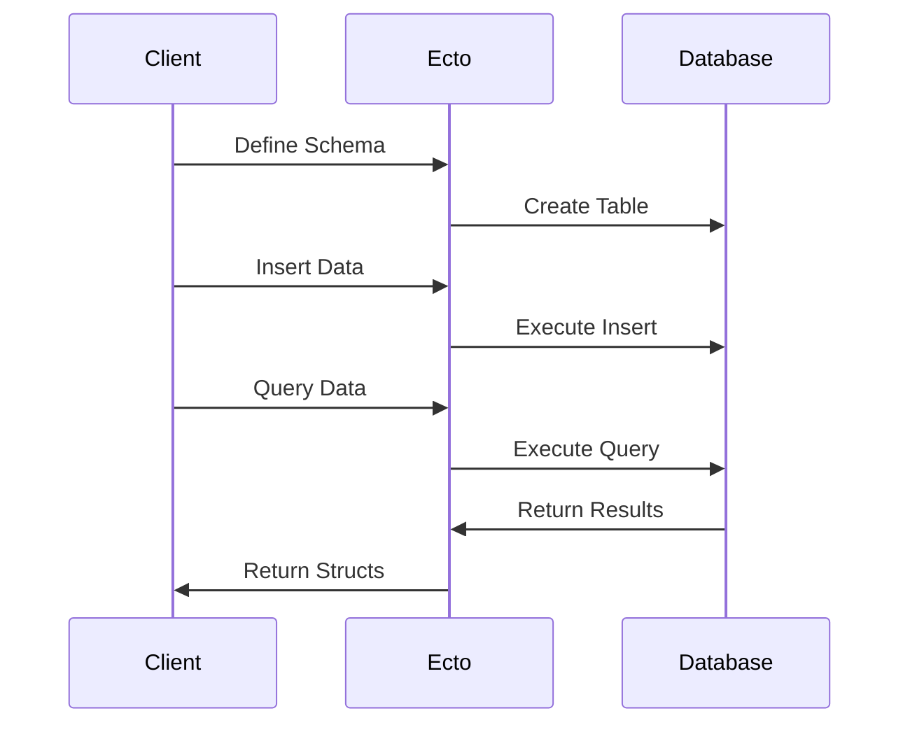

## 14.4. Working with Databases using Ecto

In the world of Elixir, Ecto stands out as a powerful database wrapper and query generator. It provides a robust and flexible framework for interacting with databases, making it an essential tool for any Elixir developer working on data-driven applications. In this section, we will explore the intricacies of Ecto, covering everything from its core concepts to advanced features.

### Ecto Overview

Ecto is more than just a database library; it is a comprehensive toolkit that simplifies the complexities of database interactions. It offers a range of features that cater to the needs of modern applications, including migrations, schemas, and changesets for data validation. Let's delve into each of these components to understand how they contribute to Ecto's capabilities.

#### Supported Databases

One of Ecto's strengths is its support for multiple databases through adapters. This flexibility allows developers to choose the best database for their application's needs. Ecto supports:

- **PostgreSQL**: Known for its powerful features and reliability.
- **MySQL**: A popular choice for web applications.
- **SQLite**: Lightweight and easy to set up, ideal for development and testing.
- **Others**: Ecto's extensible architecture allows for additional adapters, enabling support for other databases.

### Key Features of Ecto

Ecto's feature set is designed to streamline database interactions, making it easier to manage data and ensure its integrity. Here are some of the key features that make Ecto indispensable:

#### Migrations

Migrations in Ecto provide a way to modify your database schema over time. They allow you to define changes to your database structure in a way that can be versioned and tracked. This is particularly useful in collaborative environments where multiple developers might be working on the same project.

```elixir
defmodule MyApp.Repo.Migrations.CreateUsers do
  use Ecto.Migration

  def change do
    create table(:users) do
      add :name, :string
      add :email, :string
      add :age, :integer

      timestamps()
    end
  end
end
```

**Explanation:**
- **`create table(:users)`**: Defines a new table named `users`.
- **`add :name, :string`**: Adds a `name` column of type `string`.
- **`timestamps()`**: Automatically adds `inserted_at` and `updated_at` columns.

#### Schemas

Schemas in Ecto define the structure of your data. They map database tables to Elixir structs, allowing you to work with database records as if they were native Elixir data structures. This abstraction simplifies data manipulation and ensures type safety.

```elixir
defmodule MyApp.User do
  use Ecto.Schema

  schema "users" do
    field :name, :string
    field :email, :string
    field :age, :integer

    timestamps()
  end
end
```

**Explanation:**
- **`schema "users"`**: Maps the `users` table to the `User` struct.
- **`field :name, :string`**: Defines a field `name` of type `string`.

#### Changesets

Changesets are a powerful feature of Ecto that allow you to validate and transform data before it is inserted or updated in the database. They provide a way to enforce data integrity and apply business logic.

```elixir
defmodule MyApp.User do
  use Ecto.Schema
  import Ecto.Changeset

  schema "users" do
    field :name, :string
    field :email, :string
    field :age, :integer

    timestamps()
  end

  def changeset(user, attrs) do
    user
    |> cast(attrs, [:name, :email, :age])
    |> validate_required([:name, :email])
    |> validate_format(:email, ~r/@/)
    |> validate_number(:age, greater_than: 0)
  end
end
```

**Explanation:**
- **`cast(attrs, [:name, :email, :age])`**: Casts the given attributes to the changeset.
- **`validate_required([:name, :email])`**: Ensures `name` and `email` are present.
- **`validate_format(:email, ~r/@/)`**: Validates that `email` contains an `@` symbol.
- **`validate_number(:age, greater_than: 0)`**: Ensures `age` is greater than zero.

### Setting Up Ecto in Your Project

To start using Ecto in your Elixir project, you need to set it up properly. This involves adding Ecto and a database adapter to your dependencies, configuring the repository, and generating the necessary files.

#### Adding Ecto to Your Project

Begin by adding Ecto and a database adapter to your `mix.exs` file:

```elixir
defp deps do
  [
    {:ecto_sql, "~> 3.6"},
    {:postgrex, ">= 0.0.0"}
  ]
end
```

Run `mix deps.get` to fetch the dependencies.

#### Configuring the Repository

Next, configure your repository in `config/config.exs`:

```elixir
config :my_app, MyApp.Repo,
  username: "postgres",
  password: "postgres",
  database: "my_app_dev",
  hostname: "localhost",
  show_sensitive_data_on_connection_error: true,
  pool_size: 10
```

#### Generating the Repository

Generate the repository module with the following command:

```bash
mix ecto.gen.repo -r MyApp.Repo
```

This will create a repository module that you can use to interact with your database.

### Querying with Ecto

Ecto provides a powerful query API that allows you to build complex queries in a composable and readable manner. Let's explore some common querying patterns.

#### Basic Queries

You can perform basic queries using the `Ecto.Query` module. Here's an example of how to retrieve all users from the database:

```elixir
import Ecto.Query

def list_users do
  MyApp.Repo.all(from u in MyApp.User)
end
```

#### Filtering and Ordering

Ecto allows you to filter and order results using the `where` and `order_by` clauses:

```elixir
def list_users_by_age do
  MyApp.Repo.all(from u in MyApp.User, where: u.age > 18, order_by: [desc: u.age])
end
```

#### Joining Tables

You can join tables to retrieve related data:

```elixir
def list_users_with_posts do
  query = from u in MyApp.User,
          join: p in assoc(u, :posts),
          preload: [posts: p]

  MyApp.Repo.all(query)
end
```

### Transactions and Concurrency

Ecto supports transactions, allowing you to group multiple operations into a single atomic action. This is useful for ensuring data consistency.

#### Using Transactions

You can execute a series of operations within a transaction using `Ecto.Multi`:

```elixir
alias Ecto.Multi

def transfer_funds(from_account_id, to_account_id, amount) do
  Multi.new()
  |> Multi.update(:withdraw, MyApp.Accounts.withdraw(from_account_id, amount))
  |> Multi.update(:deposit, MyApp.Accounts.deposit(to_account_id, amount))
  |> MyApp.Repo.transaction()
end
```

**Explanation:**
- **`Multi.update(:withdraw, ...)`**: Defines an update operation for withdrawing funds.
- **`Multi.update(:deposit, ...)`**: Defines an update operation for depositing funds.
- **`MyApp.Repo.transaction()`**: Executes the operations within a transaction.

### Advanced Ecto Features

Ecto offers advanced features that cater to more complex use cases, such as custom types, embedded schemas, and dynamic queries.

#### Custom Types

Ecto allows you to define custom types to handle specific data formats or validation logic:

```elixir
defmodule MyApp.Types.Email do
  use Ecto.Type

  def type, do: :string

  def cast(email) when is_binary(email) do
    if String.contains?(email, "@") do
      {:ok, email}
    else
      :error
    end
  end

  def load(data), do: {:ok, data}
  def dump(data), do: {:ok, data}
end
```

**Explanation:**
- **`def type, do: :string`**: Defines the underlying database type.
- **`def cast(email)`**: Validates the email format during casting.

#### Embedded Schemas

Embedded schemas allow you to define nested data structures within a parent schema:

```elixir
defmodule MyApp.Address do
  use Ecto.Schema

  embedded_schema do
    field :street, :string
    field :city, :string
    field :zip_code, :string
  end
end

defmodule MyApp.User do
  use Ecto.Schema

  schema "users" do
    field :name, :string
    embeds_one :address, MyApp.Address

    timestamps()
  end
end
```

**Explanation:**
- **`embedded_schema`**: Defines a schema that is embedded within another schema.
- **`embeds_one :address, MyApp.Address`**: Embeds an `Address` schema within the `User` schema.

#### Dynamic Queries

Ecto supports dynamic queries, allowing you to build queries at runtime based on user input or other conditions:

```elixir
def list_users_with_dynamic_filter(filters) do
  query = from u in MyApp.User

  query =
    if filters[:age] do
      from u in query, where: u.age > ^filters[:age]
    else
      query
    end

  MyApp.Repo.all(query)
end
```

### Visualizing Ecto's Workflow

To better understand Ecto's workflow, let's visualize how Ecto interacts with the database using a sequence diagram.


```mermaid
sequenceDiagram
    participant Client
    participant Ecto
    participant Database

    Client->>Ecto: Define Schema
    Ecto->>Database: Create Table
    Client->>Ecto: Insert Data
    Ecto->>Database: Execute Insert
    Client->>Ecto: Query Data
    Ecto->>Database: Execute Query
    Database->>Ecto: Return Results
    Ecto->>Client: Return Structs
```

**Diagram Explanation:**
- **Client**: Represents the user or application code interacting with Ecto.
- **Ecto**: Acts as the intermediary between the client and the database.
- **Database**: The underlying database where data is stored and retrieved.

### Best Practices for Using Ecto

To make the most of Ecto, consider the following best practices:

- **Use Changesets for Validation**: Always use changesets to validate and transform data before database operations.
- **Leverage Migrations for Schema Changes**: Use migrations to manage schema changes in a version-controlled manner.
- **Optimize Queries**: Use Ecto's query API to build efficient and readable queries.
- **Handle Transactions Carefully**: Use transactions to ensure data consistency, especially in concurrent environments.
- **Utilize Custom Types**: Define custom types for specific data validation and transformation needs.

### Common Pitfalls and How to Avoid Them

While Ecto is a powerful tool, there are some common pitfalls to be aware of:

- **Ignoring Changeset Errors**: Always check changeset errors and handle them appropriately.
- **Overusing Dynamic Queries**: While dynamic queries are flexible, overuse can lead to complex and hard-to-maintain code.
- **Not Using Transactions**: Failing to use transactions for related operations can lead to data inconsistency.

### Try It Yourself

To solidify your understanding of Ecto, try modifying the code examples provided:

- **Add a new field to the `User` schema and update the migration.**
- **Create a changeset function that validates the new field.**
- **Write a query that filters users based on the new field.**

### Further Reading and Resources

- [Ecto Documentation](https://hexdocs.pm/ecto/Ecto.html)
- [PostgreSQL Documentation](https://www.postgresql.org/docs/)
- [Elixir Forum](https://elixirforum.com/)

### Conclusion

Ecto is a versatile and powerful library that simplifies database interactions in Elixir applications. By leveraging its features, you can build robust, efficient, and maintainable data-driven applications. Remember, this is just the beginning. As you progress, you'll discover more advanced features and techniques that Ecto has to offer. Keep experimenting, stay curious, and enjoy the journey!

## Quiz Time!



### What is Ecto primarily used for in Elixir?

- [x] Database wrapper and query generator
- [ ] Web framework
- [ ] Task scheduling
- [ ] Logging

> **Explanation:** Ecto is primarily used as a database wrapper and query generator in Elixir applications.


### Which of the following databases is NOT directly supported by Ecto?

- [ ] PostgreSQL
- [ ] MySQL
- [x] Oracle
- [ ] SQLite

> **Explanation:** Ecto supports PostgreSQL, MySQL, and SQLite, but not Oracle directly.


### What is the purpose of migrations in Ecto?

- [x] To modify the database schema over time
- [ ] To handle HTTP requests
- [ ] To manage application configuration
- [ ] To generate random data

> **Explanation:** Migrations in Ecto are used to modify the database schema over time in a version-controlled manner.


### What is a changeset in Ecto?

- [x] A way to validate and transform data
- [ ] A database connection pool
- [ ] A type of query
- [ ] A logging mechanism

> **Explanation:** A changeset in Ecto is used to validate and transform data before it is inserted or updated in the database.


### Which function is used to execute a transaction in Ecto?

- [ ] Ecto.Query.transaction()
- [x] MyApp.Repo.transaction()
- [ ] Ecto.Multi.run()
- [ ] Ecto.Schema.execute()

> **Explanation:** The `MyApp.Repo.transaction()` function is used to execute a transaction in Ecto.


### What does the `embedded_schema` macro do in Ecto?

- [x] Defines a schema that is embedded within another schema
- [ ] Connects to an external database
- [ ] Generates a new migration file
- [ ] Executes a query

> **Explanation:** The `embedded_schema` macro in Ecto is used to define a schema that is embedded within another schema.


### How can you define a custom type in Ecto?

- [x] By using the `Ecto.Type` module
- [ ] By creating a new migration
- [ ] By using the `Ecto.Schema` module
- [ ] By defining a new query

> **Explanation:** Custom types in Ecto are defined using the `Ecto.Type` module.


### What is the purpose of the `cast` function in a changeset?

- [x] To cast and validate the given attributes
- [ ] To execute a database query
- [ ] To generate a new migration
- [ ] To start a transaction

> **Explanation:** The `cast` function in a changeset is used to cast and validate the given attributes.


### True or False: Ecto can only be used with PostgreSQL databases.

- [ ] True
- [x] False

> **Explanation:** Ecto can be used with multiple databases, including PostgreSQL, MySQL, and SQLite.


### What is the role of the `assoc` function in Ecto queries?

- [x] To join related tables
- [ ] To execute a transaction
- [ ] To define a custom type
- [ ] To create a new schema

> **Explanation:** The `assoc` function in Ecto queries is used to join related tables.




