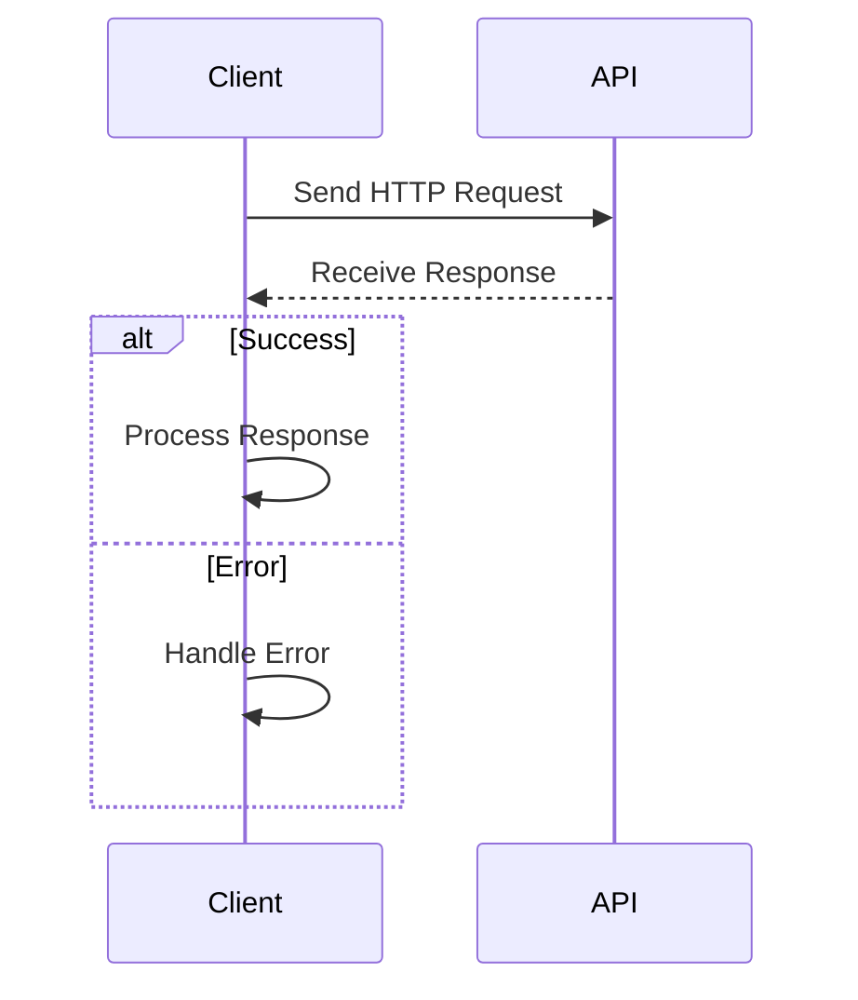

## 14.6. RESTful Services and HTTP Clients

In today's interconnected world, integrating with external systems through RESTful services is a crucial skill for any software engineer. Elixir, with its robust ecosystem and functional programming paradigm, provides powerful tools for consuming APIs and handling HTTP requests. In this section, we'll explore how to effectively use Elixir to interact with RESTful services, manage authentication, and implement rate limiting strategies.

### Consuming APIs

#### Integrating with External APIs Using HTTP Clients

To interact with RESTful services, we need an HTTP client that can handle requests and responses. In Elixir, the most popular HTTP client libraries are `HTTPoison` and `Tesla`. Let's explore how to use these libraries to consume APIs.

**HTTPoison**

`HTTPoison` is a widely-used HTTP client for Elixir, built on top of the `hackney` library. It provides a simple interface for making HTTP requests.

```elixir
defmodule MyApiClient do
  use HTTPoison.Base

  @base_url "https://api.example.com"

  def get_user(user_id) do
    url = "#{@base_url}/users/#{user_id}"
    case get(url) do
      {:ok, %HTTPoison.Response{status_code: 200, body: body}} ->
        {:ok, Jason.decode!(body)}
      {:ok, %HTTPoison.Response{status_code: status_code}} ->
        {:error, "Received status code #{status_code}"}
      {:error, %HTTPoison.Error{reason: reason}} ->
        {:error, reason}
    end
  end
end
```

In this example, we define a module `MyApiClient` that uses `HTTPoison.Base` to make a GET request to an external API. We handle different response scenarios, including successful responses and errors.

**Tesla**

`Tesla` is another popular HTTP client in Elixir, known for its middleware architecture, which allows for easy customization of requests and responses.

```elixir
defmodule MyApiClient do
  use Tesla

  plug Tesla.Middleware.BaseUrl, "https://api.example.com"
  plug Tesla.Middleware.JSON

  def get_user(user_id) do
    get("/users/#{user_id}")
  end
end
```

With `Tesla`, we can use middleware to set a base URL and automatically handle JSON encoding and decoding. This makes our code cleaner and more modular.

### Authentication

#### Handling OAuth2, API Keys, and Token-Based Authentication

When consuming APIs, authentication is often required to access protected resources. Let's explore different authentication methods and how to implement them in Elixir.

**OAuth2**

OAuth2 is a common authentication protocol used by many APIs. The `OAuth2` library in Elixir provides a client for handling OAuth2 authentication flows.

```elixir
defmodule MyOAuthClient do
  use OAuth2.Client

  @client_id "your_client_id"
  @client_secret "your_client_secret"
  @redirect_uri "http://localhost:4000/auth/callback"
  @site "https://provider.com"

  def client do
    OAuth2.Client.new([
      strategy: OAuth2.Strategy.AuthCode,
      client_id: @client_id,
      client_secret: @client_secret,
      redirect_uri: @redirect_uri,
      site: @site
    ])
  end

  def authorize_url do
    client()
    |> OAuth2.Client.authorize_url!()
  end

  def get_token(code) do
    client()
    |> OAuth2.Client.get_token!(code: code)
  end
end
```

In this example, we define an OAuth2 client that can generate an authorization URL and exchange an authorization code for an access token.

**API Keys**

Some APIs use API keys for authentication. This is often simpler than OAuth2 and can be implemented by adding the key to the request headers.

```elixir
defmodule MyApiClient do
  use Tesla

  plug Tesla.Middleware.BaseUrl, "https://api.example.com"
  plug Tesla.Middleware.Headers, [{"Authorization", "Bearer your_api_key"}]

  def get_user(user_id) do
    get("/users/#{user_id}")
  end
end
```

**Token-Based Authentication**

Token-based authentication involves obtaining a token from the API and using it in subsequent requests. This can be implemented similarly to API keys.

### Rate Limiting

#### Implementing Back-Off Strategies to Comply with API Limits

When consuming APIs, it's important to respect rate limits to avoid being blocked. Let's explore how to implement back-off strategies in Elixir.

**Exponential Back-Off**

Exponential back-off is a common strategy for handling rate limits. It involves retrying requests with increasing delays.

```elixir
defmodule MyApiClient do
  use HTTPoison.Base

  @base_url "https://api.example.com"

  def get_user(user_id, retries \\ 3) do
    url = "#{@base_url}/users/#{user_id}"
    case get(url) do
      {:ok, %HTTPoison.Response{status_code: 200, body: body}} ->
        {:ok, Jason.decode!(body)}
      {:ok, %HTTPoison.Response{status_code: 429}} when retries > 0 ->
        :timer.sleep(:math.pow(2, 3 - retries) * 1000)
        get_user(user_id, retries - 1)
      {:ok, %HTTPoison.Response{status_code: status_code}} ->
        {:error, "Received status code #{status_code}"}
      {:error, %HTTPoison.Error{reason: reason}} ->
        {:error, reason}
    end
  end
end
```

In this example, we implement exponential back-off by retrying the request with increasing delays when a 429 status code (Too Many Requests) is received.

### Visualizing API Integration

To better understand the flow of API integration, let's visualize the process using a sequence diagram.



This diagram illustrates the interaction between a client and an API, highlighting the steps involved in sending a request, receiving a response, and handling success or error scenarios.

### Try It Yourself

To deepen your understanding, try modifying the code examples to:

- Use a different HTTP client library, such as `Finch`.
- Implement a different authentication method, such as Basic Auth.
- Experiment with different back-off strategies, such as linear back-off.

### Knowledge Check

- What are the key differences between `HTTPoison` and `Tesla`?
- How does OAuth2 differ from API key authentication?
- What is the purpose of rate limiting, and how can it be managed?

### Summary

In this section, we've explored how to consume RESTful services in Elixir using HTTP clients, handle authentication, and implement rate limiting strategies. By mastering these techniques, you'll be well-equipped to integrate with external APIs and build robust, scalable applications.

## Quiz: RESTful Services and HTTP Clients



### Which Elixir library is commonly used for making HTTP requests?

- [x] HTTPoison
- [ ] Ecto
- [ ] Phoenix
- [ ] Plug

> **Explanation:** HTTPoison is a popular HTTP client library in Elixir.

### What is a common authentication protocol used by many APIs?

- [x] OAuth2
- [ ] JWT
- [ ] SSH
- [ ] FTP

> **Explanation:** OAuth2 is a widely-used authentication protocol for APIs.

### What status code indicates that a client has sent too many requests?

- [x] 429
- [ ] 404
- [ ] 500
- [ ] 200

> **Explanation:** The 429 status code indicates "Too Many Requests."

### What is the purpose of exponential back-off?

- [x] To manage retries with increasing delays
- [ ] To speed up request processing
- [ ] To reduce server load
- [ ] To encrypt data

> **Explanation:** Exponential back-off is used to manage retries with increasing delays.

### Which HTTP client library in Elixir is known for its middleware architecture?

- [x] Tesla
- [ ] HTTPoison
- [ ] Phoenix
- [ ] Ecto

> **Explanation:** Tesla is known for its middleware architecture.

### What is a common strategy for handling rate limits?

- [x] Exponential back-off
- [ ] Immediate retry
- [ ] Ignoring limits
- [ ] Increasing request size

> **Explanation:** Exponential back-off is a common strategy for handling rate limits.

### How can API keys be used in HTTP requests?

- [x] By adding them to the request headers
- [ ] By including them in the URL path
- [ ] By storing them in cookies
- [ ] By sending them in the request body

> **Explanation:** API keys are typically added to the request headers.

### What does the `OAuth2.Client.get_token!` function do?

- [x] Exchanges an authorization code for an access token
- [ ] Sends a GET request
- [ ] Retrieves user information
- [ ] Validates an access token

> **Explanation:** The `OAuth2.Client.get_token!` function exchanges an authorization code for an access token.

### What is the main advantage of using middleware in HTTP clients?

- [x] It allows for easy customization of requests and responses
- [ ] It speeds up request processing
- [ ] It reduces code complexity
- [ ] It encrypts data

> **Explanation:** Middleware allows for easy customization of requests and responses.

### True or False: Rate limiting is only necessary for public APIs.

- [ ] True
- [x] False

> **Explanation:** Rate limiting is important for both public and private APIs to ensure fair usage and prevent abuse.



Remember, mastering RESTful services and HTTP clients in Elixir is just the beginning. As you progress, you'll be able to build more complex integrations and applications. Keep experimenting, stay curious, and enjoy the journey!
