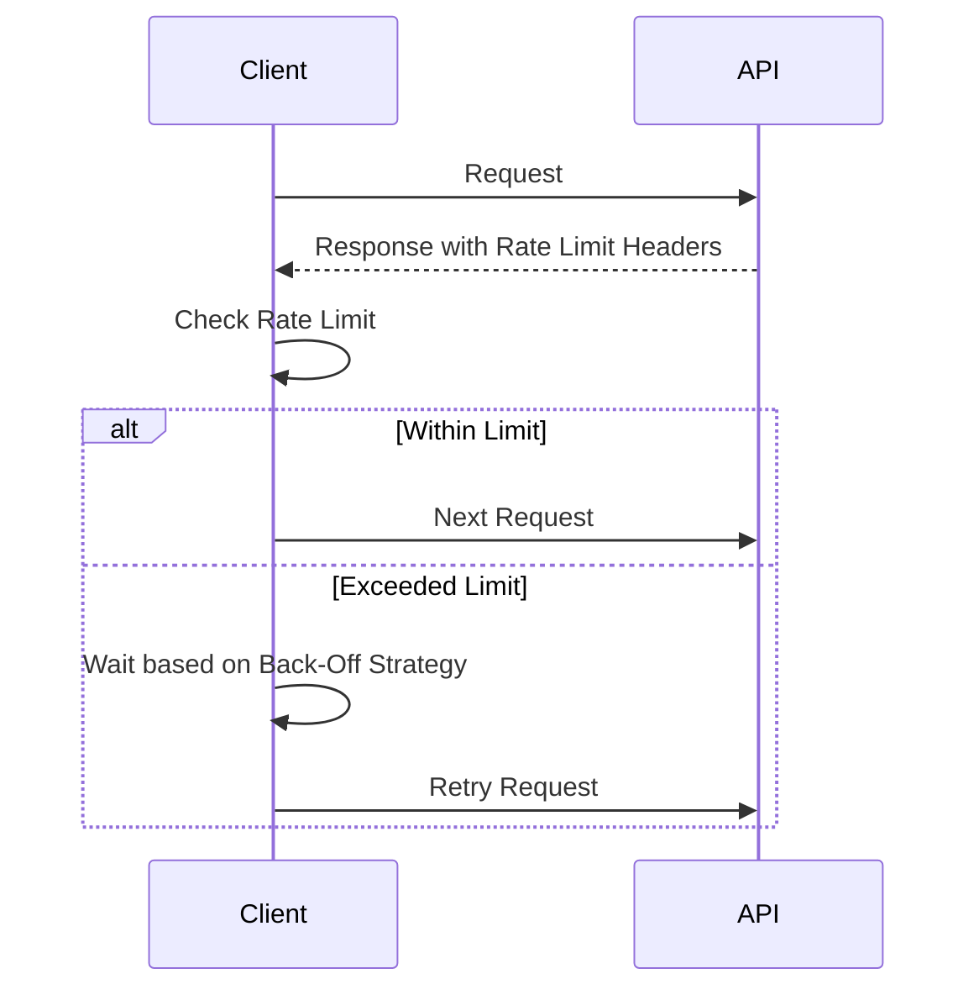

## 14.6. RESTful Services and HTTP Clients

In the modern software landscape, integrating with external systems through RESTful APIs is a common requirement. Elixir, with its robust concurrency model and functional nature, provides powerful tools for consuming APIs and handling HTTP requests. In this section, we'll explore how to effectively use HTTP clients in Elixir, manage authentication, and implement strategies to handle rate limiting.

### Consuming APIs

#### Integrating with External APIs Using HTTP Clients

To interact with RESTful services, Elixir developers often rely on HTTP clients. One of the most popular libraries for this purpose is `HTTPoison`, which is built on top of `hackney`, a flexible HTTP client in Erlang. Let's delve into how you can use `HTTPoison` to make HTTP requests.

**Installing HTTPoison**

First, add `HTTPoison` to your `mix.exs` file:

```elixir
defp deps do
  [
    {:httpoison, "~> 1.8"}
  ]
end
```

Then, run `mix deps.get` to fetch the dependency.

**Making a GET Request**

Here's a simple example of making a GET request to an API:

```elixir
defmodule MyApp.APIClient do
  use HTTPoison.Base

  def fetch_data(url) do
    case get(url) do
      {:ok, %HTTPoison.Response{status_code: 200, body: body}} ->
        {:ok, body}

      {:ok, %HTTPoison.Response{status_code: status_code}} ->
        {:error, "Request failed with status code: #{status_code}"}

      {:error, %HTTPoison.Error{reason: reason}} ->
        {:error, "HTTP request failed: #{reason}"}
    end
  end
end
```

In this example, we define a module `MyApp.APIClient` that uses `HTTPoison.Base`. The `fetch_data/1` function makes a GET request to the specified URL and handles the response based on the status code.

**Handling JSON Responses**

Most APIs return data in JSON format. Elixir's `Jason` library is a fast and efficient JSON parser. To parse JSON responses, add `Jason` to your dependencies:

```elixir
defp deps do
  [
    {:httpoison, "~> 1.8"},
    {:jason, "~> 1.2"}
  ]
end
```

Here's how you can parse a JSON response:

```elixir
def fetch_data(url) do
  case get(url) do
    {:ok, %HTTPoison.Response{status_code: 200, body: body}} ->
      case Jason.decode(body) do
        {:ok, json} -> {:ok, json}
        {:error, _} -> {:error, "Failed to parse JSON"}
      end

    {:ok, %HTTPoison.Response{status_code: status_code}} ->
      {:error, "Request failed with status code: #{status_code}"}

    {:error, %HTTPoison.Error{reason: reason}} ->
      {:error, "HTTP request failed: #{reason}"}
  end
end
```

**Try It Yourself**

Experiment with the code above by changing the URL to different APIs. Observe how the response structure changes and modify the JSON parsing logic accordingly.

### Authentication

#### Handling OAuth2, API Keys, and Token-Based Authentication

Authentication is a crucial aspect of interacting with APIs. Different APIs use various authentication mechanisms, such as OAuth2, API keys, and token-based authentication. Let's explore how to handle these in Elixir.

**Using API Keys**

API keys are a straightforward way to authenticate requests. Typically, you include the API key in the request headers or as a query parameter.

```elixir
def fetch_data_with_api_key(url, api_key) do
  headers = [{"Authorization", "Bearer #{api_key}"}]
  case get(url, headers) do
    {:ok, %HTTPoison.Response{status_code: 200, body: body}} ->
      Jason.decode(body)

    {:error, %HTTPoison.Error{reason: reason}} ->
      {:error, reason}
  end
end
```

In this example, we pass the API key in the `Authorization` header.

**OAuth2 Authentication**

OAuth2 is a more complex authentication mechanism that involves obtaining an access token. The `OAuth2` library in Elixir simplifies this process.

First, add the `OAuth2` dependency:

```elixir
defp deps do
  [
    {:oauth2, "~> 2.0"}
  ]
end
```

Here's a basic example of using OAuth2:

```elixir
defmodule MyApp.OAuthClient do
  use OAuth2.Client

  def new_client do
    OAuth2.Client.new([
      strategy: OAuth2.Strategy.AuthCode,
      client_id: "your_client_id",
      client_secret: "your_client_secret",
      site: "https://provider.com",
      redirect_uri: "https://yourapp.com/callback"
    ])
  end

  def get_token(client, code) do
    client
    |> put_param(:code, code)
    |> OAuth2.Client.get_token()
  end
end
```

In this example, we configure an OAuth2 client with the necessary credentials and endpoints. The `get_token/2` function exchanges an authorization code for an access token.

**Token-Based Authentication**

For token-based authentication, you typically include a token in the request headers. This is similar to using API keys.

```elixir
def fetch_data_with_token(url, token) do
  headers = [{"Authorization", "Token #{token}"}]
  case get(url, headers) do
    {:ok, %HTTPoison.Response{status_code: 200, body: body}} ->
      Jason.decode(body)

    {:error, %HTTPoison.Error{reason: reason}} ->
      {:error, reason}
  end
end
```

### Rate Limiting

#### Implementing Back-Off Strategies to Comply with API Limits

APIs often impose rate limits to prevent abuse. It's essential to implement back-off strategies to handle rate limiting gracefully.

**Understanding Rate Limits**

APIs typically communicate rate limits through headers, such as `X-RateLimit-Limit`, `X-RateLimit-Remaining`, and `X-RateLimit-Reset`. These headers inform you of the limit, the remaining requests, and when the limit resets.

**Back-Off Strategy**

A common strategy is exponential back-off, which involves retrying requests with increasing delays.

```elixir
def fetch_with_backoff(url, retries \\ 3) do
  case get(url) do
    {:ok, %HTTPoison.Response{status_code: 200, body: body}} ->
      {:ok, Jason.decode!(body)}

    {:ok, %HTTPoison.Response{status_code: 429}} when retries > 0 ->
      :timer.sleep(:math.pow(2, 3 - retries) * 1000)
      fetch_with_backoff(url, retries - 1)

    {:error, %HTTPoison.Error{reason: reason}} ->
      {:error, reason}
  end
end
```

In this example, if a 429 status code (Too Many Requests) is received, the function waits for an exponentially increasing time before retrying.

**Visualizing API Rate Limiting**


```mermaid
sequenceDiagram
    participant Client
    participant API
    Client->>API: Request
    API-->>Client: Response with Rate Limit Headers
    Client->>Client: Check Rate Limit
    alt Within Limit
        Client->>API: Next Request
    else Exceeded Limit
        Client->>Client: Wait based on Back-Off Strategy
        Client->>API: Retry Request
    end
```

This diagram illustrates how a client interacts with an API, checking rate limits and implementing a back-off strategy when limits are exceeded.

### Summary

In this section, we've explored how to consume RESTful services using HTTP clients in Elixir, manage authentication through various methods, and implement rate limiting strategies. By mastering these techniques, you can build robust integrations with external APIs, ensuring your applications are both efficient and reliable.

### Embrace the Journey

Remember, integrating with external systems is a journey of continuous learning and adaptation. As APIs evolve, so will the tools and strategies you use. Keep experimenting, stay curious, and enjoy the process of building powerful, connected applications with Elixir.

### References and Links

- [HTTPoison Documentation](https://hexdocs.pm/httpoison/readme.html)
- [Jason Documentation](https://hexdocs.pm/jason/readme.html)
- [OAuth2 Documentation](https://hexdocs.pm/oauth2/readme.html)
- [RESTful API Design](https://www.restapitutorial.com/)
- [Exponential Backoff Strategy](https://en.wikipedia.org/wiki/Exponential_backoff)

## Quiz Time!



### What is the primary purpose of the HTTPoison library in Elixir?

- [x] To make HTTP requests and handle responses
- [ ] To parse and generate JSON
- [ ] To manage database connections
- [ ] To handle authentication

> **Explanation:** HTTPoison is primarily used for making HTTP requests and handling responses in Elixir applications.

### How do you include an API key in an HTTP request using HTTPoison?

- [x] By adding it to the request headers
- [ ] By including it in the request body
- [ ] By appending it to the URL as a query parameter
- [ ] By setting it as an environment variable

> **Explanation:** API keys are typically included in the request headers for authentication purposes.

### Which Elixir library is commonly used for JSON parsing?

- [x] Jason
- [ ] Poison
- [ ] HTTPoison
- [ ] Plug

> **Explanation:** Jason is a popular library in Elixir for parsing and generating JSON.

### What status code indicates that an API rate limit has been exceeded?

- [x] 429
- [ ] 404
- [ ] 500
- [ ] 200

> **Explanation:** The 429 status code indicates that too many requests have been made in a given time frame, exceeding the API's rate limit.

### What is a common strategy for handling rate limiting?

- [x] Exponential back-off
- [ ] Linear scaling
- [ ] Immediate retry
- [ ] Ignoring the limit

> **Explanation:** Exponential back-off is a common strategy to handle rate limiting by retrying requests with increasing delays.

### In OAuth2, what is exchanged for an access token?

- [x] Authorization code
- [ ] API key
- [ ] Refresh token
- [ ] Client secret

> **Explanation:** An authorization code is exchanged for an access token in the OAuth2 authentication process.

### What does the `get/2` function in HTTPoison return upon a successful request?

- [x] `{:ok, %HTTPoison.Response{}}`
- [ ] `{:error, reason}`
- [ ] `{:ok, %Jason.JSON{}}`
- [ ] `{:error, %HTTPoison.Error{}}`

> **Explanation:** The `get/2` function returns `{:ok, %HTTPoison.Response{}}` upon a successful request.

### How can you handle JSON parsing errors in Elixir?

- [x] By using pattern matching on the result of `Jason.decode/1`
- [ ] By ignoring the error
- [ ] By using a try-catch block
- [ ] By logging the error and proceeding

> **Explanation:** Pattern matching on the result of `Jason.decode/1` allows you to handle JSON parsing errors effectively.

### What is the purpose of the `Authorization` header in HTTP requests?

- [x] To provide credentials for authentication
- [ ] To specify the content type
- [ ] To indicate the response format
- [ ] To set the request timeout

> **Explanation:** The `Authorization` header is used to provide credentials for authenticating HTTP requests.

### True or False: HTTP clients in Elixir can only be used for GET requests.

- [ ] True
- [x] False

> **Explanation:** HTTP clients in Elixir can be used for various types of requests, including GET, POST, PUT, DELETE, etc.




