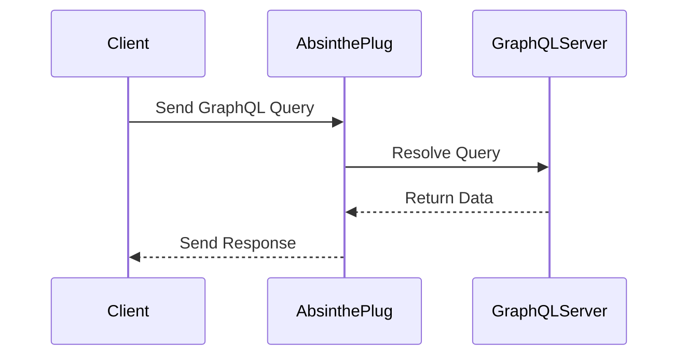

## 14.7. GraphQL APIs with Absinthe

GraphQL has emerged as a powerful alternative to REST for building APIs, offering a flexible and efficient way to query and manipulate data. In the Elixir ecosystem, Absinthe is the go-to library for implementing GraphQL APIs. This section will guide you through the advanced concepts of building GraphQL APIs with Absinthe, focusing on consuming GraphQL services, schema stitching, and implementing real-time data fetching with subscriptions.

### Introduction to GraphQL and Absinthe

GraphQL is a query language for APIs and a runtime for executing those queries by using a type system you define for your data. It allows clients to request only the data they need, reducing over-fetching and under-fetching issues common with REST APIs.

Absinthe is a robust GraphQL toolkit for Elixir, designed to help developers build powerful and flexible APIs. It integrates seamlessly with the Elixir ecosystem, leveraging its concurrency model and functional programming paradigm to deliver high-performance GraphQL services.

### Consuming GraphQL Services

To consume GraphQL services, you can use clients like `Absinthe.Plug` to interact with GraphQL APIs. This section will demonstrate how to set up a GraphQL client in Elixir and make queries to a GraphQL server.

#### Setting Up Absinthe.Plug

`Absinthe.Plug` is a library that allows you to mount a GraphQL schema in a Plug application. It acts as a bridge between your Elixir application and the GraphQL server.

```elixir
# Add Absinthe.Plug to your mix.exs
defp deps do
  [
    {:absinthe_plug, "~> 1.5"}
  ]
end
```

#### Creating a GraphQL Client

To create a GraphQL client, you need to define a schema and configure the endpoint to handle GraphQL requests.

```elixir
# Define a simple schema
defmodule MyAppWeb.Schema do
  use Absinthe.Schema

  query do
    field :hello, :string do
      resolve fn _, _ ->
        {:ok, "Hello, world!"}
      end
    end
  end
end

# Configure the endpoint
defmodule MyAppWeb.Endpoint do
  use Phoenix.Endpoint, otp_app: :my_app

  plug Absinthe.Plug,
    schema: MyAppWeb.Schema

  plug Plug.Logger
  plug Plug.Parsers, parsers: [:urlencoded, :multipart, :json],
                     pass: ["*/*"],
                     json_decoder: Jason

  plug :match
  plug :dispatch
end
```

#### Making GraphQL Queries

With the client set up, you can now make GraphQL queries to fetch data from the server.

```elixir
# Example query
query = """
{
  hello
}
"""

# Send the query to the server
response = MyAppWeb.Endpoint.call(%Plug.Conn{}, :get, "/graphql", query)

IO.inspect(response)
```

### Schema Stitching

Schema stitching is a technique used to combine multiple GraphQL schemas into a single unified schema. This is particularly useful when you have microservices or separate GraphQL APIs that you want to expose as a single API.

#### Implementing Schema Stitching

To implement schema stitching in Absinthe, you can use the `Absinthe.Schema.Notation` module to define and merge schemas.

```elixir
defmodule MyAppWeb.StitchedSchema do
  use Absinthe.Schema.Notation

  import_types MyAppWeb.Schema1
  import_types MyAppWeb.Schema2

  query do
    import_fields :schema1_query
    import_fields :schema2_query
  end
end
```

#### Benefits of Schema Stitching

- **Unified API**: Expose multiple services as a single API.
- **Modularity**: Keep schemas modular and maintainable.
- **Reusability**: Reuse types and fields across different schemas.

### Subscriptions

Subscriptions in GraphQL allow clients to receive real-time updates from the server. Absinthe provides robust support for implementing subscriptions, enabling you to build real-time applications with ease.

#### Implementing Subscriptions

To implement subscriptions, you need to define subscription fields in your schema and use a PubSub system to broadcast updates.

```elixir
defmodule MyAppWeb.Schema do
  use Absinthe.Schema

  subscription do
    field :new_message, :message do
      config fn _, _ ->
        {:ok, topic: "messages"}
      end
    end
  end
end

# Broadcasting updates
MyAppWeb.Endpoint.broadcast("messages", "new_message", %{content: "Hello, world!"})
```

#### Real-Time Data Fetching

Subscriptions enable real-time data fetching, allowing clients to receive updates as soon as they occur.

- **Use Cases**: Chat applications, live sports scores, stock market updates.
- **Efficiency**: Reduce polling and improve performance.

### Visualizing GraphQL with Absinthe

To better understand the flow of data in a GraphQL API built with Absinthe, let's visualize the process using a sequence diagram.



**Diagram Description:** This sequence diagram illustrates the interaction between a client, Absinthe.Plug, and a GraphQL server. The client sends a query to Absinthe.Plug, which resolves the query by communicating with the GraphQL server. The server returns the data, and Absinthe.Plug sends the response back to the client.

### Key Considerations for GraphQL APIs with Absinthe

- **Performance**: Optimize queries and use batching to reduce server load.
- **Security**: Implement authentication and authorization to protect sensitive data.
- **Error Handling**: Provide meaningful error messages and handle exceptions gracefully.

### Elixir Unique Features

Elixir's concurrency model and functional programming paradigm make it an excellent choice for building GraphQL APIs. Absinthe leverages these features to deliver high-performance, scalable APIs.

- **Concurrency**: Handle multiple requests simultaneously with lightweight processes.
- **Fault Tolerance**: Use OTP principles to build resilient systems.
- **Functional Programming**: Write clean, maintainable code with pure functions and immutability.

### Differences and Similarities with REST

While both GraphQL and REST are used to build APIs, they have key differences:

- **Flexibility**: GraphQL allows clients to specify exactly what data they need, while REST has fixed endpoints.
- **Efficiency**: GraphQL reduces over-fetching and under-fetching by allowing clients to request only the necessary data.
- **Complexity**: GraphQL can be more complex to implement due to its flexible query language and schema requirements.

### Try It Yourself

Experiment with the code examples provided in this section. Try modifying the schema, adding new fields, or implementing additional subscriptions. Explore the capabilities of Absinthe and see how it can enhance your Elixir applications.

### Knowledge Check

- What are the benefits of using GraphQL over REST?
- How does Absinthe leverage Elixir's concurrency model?
- What is schema stitching, and why is it useful?
- How do subscriptions enable real-time data fetching?

### Summary

In this section, we've explored the advanced concepts of building GraphQL APIs with Absinthe in Elixir. We've covered consuming GraphQL services, schema stitching, and implementing real-time data fetching with subscriptions. By leveraging Elixir's unique features and Absinthe's powerful toolkit, you can build flexible, efficient, and scalable APIs.

Remember, this is just the beginning. As you progress, you'll discover more advanced techniques and patterns for building GraphQL APIs in Elixir. Keep experimenting, stay curious, and enjoy the journey!

## Quiz: GraphQL APIs with Absinthe



### What is the primary advantage of using GraphQL over REST?

- [x] Clients can request only the data they need.
- [ ] It is easier to implement than REST.
- [ ] It requires less server-side code.
- [ ] It is more secure than REST.

> **Explanation:** GraphQL allows clients to specify exactly what data they need, reducing over-fetching and under-fetching issues common with REST APIs.

### Which library is used to mount a GraphQL schema in a Plug application?

- [x] Absinthe.Plug
- [ ] Phoenix.Plug
- [ ] Ecto.Plug
- [ ] GraphQL.Plug

> **Explanation:** Absinthe.Plug is used to mount a GraphQL schema in a Plug application, acting as a bridge between the Elixir application and the GraphQL server.

### What is schema stitching in GraphQL?

- [x] Combining multiple GraphQL schemas into a single unified schema.
- [ ] Creating a schema from a REST API.
- [ ] Splitting a large schema into smaller parts.
- [ ] Converting a GraphQL schema to JSON.

> **Explanation:** Schema stitching is a technique used to combine multiple GraphQL schemas into a single unified schema, allowing you to expose multiple services as a single API.

### How do subscriptions in GraphQL enable real-time data fetching?

- [x] By allowing clients to receive updates as soon as they occur.
- [ ] By polling the server at regular intervals.
- [ ] By caching data on the client side.
- [ ] By using WebSockets for all data transfers.

> **Explanation:** Subscriptions in GraphQL allow clients to receive real-time updates from the server, enabling real-time data fetching without the need for polling.

### What is the role of Absinthe in Elixir?

- [x] It is a toolkit for building GraphQL APIs.
- [ ] It is a database library.
- [ ] It is a web server framework.
- [ ] It is a testing library.

> **Explanation:** Absinthe is a robust GraphQL toolkit for Elixir, designed to help developers build powerful and flexible APIs.

### Which of the following is a benefit of schema stitching?

- [x] Unified API
- [x] Modularity
- [ ] Increased complexity
- [ ] Reduced performance

> **Explanation:** Schema stitching provides a unified API and modularity, allowing you to keep schemas maintainable and reuse types and fields across different schemas.

### What is the purpose of the `Absinthe.Schema.Notation` module?

- [x] To define and merge schemas in Absinthe.
- [ ] To handle HTTP requests in Phoenix.
- [ ] To manage database connections in Ecto.
- [ ] To perform static code analysis.

> **Explanation:** The `Absinthe.Schema.Notation` module is used to define and merge schemas in Absinthe, enabling schema stitching and modular schema design.

### How does Elixir's concurrency model benefit GraphQL APIs?

- [x] It allows handling multiple requests simultaneously with lightweight processes.
- [ ] It simplifies the implementation of GraphQL queries.
- [ ] It reduces the need for error handling.
- [ ] It eliminates the need for a database.

> **Explanation:** Elixir's concurrency model allows handling multiple requests simultaneously with lightweight processes, making it ideal for building high-performance GraphQL APIs.

### What is the main difference between GraphQL and REST?

- [x] GraphQL allows clients to specify exactly what data they need.
- [ ] GraphQL is less flexible than REST.
- [ ] GraphQL requires more server-side code than REST.
- [ ] GraphQL is less efficient than REST.

> **Explanation:** The main difference is that GraphQL allows clients to specify exactly what data they need, reducing over-fetching and under-fetching issues common with REST APIs.

### True or False: Absinthe can be used to implement real-time features in Elixir applications.

- [x] True
- [ ] False

> **Explanation:** True. Absinthe provides robust support for implementing subscriptions, enabling real-time features in Elixir applications.


