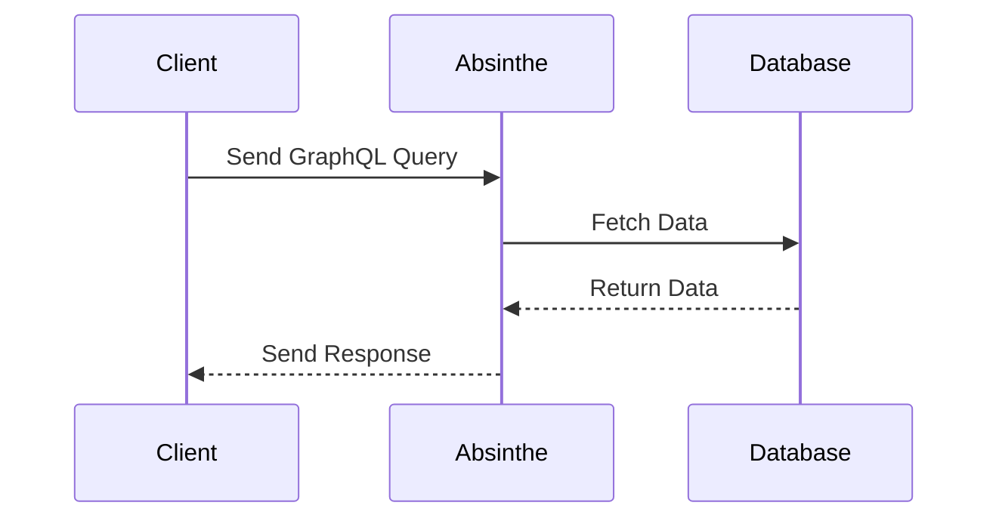

## 14.7. GraphQL APIs with Absinthe

GraphQL has become a popular choice for building APIs due to its flexibility and efficiency in data fetching. In Elixir, Absinthe is the go-to library for implementing GraphQL servers. This section will guide you through the process of building GraphQL APIs using Absinthe, covering key concepts such as consuming GraphQL services, schema stitching, and implementing subscriptions for real-time data updates.

### Introduction to GraphQL and Absinthe

GraphQL is a query language for APIs that allows clients to request only the data they need. Unlike REST, which exposes multiple endpoints, GraphQL provides a single endpoint that can serve a variety of queries. This flexibility makes GraphQL a powerful tool for building efficient and scalable APIs.

Absinthe is a GraphQL toolkit for Elixir that integrates seamlessly with the Elixir ecosystem, providing a robust framework for building GraphQL APIs. It leverages Elixir's strengths in concurrency and fault tolerance, making it ideal for handling complex queries and real-time updates.

### Consuming GraphQL Services

In Elixir, you can consume GraphQL services using clients like `Absinthe.Plug`. This allows you to interact with external GraphQL APIs, fetching data and executing mutations as needed.

#### Setting Up Absinthe Client

To consume a GraphQL API, start by adding `absinthe` and `absinthe_plug` to your `mix.exs` file:

```elixir
defp deps do
  [
    {:absinthe, "~> 1.6"},
    {:absinthe_plug, "~> 1.5"}
  ]
end
```

Run `mix deps.get` to fetch the dependencies.

#### Making GraphQL Queries

To make a GraphQL query, you can use the `Absinthe.Plug` to send HTTP requests to the GraphQL endpoint. Here's an example of how to fetch data from a GraphQL API:

```elixir
query = """
{
  user(id: "1") {
    name
    email
  }
}
"""

response = HTTPoison.post("http://example.com/graphql", query, [{"Content-Type", "application/json"}])

case response do
  {:ok, %HTTPoison.Response{status_code: 200, body: body}} ->
    IO.inspect(body)
  {:error, %HTTPoison.Error{reason: reason}} ->
    IO.inspect(reason)
end
```

In this example, we define a GraphQL query to fetch a user's name and email by ID. We then use `HTTPoison` to send the query to the GraphQL endpoint and handle the response.

### Schema Stitching

Schema stitching allows you to combine multiple GraphQL schemas into a single unified schema. This is useful when you need to integrate data from different sources or microservices.

#### Implementing Schema Stitching

To implement schema stitching in Absinthe, you can use the `Absinthe.Schema` module to define multiple schemas and merge them together. Here's an example:

```elixir
defmodule UserSchema do
  use Absinthe.Schema

  query do
    field :user, :user do
      arg :id, non_null(:id)

      resolve fn %{id: id}, _ ->
        {:ok, fetch_user(id)}
      end
    end
  end
end

defmodule ProductSchema do
  use Absinthe.Schema

  query do
    field :product, :product do
      arg :id, non_null(:id)

      resolve fn %{id: id}, _ ->
        {:ok, fetch_product(id)}
      end
    end
  end
end

defmodule UnifiedSchema do
  use Absinthe.Schema

  import_types UserSchema
  import_types ProductSchema

  query do
    import_fields :user
    import_fields :product
  end
end
```

In this example, we define two separate schemas, `UserSchema` and `ProductSchema`, and then combine them into a `UnifiedSchema`. This allows us to query both users and products from a single endpoint.

### Subscriptions

Subscriptions in GraphQL allow clients to receive real-time updates when data changes. Absinthe supports subscriptions, making it easy to implement real-time features in your applications.

#### Implementing Subscriptions in Absinthe

To implement subscriptions, you need to define subscription fields in your schema and use a PubSub system to broadcast updates. Here's an example:

```elixir
defmodule MyAppWeb.Schema do
  use Absinthe.Schema

  subscription do
    field :new_message, :message do
      config fn _, _ ->
        {:ok, topic: "messages"}
      end

      trigger :create_message, topic: fn
        message -> "messages"
      end
    end
  end
end
```

In this example, we define a `new_message` subscription that listens for new messages. When a new message is created, it triggers an update to all subscribed clients.

To broadcast updates, you can use a PubSub system like `Phoenix.PubSub`:

```elixir
defmodule MyApp.Message do
  alias MyApp.Repo
  alias MyApp.Message

  def create_message(attrs) do
    %Message{}
    |> Message.changeset(attrs)
    |> Repo.insert()
    |> case do
      {:ok, message} ->
        MyAppWeb.Endpoint.broadcast!("messages", "new_message", message)
        {:ok, message}
      {:error, changeset} ->
        {:error, changeset}
    end
  end
end
```

In this example, we broadcast a `new_message` event whenever a new message is created, notifying all subscribed clients.

### Visualizing GraphQL API with Absinthe

To better understand how GraphQL APIs work with Absinthe, let's visualize the flow of data using a Mermaid.js sequence diagram:


```mermaid
sequenceDiagram
    participant Client
    participant Absinthe
    participant Database

    Client->>Absinthe: Send GraphQL Query
    Absinthe->>Database: Fetch Data
    Database-->>Absinthe: Return Data
    Absinthe-->>Client: Send Response
```

This diagram illustrates the process of a client sending a GraphQL query to Absinthe, which then fetches data from the database and returns the response to the client.

### Key Considerations

When building GraphQL APIs with Absinthe, there are several key considerations to keep in mind:

- **Performance**: GraphQL queries can become complex, leading to performance issues. Use query batching and caching to optimize performance.
- **Security**: Ensure your GraphQL API is secure by implementing authentication and authorization mechanisms.
- **Error Handling**: Provide meaningful error messages to clients and handle errors gracefully in your API.

### Elixir Unique Features

Elixir's concurrency model and fault tolerance make it an excellent choice for building GraphQL APIs. Absinthe leverages these features to handle complex queries and real-time updates efficiently.

### Differences and Similarities

GraphQL APIs differ from REST APIs in that they provide a single endpoint for all data requests, allowing clients to specify exactly what data they need. This can lead to more efficient data fetching compared to REST, where multiple endpoints may be required.

### Try It Yourself

To experiment with Absinthe and GraphQL, try modifying the code examples provided in this section. For example, add new fields to the schemas, implement additional subscriptions, or integrate with a different database.

### Conclusion

Building GraphQL APIs with Absinthe in Elixir is a powerful way to create efficient and scalable applications. By leveraging Elixir's strengths and Absinthe's robust features, you can build APIs that provide real-time updates and flexible data fetching.

Remember, this is just the beginning. As you progress, you'll build more complex and interactive APIs. Keep experimenting, stay curious, and enjoy the journey!

## Quiz Time!



### What is the primary advantage of using GraphQL over REST?

- [x] Clients can request only the data they need.
- [ ] It automatically scales better than REST.
- [ ] It is easier to implement than REST.
- [ ] It always provides faster responses.

> **Explanation:** GraphQL allows clients to specify exactly what data they need, reducing over-fetching and under-fetching of data.

### Which Elixir library is commonly used for building GraphQL APIs?

- [ ] Phoenix
- [x] Absinthe
- [ ] Ecto
- [ ] Plug

> **Explanation:** Absinthe is the primary library used in Elixir for building GraphQL APIs.

### What is schema stitching in GraphQL?

- [x] Combining multiple GraphQL schemas into a single schema.
- [ ] Creating a schema from a database schema.
- [ ] Splitting a large schema into smaller ones.
- [ ] Automatically generating schemas from models.

> **Explanation:** Schema stitching allows you to combine multiple GraphQL schemas into one unified schema.

### What is the purpose of subscriptions in GraphQL?

- [ ] To fetch data more efficiently.
- [ ] To cache responses.
- [x] To provide real-time data updates.
- [ ] To handle errors more gracefully.

> **Explanation:** Subscriptions in GraphQL are used to provide real-time updates to clients when data changes.

### How can you broadcast updates in Absinthe?

- [ ] Using Ecto
- [ ] Using HTTPoison
- [x] Using Phoenix.PubSub
- [ ] Using Plug

> **Explanation:** Phoenix.PubSub is used to broadcast updates in Absinthe, enabling real-time features.

### What is a key consideration when building GraphQL APIs?

- [x] Performance optimization
- [ ] Using only one schema
- [ ] Avoiding real-time updates
- [ ] Using REST endpoints

> **Explanation:** Performance optimization is crucial when building GraphQL APIs, as queries can become complex and resource-intensive.

### Which of the following is a unique feature of Elixir that benefits GraphQL APIs?

- [ ] Static typing
- [x] Concurrency model
- [ ] Object-oriented programming
- [ ] Built-in UI components

> **Explanation:** Elixir's concurrency model and fault tolerance are unique features that benefit GraphQL APIs, especially for handling complex queries and real-time updates.

### What is the role of `Absinthe.Plug` in consuming GraphQL services?

- [x] It acts as a client to interact with GraphQL APIs.
- [ ] It provides real-time updates.
- [ ] It manages database connections.
- [ ] It handles RESTful requests.

> **Explanation:** `Absinthe.Plug` is used to interact with GraphQL APIs, allowing you to send queries and mutations.

### What does the following code snippet represent in a GraphQL context?

```elixir
field :user, :user do
  arg :id, non_null(:id)
  resolve fn %{id: id}, _ -> {:ok, fetch_user(id)} end
end
```

- [x] A GraphQL query field definition
- [ ] A mutation definition
- [ ] A subscription definition
- [ ] A REST endpoint

> **Explanation:** This code snippet defines a GraphQL query field for fetching a user by ID.

### True or False: GraphQL APIs always provide faster responses than REST APIs.

- [ ] True
- [x] False

> **Explanation:** While GraphQL can be more efficient in data fetching, it does not guarantee faster responses in all cases. The performance depends on various factors, including query complexity and server implementation.




