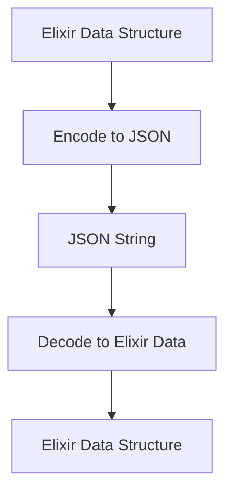

## 14.8. JSON and Data Serialization

In the modern world of software development, data serialization is a crucial aspect of integrating systems, especially when dealing with web services and APIs. JSON (JavaScript Object Notation) is one of the most popular data interchange formats due to its simplicity and readability. In this section, we will delve into JSON and data serialization in Elixir, focusing on encoding and decoding, custom serialization, and optimizing serialization for performance.

### Encoding and Decoding

JSON encoding and decoding are fundamental operations when working with web APIs and data interchange between systems. In Elixir, libraries like `Jason` and `Poison` are commonly used for these operations.

#### Using `Jason` for JSON Operations

`Jason` is a fast and efficient JSON library for Elixir. It is widely used due to its performance and ease of use. Let's explore how to use `Jason` for encoding and decoding JSON data.

**Installation**

To use `Jason`, you need to add it to your `mix.exs` file:

```elixir
defp deps do
  [
    {:jason, "~> 1.2"}
  ]
end
```

Run `mix deps.get` to fetch the dependency.

**Encoding Data to JSON**

Encoding Elixir data structures to JSON is straightforward with `Jason`. Here's an example:

```elixir
# Define a map
data = %{
  name: "Alice",
  age: 30,
  languages: ["Elixir", "Ruby", "JavaScript"]
}

# Encode the map to JSON
{:ok, json} = Jason.encode(data)

IO.puts(json)
# Output: {"name":"Alice","age":30,"languages":["Elixir","Ruby","JavaScript"]}
```

**Decoding JSON to Data**

Decoding JSON back into Elixir data structures is just as simple:

```elixir
# JSON string
json = "{\"name\":\"Alice\",\"age\":30,\"languages\":[\"Elixir\",\"Ruby\",\"JavaScript\"]}"

# Decode the JSON string
{:ok, data} = Jason.decode(json)

IO.inspect(data)
# Output: %{"name" => "Alice", "age" => 30, "languages" => ["Elixir", "Ruby", "JavaScript"]}
```

#### Using `Poison` for JSON Operations

`Poison` is another JSON library for Elixir, known for its speed and simplicity. Although `Jason` is often preferred for new projects, `Poison` is still widely used in existing codebases.

**Installation**

Add `Poison` to your `mix.exs` file:

```elixir
defp deps do
  [
    {:poison, "~> 4.0"}
  ]
end
```

Run `mix deps.get` to fetch the dependency.

**Encoding Data to JSON with Poison**

```elixir
# Define a map
data = %{
  name: "Bob",
  age: 25,
  languages: ["Python", "Java", "Elixir"]
}

# Encode the map to JSON
json = Poison.encode!(data)

IO.puts(json)
# Output: {"name":"Bob","age":25,"languages":["Python","Java","Elixir"]}
```

**Decoding JSON to Data with Poison**

```elixir
# JSON string
json = "{\"name\":\"Bob\",\"age\":25,\"languages\":[\"Python\",\"Java\",\"Elixir\"]}"

# Decode the JSON string
data = Poison.decode!(json)

IO.inspect(data)
# Output: %{"name" => "Bob", "age" => 25, "languages" => ["Python", "Java", "Elixir"]}
```

### Custom Serialization

While JSON libraries handle basic data types well, there are times when you need to serialize custom data types. Elixir's protocol system allows you to define custom serialization logic for your data structures.

#### Implementing Protocols for Custom Data Types

Let's say we have a custom struct that we want to serialize to JSON:

```elixir
defmodule User do
  defstruct [:name, :email, :age]
end
```

To serialize this struct, we can implement the `Jason.Encoder` protocol:

```elixir
defimpl Jason.Encoder, for: User do
  def encode(%User{name: name, email: email, age: age}, opts) do
    Jason.Encode.map(%{name: name, email: email, age: age}, opts)
  end
end
```

Now, we can encode a `User` struct to JSON:

```elixir
user = %User{name: "Charlie", email: "charlie@example.com", age: 28}

{:ok, json} = Jason.encode(user)

IO.puts(json)
# Output: {"name":"Charlie","email":"charlie@example.com","age":28}
```

### Efficiency

Efficiency in serialization is crucial, especially when dealing with large datasets or high-throughput systems. Here are some tips to optimize serialization performance in Elixir.

#### Optimizing Serialization for Performance

1. **Use Efficient Libraries**: Choose libraries like `Jason` that are optimized for speed and memory usage.

2. **Avoid Unnecessary Encoding/Decoding**: Minimize the number of times data is serialized and deserialized. Cache serialized data if possible.

3. **Batch Operations**: When dealing with collections, encode or decode them in batches rather than one item at a time.

4. **Profile and Benchmark**: Use tools like `Benchee` to profile and benchmark your serialization code to identify bottlenecks.

5. **Leverage Concurrency**: Utilize Elixir's concurrency model to parallelize serialization tasks when dealing with large datasets.

### Visualizing JSON Serialization

To better understand the process of JSON serialization in Elixir, let's visualize the flow of encoding and decoding operations.



**Diagram Description**: This flowchart illustrates the process of encoding an Elixir data structure to a JSON string and then decoding it back to an Elixir data structure.

### References and Links

- [Jason GitHub Repository](https://github.com/michalmuskala/jason)
- [Poison GitHub Repository](https://github.com/devinus/poison)
- [Elixir Protocols](https://elixir-lang.org/getting-started/protocols.html)

### Knowledge Check

- What are the benefits of using `Jason` over `Poison` for JSON operations?
- How can you implement custom serialization for a struct in Elixir?
- What are some strategies to optimize serialization performance?

### Embrace the Journey

Remember, mastering JSON and data serialization in Elixir is just one step in building robust and efficient systems. Keep experimenting with different libraries and techniques, stay curious, and enjoy the journey of learning and growing as a developer!

## Quiz: JSON and Data Serialization



### Which library is known for its speed and efficiency in JSON operations in Elixir?

- [x] Jason
- [ ] Poison
- [ ] Ecto
- [ ] Phoenix

> **Explanation:** Jason is known for its speed and efficiency in JSON operations in Elixir.

### How do you add Jason as a dependency in a Mix project?

- [x] Add `{:jason, "~> 1.2"}` to the `deps` function in `mix.exs`.
- [ ] Add `{:jason, "~> 1.2"}` to the `config` function in `mix.exs`.
- [ ] Add `{:jason, "~> 1.2"}` to the `applications` function in `mix.exs`.
- [ ] Add `{:jason, "~> 1.2"}` to the `env` function in `mix.exs`.

> **Explanation:** To add Jason as a dependency, you need to include it in the `deps` function in `mix.exs`.

### What is the output of encoding a map `%{name: "Alice", age: 30}` using Jason?

- [x] `{"name":"Alice","age":30}`
- [ ] `{"name":"Alice","age":"30"}`
- [ ] `{"name":Alice,"age":30}`
- [ ] `{"name":"Alice",age:30}`

> **Explanation:** Jason encodes maps to JSON strings with keys and values in quotes.

### How can you implement custom serialization for a struct in Elixir?

- [x] Implement the `Jason.Encoder` protocol for the struct.
- [ ] Implement the `Poison.Encoder` protocol for the struct.
- [ ] Implement the `String.Chars` protocol for the struct.
- [ ] Implement the `Inspect` protocol for the struct.

> **Explanation:** To implement custom serialization for a struct, you need to implement the `Jason.Encoder` protocol.

### What is a key strategy for optimizing serialization performance?

- [x] Use efficient libraries like Jason.
- [ ] Use inefficient libraries like Poison.
- [ ] Encode and decode data multiple times.
- [ ] Avoid using any libraries.

> **Explanation:** Using efficient libraries like Jason is a key strategy for optimizing serialization performance.

### Which of the following is NOT a benefit of using JSON for data interchange?

- [ ] Simplicity
- [ ] Readability
- [x] Complexity
- [ ] Language independence

> **Explanation:** JSON is known for its simplicity and readability, not complexity.

### What is the purpose of the `Jason.encode/1` function?

- [x] To convert Elixir data structures to JSON strings.
- [ ] To convert JSON strings to Elixir data structures.
- [ ] To convert Elixir data structures to XML strings.
- [ ] To convert XML strings to Elixir data structures.

> **Explanation:** The `Jason.encode/1` function is used to convert Elixir data structures to JSON strings.

### What is the purpose of the `Jason.decode/1` function?

- [x] To convert JSON strings to Elixir data structures.
- [ ] To convert Elixir data structures to JSON strings.
- [ ] To convert JSON strings to XML strings.
- [ ] To convert XML strings to JSON strings.

> **Explanation:** The `Jason.decode/1` function is used to convert JSON strings to Elixir data structures.

### Which of the following is a common use case for JSON serialization?

- [x] Data interchange between web services
- [ ] Compiling Elixir code
- [ ] Rendering HTML templates
- [ ] Managing database connections

> **Explanation:** JSON serialization is commonly used for data interchange between web services.

### True or False: JSON is a binary data format.

- [ ] True
- [x] False

> **Explanation:** JSON is a text-based data format, not a binary format.


