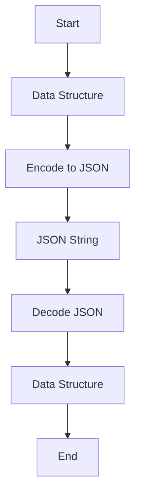

## 14.8. JSON and Data Serialization

In the realm of modern software development, data serialization is a crucial concept, especially when integrating with other systems. JSON (JavaScript Object Notation) has become a ubiquitous format for data interchange due to its simplicity and readability. In this section, we will delve into JSON and data serialization in Elixir, focusing on encoding and decoding, custom serialization, and performance optimization. 

### Encoding and Decoding

#### Using `Jason` for JSON Operations

`Jason` is a fast and efficient JSON library for Elixir, commonly used for encoding and decoding JSON data. It is known for its speed and ease of use, making it a popular choice among Elixir developers.

**Encoding Data to JSON**

To encode data to JSON using `Jason`, you can use the `Jason.encode/1` function. Here's a simple example:

```elixir
# Define a map with some data
data = %{name: "Elixir", type: "Functional", year: 2011}

# Encode the map to a JSON string
{:ok, json_string} = Jason.encode(data)

IO.puts(json_string)
# Output: {"name":"Elixir","type":"Functional","year":2011}
```

In this example, we define a map and encode it to a JSON string. The `Jason.encode/1` function returns a tuple with `:ok` and the JSON string if successful.

**Decoding JSON to Data**

Decoding JSON back to Elixir data structures is equally straightforward with `Jason`. Use the `Jason.decode/1` function:

```elixir
# JSON string to decode
json_string = "{\"name\":\"Elixir\",\"type\":\"Functional\",\"year\":2011}"

# Decode the JSON string to a map
{:ok, data} = Jason.decode(json_string)

IO.inspect(data)
# Output: %{"name" => "Elixir", "type" => "Functional", "year" => 2011}
```

Here, the JSON string is decoded back into a map. The keys in the resulting map are strings, as JSON keys are always strings.

#### Using `Poison` for JSON Operations

`Poison` is another JSON library in Elixir, known for its ease of use and flexibility. Although `Jason` is generally preferred for its performance, `Poison` remains a viable option.

**Encoding with `Poison`**

```elixir
# Define a map with some data
data = %{name: "Elixir", type: "Functional", year: 2011}

# Encode the map to a JSON string
json_string = Poison.encode!(data)

IO.puts(json_string)
# Output: {"name":"Elixir","type":"Functional","year":2011}
```

**Decoding with `Poison`**

```elixir
# JSON string to decode
json_string = "{\"name\":\"Elixir\",\"type\":\"Functional\",\"year\":2011}"

# Decode the JSON string to a map
data = Poison.decode!(json_string)

IO.inspect(data)
# Output: %{"name" => "Elixir", "type" => "Functional", "year" => 2011}
```

### Custom Serialization

#### Implementing Protocols for Custom Data Types

In Elixir, you can implement custom serialization for your data types by using protocols. Protocols allow you to define a set of functions that can be implemented by different data types.

**Defining a Protocol**

Let's define a protocol for serializing data to JSON:

```elixir
defprotocol JSONSerializable do
  @doc "Converts a data structure to a JSON-compatible map"
  def to_json(data)
end
```

**Implementing the Protocol**

Now, let's implement this protocol for a custom struct:

```elixir
defmodule User do
  defstruct [:name, :email, :age]
end

defimpl JSONSerializable, for: User do
  def to_json(%User{name: name, email: email, age: age}) do
    %{
      "name" => name,
      "email" => email,
      "age" => age
    }
  end
end
```

**Using the Protocol**

With the protocol implemented, you can now serialize a `User` struct to JSON:

```elixir
# Create a User struct
user = %User{name: "Alice", email: "alice@example.com", age: 30}

# Serialize the User struct to a JSON-compatible map
json_map = JSONSerializable.to_json(user)

# Encode the JSON-compatible map to a JSON string
{:ok, json_string} = Jason.encode(json_map)

IO.puts(json_string)
# Output: {"name":"Alice","email":"alice@example.com","age":30}
```

### Efficiency

#### Optimizing Serialization for Performance

When dealing with large datasets or high-throughput systems, optimizing serialization performance is crucial. Here are some strategies to enhance efficiency:

1. **Use Efficient Libraries**: Choose libraries like `Jason` that are optimized for performance.

2. **Avoid Unnecessary Encoding/Decoding**: Minimize the number of times data is encoded or decoded by keeping it in a serialized state as long as possible.

3. **Batch Processing**: When possible, process data in batches to reduce the overhead of multiple serialization operations.

4. **Stream Processing**: Use streams to handle large datasets efficiently without loading the entire dataset into memory.

5. **Avoid Repeated Conversions**: Cache serialized data if it is used multiple times without modification.

### Visualizing JSON Serialization Process

To better understand the JSON serialization process, let's visualize it using a flowchart.


```mermaid
graph TD;
    A[Start] --> B[Data Structure]
    B --> C[Encode to JSON]
    C --> D[JSON String]
    D --> E[Decode JSON]
    E --> F[Data Structure]
    F --> G[End]
```

**Description**: This flowchart illustrates the process of encoding a data structure to a JSON string and then decoding it back to a data structure.

### Try It Yourself

Experiment with the following tasks to deepen your understanding:

- **Modify the `User` struct** to include additional fields, and update the JSON serialization protocol implementation accordingly.
- **Switch between `Jason` and `Poison`** in your code and observe any differences in performance or output.
- **Implement a custom serialization protocol** for another data type, such as a list of tuples.

### Knowledge Check

- **Why is JSON a popular format for data interchange?**
- **What are the benefits of using protocols for custom serialization in Elixir?**
- **How can you optimize JSON serialization for performance in Elixir applications?**

### Embrace the Journey

As you explore JSON and data serialization in Elixir, remember that mastering these concepts is a stepping stone to building robust, efficient, and scalable applications. Keep experimenting, stay curious, and enjoy the journey!

## Quiz Time!



### Which library is known for its speed and efficiency in JSON operations in Elixir?

- [x] Jason
- [ ] Poison
- [ ] Ecto
- [ ] Phoenix

> **Explanation:** Jason is known for its speed and efficiency in JSON operations in Elixir.

### What function is used to encode data to JSON using Jason?

- [ ] Jason.decode/1
- [x] Jason.encode/1
- [ ] Poison.encode/1
- [ ] JSON.encode/1

> **Explanation:** Jason.encode/1 is used to encode data to JSON.

### How are JSON keys represented in Elixir maps after decoding?

- [x] As strings
- [ ] As atoms
- [ ] As integers
- [ ] As tuples

> **Explanation:** JSON keys are represented as strings in Elixir maps after decoding.

### What is the purpose of defining a protocol in Elixir?

- [ ] To create a new programming language
- [x] To define a set of functions that can be implemented by different data types
- [ ] To manage database connections
- [ ] To handle HTTP requests

> **Explanation:** A protocol in Elixir defines a set of functions that can be implemented by different data types.

### What is a key strategy for optimizing serialization performance?

- [x] Batch processing
- [ ] Using slower libraries
- [ ] Frequent encoding/decoding
- [ ] Avoiding caching

> **Explanation:** Batch processing is a key strategy for optimizing serialization performance.

### Which function is used to decode JSON to data using Jason?

- [x] Jason.decode/1
- [ ] Jason.encode/1
- [ ] Poison.decode/1
- [ ] JSON.decode/1

> **Explanation:** Jason.decode/1 is used to decode JSON to data.

### What is a benefit of using streams for data processing?

- [x] Efficient handling of large datasets
- [ ] Increased memory usage
- [ ] Slower processing
- [ ] Data loss

> **Explanation:** Streams allow efficient handling of large datasets without loading them entirely into memory.

### What is a common use case for custom serialization in Elixir?

- [x] Serializing custom structs
- [ ] Managing server logs
- [ ] Handling network errors
- [ ] Creating user interfaces

> **Explanation:** Custom serialization is commonly used for serializing custom structs in Elixir.

### Which of the following is NOT a JSON library for Elixir?

- [ ] Jason
- [x] Ecto
- [ ] Poison
- [ ] JSX

> **Explanation:** Ecto is not a JSON library; it's a database wrapper and query generator for Elixir.

### True or False: JSON keys in Elixir maps are always atoms.

- [ ] True
- [x] False

> **Explanation:** JSON keys in Elixir maps are always strings, not atoms.


