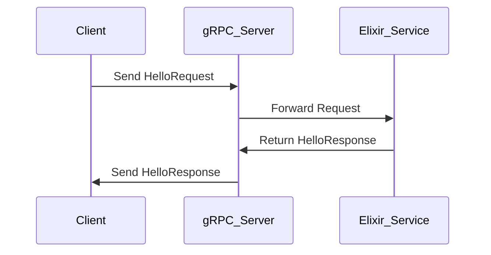

## 14.9. gRPC and Protobuf Integration

In the realm of distributed systems and microservices, efficient communication between services is paramount. gRPC (Google Remote Procedure Call) and Protocol Buffers (Protobuf) offer a robust solution for high-performance, strongly-typed service communication. In this section, we will delve into how Elixir, a functional programming language known for its concurrency and fault tolerance, can leverage gRPC and Protobuf to build scalable and efficient systems.

### High-Performance RPC with gRPC

gRPC is a modern, open-source RPC framework that can run in any environment. It enables client and server applications to communicate transparently and makes it easier to build connected systems. gRPC is based on HTTP/2, which provides several benefits such as multiplexing, flow control, header compression, and bidirectional streaming.

#### Key Features of gRPC

- **Language Agnostic**: gRPC supports multiple languages, making it a versatile choice for polyglot environments.
- **Strongly Typed**: With Protobuf, gRPC ensures that the data exchanged between services is strongly typed.
- **Efficient**: gRPC uses HTTP/2 for transport, which is more efficient than HTTP/1.1.
- **Streaming**: Supports unary, client streaming, server streaming, and bidirectional streaming RPCs.

### Defining Data Structures with Protocol Buffers

Protocol Buffers (Protobuf) is a language-neutral, platform-neutral, extensible mechanism for serializing structured data. It is used to define the structure of the data exchanged between services in gRPC.

#### Protobuf Basics

- **.proto Files**: Define the structure of your data and the services.
- **Message Types**: Define the data structure.
- **Service Definitions**: Define the RPC methods.

Here is a simple example of a `.proto` file:

```protobuf
syntax = "proto3";

package example;

message HelloRequest {
  string name = 1;
}

message HelloResponse {
  string message = 1;
}

service Greeter {
  rpc SayHello (HelloRequest) returns (HelloResponse);
}
```

### Elixir Support for gRPC and Protobuf

Elixir, with its powerful concurrency model and fault-tolerant design, is well-suited for building distributed systems. While Elixir does not natively support gRPC, there are libraries available that enable gRPC integration.

#### Using the `grpc` Library in Elixir

The `grpc` library for Elixir provides the necessary tools to implement gRPC services and clients. It leverages the Erlang ecosystem to provide a robust and efficient implementation.

#### Setting Up gRPC in Elixir

1. **Install Dependencies**: Add the `grpc` library to your `mix.exs` file.

```elixir
defp deps do
  [
    {:grpc, "~> 0.5.0"},
    {:protobuf, "~> 0.7.0"}
  ]
end
```

2. **Compile Protobuf Definitions**: Use the `protobuf` library to compile your `.proto` files.

3. **Implement the gRPC Service**: Define your service module and implement the RPC methods.

```elixir
defmodule Example.Greeter.Server do
  use GRPC.Server, service: Example.Greeter.Service

  def say_hello(%Example.HelloRequest{name: name}, _stream) do
    {:ok, %Example.HelloResponse{message: "Hello, #{name}!"}}
  end
end
```

4. **Start the gRPC Server**: Use the `GRPC.Server` module to start your server.

```elixir
defmodule Example.Application do
  use Application

  def start(_type, _args) do
    children = [
      {GRPC.Server.Supervisor, {Example.Greeter.Server, 50051}}
    ]

    opts = [strategy: :one_for_one, name: Example.Supervisor]
    Supervisor.start_link(children, opts)
  end
end
```

### Visualizing gRPC and Protobuf Integration

To better understand the flow of data and the interaction between components, let's visualize the architecture using a sequence diagram.



### Key Participants in gRPC and Protobuf Integration

- **Client**: Initiates the RPC call.
- **gRPC Server**: Receives the request, processes it, and returns a response.
- **Elixir Service**: Implements the business logic for the RPC methods.

### Applicability of gRPC and Protobuf in Elixir

- **Microservices**: Ideal for communication between microservices due to its efficiency and language agnosticism.
- **Real-Time Systems**: Supports streaming, making it suitable for real-time data processing.
- **Cross-Language Communication**: Facilitates communication between services written in different languages.

### Design Considerations

- **Compatibility**: Ensure that the gRPC and Protobuf versions are compatible across different services.
- **Security**: Use TLS for secure communication.
- **Error Handling**: Implement robust error handling to manage network failures and service unavailability.

### Elixir Unique Features

- **Concurrency**: Leverage Elixir's lightweight processes for handling multiple gRPC requests concurrently.
- **Fault Tolerance**: Use Elixir's supervision trees to manage gRPC server processes and ensure fault tolerance.

### Differences and Similarities with Other Patterns

- **REST vs. gRPC**: Unlike REST, gRPC uses HTTP/2 and Protobuf, making it more efficient for certain use cases.
- **SOAP vs. gRPC**: Both are RPC frameworks, but gRPC is more modern and efficient.

### Try It Yourself

Experiment with the provided code examples by modifying the `.proto` file to add new RPC methods or message types. Implement these changes in your Elixir service and observe how the system behaves.

### Knowledge Check

- What are the key benefits of using gRPC over traditional REST APIs?
- How does Protobuf ensure data consistency across different services?
- What are the steps to set up a gRPC server in Elixir?

### Embrace the Journey

Remember, integrating gRPC and Protobuf in Elixir is just the beginning. As you progress, you'll discover more advanced patterns and techniques to build robust, scalable systems. Keep experimenting, stay curious, and enjoy the journey!

## Quiz: gRPC and Protobuf Integration



### What is the primary advantage of using gRPC over REST?

- [x] Efficiency and strong typing
- [ ] Simplicity and ease of use
- [ ] Better support for JSON
- [ ] Wider adoption

> **Explanation:** gRPC is more efficient due to HTTP/2 and provides strong typing with Protobuf.

### Which protocol does gRPC use for transport?

- [ ] HTTP/1.1
- [x] HTTP/2
- [ ] WebSocket
- [ ] FTP

> **Explanation:** gRPC uses HTTP/2, which offers benefits like multiplexing and header compression.

### What is the role of a `.proto` file in gRPC?

- [x] Define data structures and services
- [ ] Store configuration settings
- [ ] Manage database connections
- [ ] Handle authentication

> **Explanation:** A `.proto` file defines the data structures and services for gRPC.

### How does Elixir handle concurrency in gRPC services?

- [x] Using lightweight processes
- [ ] Through threads
- [ ] By using locks
- [ ] With coroutines

> **Explanation:** Elixir uses lightweight processes for concurrency, making it efficient for handling gRPC requests.

### What library is commonly used for gRPC in Elixir?

- [x] `grpc`
- [ ] `phoenix`
- [ ] `ecto`
- [ ] `plug`

> **Explanation:** The `grpc` library is used for implementing gRPC in Elixir.

### What is a key feature of Protocol Buffers?

- [x] Language-neutral serialization
- [ ] XML-based data format
- [ ] Built-in encryption
- [ ] Automatic database integration

> **Explanation:** Protocol Buffers provide a language-neutral way to serialize structured data.

### What type of communication does gRPC support?

- [x] Unary and streaming
- [ ] Only unary
- [ ] Only streaming
- [ ] Batch processing

> **Explanation:** gRPC supports unary, client streaming, server streaming, and bidirectional streaming.

### How can you secure gRPC communication?

- [x] Use TLS
- [ ] Use HTTP Basic Auth
- [ ] Use API keys
- [ ] Use OAuth

> **Explanation:** TLS is used to secure gRPC communication.

### What is a common use case for gRPC in Elixir?

- [x] Microservices communication
- [ ] Static website hosting
- [ ] File storage
- [ ] Image processing

> **Explanation:** gRPC is commonly used for efficient communication between microservices.

### True or False: gRPC is only suitable for use with Elixir.

- [ ] True
- [x] False

> **Explanation:** gRPC is language-agnostic and can be used with multiple programming languages.


