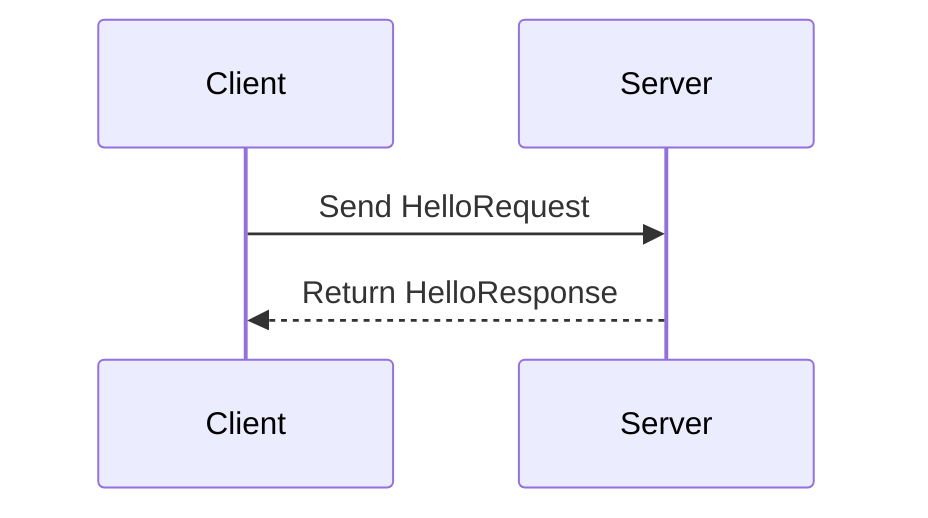

## 14.9. gRPC and Protobuf Integration

In today's interconnected world, efficient communication between services is paramount. gRPC, a high-performance, open-source RPC framework developed by Google, paired with Protocol Buffers (Protobuf), offers a powerful solution for building scalable, strongly-typed service communication. In this section, we will explore how to integrate gRPC and Protobuf in Elixir, leveraging libraries like `grpc` to facilitate seamless implementation.

### High-Performance RPC with gRPC

gRPC stands out for its ability to provide efficient, low-latency communication between services. It uses HTTP/2 for transport, allowing for multiplexing requests over a single connection, bidirectional streaming, and more. This makes it particularly suitable for microservices architectures where performance and scalability are critical.

#### Key Features of gRPC

- **Strongly-Typed Contracts**: gRPC uses Protobuf to define service contracts, ensuring type safety and reducing errors.
- **Multiplexing and Streaming**: Supports multiple types of RPCs—unary, server streaming, client streaming, and bidirectional streaming.
- **Language Agnostic**: Supports multiple programming languages, making it ideal for polyglot environments.
- **Efficient Serialization**: Protobuf provides efficient serialization of structured data, minimizing payload sizes and improving speed.

### Understanding Protocol Buffers (Protobuf)

Protocol Buffers, or Protobuf, is a language-agnostic binary serialization format developed by Google. It is used to define the structure of data in a way that is both efficient and extensible.

#### Defining Data Structures with Protobuf

Protobuf allows you to define your data structures in `.proto` files. These files specify the structure of your messages and services in a clear, concise manner.

```protobuf
syntax = "proto3";

package example;

message HelloRequest {
  string name = 1;
}

message HelloResponse {
  string message = 1;
}

service Greeter {
  rpc SayHello (HelloRequest) returns (HelloResponse);
}
```

In the example above, we define a simple `Greeter` service with a `SayHello` method. The method takes a `HelloRequest` message and returns a `HelloResponse` message.

### Elixir Support for gRPC and Protobuf

Elixir, a dynamic, functional language designed for building scalable and maintainable applications, can be integrated with gRPC using libraries such as `grpc`. This library provides the necessary tools to define and implement gRPC services in Elixir.

#### Setting Up gRPC in Elixir

To get started with gRPC in Elixir, you need to add the `grpc` library to your project. Ensure you have the following dependencies in your `mix.exs` file:

```elixir
defp deps do
  [
    {:grpc, "~> 0.5.0"},
    {:protobuf, "~> 0.10.0"}
  ]
end
```

Run `mix deps.get` to fetch the dependencies.

#### Generating Elixir Code from Protobuf Definitions

Once you have your `.proto` files, you can generate Elixir code using the `protobuf` library. This involves compiling the `.proto` files into Elixir modules.

```shell
protoc --elixir_out=plugins=grpc:./lib example.proto
```

This command generates Elixir modules for the messages and services defined in `example.proto`.

#### Implementing a gRPC Server in Elixir

With the generated code, you can now implement a gRPC server. Below is an example of a simple gRPC server using the generated modules:

```elixir
defmodule Example.Greeter.Server do
  use GRPC.Server, service: Example.Greeter.Service

  def say_hello(%Example.HelloRequest{name: name}, _stream) do
    {:ok, %Example.HelloResponse{message: "Hello, #{name}!"}}
  end
end

defmodule Example.Endpoint do
  use GRPC.Endpoint

  intercept GRPC.Logger.Server
  run Example.Greeter.Server
end
```

In this example, we define a server module `Example.Greeter.Server` that implements the `say_hello/2` function. The `GRPC.Endpoint` module is used to run the server.

#### Starting the gRPC Server

To start the server, you need to add it to your application's supervision tree:

```elixir
defmodule Example.Application do
  use Application

  def start(_type, _args) do
    children = [
      {GRPC.Server.Supervisor, {Example.Endpoint, 50051}}
    ]

    opts = [strategy: :one_for_one, name: Example.Supervisor]
    Supervisor.start_link(children, opts)
  end
end
```

This configuration starts the gRPC server on port `50051`.

### Creating a gRPC Client in Elixir

To interact with the gRPC server, you can create a gRPC client in Elixir. Below is an example of a simple client:

```elixir
defmodule Example.Greeter.Client do
  use GRPC.Stub, service: Example.Greeter.Service

  def say_hello(name) do
    request = %Example.HelloRequest{name: name}
    Example.Greeter.Client.say_hello(request)
  end
end
```

This client module uses the generated `Example.Greeter.Service` to send a `HelloRequest` to the server and receive a `HelloResponse`.

### Visualizing gRPC Integration

To better understand the flow of gRPC integration in Elixir, let's visualize the architecture using a sequence diagram:


```mermaid
sequenceDiagram
    participant Client
    participant Server
    Client->>Server: Send HelloRequest
    Server-->>Client: Return HelloResponse
```

This diagram illustrates the interaction between the client and server. The client sends a `HelloRequest`, and the server responds with a `HelloResponse`.

### Design Considerations

When integrating gRPC and Protobuf in Elixir, consider the following:

- **Service Design**: Carefully design your service interfaces to ensure they are intuitive and efficient.
- **Error Handling**: Implement robust error handling to manage network failures and other exceptions.
- **Performance Optimization**: Leverage Protobuf's efficient serialization to minimize payload sizes and improve performance.
- **Security**: Use encryption and authentication mechanisms to secure gRPC communications.

### Elixir Unique Features

Elixir's concurrency model, based on the Actor model, complements gRPC's efficient communication capabilities. This allows for building highly concurrent and fault-tolerant systems.

### Differences and Similarities with Other Patterns

gRPC is often compared with REST due to its use in service communication. Unlike REST, gRPC provides strongly-typed contracts and efficient serialization, making it more suitable for high-performance applications.

### Try It Yourself

Experiment with the provided code examples by modifying the `.proto` file to include additional methods or messages. Implement these changes in your Elixir server and client to see how gRPC handles different communication patterns.

### Knowledge Check

- How does gRPC differ from REST in terms of service communication?
- What are the benefits of using Protobuf for data serialization?
- How can you secure gRPC communications in Elixir?

### Embrace the Journey

Remember, integrating gRPC and Protobuf in Elixir is just the beginning. As you progress, you'll discover more advanced patterns and techniques to build scalable, high-performance applications. Keep experimenting, stay curious, and enjoy the journey!

## Quiz Time!



### How does gRPC differ from REST in terms of service communication?

- [x] gRPC uses strongly-typed contracts with Protobuf, while REST typically uses JSON.
- [ ] gRPC is slower than REST.
- [ ] REST supports streaming, while gRPC does not.
- [ ] gRPC does not support multiple languages.

> **Explanation:** gRPC uses strongly-typed contracts defined with Protobuf, providing more efficient serialization compared to REST's typical use of JSON.

### What is the primary benefit of using Protobuf for data serialization?

- [x] Efficient serialization and smaller payload sizes.
- [ ] Human-readable data format.
- [ ] Built-in encryption.
- [ ] Automatic error handling.

> **Explanation:** Protobuf provides efficient serialization, resulting in smaller payload sizes, which is beneficial for high-performance applications.

### Which library is commonly used in Elixir for gRPC integration?

- [x] grpc
- [ ] phoenix
- [ ] ecto
- [ ] plug

> **Explanation:** The `grpc` library is commonly used in Elixir for implementing gRPC services.

### What transport protocol does gRPC use?

- [x] HTTP/2
- [ ] HTTP/1.1
- [ ] WebSockets
- [ ] TCP

> **Explanation:** gRPC uses HTTP/2 for transport, enabling features like multiplexing and bidirectional streaming.

### Which of the following is NOT a type of RPC supported by gRPC?

- [ ] Unary
- [ ] Server streaming
- [ ] Client streaming
- [x] Batch processing

> **Explanation:** gRPC supports unary, server streaming, client streaming, and bidirectional streaming, but not batch processing.

### What is the role of `.proto` files in gRPC?

- [x] Define service contracts and data structures.
- [ ] Store configuration settings.
- [ ] Handle error logging.
- [ ] Manage client connections.

> **Explanation:** `.proto` files are used to define service contracts and data structures in gRPC.

### How can you start a gRPC server in Elixir?

- [x] By adding it to the application's supervision tree.
- [ ] By running a standalone script.
- [ ] By using a third-party hosting service.
- [ ] By configuring it in a YAML file.

> **Explanation:** In Elixir, a gRPC server is typically started by adding it to the application's supervision tree.

### What is a key advantage of using gRPC in a microservices architecture?

- [x] Efficient, low-latency communication.
- [ ] Simplicity of setup.
- [ ] Built-in database integration.
- [ ] Automatic UI generation.

> **Explanation:** gRPC provides efficient, low-latency communication, which is advantageous in microservices architectures.

### Can gRPC be used with multiple programming languages?

- [x] True
- [ ] False

> **Explanation:** gRPC is language-agnostic and supports multiple programming languages, making it suitable for polyglot environments.

### What is a common use case for bidirectional streaming in gRPC?

- [x] Real-time chat applications.
- [ ] Static web pages.
- [ ] Batch data processing.
- [ ] File storage.

> **Explanation:** Bidirectional streaming in gRPC is commonly used in real-time chat applications, where both client and server can send messages independently.




