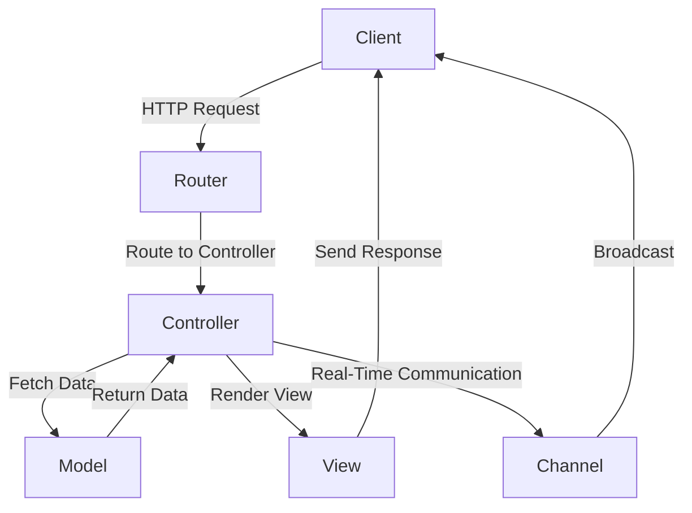

## 15.1. Overview of the Phoenix Framework

The Phoenix Framework is a modern web development framework that leverages the power of Elixir to build high-performance, scalable, and maintainable web applications. It is designed to provide developers with the tools they need to create real-time applications with ease, while also ensuring that these applications can handle a large number of concurrent users without sacrificing performance.

### Introduction to Phoenix Framework

Phoenix is built on top of the Elixir programming language, which itself runs on the Erlang VM (BEAM). This foundation gives Phoenix its unique strengths, such as fault tolerance, concurrency, and distributed computing capabilities. The framework is particularly well-suited for applications that require real-time features, such as chat applications, live notifications, and collaborative tools.

#### Key Features of Phoenix

- **Real-Time Communication**: Phoenix Channels enable real-time features, allowing developers to build applications that can push updates to clients instantly.
- **Scalability**: Leveraging Elixir's concurrency model, Phoenix can handle a large number of simultaneous connections efficiently.
- **Maintainability**: With a focus on clear code structure and conventions, Phoenix applications are easy to maintain and extend.
- **Performance**: Thanks to the BEAM VM, Phoenix applications can achieve high throughput and low latency.
- **Security**: Phoenix provides built-in security features to protect against common web vulnerabilities.

### The Architecture of Phoenix

Phoenix follows the Model-View-Controller (MVC) architecture, which is a well-known pattern in web development. This architecture helps in organizing code in a way that separates concerns, making the application easier to manage and scale.

#### Model-View-Controller (MVC) Pattern

- **Model**: Represents the data and business logic of the application. In Phoenix, models are typically implemented using Ecto, a database wrapper and query generator for Elixir.
- **View**: Responsible for rendering the user interface. Phoenix views use templates to generate HTML that is sent to the client.
- **Controller**: Acts as an intermediary between models and views. Controllers handle incoming requests, interact with models, and return responses.

```elixir
defmodule MyAppWeb.PageController do
  use MyAppWeb, :controller

  def index(conn, _params) do
    render(conn, "index.html")
  end
end
```

In the example above, the `PageController` defines an `index` action that renders the `index.html` template.

### Real-Time Features with Phoenix Channels

One of the standout features of Phoenix is its support for real-time communication through Phoenix Channels. Channels provide a way to establish persistent connections between the server and clients, allowing for bi-directional communication.

#### Setting Up a Channel

To set up a channel in Phoenix, you need to define a channel module and a socket endpoint.

```elixir
defmodule MyAppWeb.UserSocket do
  use Phoenix.Socket

  channel "room:*", MyAppWeb.RoomChannel

  def connect(_params, socket, _connect_info) do
    {:ok, socket}
  end

  def id(_socket), do: nil
end
```

```elixir
defmodule MyAppWeb.RoomChannel do
  use Phoenix.Channel

  def join("room:lobby", _message, socket) do
    {:ok, socket}
  end

  def handle_in("new_msg", %{"body" => body}, socket) do
    broadcast!(socket, "new_msg", %{body: body})
    {:noreply, socket}
  end
end
```

In this example, the `RoomChannel` allows clients to join a "room:lobby" and handle incoming messages by broadcasting them to all connected clients.

### Scalability and Performance

Phoenix's scalability is largely due to its use of the Erlang VM, which is designed for building concurrent, distributed, and fault-tolerant systems. The VM's lightweight process model allows Phoenix to handle millions of connections simultaneously.

#### Concurrency Model

Elixir's concurrency model is based on the Actor model, where each process is isolated and communicates with others through message passing. This model is inherently scalable and fault-tolerant.

```elixir
defmodule MyApp.Worker do
  def start_link do
    Task.start_link(fn -> perform_work() end)
  end

  defp perform_work do
    # Perform some work here
  end
end
```

In this example, a worker process is started using Elixir's `Task` module, which is a simple way to run concurrent tasks.

### Security in Phoenix

Phoenix includes several security features to help protect applications from common vulnerabilities such as Cross-Site Scripting (XSS), Cross-Site Request Forgery (CSRF), and SQL Injection.

#### CSRF Protection

Phoenix provides CSRF protection by default. It includes a CSRF token in forms, which is validated on the server side.

```elixir
<%= form_for @changeset, @action, fn f -> %>
  <%= hidden_input f, :csrf_token, value: get_csrf_token() %>
  <%= submit "Submit" %>
<% end %>
```

In this form example, a hidden input field is used to include the CSRF token.

### Maintainability and Code Organization

Phoenix encourages a clear code structure and follows conventions that make applications easy to maintain. It uses a modular approach, where different parts of the application are organized into contexts.

#### Contexts in Phoenix

Contexts are a way to group related functionality and data. They help in organizing the codebase and defining clear boundaries within the application.

```elixir
defmodule MyApp.Accounts do
  alias MyApp.Repo
  alias MyApp.Accounts.User

  def list_users do
    Repo.all(User)
  end

  def get_user!(id) do
    Repo.get!(User, id)
  end
end
```

In this example, the `Accounts` context encapsulates functionality related to user accounts.

### Performance Optimization

Phoenix applications can be optimized for performance by leveraging Elixir's features and the BEAM VM's capabilities.

#### Caching with ETS

ETS (Erlang Term Storage) is a powerful in-memory storage system that can be used to cache data for fast access.

```elixir
:ets.new(:my_cache, [:named_table, :public, read_concurrency: true])

def cache_data(key, value) do
  :ets.insert(:my_cache, {key, value})
end

def get_cached_data(key) do
  case :ets.lookup(:my_cache, key) do
    [{^key, value}] -> {:ok, value}
    [] -> :error
  end
end
```

This example demonstrates how to use ETS for caching data in a Phoenix application.

### Try It Yourself

To get hands-on experience with Phoenix, try setting up a new Phoenix project and experiment with the features discussed above. Modify the code examples to suit your needs and observe how Phoenix handles real-time communication, scalability, and security.

### Visualizing Phoenix Architecture

Below is a diagram representing the architecture of a Phoenix application, illustrating the interaction between different components such as controllers, views, channels, and models.



### Summary

The Phoenix Framework is a powerful tool for building modern web applications that require real-time features, scalability, and maintainability. By leveraging Elixir's strengths, Phoenix provides developers with a robust platform for creating high-performance applications. As you continue to explore Phoenix, remember to experiment with its features and apply best practices to ensure your applications are secure, efficient, and easy to maintain.

## Quiz: Overview of the Phoenix Framework



### What is the primary programming language used by the Phoenix Framework?

- [x] Elixir
- [ ] Ruby
- [ ] Python
- [ ] JavaScript

> **Explanation:** Phoenix is built on top of the Elixir programming language.

### Which architecture pattern does Phoenix follow?

- [x] Model-View-Controller (MVC)
- [ ] Microservices
- [ ] Event-Driven
- [ ] Layered

> **Explanation:** Phoenix follows the Model-View-Controller (MVC) architecture pattern.

### What feature of Phoenix allows for real-time communication?

- [x] Channels
- [ ] Controllers
- [ ] Views
- [ ] Models

> **Explanation:** Phoenix Channels enable real-time communication between the server and clients.

### How does Phoenix handle a large number of simultaneous connections?

- [x] By leveraging Elixir's concurrency model
- [ ] By using a single-threaded model
- [ ] By offloading to a separate server
- [ ] By using a queue system

> **Explanation:** Phoenix uses Elixir's concurrency model, which is based on the Actor model, to handle many connections efficiently.

### What is the purpose of contexts in Phoenix?

- [x] To group related functionality and data
- [ ] To manage database connections
- [ ] To handle HTTP requests
- [ ] To render views

> **Explanation:** Contexts in Phoenix are used to group related functionality and data, helping to organize the codebase.

### Which of the following is a built-in security feature of Phoenix?

- [x] CSRF protection
- [ ] SQL Injection prevention
- [ ] Firewall integration
- [ ] Password encryption

> **Explanation:** Phoenix provides CSRF protection as a built-in security feature.

### What is ETS used for in a Phoenix application?

- [x] Caching data
- [ ] Rendering views
- [ ] Handling HTTP requests
- [ ] Managing user sessions

> **Explanation:** ETS (Erlang Term Storage) is used for caching data in a Phoenix application.

### What is the role of a controller in Phoenix?

- [x] To handle incoming requests and return responses
- [ ] To render the user interface
- [ ] To manage database connections
- [ ] To establish real-time communication

> **Explanation:** Controllers in Phoenix handle incoming requests, interact with models, and return responses.

### How does Phoenix ensure maintainability of applications?

- [x] By encouraging a clear code structure and following conventions
- [ ] By using a single-file architecture
- [ ] By minimizing the use of external libraries
- [ ] By enforcing strict type checking

> **Explanation:** Phoenix ensures maintainability by encouraging a clear code structure and following conventions.

### True or False: Phoenix is suitable for building applications that require real-time features.

- [x] True
- [ ] False

> **Explanation:** Phoenix is well-suited for building applications with real-time features, thanks to its support for Phoenix Channels.


