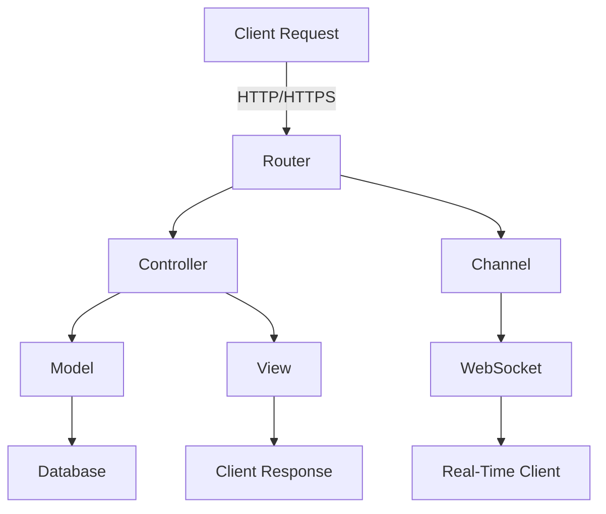

## 15.1. Overview of the Phoenix Framework

The Phoenix Framework is a modern, high-performance web framework built on top of Elixir. It is designed to enable developers to create scalable and maintainable web applications with real-time communication capabilities. This section will delve into the key features, architecture, and benefits of using Phoenix, providing expert software engineers and architects with a comprehensive understanding of its capabilities and how it leverages the power of Elixir.

### Introduction to Phoenix Framework

Phoenix is often compared to other web frameworks like Ruby on Rails and Django, but it distinguishes itself through its focus on concurrency, fault tolerance, and real-time features, thanks to the underlying Erlang VM (BEAM) and Elixir language. Let's explore what makes Phoenix a compelling choice for modern web development.

### Key Features of Phoenix Framework

#### Real-Time Communication

One of Phoenix's standout features is its ability to handle real-time communication seamlessly. This is achieved through Phoenix Channels, which provide a simple yet powerful way to implement WebSockets for real-time messaging between the server and clients.

```elixir
defmodule MyAppWeb.UserSocket do
  use Phoenix.Socket

  channel "room:*", MyAppWeb.RoomChannel

  def connect(_params, socket, _connect_info) do
    {:ok, socket}
  end

  def id(_socket), do: nil
end
```

In this code snippet, we define a user socket in Phoenix, which allows us to handle real-time communication in a chat room application. The `channel` macro sets up a route for the WebSocket connection, and the `connect` function determines how to handle incoming connections.

#### Scalability

Phoenix is built with scalability in mind. Its architecture supports distributed systems, allowing applications to scale horizontally across multiple nodes. This is facilitated by the BEAM's lightweight processes and message-passing capabilities.

#### Maintainability

Phoenix promotes maintainable code through its use of Elixir's functional programming paradigm. This encourages developers to write pure functions, use pattern matching, and leverage immutable data structures, leading to more predictable and testable code.

#### Performance

The performance of Phoenix is another key advantage. It is capable of handling a large number of concurrent connections, making it ideal for applications with high traffic demands. This is largely due to Elixir's concurrency model and the efficiency of the BEAM.

### Architecture of Phoenix Framework

Phoenix follows the Model-View-Controller (MVC) architecture, which separates concerns and organizes code into distinct parts:

- **Model**: Manages data and business logic. In Phoenix, models are often represented by Ecto schemas, which define the structure and relationships of data stored in a database.
- **View**: Responsible for presenting data to the user. Phoenix views use templates to render HTML, JSON, or other formats.
- **Controller**: Handles incoming requests, processes data through models, and returns responses using views.

This separation of concerns makes it easier to manage complex applications and encourages clean, organized code.

### Phoenix Channels: Real-Time Communication

Phoenix Channels are a core feature that enables real-time communication in web applications. They provide an abstraction over WebSockets, allowing developers to build interactive applications without dealing with the complexities of WebSocket protocols directly.

```elixir
defmodule MyAppWeb.RoomChannel do
  use Phoenix.Channel

  def join("room:lobby", _message, socket) do
    {:ok, socket}
  end

  def handle_in("new_msg", %{"body" => body}, socket) do
    broadcast!(socket, "new_msg", %{body: body})
    {:noreply, socket}
  end
end
```

In this example, we define a channel for a chat room. The `join` function handles users joining the room, and the `handle_in` function processes incoming messages and broadcasts them to all connected clients.

### Phoenix LiveView: Interactive Applications

Phoenix LiveView is a revolutionary feature that allows developers to build rich, interactive web applications without writing JavaScript. LiveView leverages server-rendered HTML and WebSocket connections to provide real-time updates to the client.

```elixir
defmodule MyAppWeb.CounterLive do
  use Phoenix.LiveView

  def mount(_params, _session, socket) do
    {:ok, assign(socket, :count, 0)}
  end

  def handle_event("increment", _value, socket) do
    {:noreply, update(socket, :count, &(&1 + 1))}
  end
end
```

Here, we create a simple counter application using LiveView. The `mount` function initializes the state, and the `handle_event` function updates the count when the user interacts with the UI.

### Diagram: Phoenix Framework Architecture


```mermaid
graph TD;
    A[Client Request] -->|HTTP/HTTPS| B[Router];
    B --> C[Controller];
    C --> D[Model];
    D --> E[Database];
    C --> F[View];
    F --> G[Client Response];
    B --> H[Channel];
    H --> I[WebSocket];
    I --> J[Real-Time Client];
```

**Diagram Description**: This diagram illustrates the flow of a request through the Phoenix Framework. It shows how a client request is routed to a controller, which interacts with models and views to generate a response. It also highlights the role of channels in handling real-time communication.

### Benefits of Using Phoenix Framework

#### Concurrency and Fault Tolerance

Phoenix inherits Elixir's strengths in concurrency and fault tolerance, making it an excellent choice for applications that require high availability and responsiveness.

#### Developer Productivity

Phoenix's conventions and tooling, such as generators and the interactive shell, enhance developer productivity. The framework's clear structure and comprehensive documentation further support efficient development.

#### Ecosystem and Community

Phoenix benefits from a vibrant ecosystem and community. It integrates seamlessly with Elixir libraries and tools, such as Ecto for database interactions and ExUnit for testing.

### Code Example: Building a Simple Phoenix Application

Let's walk through the process of creating a basic Phoenix application to illustrate the framework's capabilities.

1. **Create a New Phoenix Project**

```bash
mix phx.new hello_phoenix
cd hello_phoenix
```

2. **Start the Phoenix Server**

```bash
mix phx.server
```

3. **Define a Route**

Edit `lib/hello_phoenix_web/router.ex` to add a new route:

```elixir
scope "/", HelloPhoenixWeb do
  pipe_through :browser

  get "/", PageController, :index
end
```

4. **Create a Controller**

Generate a controller with the following command:

```bash
mix phx.gen.html Page Page pages title:string body:text
```

5. **Implement the Controller Action**

Edit `lib/hello_phoenix_web/controllers/page_controller.ex`:

```elixir
defmodule HelloPhoenixWeb.PageController do
  use HelloPhoenixWeb, :controller

  def index(conn, _params) do
    render(conn, "index.html")
  end
end
```

6. **Create a View**

Edit `lib/hello_phoenix_web/templates/page/index.html.eex`:

```html
<h1>Welcome to Phoenix!</h1>
<p>This is a simple Phoenix application.</p>
```

7. **Visit the Application**

Open a web browser and navigate to `http://localhost:4000` to see your Phoenix application in action.

### Try It Yourself

Experiment with the code examples by modifying the templates, adding new routes, or implementing additional features such as user authentication or real-time updates using Phoenix Channels.

### References and Further Reading

- [Phoenix Framework Official Documentation](https://hexdocs.pm/phoenix/)
- [Elixir Official Website](https://elixir-lang.org/)
- [Ecto: A Database Library for Elixir](https://hexdocs.pm/ecto/)

### Knowledge Check

- What are the key features of the Phoenix Framework?
- How does Phoenix handle real-time communication?
- Describe the MVC architecture in Phoenix.
- What benefits does Phoenix offer for web development?
- How can you create a simple Phoenix application?

### Embrace the Journey

Remember, this is just the beginning of your journey with the Phoenix Framework. As you explore its capabilities, you'll discover new ways to build powerful, interactive web applications. Keep experimenting, stay curious, and enjoy the process of learning and creating with Phoenix!

## Quiz Time!



### What is a key advantage of using Phoenix for web development?

- [x] Real-time communication capabilities
- [ ] Built-in JavaScript framework
- [ ] Support for multiple programming languages
- [ ] Automatic database management

> **Explanation:** Phoenix offers real-time communication capabilities through its Channels, which is a standout feature.

### How does Phoenix achieve scalability?

- [x] By leveraging the BEAM's lightweight processes
- [ ] Through built-in load balancers
- [ ] By using a microservices architecture
- [ ] With automatic horizontal scaling

> **Explanation:** Phoenix achieves scalability by utilizing the BEAM's lightweight processes and message-passing capabilities.

### Which architectural pattern does Phoenix follow?

- [x] Model-View-Controller (MVC)
- [ ] Microservices
- [ ] Event-Driven
- [ ] Layered Architecture

> **Explanation:** Phoenix follows the Model-View-Controller (MVC) architecture, which organizes code into models, views, and controllers.

### What is the purpose of Phoenix Channels?

- [x] To enable real-time communication
- [ ] To manage database connections
- [ ] To handle HTTP requests
- [ ] To render templates

> **Explanation:** Phoenix Channels are used to enable real-time communication between the server and clients.

### What is Phoenix LiveView used for?

- [x] Building interactive applications without JavaScript
- [ ] Managing database transactions
- [ ] Handling HTTP requests
- [ ] Creating RESTful APIs

> **Explanation:** Phoenix LiveView allows developers to build interactive applications without writing JavaScript.

### How does Phoenix enhance developer productivity?

- [x] Through conventions and tooling
- [ ] By providing a built-in IDE
- [ ] By automating code generation
- [ ] By integrating with all databases

> **Explanation:** Phoenix enhances developer productivity through its conventions and tooling, such as generators and the interactive shell.

### What is a benefit of using Elixir with Phoenix?

- [x] Concurrency and fault tolerance
- [ ] Built-in front-end framework
- [ ] Automatic code deployment
- [ ] Native mobile app support

> **Explanation:** Elixir provides concurrency and fault tolerance, which are beneficial when using Phoenix.

### Which of the following is part of Phoenix's MVC architecture?

- [x] Model
- [x] View
- [x] Controller
- [ ] Service

> **Explanation:** Phoenix's MVC architecture includes Models, Views, and Controllers.

### What tool does Phoenix use for database interactions?

- [x] Ecto
- [ ] ActiveRecord
- [ ] Sequelize
- [ ] Hibernate

> **Explanation:** Phoenix uses Ecto for database interactions.

### True or False: Phoenix can only be used for building web applications.

- [ ] True
- [x] False

> **Explanation:** While Phoenix is primarily used for web applications, it can also be used for building APIs and real-time features.


