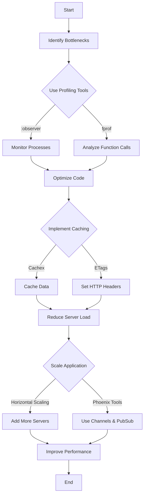

## 15.10. Performance Optimization in Phoenix

In the fast-paced world of web development, performance is a crucial factor that can make or break your application. Phoenix, a web framework built on Elixir, is designed to handle high concurrency and provide excellent performance out of the box. However, as your application grows, you may encounter performance bottlenecks that require optimization. In this section, we will explore advanced techniques for optimizing performance in Phoenix applications, focusing on caching strategies, code profiling, and scalability solutions.

### Caching

Caching is a powerful technique to improve the performance of your Phoenix application by reducing the load on your server and speeding up response times. Let's delve into some caching strategies you can employ.

#### Using Cachex

Cachex is a popular caching library in Elixir that provides a simple and efficient way to cache data in your Phoenix application. It supports features like time-based expiration, cache persistence, and more.

```elixir
# Add Cachex to your mix.exs dependencies
defp deps do
  [
    {:cachex, "~> 3.3"}
  ]
end

# Start Cachex in your application supervision tree
def start(_type, _args) do
  children = [
    {Cachex, name: :my_cache}
  ]

  opts = [strategy: :one_for_one, name: MyApp.Supervisor]
  Supervisor.start_link(children, opts)
end

# Using Cachex to cache data
def get_user_data(user_id) do
  case Cachex.get(:my_cache, user_id) do
    {:ok, nil} ->
      # Data not in cache, fetch from database
      user_data = fetch_user_data_from_db(user_id)
      Cachex.put(:my_cache, user_id, user_data)
      user_data

    {:ok, cached_data} ->
      # Return cached data
      cached_data
  end
end
```

In this example, we use Cachex to cache user data. If the data is not in the cache, we fetch it from the database and store it in the cache for future requests.

#### ETags and HTTP Caching Headers

ETags (Entity Tags) and HTTP caching headers are essential tools for optimizing web performance by reducing the amount of data transferred between the client and server.

- **ETags**: ETags are unique identifiers assigned to resources. They allow the server to determine if a resource has changed since the last request. If the resource hasn't changed, the server can return a 304 Not Modified response, saving bandwidth.

- **Cache-Control Headers**: These headers instruct the browser and intermediate caches on how to cache the response. For example, `Cache-Control: max-age=3600` tells the browser to cache the response for one hour.

```elixir
defmodule MyAppWeb.PageController do
  use MyAppWeb, :controller

  def show(conn, %{"id" => id}) do
    page = get_page(id)
    etag = generate_etag(page)

    conn
    |> put_resp_header("etag", etag)
    |> put_resp_header("cache-control", "max-age=3600, public")
    |> render("show.html", page: page)
  end

  defp generate_etag(page) do
    :crypto.hash(:sha256, page.content) |> Base.encode16()
  end
end
```

In this example, we generate an ETag for a page based on its content and set caching headers to instruct the browser to cache the response.

### Code Profiling

Identifying performance bottlenecks is crucial for optimization. Elixir provides several tools for profiling your Phoenix application.

#### Using :observer

`:observer` is a graphical tool that provides insights into the performance of your application, including process information, memory usage, and more.

To start `:observer`, run the following command in your IEx session:

```elixir
:observer.start()
```

This will open a GUI where you can monitor your application's performance in real-time. Use it to identify processes consuming excessive CPU or memory.

#### Using fprof

`fprof` is a profiling tool that provides detailed information about function calls and execution times. It is useful for identifying slow functions in your application.

```elixir
# Start profiling
:fprof.start()

# Profile a specific function
:fprof.trace([:start, {:procs, self()}])
:fprof.apply(&MyApp.some_function/1, [arg])
:fprof.trace(:stop)

# Analyze the results
:fprof.analyse()
```

This example demonstrates how to use `fprof` to profile a specific function in your application. The analysis will provide insights into which functions are consuming the most time.

### Scalability

Scalability is a key consideration for any web application. Phoenix provides several tools and techniques to handle large numbers of connections efficiently.

#### Leveraging Phoenix’s Built-in Tools

Phoenix is built on top of the Erlang VM, which is designed for high concurrency. Here are some ways to leverage Phoenix's built-in tools for scalability:

- **Channels**: Phoenix Channels provide a way to handle real-time communication with clients. They are optimized for handling thousands of connections simultaneously.

- **Presence**: The Presence module in Phoenix allows you to track user presence across multiple nodes in a distributed system.

- **PubSub**: Phoenix PubSub is a distributed messaging system that enables communication between different parts of your application.

```elixir
defmodule MyAppWeb.UserSocket do
  use Phoenix.Socket

  channel "room:*", MyAppWeb.RoomChannel

  def connect(_params, socket, _connect_info) do
    {:ok, socket}
  end

  def id(_socket), do: nil
end

defmodule MyAppWeb.RoomChannel do
  use Phoenix.Channel

  def join("room:lobby", _message, socket) do
    {:ok, socket}
  end

  def handle_in("new_msg", %{"body" => body}, socket) do
    broadcast!(socket, "new_msg", %{body: body})
    {:noreply, socket}
  end
end
```

In this example, we define a Phoenix Channel for real-time communication. The `broadcast!` function sends messages to all connected clients in the channel.

#### Horizontal Scaling

Horizontal scaling involves adding more servers to handle increased load. Phoenix supports horizontal scaling out of the box, thanks to its distributed nature.

- **Load Balancing**: Use a load balancer to distribute incoming requests across multiple Phoenix instances.

- **Distributed Erlang**: Use Erlang's built-in distribution capabilities to run your application on multiple nodes.

```elixir
# Configure your application for distributed Erlang
config :my_app, MyApp.Endpoint,
  http: [port: 4000],
  url: [host: "example.com"],
  cache_static_manifest: "priv/static/cache_manifest.json",
  server: true,
  secret_key_base: "YOUR_SECRET_KEY_BASE"

config :my_app, MyApp.Repo,
  adapter: Ecto.Adapters.Postgres,
  username: "postgres",
  password: "postgres",
  database: "my_app_prod",
  pool_size: 20
```

In this configuration, we set up our application for distributed Erlang and configure the database connection pool size for better performance.

### Visualizing Performance Optimization

To better understand the flow of performance optimization in Phoenix, let's visualize the process using a flowchart.



This flowchart illustrates the process of identifying bottlenecks, optimizing code, implementing caching, and scaling your application to improve performance.

### Knowledge Check

To reinforce your understanding of performance optimization in Phoenix, consider the following questions:

1. What are some benefits of using caching in a Phoenix application?
2. How can you use `:observer` to identify performance bottlenecks?
3. What is the role of ETags in HTTP caching?
4. How does horizontal scaling improve the performance of a Phoenix application?
5. What are some tools provided by Phoenix for handling large numbers of connections?

### Try It Yourself

Experiment with the code examples provided in this section. Try modifying the caching strategy to use different expiration times or cache keys. Use `:observer` and `fprof` to profile different parts of your application and identify potential bottlenecks. Finally, set up a simple Phoenix application with Channels and PubSub to explore real-time communication.

### Conclusion

Performance optimization is an ongoing process that requires careful analysis and implementation of various techniques. By leveraging caching, profiling tools, and scalability solutions, you can ensure that your Phoenix application remains fast and efficient as it grows. Remember, this is just the beginning. Keep experimenting, stay curious, and enjoy the journey!

## Quiz: Performance Optimization in Phoenix



### What is the primary benefit of using Cachex in a Phoenix application?

- [x] Reducing server load by caching data
- [ ] Improving database query speed
- [ ] Enhancing security through encryption
- [ ] Simplifying code structure

> **Explanation:** Cachex helps reduce server load by caching frequently accessed data, which minimizes database queries.

### Which tool can be used to monitor processes and memory usage in a Phoenix application?

- [ ] fprof
- [x] :observer
- [ ] Cachex
- [ ] ETags

> **Explanation:** `:observer` is a graphical tool that provides insights into process and memory usage in a Phoenix application.

### How do ETags improve web performance?

- [x] By reducing data transfer with 304 Not Modified responses
- [ ] By encrypting HTTP requests
- [ ] By compressing images
- [ ] By optimizing JavaScript execution

> **Explanation:** ETags allow the server to send 304 Not Modified responses if a resource hasn't changed, reducing data transfer.

### What is the purpose of the `broadcast!` function in Phoenix Channels?

- [ ] To encrypt messages
- [ ] To cache data
- [x] To send messages to all connected clients
- [ ] To log errors

> **Explanation:** The `broadcast!` function sends messages to all clients connected to a Phoenix Channel.

### Which of the following is a benefit of horizontal scaling?

- [x] Handling increased load by adding more servers
- [ ] Reducing code complexity
- [ ] Improving database indexing
- [ ] Enhancing security protocols

> **Explanation:** Horizontal scaling involves adding more servers to handle increased load, improving application performance.

### What is the role of Cache-Control headers in HTTP caching?

- [x] Instructing browsers on how to cache responses
- [ ] Encrypting HTTP requests
- [ ] Compressing HTML content
- [ ] Optimizing CSS loading

> **Explanation:** Cache-Control headers tell browsers how to cache responses, which can improve web performance.

### How can `fprof` be used in a Phoenix application?

- [x] To profile function calls and execution times
- [ ] To monitor network traffic
- [ ] To encrypt data
- [ ] To manage database connections

> **Explanation:** `fprof` is a profiling tool used to analyze function calls and execution times in a Phoenix application.

### What is the advantage of using Phoenix Channels for real-time communication?

- [ ] They encrypt all messages
- [x] They handle thousands of connections efficiently
- [ ] They reduce server load by caching data
- [ ] They simplify database queries

> **Explanation:** Phoenix Channels are optimized for handling thousands of connections efficiently, making them ideal for real-time communication.

### Which of the following is a feature of Phoenix PubSub?

- [x] Distributed messaging system
- [ ] Data encryption
- [ ] Image compression
- [ ] CSS optimization

> **Explanation:** Phoenix PubSub is a distributed messaging system that enables communication between different parts of an application.

### True or False: ETags are used to encrypt HTTP responses.

- [ ] True
- [x] False

> **Explanation:** ETags are not used for encryption; they are used to identify if a resource has changed since the last request.


