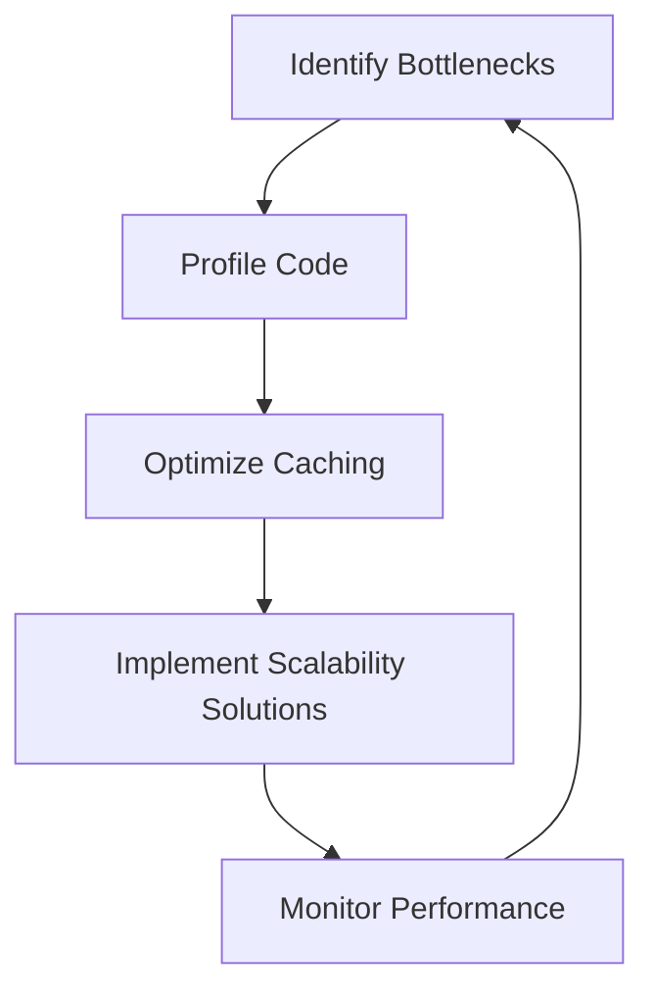

## 15.10. Performance Optimization in Phoenix

In the fast-paced world of web development, performance optimization is crucial for ensuring that your applications are responsive, scalable, and efficient. Phoenix, a web framework built on Elixir, provides a robust platform for building high-performance applications. In this section, we will explore various strategies for optimizing the performance of your Phoenix applications, focusing on caching, code profiling, and scalability.

### Caching

Caching is a critical technique for improving the performance of web applications by reducing the need to recompute or refetch data. In Phoenix, there are several caching strategies you can employ:

#### Using Cachex

Cachex is a powerful caching library for Elixir that provides a wide range of features, including TTL (Time-To-Live) support, transactions, and fallback functions. Here's how you can use Cachex in a Phoenix application:

```elixir
# Add Cachex to your mix.exs dependencies
defp deps do
  [
    {:cachex, "~> 3.3"}
  ]
end

# Fetching data with Cachex
defmodule MyApp.Cache do
  use Cachex

  def get_user(id) do
    Cachex.fetch(:user_cache, id, fn ->
      # Simulate a database call
      IO.puts("Fetching user from database")
      {:commit, %{id: id, name: "User #{id}"}}
    end)
  end
end

# Usage in a controller
defmodule MyAppWeb.UserController do
  use MyAppWeb, :controller

  def show(conn, %{"id" => id}) do
    user = MyApp.Cache.get_user(id)
    json(conn, user)
  end
end
```

In this example, `Cachex.fetch/3` is used to retrieve a user from the cache, falling back to a database call if the user is not already cached. This reduces database load and improves response times.

#### ETags and HTTP Caching Headers

ETags (Entity Tags) and HTTP caching headers are essential for optimizing client-side caching. They help browsers determine whether content has changed since the last request, reducing unnecessary data transfer.

```elixir
defmodule MyAppWeb.PageController do
  use MyAppWeb, :controller

  def index(conn, _params) do
    etag = compute_etag()
    conn
    |> put_resp_header("etag", etag)
    |> put_resp_header("cache-control", "max-age=3600, public")
    |> render("index.html")
  end

  defp compute_etag do
    # Generate a unique ETag based on content
    :crypto.hash(:sha256, "unique-content-identifier") |> Base.encode16()
  end
end
```

By setting the `etag` and `cache-control` headers, you instruct the browser to cache the response and use the cached version if the ETag matches on subsequent requests.

### Code Profiling

Identifying performance bottlenecks is crucial for optimization. Elixir provides several tools for profiling code, such as `:observer` and `fprof`.

#### Using :observer

`:observer` is a graphical tool that provides insights into the performance of your application, including process information, memory usage, and more.

To start `:observer`, run your Phoenix application and execute the following in IEx:

```elixir
:observer.start()
```

This will open a GUI where you can monitor various aspects of your application's performance. Look for processes with high memory or CPU usage to identify potential bottlenecks.

#### Using fprof

`fprof` is a profiling tool that provides detailed information about function call times. Here's how you can use it:

```elixir
# Start the profiler
:fprof.start()

# Profile a function
:fprof.trace([:start, {:procs, self()}])
:fprof.apply(&MyApp.MyModule.my_function/1, [arg])
:fprof.trace(:stop)

# Analyze the results
:fprof.analyse([sort: :own])
```

This will output a detailed report of function calls and their execution times, helping you pinpoint slow functions.

### Scalability

Scalability is about ensuring your application can handle increased load. Phoenix is built on the BEAM VM, which excels at handling large numbers of concurrent connections.

#### Leveraging Phoenix’s Built-in Tools

Phoenix provides several tools for scalability, including channels and presence.

##### Channels

Phoenix Channels provide real-time communication between clients and servers, allowing you to build scalable, interactive applications.

```elixir
defmodule MyAppWeb.MyChannel do
  use Phoenix.Channel

  def join("topic:subtopic", _message, socket) do
    {:ok, socket}
  end

  def handle_in("ping", _payload, socket) do
    {:reply, {:ok, %{message: "pong"}}, socket}
  end
end
```

Channels are designed to handle thousands of concurrent connections efficiently, making them ideal for real-time features.

##### Presence

Phoenix Presence provides a scalable way to track users and their state across distributed nodes.

```elixir
defmodule MyAppWeb.Presence do
  use Phoenix.Presence,
    otp_app: :my_app,
    pubsub_server: MyApp.PubSub
end

# Tracking presence in a channel
defmodule MyAppWeb.MyChannel do
  use Phoenix.Channel
  alias MyAppWeb.Presence

  def join("room:lobby", _params, socket) do
    send(self(), :after_join)
    {:ok, socket}
  end

  def handle_info(:after_join, socket) do
    Presence.track(socket, socket.assigns.user_id, %{
      online_at: inspect(System.system_time(:second))
    })

    push(socket, "presence_state", Presence.list(socket))
    {:noreply, socket}
  end
end
```

Presence is built on top of Phoenix PubSub, which allows it to scale across distributed systems.

### Try It Yourself

Experiment with the following modifications to the code examples:

- **Cachex**: Try implementing a cache eviction strategy using TTL or size limits.
- **ETags**: Modify the `compute_etag` function to include dynamic content, such as timestamps.
- **fprof**: Profile different functions in your application to compare their performance.
- **Channels**: Create a new channel and implement a simple chat application.

### Visualizing Performance Optimization

Below is a flowchart illustrating the process of performance optimization in a Phoenix application:


```mermaid
graph TD;
    A[Identify Bottlenecks] --> B[Profile Code];
    B --> C[Optimize Caching];
    C --> D[Implement Scalability Solutions];
    D --> E[Monitor Performance];
    E --> A;
```

This flowchart represents a continuous cycle of identifying bottlenecks, profiling code, optimizing caching, implementing scalability solutions, and monitoring performance.

### References and Links

- [Cachex Documentation](https://hexdocs.pm/cachex/Cachex.html)
- [Phoenix Framework Guides](https://hexdocs.pm/phoenix/)
- [Observer Documentation](https://erlang.org/doc/man/observer.html)
- [Profiling with fprof](https://erlang.org/doc/man/fprof.html)

### Knowledge Check

- What are the benefits of using ETags in HTTP caching?
- How does Cachex improve application performance?
- What are the key features of Phoenix Channels?
- How can you use `:observer` to identify performance bottlenecks?

### Embrace the Journey

Remember, performance optimization is an ongoing process. As you build and scale your Phoenix applications, continue to explore new strategies and tools. Stay curious, experiment with different approaches, and enjoy the journey of creating high-performance web applications!

## Quiz Time!



### What is the primary benefit of using Cachex in a Phoenix application?

- [x] Reducing database load and improving response times
- [ ] Simplifying code structure
- [ ] Enhancing security features
- [ ] Increasing memory usage

> **Explanation:** Cachex helps reduce database load and improve response times by caching frequently accessed data.

### How do ETags contribute to performance optimization in web applications?

- [x] By reducing unnecessary data transfer
- [ ] By increasing server load
- [ ] By enhancing data encryption
- [ ] By simplifying code maintenance

> **Explanation:** ETags help reduce unnecessary data transfer by allowing browsers to cache responses and use the cached version if the content hasn't changed.

### What tool can you use to profile function call times in Elixir?

- [ ] :observer
- [x] fprof
- [ ] Cachex
- [ ] Phoenix Presence

> **Explanation:** `fprof` is a profiling tool that provides detailed information about function call times in Elixir.

### What is a key feature of Phoenix Channels?

- [x] Real-time communication between clients and servers
- [ ] Data encryption
- [ ] Static content delivery
- [ ] Automated testing

> **Explanation:** Phoenix Channels provide real-time communication between clients and servers, allowing for scalable, interactive applications.

### How does Phoenix Presence help in scalability?

- [x] By tracking users and their state across distributed nodes
- [ ] By caching static assets
- [ ] By reducing memory usage
- [ ] By simplifying code structure

> **Explanation:** Phoenix Presence provides a scalable way to track users and their state across distributed nodes, enhancing scalability.

### What is the purpose of the `:observer` tool in Elixir?

- [x] To monitor application performance and identify bottlenecks
- [ ] To cache database queries
- [ ] To encrypt user data
- [ ] To automate deployments

> **Explanation:** `:observer` is a graphical tool that helps monitor application performance and identify bottlenecks.

### Which of the following is NOT a feature of Cachex?

- [ ] TTL support
- [ ] Transactions
- [ ] Fallback functions
- [x] Real-time communication

> **Explanation:** Cachex provides TTL support, transactions, and fallback functions, but it does not offer real-time communication.

### What is the role of HTTP caching headers in performance optimization?

- [x] To instruct browsers to cache responses and reduce server load
- [ ] To encrypt HTTP requests
- [ ] To simplify server configuration
- [ ] To enhance user authentication

> **Explanation:** HTTP caching headers instruct browsers to cache responses, reducing server load and improving performance.

### How can you modify the `compute_etag` function to include dynamic content?

- [x] By incorporating timestamps or other unique identifiers
- [ ] By using static strings
- [ ] By removing all dynamic elements
- [ ] By encrypting the ETag value

> **Explanation:** Modifying the `compute_etag` function to include timestamps or other unique identifiers allows it to reflect dynamic content changes.

### True or False: Phoenix Channels are designed to handle thousands of concurrent connections efficiently.

- [x] True
- [ ] False

> **Explanation:** Phoenix Channels are indeed designed to handle thousands of concurrent connections efficiently, making them ideal for real-time applications.


