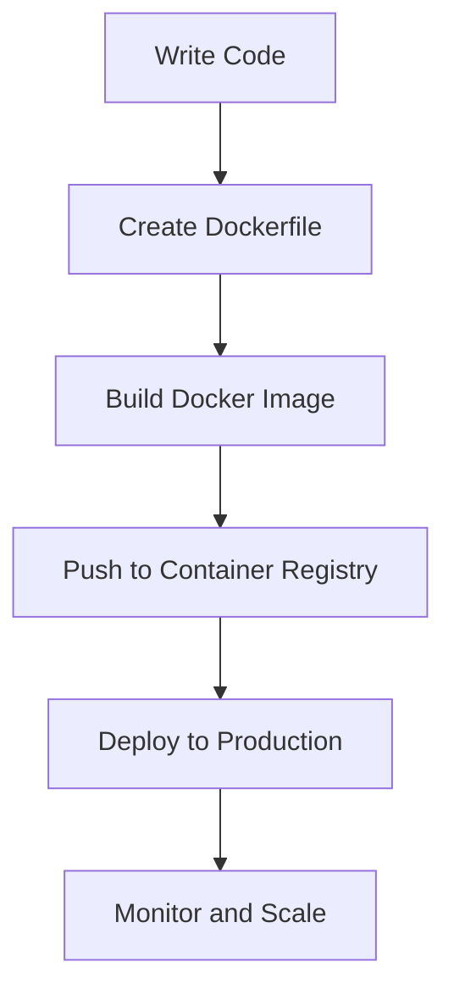

## 15.11. Deployment Strategies

Deploying Elixir applications effectively is crucial for ensuring that your software runs smoothly in production environments. This section will guide you through advanced deployment strategies, focusing on building releases, exploring various hosting options, and leveraging containerization with Docker. By mastering these techniques, you'll be able to deploy scalable, reliable, and maintainable Elixir applications.

### Releases

Releases are self-contained packages of your Elixir application, including the Erlang runtime, all dependencies, and any necessary configuration files. They are essential for deploying Elixir applications in production, as they provide a consistent and predictable runtime environment.

#### Building Standalone Releases with Mix

Mix is the build tool that comes with Elixir, and it provides a straightforward way to create releases. Let's walk through the process of building a release using Mix.

1. **Configure Your Application**: Ensure your `mix.exs` file is properly configured. Specify the application name, version, and dependencies.

    ```elixir
    defmodule MyApp.MixProject do
      use Mix.Project

      def project do
        [
          app: :my_app,
          version: "0.1.0",
          elixir: "~> 1.12",
          start_permanent: Mix.env() == :prod,
          deps: deps()
        ]
      end

      defp deps do
        [
          {:phoenix, "~> 1.5.9"},
          {:phoenix_pubsub, "~> 2.0"},
          {:phoenix_ecto, "~> 4.1"},
          {:ecto_sql, "~> 3.4"},
          {:postgrex, ">= 0.0.0"},
          {:phoenix_html, "~> 2.11"},
          {:phoenix_live_reload, "~> 1.2", only: :dev},
          {:gettext, "~> 0.11"},
          {:jason, "~> 1.0"},
          {:plug_cowboy, "~> 2.0"}
        ]
      end
    end
    ```

2. **Add Release Configuration**: In your `mix.exs`, add a release configuration under the `def project` function.

    ```elixir
    def project do
      [
        # ... other configurations
        releases: [
          my_app: [
            include_executables_for: [:unix],
            applications: [runtime_tools: :permanent]
          ]
        ]
      ]
    end
    ```

3. **Build the Release**: Use the Mix task to build the release.

    ```bash
    MIX_ENV=prod mix release
    ```

4. **Run the Release**: Navigate to the `_build/prod/rel/my_app/bin` directory and start your application.

    ```bash
    ./my_app start
    ```

#### Building Releases with Distillery

Distillery is a popular tool for building releases in Elixir. It offers more advanced features compared to Mix's built-in release functionality.

1. **Add Distillery to Your Project**: Include Distillery in your `mix.exs` dependencies.

    ```elixir
    defp deps do
      [
        {:distillery, "~> 2.1"}
      ]
    end
    ```

2. **Initialize Distillery**: Run the Distillery initialization command to generate the necessary configuration files.

    ```bash
    mix release.init
    ```

3. **Configure the Release**: Edit the `rel/config.exs` file to customize your release settings.

4. **Build the Release**: Use the Distillery command to build your release.

    ```bash
    MIX_ENV=prod mix release
    ```

5. **Deploy the Release**: Transfer the release tarball to your production server and extract it.

6. **Run the Release**: Start your application using the generated scripts.

    ```bash
    _build/prod/rel/my_app/bin/my_app start
    ```

### Hosting Options

Choosing the right hosting environment is crucial for the performance and reliability of your Elixir applications. Let's explore some popular hosting options.

#### Deploying to Heroku

Heroku is a cloud platform that allows you to deploy, manage, and scale applications. It provides a simple and straightforward deployment process for Elixir applications.

1. **Create a Heroku Account**: Sign up for a Heroku account if you don't already have one.

2. **Install the Heroku CLI**: Download and install the Heroku Command Line Interface (CLI).

3. **Create a Heroku App**: Use the Heroku CLI to create a new application.

    ```bash
    heroku create my-app
    ```

4. **Deploy Your Application**: Push your code to Heroku using Git.

    ```bash
    git push heroku main
    ```

5. **Manage Your Application**: Use the Heroku dashboard or CLI to manage your application, scale dynos, and configure environment variables.

#### Deploying to Gigalixir

Gigalixir is a platform-as-a-service (PaaS) specifically designed for Elixir applications. It provides features like zero-downtime deployments and automatic scaling.

1. **Sign Up for Gigalixir**: Create an account on Gigalixir.

2. **Install the Gigalixir CLI**: Download and install the Gigalixir Command Line Interface.

3. **Create a Gigalixir App**: Use the CLI to create a new application.

    ```bash
    gigalixir create my-app
    ```

4. **Deploy Your Application**: Push your code to Gigalixir using Git.

    ```bash
    git push gigalixir main
    ```

5. **Monitor and Scale**: Use the Gigalixir dashboard to monitor your application's performance and scale resources as needed.

#### Deploying to Custom Servers

For more control over your deployment environment, you can deploy Elixir applications to custom servers.

1. **Set Up Your Server**: Choose a cloud provider (e.g., AWS, DigitalOcean) and set up a virtual machine.

2. **Install Erlang and Elixir**: Ensure that Erlang and Elixir are installed on your server.

3. **Transfer Your Release**: Use SCP or another file transfer method to move your release to the server.

4. **Configure Your Environment**: Set environment variables and configure any necessary services (e.g., PostgreSQL).

5. **Start Your Application**: Use the release scripts to start your application.

    ```bash
    ./my_app start
    ```

### Containerization

Containerization is a powerful technique for deploying applications in a consistent and isolated environment. Docker is the most popular containerization platform.

#### Using Docker for Consistent Deployment Environments

Docker allows you to package your application and its dependencies into a container, ensuring that it runs consistently across different environments.

1. **Install Docker**: Download and install Docker on your development machine and production server.

2. **Create a Dockerfile**: Define your application's environment in a `Dockerfile`.

    ```dockerfile
    FROM elixir:1.12

    # Install Hex and Rebar
    RUN mix local.hex --force && \
        mix local.rebar --force

    # Set working directory
    WORKDIR /app

    # Copy the application code
    COPY . .

    # Install dependencies
    RUN mix deps.get

    # Build the release
    RUN MIX_ENV=prod mix release

    # Expose the application port
    EXPOSE 4000

    # Start the application
    CMD ["_build/prod/rel/my_app/bin/my_app", "start"]
    ```

3. **Build the Docker Image**: Use Docker to build an image of your application.

    ```bash
    docker build -t my_app .
    ```

4. **Run the Docker Container**: Start a container from your image.

    ```bash
    docker run -p 4000:4000 my_app
    ```

5. **Deploy to a Container Platform**: Use a container orchestration platform like Kubernetes to manage your containers in production.

### Visualizing Deployment Strategies

To better understand the deployment process, let's visualize the steps involved in deploying an Elixir application using Docker.



**Figure 1: Docker Deployment Workflow**

### References and Links

- [Elixir Releases Documentation](https://hexdocs.pm/mix/Mix.Tasks.Release.html)
- [Distillery GitHub Repository](https://github.com/bitwalker/distillery)
- [Heroku Elixir Deployment Guide](https://devcenter.heroku.com/articles/getting-started-with-elixir)
- [Gigalixir Documentation](https://gigalixir.readthedocs.io/en/latest/)
- [Docker Official Documentation](https://docs.docker.com/)

### Knowledge Check

- What are the benefits of using releases for deploying Elixir applications?
- How does containerization improve deployment consistency?
- What are the key differences between deploying to Heroku and Gigalixir?

### Embrace the Journey

Remember, deploying Elixir applications is a journey that involves continuous learning and adaptation. As you explore different deployment strategies, you'll gain valuable insights into optimizing your applications for performance and reliability. Keep experimenting, stay curious, and enjoy the journey!

## Quiz: Deployment Strategies



### What is the primary benefit of using releases in Elixir deployment?

- [x] Consistent and predictable runtime environment
- [ ] Faster code execution
- [ ] Reduced memory usage
- [ ] Easier code debugging

> **Explanation:** Releases package the application with its dependencies and the Erlang runtime, ensuring a consistent environment.

### Which tool is specifically designed for building advanced releases in Elixir?

- [ ] Mix
- [x] Distillery
- [ ] Hex
- [ ] Rebar

> **Explanation:** Distillery provides advanced features for building releases in Elixir.

### What is a key advantage of deploying Elixir applications on Heroku?

- [x] Simple deployment process
- [ ] Built-in machine learning capabilities
- [ ] Automatic code optimization
- [ ] Native support for blockchain

> **Explanation:** Heroku offers a straightforward deployment process and easy management.

### Which platform is specifically designed for Elixir applications and offers zero-downtime deployments?

- [ ] AWS
- [ ] DigitalOcean
- [x] Gigalixir
- [ ] Google Cloud

> **Explanation:** Gigalixir is tailored for Elixir applications and supports zero-downtime deployments.

### What is the main purpose of a Dockerfile?

- [x] Define the application's environment
- [ ] Store application logs
- [ ] Manage user authentication
- [ ] Optimize database queries

> **Explanation:** A Dockerfile specifies the environment and dependencies for the application.

### How does containerization benefit application deployment?

- [x] Ensures consistent environments
- [ ] Increases code readability
- [ ] Reduces application size
- [ ] Enhances user interface design

> **Explanation:** Containerization packages applications and their dependencies, ensuring they run consistently across different environments.

### Which command is used to build a Docker image?

- [x] docker build
- [ ] docker run
- [ ] docker push
- [ ] docker start

> **Explanation:** The `docker build` command creates a Docker image from a Dockerfile.

### What is the role of a container orchestration platform like Kubernetes?

- [x] Manage and scale containers
- [ ] Write application code
- [ ] Design user interfaces
- [ ] Optimize database performance

> **Explanation:** Kubernetes manages the deployment, scaling, and operation of application containers.

### Which of the following is a common hosting option for Elixir applications?

- [x] Heroku
- [ ] WordPress
- [ ] Shopify
- [ ] Wix

> **Explanation:** Heroku is a popular platform for hosting Elixir applications.

### True or False: Distillery is a tool for managing Elixir dependencies.

- [ ] True
- [x] False

> **Explanation:** Distillery is a tool for building releases, not managing dependencies.


